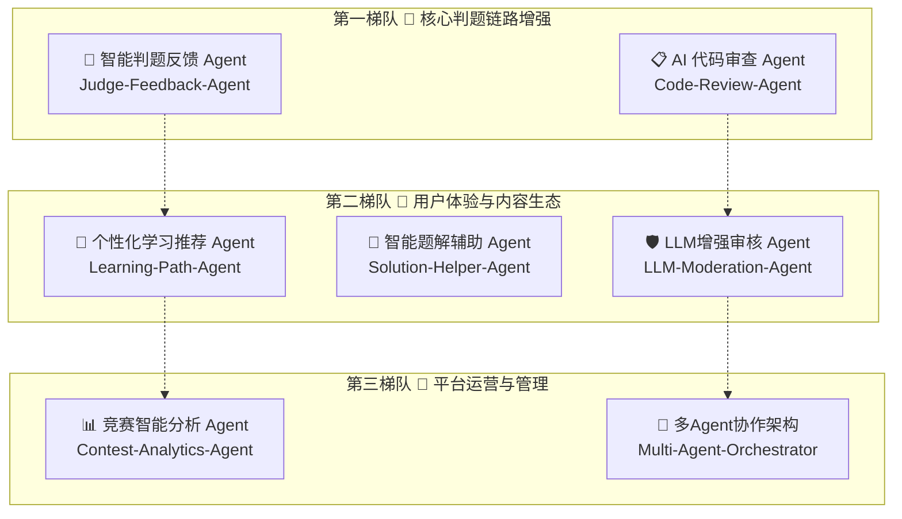
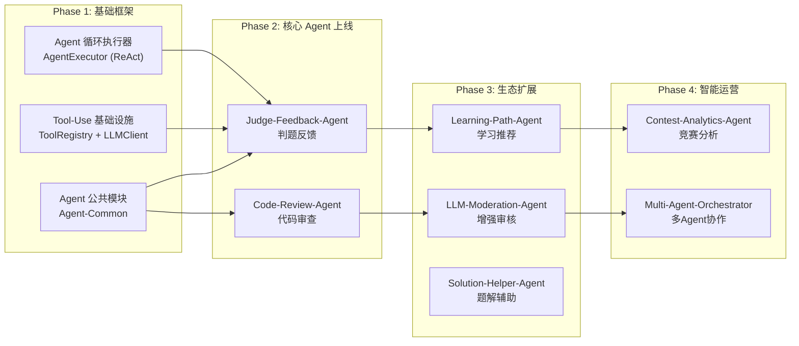

# EmiyaOJ-Cloud Agent 接入方案构想

> **版本**: V1.0 | **日期**: 2026-06-05 | **作者**: 开发小组
>
> 本文档记录 EmiyaOJ-Cloud 系统中可接入 AI Agent 的场景构想，用于后续技术选型与迭代规划。

---

## 目录

1. [现状分析](#1-现状分析)
2. [Agent 接入全景图](#2-agent-接入全景图)
3. [第一梯队：核心判题链路增强](#3-第一梯队核心判题链路增强)
   - [3.1 智能判题反馈 Agent](#31-智能判题反馈-agent)
   - [3.2 AI 代码审查 Agent](#32-ai-代码审查-agent)
4. [第二梯队：用户体验与内容生态](#4-第二梯队用户体验与内容生态)
   - [4.1 个性化学习推荐 Agent](#41-个性化学习推荐-agent)
   - [4.2 智能题解辅助 Agent](#42-智能题解辅助-agent)
   - [4.3 LLM 增强审核 Agent](#43-llm-增强审核-agent)
5. [第三梯队：平台运营与管理](#5-第三梯队平台运营与管理)
   - [5.1 竞赛智能分析 Agent](#51-竞赛智能分析-agent)
   - [5.2 多 Agent 协作架构](#52-多-agent-协作架构)
6. [Agent 公共基础设施设计](#6-agent-公共基础设施设计)
7. [架构演进路径](#7-架构演进路径)
8. [优先级评估矩阵](#8-优先级评估矩阵)

---

## 1. 现状分析

### 1.1 现有 AI 能力

| 现有能力 | 成熟度 | 集成模式 | 局限 |
|-----------|--------|---------|------|
| **Chat Service** — 基础 LLM 对话 | ⭐⭐⭐ | 同步非流式 HTTP，单一 System Prompt | 被动问答，缺乏工具调用、自主规划、多步推理能力 |
| **Moderation Service** — 阿里云文本审核 | ⭐⭐⭐ | 异步 MQ 驱动，SDK 调用 | 基于规则/传统 ML，缺乏语境理解 |

### 1.2 核心差距

当前 AI 能力停留在"请求-响应"式的 API 透传，不具备 Agent 的核心特征：

- ❌ **无工具调用 (Tool Use / Function Calling)**：Agent 无法主动查询数据库或调用其他服务
- ❌ **无自主规划 (Planning)**：无法将复杂任务分解为多步骤执行
- ❌ **无记忆管理 (Memory)**：无法跨轮次记住上下文和中间推理结果
- ❌ **无反思机制 (Reflection)**：无法对自身输出进行校验和修正

---

## 2. Agent 接入全景图



---

## 3. 第一梯队：核心判题链路增强

> **总体思路**：Agent 直接嵌入 OJ 最核心的"提交 → 判题 → 反馈"链路，用户感知最强，技术风险可控。

### 3.1 智能判题反馈 Agent

**Agent 名称**：`Judge-Feedback-Agent`

#### 3.1.1 痛点分析

目前判题结果仅返回干巴巴的状态码（AC / WA / TLE / CE / RE / MLE 等）。用户面对非 AC 结果时，只能自行排查，缺乏有效引导：
- WA 时不知道是什么类型的逻辑错误
- TLE 时不清楚是算法选择问题还是常数优化问题
- RE 时难以定位具体异常原因

#### 3.1.2 Agent 方案

当提交判题为**非 AC**状态时，Agent 自动触发，执行多步推理：

1. **错误分类**：分析是逻辑错误、边界条件遗漏还是算法复杂度问题
2. **差异分析**：对比 WA 用例的期望输出 vs 实际输出，推断可能的错误方向
3. **引导式提示**：给出思路点拨而非直接答案（延续现有 Chat Service 的教学理念）

#### 3.1.3 架构设计

```
Judge Service (判题完成)
    │
    ├── 状态 = AC → 正常流程结束
    │
    └── 状态 ≠ AC → RabbitMQ → Judge-Feedback-Agent
                                    │
                                    ├── Tool: getProblemInfo(problemId)
                                    ├── Tool: getFailedCaseHints(submissionId)
                                    ├── Tool: getUserSubmissionHistory(userId, problemId)
                                    │
                                    └── LLM (ReAct 模式)
                                        分析代码 + 判题结果
                                            │
                                            └── Feign 回调写入 feedback 表
                                                    │
                                                    └── 用户端展示智能反馈
```

#### 3.1.4 核心 Tools

| Tool 名称 | 功能 | 数据来源 |
|-----------|------|---------|
| `getProblemInfo` | 获取题目标题、描述、输入输出格式、限制条件 | Problem Service Feign |
| `getFailedCaseHints` | 获取失败用例的非完整信息（隐藏输入/输出，仅给出差异提示） | Judge Service 内部 |
| `getUserSubmissionHistory` | 获取用户对该题的历史提交情况 | Judge Service 内部 |
| `analyzeCodeComplexity` | LLM 自身推理代码时间/空间复杂度 | LLM 内置能力（无需外部调用） |

#### 3.1.5 示例 Prompt 设计

```text
# System Prompt
你是一个专业的 OJ 判题反馈分析助手。用户提交代码判题结果为 {status}。
你的任务是分析失败原因并给出引导式建议。

## 核心原则
- 严禁直接给出完整代码或核心算法
- 优先引导用户思考而非告知答案
- 对于 WA：分析可能的逻辑错误方向（边界条件、特殊情况、数据类型等）
- 对于 TLE：分析算法复杂度并提示可能的优化方向
- 对于 RE：分析可能的异常原因（数组越界、空指针、栈溢出等）
- 对于 CE：直接给出编译错误的具体位置和修复建议

## 可用工具
你可以调用以下工具获取更多信息：
- getProblemInfo(problemId)
- getFailedCaseHints(submissionId)
- getUserSubmissionHistory(userId, problemId)
```

#### 3.1.6 技术要点

| 维度 | 方案 |
|------|------|
| Agent 模式 | **ReAct (Reasoning + Acting)**：先推理后行动，循环直至得出结论 |
| LLM 调用方式 | 支持 Function Calling / Tool Use 的模型（Qwen-Plus 及以上） |
| 触发方式 | 判题完成后的 MQ 异步消息（不阻塞判题主链路） |
| 结果存储 | 新增 `judge_feedback` 表（feedback_id, submission_id, content, create_time） |
| 超时控制 | Agent 总执行超时 15s，避免长时间阻塞 |
| 降级策略 | Agent 不可用时回退到静态判题说明 |

#### 3.1.7 对现有服务的影响

| 影响范围 | 改动说明 |
|----------|---------|
| Judge Service | 判题完成后投递 MQ 消息（新增一个 `RabbitTemplate` 调用） |
| 新增服务/模块 | 可独立为 `EmiyaOJ-Judge-Feedback` 微服务，或作为 Judge Service 的内部模块 |
| 数据库 | 新增 `judge_feedback` 表 |
| 前端 | 提交详情页增加"AI 反馈"卡片 |

---

### 3.2 AI 代码审查 Agent

**Agent 名称**：`Code-Review-Agent`

#### 3.2.1 痛点分析

判题只关注结果对错，不关注代码质量。用户可能写出：
- 命名混乱的变量（`a1, a2, a3`）
- 安全隐患（SQL 注入风险的字符串拼接）
- 不良实践（硬编码魔法数字、深层嵌套）
- 资源泄漏（未关闭的 Scanner / 文件流）

这些问题不会导致 WA，但会养成不良编程习惯。

#### 3.2.2 Agent 方案

独立于判题结果的代码质量分析，审查多个维度并生成结构化报告：

| 审查维度 | 检查内容 |
|----------|---------|
| **效率分析** | 时间复杂度估算、空间复杂度估算、是否有冗余计算 |
| **安全审查** | 数组越界风险、空指针风险、资源泄漏、SQL 注入模式 |
| **代码风格** | 命名规范、缩进一致性、注释质量、函数长度 |
| **最佳实践** | 边界条件处理、输入校验、异常处理 |

#### 3.2.3 架构设计

```
Judge Service (判题完成)
    │
    └── RabbitMQ → Code-Review-Agent
                       │
                       ├── Tool: getSubmissionCode(submissionId)
                       ├── Tool: getProblemConstraints(problemId)
                       │
                       └── LLM (Prompt Chain 模式)
                           Step 1: 效率分析
                           Step 2: 安全审查
                           Step 3: 代码风格
                           Step 4: 最佳实践
                           Step 5: 汇总生成审查报告
                               │
                               └── review_results 表
                                       │
                                       └── 用户端"代码审查"Tab
```

#### 3.2.4 使用 Prompt Chain 的原因

单次 Prompt 要求 LLM 同时审查多个维度可能遗漏细节。采用 **Prompt Chain** 分步审查：

```text
Chain Step 1（效率分析）:
"分析以下 Java 代码的时间复杂度和空间复杂度，指出可能的性能瓶颈。"

Chain Step 2（安全审查）:
"审查以下 Java 代码中可能的安全隐患，包括但不限于：数组越界、空指针、资源泄漏、不安全的类型转换。"

Chain Step 3（代码风格）:
"审查以下 Java 代码的代码风格问题：命名规范、注释质量、代码结构。"

Chain Step 4（汇总）:
"基于以下三个维度的审查结果，生成一份结构化的代码审查报告：
- 效率分析: {step1_result}
- 安全审查: {step2_result}
- 代码风格: {step3_result}"
```

#### 3.2.5 示例审查报告输出

```json
{
  "submissionId": 12345,
  "overallScore": 72,
  "dimensions": [
    {
      "name": "效率分析",
      "score": 65,
      "findings": [
        {
          "severity": "warning",
          "message": "第12行的嵌套循环导致 O(n²) 时间复杂度，对于 n≤10⁵ 的数据范围可能超时",
          "suggestion": "考虑使用 HashMap 将内层查找优化为 O(1)"
        }
      ]
    },
    {
      "name": "安全审查",
      "score": 85,
      "findings": [
        {
          "severity": "info",
          "message": "第25行使用了 `Scanner.nextInt()` 未校验输入范围",
          "suggestion": "建议添加输入合法性检查"
        }
      ]
    },
    {
      "name": "代码风格",
      "score": 70,
      "findings": [
        {
          "severity": "info",
          "message": "变量名 `a`, `b`, `tmp` 不够表意",
          "suggestion": "建议使用更具描述性的变量名如 `inputCount`, `currentValue`"
        }
      ]
    }
  ],
  "summary": "代码逻辑基本正确，但存在效率瓶颈和代码风格问题。建议重点关注算法优化。"
}
```

#### 3.2.6 技术要点

| 维度 | 方案 |
|------|------|
| Agent 模式 | **Prompt Chain**：分步审查，逐步汇总 |
| 触发方式 | 判题完成后的 MQ 异步消息 |
| 覆盖范围 | 建议对所有 AC 提交进行审查（非 AC 由 Judge-Feedback-Agent 处理） |
| 结果存储 | 新增 `code_review_result` 表 |
| 审查语言 | 根据提交的语言选择对应的代码分析知识（Java / C++ / Python / Go） |

#### 3.2.7 对现有服务的影响

| 影响范围 | 改动说明 |
|----------|---------|
| Judge Service | 判题完成后投递 MQ 消息（可与 Judge-Feedback-Agent 共用消息） |
| 新增服务/模块 | 可独立为 `EmiyaOJ-Code-Review` 微服务 |
| 数据库 | 新增 `code_review_result` 表 |
| 前端 | 提交详情页增加"代码审查"Tab |

---

## 4. 第二梯队：用户体验与内容生态

### 4.1 个性化学习推荐 Agent

**Agent 名称**：`Learning-Path-Agent`

#### 4.1.1 痛点分析

- 用户不知道下一步该刷什么题
- 题库浏览是纯列表展示，无个性化排序
- 用户可能在自己已掌握的领域反复刷题，忽略薄弱环节

#### 4.1.2 Agent 方案

分析用户历史行为，识别知识薄弱点，生成个性化推荐：

```
用户请求推荐 → Learning-Path-Agent
                    │
                    ├── Tool: getUserSubmissionStats(userId)
                    │      └── 返回: 按标签分组的 AC/WA 统计、各难度完成率
                    │
                    ├── Tool: getProblemByTags(tags, difficulty, excludeSolved)
                    │      └── 返回: 符合条件的题目列表
                    │
                    ├── Tool: getProblemByDifficulty(level, excludeSolved)
                    │
                    └── LLM 综合分析
                        1. 识别薄弱标签（WA率高 / 未涉及的标签）
                        2. 确定适合的难度等级
                        3. 生成推荐列表 + 学习路径建议
                            │
                            └── 推荐结果返回用户端
```

#### 4.1.3 推荐策略

| 场景 | 推荐策略 |
|------|---------|
| 新用户 | 推荐各标签的入门级题目，帮助用户了解各算法领域 |
| 某标签 WA 率 > 50% | 推荐该标签的简单/中等题目，优先巩固基础 |
| 某难度 AC 率 > 80% | 推荐更高难度的题目，推动能力进阶 |
| 竞赛即将开始 | 推荐与竞赛题目标签相似的历史题目供练习 |
| 长时间未刷题 | 推荐已 AC 题目的同难度题目，帮助恢复手感 |

#### 4.1.4 技术要点

| 维度 | 方案 |
|------|------|
| Agent 模式 | **Function Calling**：LLM 通过工具调用获取真实数据 |
| 数据依赖 | Problem Service（题目数据）、Judge Service（提交统计） |
| 冷启动 | 新用户默认推荐各标签热度最高的入门题 |
| 更新频率 | 每次用户请求时实时计算（或每日定时预计算） |
| 架构位置 | 可作为 Problem Service 的内部模块或独立微服务 |

#### 4.1.5 现有服务影响

| 影响范围 | 改动说明 |
|----------|---------|
| Problem Service | 新增 `/problem/recommend` 接口；或新增 Feign 接口供 Agent 调用 |
| Judge Service | 需暴露用户提交统计的 Feign 接口 |
| 前端 | 首页或题库页增加"为你推荐"模块 |

---

### 4.2 智能题解辅助 Agent

**Agent 名称**：`Solution-Helper-Agent`

#### 4.2.1 痛点分析

- 用户写题解时缺乏引导，质量参差不齐
- 许多题解只有代码，缺乏思路分析和复杂度说明
- 低质量题解影响社区内容的参考价值

#### 4.2.2 Agent 方案

用户在编辑器中写题解时，Agent 提供侧边栏辅助：

**功能 1：结构引导**

检查题解是否包含必要模块：
- ✅ 思路分析
- ✅ 算法选择与理由
- ✅ 时间复杂度分析
- ✅ 空间复杂度分析
- ⚠️ 缺少代码注释
- ❌ 缺少边界条件说明

**功能 2：内容增强**

- 根据绑定的题目信息，自动生成"题目要点摘要"
- 检测代码块中的关键算法并自动标注
- 推荐相关题目的链接

**功能 3：格式检查**

- 检查代码块是否正确使用语言标记
- 数学公式是否正确使用 LaTeX 语法
- 图片引用是否有效

#### 4.2.3 架构设计

```
用户编辑题解 → Solution-Helper-Agent
                    │
                    ├── Tool: getProblemSummary(problemId)
                    │      └── 获取题目摘要、标签、难度
                    │
                    ├── Tool: getRelatedSolutions(problemId)
                    │      └── 获取同题目下的高赞题解作为参考
                    │
                    └── LLM 分析题解草稿
                        1. 结构完整性检查
                        2. 内容质量评估
                        3. 生成改进建议
                            │
                            └── 实时返回建议给编辑器
```

#### 4.2.4 交互方式

| 模式 | 说明 |
|------|------|
| **主动触发** | 用户点击"AI 辅助检查"按钮 |
| **保存前提示** | 用户点击发布/保存时，Agent 快速扫描并给出改进建议 |
| **后台异步** | 题解发布后，Agent 生成完整的质量报告供用户后续优化 |

#### 4.2.5 技术要点

| 维度 | 方案 |
|------|------|
| Agent 模式 | **Tool Use**：实时查询题目和上下文信息 |
| 响应时间 | 建议 < 3s（快速检查模式） |
| 架构位置 | Blog Service 内部模块 |
| 前端交互 | 编辑器侧边栏或底部面板展示建议 |

---

### 4.3 LLM 增强审核 Agent

**Agent 名称**：`LLM-Moderation-Agent`

#### 4.3.1 痛点分析

当前阿里云文本审核存在局限性：

| 问题 | 说明 |
|------|------|
| **语境误解** | "暴力枚举"（brute force）被判为暴力内容；"Java 内存溢出杀死进程"被判为危险内容 |
| **变体绕过** | 谐音字、拆字、特殊符号替换等绕过规则检测 |
| **审核理由不透明** | 阿里云仅返回 `pass/review/block`，缺少可读的审核理由 |
| **编程社区特殊性** | OJ 社区讨论算法、竞赛、代码，术语体系与通用社交平台不同 |

#### 4.3.2 Agent 方案

在现有阿里云审核基础上增加 **LLM 二次审核层**：

```
阿里云审核结果
    │
    ├── pass → 直接通过（快速通道，不触发 LLM）
    │
    ├── block → LLM-Moderation-Agent 复核
    │      └── 重点：判断是否为 OJ 语境下的误判
    │          例："暴力枚举所有可能" → 算法术语，应通过
    │
    └── review → LLM-Moderation-Agent 深度分析
           └── 提供详细的审核判断 + 可读的审核理由
```

#### 4.3.3 架构设计

```
Blog Service (发布内容)
    │
    └── RabbitMQ → 阿里云审核 (快速粗筛)
                       │
                       ├── pass → 直接回写 APPROVED
                       │
                       ├── block → LLM-Moderation-Agent
                       │      │
                       │      ├── Tool: getContentContext(targetId)
                       │      │      └── 获取内容关联的题目、标签等上下文
                       │      │
                       │      └── LLM 语境分析
                       │          判断是否为编程社区正常讨论
                       │              │
                       │              ├── 误判 → 回写 APPROVED + 记录
                       │              └── 确认违规 → 回写 REJECTED + 详细理由
                       │
                       └── review → LLM-Moderation-Agent
                              └── 详细分析后给出最终判定
```

#### 4.3.4 语境理解示例

| 待审核文本 | 阿里云判定 | LLM Agent 判定 | 理由 |
|-----------|-----------|---------------|------|
| "这题用暴力枚举就能过" | `block`（含"暴力"） | `pass` | OJ 语境，"暴力枚举" = brute force algorithm |
| "杀进程释放内存" | `review`（含"杀"） | `pass` | 讨论操作系统进程管理 |
| "加QQ12345买答案" | `review` | `block` | 明确广告行为 |
| "这是道sb题" | `block` | `block` | 不文明用语 |

#### 4.3.5 技术要点

| 维度 | 方案 |
|------|------|
| Agent 模式 | **Router + Tool Use**：根据审核结果分流，调用上下文工具辅助判断 |
| 成本优化 | 仅 `block` 和 `review` 触发 LLM，`pass` 走快速通道 |
| 误判记录 | 建立 `moderation_overrule_log` 表，记录 LLM 翻案案例，用于持续优化 |
| 架构位置 | Moderation Service 审核链中增加 LLM 节点 |
| 安全边界 | LLM Agent 判定为 `pass` 的内容仍需人工抽检 |

#### 4.3.6 对现有服务的影响

| 影响范围 | 改动说明 |
|----------|---------|
| Moderation Service | 审核链增加 LLM Agent 调用节点 |
| 数据库 | 新增 `moderation_overrule_log` 表 |
| 配置 | 新增 LLM API Key 配置项 |

---

## 5. 第三梯队：平台运营与管理

### 5.1 竞赛智能分析 Agent

**Agent 名称**：`Contest-Analytics-Agent`

#### 5.1.1 痛点分析

竞赛结束后，管理员需要手动总结：
- 每道题的通过率、平均尝试次数
- 题目难度与预期是否匹配
- 参赛者整体表现分布
- 竞赛亮点和问题

这些工作繁琐且依赖人工经验。

#### 5.1.2 Agent 方案

竞赛结束后自动生成分析报告：

```
竞赛结束事件 → Contest-Analytics-Agent
                    │
                    ├── Tool: getContestSubmissions(contestId)
                    │      └── 获取所有提交记录和判题结果
                    │
                    ├── Tool: getContestRanking(contestId)
                    │      └── 获取最终排行榜
                    │
                    ├── Tool: getContestProblems(contestId)
                    │      └── 获取题目信息（标题、难度、标签）
                    │
                    └── LLM 多维度分析
                        1. 题目质量评估（区分度、通过率趋势）
                        2. 参赛者表现总览（分数分布、AC 分布）
                        3. 竞赛亮点与改进建议
                            │
                            └── 生成 Markdown 竞赛报告
```

#### 5.1.3 报告内容结构

```markdown
# 「2026 春季算法竞赛」分析报告

## 1. 基本数据
- 参赛人数: 128
- 题目数量: 5
- 总提交次数: 1,024

## 2. 题目分析
| 题目 | 通过率 | 平均提交次数 | 区分度 | 评价 |
|------|--------|-------------|--------|------|
| A. 两数之和 | 85% | 1.2 | 低 | 签到题，适合热身 |
| B. 最短路径 | 45% | 3.8 | 高 | 核心区分题，难度适中 |
| C. 动态规划 | 12% | 6.5 | 极高 | 偏难，建议下届调整难度 |

## 3. 参赛者表现
- 满分人数: 3 (2.3%)
- AC ≥ 3题: 42 (32.8%)
- 零提交: 8 (6.3%)

## 4. AI 生成的分析总结
（LLM 综合分析，含亮点、不足和建议）
```

#### 5.1.4 技术要点

| 维度 | 方案 |
|------|------|
| Agent 模式 | **Tool Use + Plan-and-Solve**：先规划分析步骤，再逐步执行 |
| 触发方式 | 管理员手动触发 或 竞赛结束自动触发 |
| 输出格式 | Markdown 报告（可导出 PDF） |
| 架构位置 | Problem Service 或独立分析微服务 |

---

### 5.2 多 Agent 协作架构

**Agent 名称**：`Multi-Agent-Orchestrator`

#### 5.2.1 场景

当复杂任务需要多个 Agent 协作时，引入编排层统一调度。典型场景：

**场景：新题上架全流程**

```
管理员提交新题 → Orchestrator
                    │
                    ├── Agent 1: Problem-Review-Agent
                    │     审查题目描述完整性、样例正确性
                    │
                    ├── Agent 2: Solution-Validator-Agent
                    │     使用 Go-Judge 验证参考解法是否可 AC
                    │
                    ├── Agent 3: Difficulty-Assessor-Agent
                    │     基于参考解法的复杂度和历史数据评估难度
                    │
                    └── Agent 4: Tag-Recommender-Agent
                          基于题面分析推荐合适的标签
                              │
                              └── 汇总结果 → 返回管理员审核
```

#### 5.2.2 编排模式

| 模式 | 说明 | 适用场景 |
|------|------|---------|
| **Sequential（串行）** | Agent 按序执行，后续 Agent 可使用前序结果 | 有依赖关系的任务 |
| **Parallel（并行）** | 多个 Agent 同时执行互不依赖的子任务 | 新题上架（各维度独立审查） |
| **Debate（辩论）** | 多个 Agent 从不同角度分析同一问题，汇总分歧 | 审核结果有争议时 |
| **Hierarchical（层级）** | 上层 Agent 拆解任务分发给下层 Agent | 复杂多步骤任务 |

#### 5.2.3 技术要点

| 维度 | 方案 |
|------|------|
| 编排框架 | 轻量自研（基于 Agent 公共模块），或引入 LangGraph / CrewAI |
| 消息传递 | Agent 之间通过结构化的 JSON 消息传递 |
| 状态管理 | Redis 存储编排会话状态 |
| 超时与重试 | 每个 Agent 有独立超时和重试策略 |

---

## 6. Agent 公共基础设施设计

### 6.1 设计目标

避免每个 Agent 各写一套 LLM 调用逻辑，在 `EmiyaOJ-Common` 中统一封装：

```
EmiyaOJ-Common/src/main/java/com/emiyaoj/common/agent/
├── core/
│   ├── AgentContext.java          # Agent 执行上下文（工具列表、会话状态、消息历史）
│   ├── AgentExecutor.java         # Agent 循环执行器（ReAct / Tool Use 循环）
│   ├── AgentMemory.java           # Agent 短期记忆管理（对话历史、中间推理）
│   └── AgentConfig.java           # Agent 通用配置（超时、重试、模型选择）
│
├── tool/
│   ├── ToolDefinition.java        # 工具定义接口（name, description, parameters JSON Schema）
│   ├── ToolRegistry.java          # 工具注册表（名称 → 工具实例映射）
│   ├── ToolResult.java            # 工具执行结果封装（success, data, error）
│   └── ToolExecutionLog.java      # 工具调用日志（用于调试和审计）
│
├── llm/
│   ├── LLMClient.java             # 统一的 LLM 调用封装（支持 tool_choice / function_call）
│   ├── LLMRequest.java            # LLM 请求模型（messages, tools, tool_choice）
│   ├── LLMResponse.java           # LLM 响应模型（content, tool_calls, finish_reason）
│   ├── ChatMessage.java           # 消息模型（role, content, tool_call_id, tool_calls）
│   └── LLMProperties.java         # LLM 配置属性（apiKey, model, baseUrl, timeout）
│
├── prompt/
│   ├── PromptTemplate.java        # Prompt 模板引擎（变量替换、Few-shot 管理）
│   └── SystemPromptBuilder.java   # System Prompt 构建器（角色设定 + 规则 + 工具描述）
│
└── monitor/
    ├── AgentMetrics.java          # Agent 执行指标（调用次数、延迟、成功率）
    └── AgentAuditLog.java         # Agent 审计日志（完整执行链路记录）
```

### 6.2 核心组件设计

#### 6.2.1 AgentExecutor — Agent 循环执行器

```java
/**
 * Agent 循环执行器。
 * 支持 ReAct 模式：Thought → Action → Observation → Thought → ... → Final Answer
 */
public class AgentExecutor {

    /**
     * 执行 Agent 循环
     * @param context   Agent 上下文（包含 system prompt, tools, maxIterations）
     * @param userInput 用户输入
     * @return Agent 最终输出
     */
    public AgentResult execute(AgentContext context, String userInput) {
        int iteration = 0;
        while (iteration < context.getMaxIterations()) {
            iteration++;

            // 1. 调用 LLM（携带工具定义）
            LLMResponse response = llmClient.chat(context.getMessages(), context.getTools());

            // 2. 判断 LLM 意图
            if (response.hasToolCalls()) {
                // LLM 想调用工具
                for (ToolCall call : response.getToolCalls()) {
                    ToolResult result = context.getToolRegistry()
                        .execute(call.getName(), call.getArguments());
                    // 将工具结果反馈给 LLM
                    context.addToolResult(call.getId(), result);
                }
            } else if (response.isFinished()) {
                // LLM 给出最终答案
                return AgentResult.success(response.getContent());
            }
        }
        return AgentResult.timeout("Agent 超过最大迭代次数");
    }
}
```

#### 6.2.2 ToolDefinition — 工具定义

```java
/**
 * 工具定义接口。
 * 每个 Agent 的可用工具需实现此接口并注册到 ToolRegistry。
 */
public interface ToolDefinition {

    /** 工具名称（LLM function_call 中的 name） */
    String getName();

    /** 工具描述（LLM 用于判断何时调用） */
    String getDescription();

    /** 参数 JSON Schema（LLM 用于生成参数） */
    String getParametersSchema();

    /** 执行工具 */
    ToolResult execute(Map<String, Object> arguments);
}
```

#### 6.2.3 LLMClient — LLM 调用封装

```java
/**
 * 统一 LLM 调用客户端。
 * 封装不同 LLM 提供商的 API 差异（阿里云百炼 / DeepSeek / OpenAI 兼容）。
 */
public interface LLMClient {

    /**
     * 发送对话请求（支持 Function Calling）
     */
    LLMResponse chat(List<ChatMessage> messages, List<ToolDefinition> tools);

    /**
     * 流式对话（用于实时反馈场景）
     */
    Flux<String> chatStream(List<ChatMessage> messages, List<ToolDefinition> tools);
}
```

### 6.3 Maven 依赖

在 `EmiyaOJ-Common/pom.xml` 中新增：

```xml
<!-- ==================== Agent 基础设施 ==================== -->
<!-- HTTP 客户端（调用 LLM API） -->
<dependency>
    <groupId>org.springframework.boot</groupId>
    <artifactId>spring-boot-starter-webflux</artifactId>
    <optional>true</optional>
</dependency>
<!-- JSON Schema 处理（工具参数定义） -->
<dependency>
    <groupId>com.fasterxml.jackson.core</groupId>
    <artifactId>jackson-databind</artifactId>
    <optional>true</optional>
</dependency>
```

---

## 7. 架构演进路径



### Phase 1（1-2 周）

- 在 `EmiyaOJ-Common` 中搭建 Agent 公共基础设施
- 实现 ToolRegistry、LLMClient、AgentExecutor
- 编写单元测试和 Mock Agent 验证框架可用性

### Phase 2（2-3 周）

- 实现 Judge-Feedback-Agent 和 Code-Review-Agent
- Judge Service 增加判题后 MQ 消息投递
- 前端增加"AI 反馈"和"代码审查"展示区域

### Phase 3（3-4 周）

- 实现 Learning-Path-Agent、LLM-Moderation-Agent、Solution-Helper-Agent
- Problem / Blog / Moderation Service 扩展对应接口
- 前端增加推荐模块、题解辅助面板

### Phase 4（2-3 周）

- 实现 Contest-Analytics-Agent
- 搭建 Multi-Agent-Orchestrator
- 管理端增加竞赛报告查看和 Agent 编排配置

---

## 8. 优先级评估矩阵

| Agent | 优先级 | 用户感知度 | 实现难度 | 对现有服务影响 | 预估工期 |
|-------|--------|-----------|---------|---------------|---------|
| **Judge-Feedback-Agent** | 🔴 P0 | ⭐⭐⭐⭐⭐ | ⭐⭐⭐ | Judge Service 新增 MQ 投递 + 反馈表 | 5-7 天 |
| **Code-Review-Agent** | 🔴 P0 | ⭐⭐⭐⭐ | ⭐⭐ | Judge Service 新增 MQ 投递（复用） | 4-6 天 |
| **LLM-Moderation-Agent** | 🟡 P1 | ⭐⭐⭐ | ⭐⭐⭐ | Moderation Service 审核链 | 5-7 天 |
| **Learning-Path-Agent** | 🟡 P1 | ⭐⭐⭐⭐ | ⭐⭐⭐⭐ | Problem + Judge Service 扩展 Feign | 7-10 天 |
| **Solution-Helper-Agent** | 🟢 P2 | ⭐⭐⭐ | ⭐⭐⭐ | Blog Service 扩展 | 5-7 天 |
| **Contest-Analytics-Agent** | 🟢 P2 | ⭐⭐⭐ | ⭐⭐ | Problem Service 扩展 | 4-6 天 |
| **Multi-Agent-Orchestrator** | 🔵 P3 | ⭐⭐ | ⭐⭐⭐⭐⭐ | 独立模块 | 10-14 天 |

### 选型建议

> **强烈建议 Phase 1 + Phase 2 作为 MVP 优先实现。**
>
> 原因：
> 1. Judge-Feedback-Agent + Code-Review-Agent 直接打在 OJ 最核心的"提交→判题→反馈"链路上
> 2. 用户感知最强，是区别于其他 OJ 系统的核心竞争力
> 3. 技术风险可控（异步 MQ + LLM 推理，无复杂分布式事务）
> 4. Phase 1 的公共基础设施可复用于后续所有 Agent

---

## 附录 A：Agent 模式选型指南

| 模式 | 适用场景 | 本项目适用 Agent |
|------|---------|-----------------|
| **ReAct** | 需要 LLM 主动推理 + 调用工具获取信息 | Judge-Feedback-Agent |
| **Prompt Chain** | 需要分步骤深入分析不同维度 | Code-Review-Agent |
| **Function Calling** | 需要查询/操作外部数据源 | Learning-Path-Agent, Solution-Helper-Agent |
| **Router** | 根据条件分流到不同处理逻辑 | LLM-Moderation-Agent |
| **Plan-and-Solve** | 复杂任务需先规划再执行 | Contest-Analytics-Agent |
| **Multi-Agent** | 多视角协作或辩论 | Multi-Agent-Orchestrator |

## 附录 B：LLM 服务商选型参考

| 服务商 | 模型 | Function Calling | 中文能力 | 成本 | 推荐场景 |
|--------|------|:---:|:---:|------|---------|
| 阿里云百炼 | Qwen-Plus / Qwen-Max | ✅ | ⭐⭐⭐⭐⭐ | 中 | 现有 Chat Service 已对接，生态一致 |
| DeepSeek | deepseek-chat | ✅ | ⭐⭐⭐⭐⭐ | 低 | 高性价比，适合大批量 Agent 调用 |
| OpenAI 兼容 | GPT-4o / Claude | ✅ | ⭐⭐⭐ | 高 | 备选方案 |

> **建议**：继续使用阿里云百炼（与现有 Chat Service 一致），审核类 Agent 因成本敏感可考虑 DeepSeek。

---

> **文档状态**：构想草案，待小组评审后确定实施优先级和排期。
