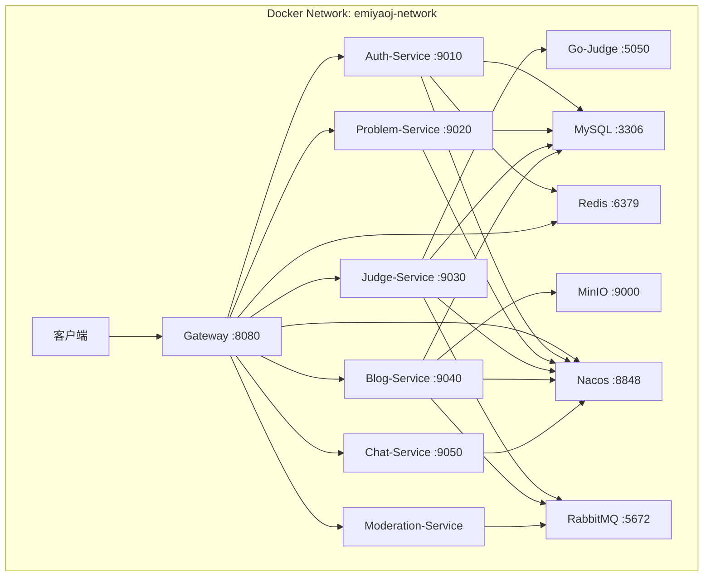
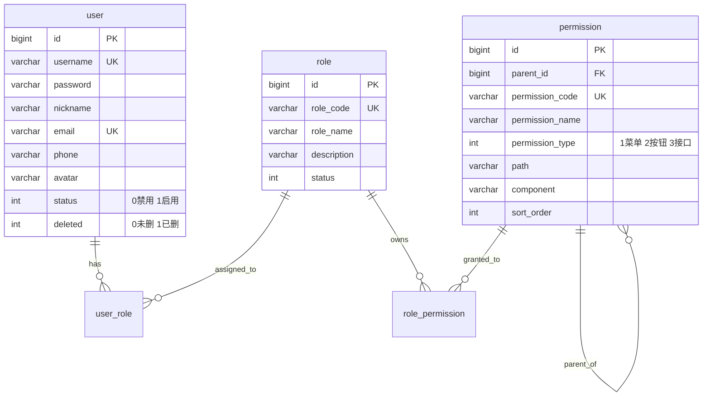

# EmiyaOJ-Cloud 代码框架说明

> **版本**: V1.0 | **日期**: 2026-06-03 | **JDK**: 21 | **Spring Boot**: 3.5.5 | **Spring Cloud**: 2025.0.0

---

## 目录

1. [项目概述](#1-项目概述)
2. [技术栈与依赖](#2-技术栈与依赖)
3. [Maven 模块结构](#3-maven-模块结构)
4. [基础设施与部署架构](#4-基础设施与部署架构)
5. [公共模块 — EmiyaOJ-Common](#5-公共模块--emiyaoj-common)
6. [API 网关 — EmiyaOJ-Gateway](#6-api-网关--emiyaoj-gateway)
7. [认证权限服务 — EmiyaOJ-Auth](#7-认证权限服务--emiyaoj-auth)
8. [题目竞赛服务 — EmiyaOJ-Problem](#8-题目竞赛服务--emiyaoj-problem)
9. [判题提交服务 — EmiyaOJ-Judge](#9-判题提交服务--emiyaoj-judge)
10. [博客题解服务 — EmiyaOJ-Blog](#10-博客题解服务--emiyaoj-blog)
11. [AI 聊天服务 — EmiyaOJ-Chat](#11-ai-聊天服务--emiyaoj-chat)
12. [内容审核服务 — EmiyaOJ-Moderation](#12-内容审核服务--emiyaoj-moderation)
13. [判题沙箱 — Go-Judge](#13-判题沙箱--go-judge)
14. [微服务间通信机制](#14-微服务间通信机制)
15. [数据库架构总览](#15-数据库架构总览)
16. [统一 API 响应规范](#16-统一-api-响应规范)
17. [关键设计模式与约定](#17-关键设计模式与约定)

---

## 1. 项目概述

EmiyaOJ-Cloud 是一个基于 **Spring Cloud 微服务架构**的在线判题系统（Online Judge），面向高校软件工程实训和在线编程训练场景。系统采用前后端分离架构，后端由 **8 个 Maven 模块**（1 个公共模块 + 1 个网关 + 6 个微服务）组成，搭配 **Go-Judge 判题沙箱**完成代码安全执行与评测。

### 核心业务能力

| 能力域 | 描述 |
|--------|------|
| 用户认证 | JWT + Redis 白名单双重认证，RBAC 权限模型（用户/角色/权限三级管理） |
| 题库管理 | 题目 CRUD、测试用例管理、标签分类、编程语言配置 |
| 在线判题 | 异步判题引擎，支持 C/C++/Java/Python/Go 等语言，沙箱隔离执行 |
| 竞赛管理 | ACM/ICPC、IOI、Codeforces 三种赛制，排名实时计算 |
| 博客题解 | 博客发布/评论/点赞/收藏，图片上传（MinIO），内容审核 |
| AI 辅助 | 基于大模型的智能聊天与编程辅助 |
| 内容审核 | 阿里云内容安全 + AI 自动审核，支持人工复审 |

---

## 2. 技术栈与依赖

### 2.1 核心框架

| 技术 | 版本 | 用途 |
|------|------|------|
| JDK | 21 | 运行环境 |
| Spring Boot | 3.5.5 | 应用框架 |
| Spring Cloud | 2025.0.0 | 微服务治理 |
| Spring Cloud Alibaba | 2025.0.0.0 | Nacos 服务注册/配置 |
| Spring Cloud Gateway | — | API 网关 |
| Spring Security | — | 认证授权框架 |
| MyBatis-Plus | 3.5.16 | ORM 框架 |
| JJWT | 0.12.6 | JWT 令牌 |
| SpringDoc OpenAPI | 2.8.6 | API 文档 (Swagger) |

### 2.2 中间件

| 中间件 | 版本/镜像 | 用途 |
|--------|----------|------|
| MySQL | 8.0.31 | 关系数据库 |
| Redis | 7-alpine | 缓存 / Token 白名单 |
| Nacos | v2.5.1 | 服务注册发现 & 配置中心 |
| RabbitMQ | 3.13-management | 消息队列 |
| MinIO | RELEASE.2025-04 | 对象存储（博客图片） |
| Go-Judge | 自定义镜像 | 判题沙箱 |

### 2.3 开发辅助

| 工具 | 用途 |
|------|------|
| Lombok | 简化 POJO 代码 |
| Docker & Docker Compose | 容器化部署 |
| Maven | 项目构建与依赖管理 |

---

## 3. Maven 模块结构

```
EmiyaOJ-Cloud/                          # 父工程 (packaging=pom)
├── pom.xml                             # 根 POM，统一依赖版本管理
│
├── EmiyaOJ-Common/                     # 公共模块 (jar)
│   └── src/main/java/com/emiyaoj/common/
│       ├── config/                     # 公共配置类
│       ├── constant/                   # 常量与枚举
│       ├── domain/                     # 通用领域对象
│       ├── exception/                  # 全局异常类
│       ├── handler/                    # 全局异常处理器
│       ├── interceptor/                # 通用拦截器
│       ├── properties/                 # 配置属性类
│       └── utils/                      # 工具类
│
├── EmiyaOJ-Gateway/                    # API 网关 (jar)
│   └── src/main/java/com/emiyaoj/gateway/
│       ├── config/                     # 网关配置
│       ├── filter/                     # 全局认证过滤器
│       └── GatewayApplication.java     # 启动类
│
├── EmiyaOJ-Auth/                       # 认证权限服务 (pom)
│   ├── auth-api/                       # Feign 接口定义
│   ├── auth-dto/                       # 数据传输对象
│   └── auth-service/                   # 业务实现 (Spring Boot)
│       └── src/main/java/com/emiyaoj/auth/
│           ├── config/                 # Security 等配置
│           ├── controller/             # REST 控制器
│           ├── domain/                 # 实体类 (User, Role, Permission)
│           ├── mapper/                 # MyBatis Mapper
│           └── service/                # 业务服务
│
├── EmiyaOJ-Problem/                    # 题目竞赛服务 (pom)
│   ├── problem-api/                    # Feign 接口定义
│   ├── problem-dto/                    # 数据传输对象
│   └── problem-service/               # 业务实现
│       └── src/main/java/com/emiyaoj/problem/
│           ├── controller/             # Problem, TestCase, Language, Contest, ProblemSet
│           ├── domain/                 # 实体类
│           ├── mapper/                 # MyBatis Mapper
│           └── service/                # 业务服务
│
├── EmiyaOJ-Judge/                      # 判题提交服务 (pom)
│   ├── judge-api/                      # Feign 接口定义
│   ├── judge-dto/                      # 数据传输对象
│   └── judge-service/                  # 业务实现
│       └── src/main/java/com/emiyaoj/judge/
│           ├── controller/             # Judge, Submission
│           ├── domain/                 # 实体类
│           ├── mapper/                 # MyBatis Mapper
│           ├── service/                # 判题执行、Go-Judge 通信
│           └── config/                 # 异步线程池配置
│
├── EmiyaOJ-Blog/                       # 博客题解服务 (pom)
│   ├── blog-api/                       # Feign 接口定义
│   ├── blog-dto/                       # 数据传输对象
│   └── blog-service/                   # 业务实现
│       └── src/main/java/com/emiyaoj/blog/
│           ├── controller/             # Blog, Comment, UserBlog
│           ├── domain/                 # 实体类
│           ├── mapper/                 # MyBatis Mapper
│           ├── service/                # 博客业务、图片 URL 解析
│           └── config/                 # MinIO 配置
│
├── EmiyaOJ-Chat/                       # AI 聊天服务 (pom)
│   ├── chat-api/                       # Feign 接口定义
│   ├── chat-dto/                       # 数据传输对象
│   └── chat-service/                   # 业务实现
│       └── src/main/java/com/emiyaoj/chat/
│           ├── config/                 # AI 服务配置
│           ├── controller/             # Chat 控制器
│           └── service/                # AI 调用服务
│
├── EmiyaOJ-Moderation/                 # 内容审核服务 (pom)
│   ├── moderation-api/                 # Feign 接口定义
│   ├── moderation-dto/                 # 数据传输对象
│   └── moderation-service/             # 业务实现
│       └── src/main/java/com/emiyaoj/moderation/
│           ├── config/                 # 审核配置
│           ├── consumer/               # 消息队列消费者
│           └── service/                # 审核服务
│
└── go-judge/                           # Go-Judge 判题沙箱
    └── Dockerfile                      # Go 环境镜像构建
```

### 3.1 Maven 子模块三层分离规范

每个业务微服务（Auth / Problem / Judge / Blog / Chat / Moderation）均采用 **api / dto / service** 三层子模块分离：

```
EmiyaOJ-{Service}/
├── pom.xml                    # 父 POM，聚合子模块
├── {service}-api/             # Feign 客户端接口（供其他服务依赖）
│   └── src/main/java/**/feign/
├── {service}-dto/             # DTO / VO / Query 对象（跨服务共享）
│   └── src/main/java/**/dto/
└── {service}-service/         # 业务实现 + 独立启动
    └── src/main/java/**/
        ├── controller/        # REST API
        ├── service/           # 业务逻辑
        ├── domain/            # 实体 / 领域对象（仅 service 模块内部可见）
        ├── mapper/            # MyBatis Mapper
        └── config/            # 本服务私有配置
```

> **设计意图**：`api` 和 `dto` 模块作为轻量级 JAR 被其他微服务依赖，避免引入 Spring Boot 全套依赖和内部实现。

---

## 4. 基础设施与部署架构

### 4.1 容器拓扑



### 4.2 端口映射与服务依赖

| 服务 | 端口 | 依赖基础设施 |
|------|------|-------------|
| Gateway | 8080 | Nacos, Redis |
| Auth-Service | 9010 | MySQL, Nacos, Redis |
| Problem-Service | 9020 | MySQL, Nacos |
| Judge-Service | 9030 | MySQL, Nacos, Go-Judge, RabbitMQ |
| Blog-Service | 9040 | MySQL, Nacos, MinIO, RabbitMQ |
| Chat-Service | 9050 | Nacos |
| Moderation-Service | — | Nacos, RabbitMQ |
| Go-Judge | 5050 | —（沙箱独立容器，特权模式）|

### 4.3 启动顺序

```
1. MySQL → 2. Redis → 3. RabbitMQ → 4. MinIO → 5. Nacos
                                    ↓
                              6. Go-Judge
                                    ↓
7. Auth-Service → 8. Problem-Service → 9. Judge-Service
       ↓
10. Blog-Service → 11. Chat-Service → 12. Moderation-Service
       ↓
13. Gateway（最后启动，作为统一入口）
```

---

## 5. 公共模块 — EmiyaOJ-Common

**模块定位**：所有微服务共享的基础设施代码，不依赖任何业务模块。

### 5.1 包结构

```
com.emiyaoj.common/
├── config/
│   ├── FeignConfig.java          # Feign 客户端通用配置（请求拦截器传递 X-User-Id）
│   ├── JacksonConfig.java        # Jackson JSON 序列化配置（日期格式、Long→String 等）
│   ├── MybatisPlusConfig.java    # MyBatis-Plus 分页插件、逻辑删除配置
│   ├── OpenApiConfig.java        # SpringDoc / Swagger UI 配置
│   ├── RedisConfig.java          # Redis 序列化与连接配置
│   └── WebMvcConfig.java         # Web MVC 拦截器注册
│
├── constant/
│   ├── JwtClaimsConstant.java    # JWT Claims 键名常量
│   └── PermissionTypeEnum.java   # 权限类型枚举（1-菜单, 2-按钮, 3-接口）
│
├── domain/
│   ├── ResponseResult.java       # 统一响应体 {code, message, data}
│   ├── PageDTO.java              # 分页请求 {pageNum, pageSize}
│   └── PageVO.java               # 分页响应 {records, total, pages, pageNum, pageSize}
│
├── exception/
│   ├── BaseException.java              # 基础业务异常
│   ├── BadRequestException.java        # 请求参数异常
│   └── CustomerAuthenticationException.java  # 认证异常
│
├── handler/
│   └── GlobalExceptionHandler.java     # @RestControllerAdvice 全局异常处理
│
├── interceptor/
│   └── UserContextInterceptor.java     # 从请求头提取 X-User-Id 写入 ThreadLocal
│
├── properties/
│   └── JwtProperties.java              # JWT 配置属性（secretKey, ttl）
│
└── utils/
    ├── BaseContext.java                # ThreadLocal 用户上下文持有者
    ├── JwtUtil.java                    # JWT 创建/解析工具
    └── RedisUtil.java                  # Redis 操作封装
```

### 5.2 核心类职责

| 类 | 职责 |
|----|------|
| `ResponseResult<T>` | 统一封装所有 API 返回结果，提供 `success(data)` / `fail(msg)` 静态工厂方法 |
| `PageVO<T>` | 分页查询统一返回结构，提供 `of(MyBatisPlus Page, converter)` 便捷转换 |
| `BaseContext` | ThreadLocal 存储当前请求的 `userId`，网关注入后由拦截器提取 |
| `JwtUtil` | 基于 JJWT 的 Token 签发与解析，支持自定义 Claims |
| `RedisUtil` | StringRedisTemplate 封装，支持 set/get/delete/exists 及 TTL 设置 |
| `GlobalExceptionHandler` | 统一捕获并返回 `ResponseResult.fail()`，确保异常不泄露内部细节 |

---

## 6. API 网关 — EmiyaOJ-Gateway

**模块定位**：系统唯一对外入口，基于 **Spring Cloud Gateway**（WebFlux 反应式）构建。

### 6.1 包结构

```
com.emiyaoj.gateway/
├── config/
│   ├── JwtProperties.java                 # JWT 密钥与 TTL 配置
│   └── GatewayWhitelistProperties.java    # 白名单路径配置（如 /auth/login）
├── filter/
│   └── AuthGlobalFilter.java              # 全局认证过滤器 (implements GlobalFilter, Ordered)
└── GatewayApplication.java                # 启动类
```

### 6.2 认证流程（AuthGlobalFilter）

```
请求到达 Gateway
    │
    ├── 1. 检查路径是否在白名单中？
    │       ├── 是 → 直接转发到下游服务
    │       └── 否 ↓
    │
    ├── 2. 从 Authorization 头提取 Bearer Token
    │       └── 无 Token → 返回 401
    │
    ├── 3. 使用 JwtUtil.parseJWT() 解析 Token
    │       └── 解析失败 / 过期 → 返回 401
    │
    ├── 4. 查询 Redis Token 白名单（key: token_{userId}）
    │       └── 不存在 → 返回 401（已登出）
    │
    └── 5. 注入请求头，转发请求
            ├── X-User-Id: {userId}
            ├── X-User-Name: {username}
            └── X-User-Roles: {permissions}
```

### 6.3 白名单路径示例

```
/auth/login          # 登录接口
/auth/register       # 注册接口（如有）
/problem/list        # 题目公开列表
/problem/{id}        # 题目公开详情
/blog                # 博客公开列表
/blog/{id}           # 博客公开详情
```

---

## 7. 认证权限服务 — EmiyaOJ-Auth

**模块定位**：负责用户认证、JWT 签发/解析、RBAC 权限管理。

### 7.1 核心包结构

```
com.emiyaoj.auth/
├── config/
│   └── SecurityConfig.java           # Spring Security 配置（密码加密器、认证管理器）
├── controller/
│   ├── AuthController.java           # /auth/login, /auth/logout, /auth/user/parse-token
│   ├── UserController.java           # /user CRUD、分配角色、密码重置
│   ├── RoleController.java           # /role CRUD、分配权限
│   └── PermissionController.java     # /permission CRUD、树形查询
├── domain/
│   ├── User.java                     # 用户实体（逻辑删除 @TableLogic）
│   ├── Role.java                     # 角色实体
│   ├── Permission.java               # 权限实体（树形结构，parentId 自引用）
│   ├── UserRole.java                 # 用户-角色关联
│   ├── RolePermission.java           # 角色-权限关联
│   └── LoginUser.java                # Spring Security UserDetails 实现
├── mapper/
│   ├── UserMapper.java
│   ├── RoleMapper.java
│   ├── PermissionMapper.java
│   ├── UserRoleMapper.java
│   └── RolePermissionMapper.java
└── service/
    ├── AuthService.java              # 登录/登出/Token 解析
    ├── IUserService.java             # 用户管理接口
    ├── UserServiceImpl.java          # 用户管理实现
    ├── IRoleService.java             # 角色管理接口
    ├── RoleServiceImpl.java          # 角色管理实现
    ├── IPermissionService.java       # 权限管理接口
    ├── PermissionServiceImpl.java    # 权限管理实现
    └── UserDetailsServiceImpl.java   # Spring Security 用户加载
```

### 7.2 数据库 ER 关系（emiya_oj_auth）



### 7.3 核心 API 端点

| 方法 | 路径 | 说明 |
|------|------|------|
| POST | `/auth/login` | 用户登录，返回 JWT Token |
| POST | `/auth/logout` | 用户登出，清除 Redis Token |
| GET | `/auth/user/parse-token` | 解析 Token 返回用户信息（内部 Feign 调用） |
| POST | `/user/page` | 分页查询用户 |
| GET | `/user/{id}` | 查询用户详情 |
| POST | `/user` | 新增用户 |
| PUT | `/user` | 更新用户 |
| DELETE | `/user/{id}` | 删除用户（逻辑删除） |
| PUT | `/user/{id}/reset-password` | 重置密码为默认值 |
| PUT | `/user/{id}/roles` | 分配用户角色 |
| GET | `/user/{id}/permissions` | 获取用户权限码列表 |
| POST | `/role/page` | 分页查询角色 |
| PUT | `/role/{id}/permissions` | 分配角色权限 |
| POST | `/permission/tree` | 查询权限树 |
| GET | `/permission/user/{userId}` | 查询用户有效权限 |

### 7.4 Feign 接口（供其他服务调用）

| Feign Client | 方法 | 用途 |
|-------------|------|------|
| `AuthFeignClient` | `parseToken(token)` | 网关/其他服务解析 Token 获取用户信息 |
| `AuthUserFeignClient` | `getUsersByPermission(code)` | 根据权限码查询用户列表 |
| `AuthUserFeignClient` | `hasPermission(userId, code)` | 检查用户是否有某权限 |

---

## 8. 题目竞赛服务 — EmiyaOJ-Problem

**模块定位**：管理题库、测试用例、编程语言配置、竞赛和题目集。

### 8.1 核心包结构

```
com.emiyaoj.problem/
├── controller/
│   ├── ProblemController.java       # 题目 CRUD、条件分页查询
│   ├── TestCaseController.java      # 测试用例管理
│   ├── LanguageController.java      # 编程语言配置管理
│   ├── ContestController.java       # 竞赛管理（CRUD、注册、排名）
│   └── ProblemSetController.java    # 题目集管理
├── domain/
│   ├── Problem.java                 # 题目实体
│   ├── TestCase.java                # 测试用例实体
│   ├── Language.java                # 编程语言配置实体
│   ├── Tag.java                     # 标签实体
│   ├── ProblemTag.java              # 题目-标签关联
│   ├── Contest.java                 # 竞赛实体
│   ├── ContestProblem.java          # 竞赛-题目关联
│   ├── ContestRegistration.java     # 竞赛报名
│   ├── ContestAdmin.java            # 竞赛管理员
│   ├── ProblemSet.java              # 题目集实体
│   └── ProblemSetProblem.java       # 题目集-题目关联
├── mapper/
│   ├── ProblemMapper.java
│   ├── TestCaseMapper.java
│   ├── LanguageMapper.java
│   ├── TagMapper.java
│   ├── ProblemTagMapper.java
│   ├── ContestMapper.java
│   ├── ContestProblemMapper.java
│   ├── ContestRegistrationMapper.java
│   ├── ContestAdminMapper.java
│   ├── ProblemSetMapper.java
│   └── ProblemSetProblemMapper.java
└── service/
    ├── ProblemService.java          # 题目业务逻辑
    ├── TestCaseService.java         # 测试用例管理
    ├── LanguageService.java         # 语言配置管理
    ├── ContestService.java          # 竞赛业务逻辑
    └── ProblemSetService.java       # 题目集业务逻辑
```

### 8.2 数据库表概览（emiya_oj_problem）

| 表名 | 说明 | 关键字段 |
|------|------|---------|
| `problem` | 题目 | title, difficulty(1-简单/2-中等/3-困难), timeLimit, memoryLimit, status(0-隐藏/1-公开) |
| `test_case` | 测试用例 | problemId, input, output, isSample, score |
| `language` | 编程语言 | name, compileCommand, executeCommand, sourceFileExt |
| `tag` | 标签 | name, color |
| `problem_tag` | 题目-标签 | problemId, tagId |
| `contest` | 竞赛 | invite_code(UK 10位), rule_type(1-ACM/2-IOI/3-CF), status(0-草稿/1-发布/2-取消) |
| `contest_problem` | 竞赛题目 | contestId, problemId, label(题号) |
| `contest_registration` | 竞赛报名 | contestId, userId |
| `contest_admin` | 竞赛管理员 | contestId, userId |
| `problem_set` | 题目集 | name, description |
| `problem_set_problem` | 题目集-题目 | setId, problemId |

### 8.3 编程语言配置特性

`language` 表支持命令模板占位符渲染，编译和执行命令支持以下变量：

| 占位符 | 含义 |
|--------|------|
| `{LanguageVersion}` | 语言版本 |
| `{CompileFileName}` | 编译文件名 |
| `{SourceFileName}` | 源文件名 |
| `{ExecutableFileName}` | 可执行文件名 |

---

## 9. 判题提交服务 — EmiyaOJ-Judge

**模块定位**：接收代码提交、调度异步判题、管理判题结果。

### 9.1 核心包结构

```
com.emiyaoj.judge/
├── config/
│   └── AsyncConfig.java             # @Async 异步线程池配置
├── controller/
│   ├── JudgeController.java         # POST /judge/submit 提交判题
│   └── SubmissionController.java    # 提交记录查询
├── domain/
│   ├── Submission.java              # 提交记录实体
│   ├── SubmissionJudgeResult.java   # 判题汇总结果
│   ├── SubmissionCaseResult.java    # 单个测试用例判题结果
│   ├── MessageEvent.java            # 本地消息表（分布式事务）
│   ├── GoJudgeRequest.java          # Go-Judge HTTP 请求模型
│   ├── GoJudgeResult.java           # Go-Judge HTTP 响应模型
│   └── GoJudgeStatus.java           # Go-Judge 状态枚举
├── mapper/
│   ├── SubmissionMapper.java
│   ├── SubmissionJudgeResultMapper.java
│   └── SubmissionCaseResultMapper.java
└── service/
    ├── SubmissionService.java       # 提交管理服务
    ├── JudgeExecutor.java           # @Async 异步判题执行器
    └── GoJudgeService.java          # Go-Judge HTTP 通信服务（编译/运行）
```

### 9.2 判题流程时序

```
Client                  Judge-Service             Problem-Service        Go-Judge
  │                         │                         │                    │
  │ POST /judge/submit      │                         │                    │
  │────────────────────────>│                         │                    │
  │                         │                         │                    │
  │                         │ 1. 保存 Submission(status=0-Pending)        │
  │                         │                         │                    │
  │<── SubmissionVO(id,0) ──│                         │                    │
  │                         │                         │                    │
  │                         │ 2. @Async 异步执行                          │
  │                         │────┐                    │                    │
  │                         │    │ 3. Feign 获取题目   │                    │
  │                         │    │───────────────────>│                    │
  │                         │    │<── ProblemVO ──────│                    │
  │                         │    │                    │                    │
  │                         │    │ 4. Feign 获取测试用例                   │
  │                         │    │───────────────────>│                    │
  │                         │    │<── List<TestCaseVO>│                    │
  │                         │    │                    │                    │
  │                         │    │ 5. Feign 获取语言配置                   │
  │                         │    │───────────────────>│                    │
  │                         │    │<── LanguageVO ─────│                    │
  │                         │    │                                         │
  │                         │    │ 6. 编译（如 C/C++）                     │
  │                         │    │────────────────────────────────────────>│
  │                         │    │<── GoJudgeResult ──────────────────────│
  │                         │    │                                         │
  │                         │    │ 7. 循环每个测试用例运行                 │
  │                         │    │────────────────────────────────────────>│
  │                         │    │<── GoJudgeResult ──────────────────────│
  │                         │    │                                         │
  │                         │    │ 8. 对比期望输出与实际输出                │
  │                         │    │                                         │
  │                         │    │ 9. 更新 Submission(status=AC/WA/...)   │
  │                         │<───┘                                         │
```

### 9.3 判题状态枚举

| 值 | 状态码 | 含义 |
|----|--------|------|
| 0 | Pending | 等待判题 |
| 1 | Judging | 判题中 |
| 2 | AC | Accepted（通过） |
| 3 | CE | Compile Error（编译错误） |
| 4 | SE | System Error（系统错误） |
| 5 | WA | Wrong Answer（答案错误） |
| 6 | TLE | Time Limit Exceeded（超时） |
| 7 | MLE | Memory Limit Exceeded（超内存） |
| 8 | RE | Runtime Error（运行错误） |
| 9 | OLE | Output Limit Exceeded（输出超限） |
| 10 | PA | Partial Accepted（部分通过） |

### 9.4 分布式事务 — 本地消息表

`message_event` 表用于保证判题相关操作的最终一致性：

| 字段 | 说明 |
|------|------|
| businessType | 业务类型 |
| businessId | 业务 ID |
| status | 0-待处理, 1-处理中, 2-成功, 3-失败 |
| retryCount / maxRetryCount | 重试次数控制 |
| payload | 消息体 JSON |
| nextRetryTime | 下次重试时间 |

---

## 10. 博客题解服务 — EmiyaOJ-Blog

**模块定位**：管理博客、评论、点赞、收藏、图片上传，支持内容审核。

### 10.1 核心包结构

```
com.emiyaoj.blog/
├── config/
│   └── MinioConfig.java             # MinIO 对象存储配置
├── controller/
│   ├── BlogController.java          # 博客 CRUD、评论、点赞、收藏、标签
│   ├── BlogImageController.java     # 图片上传/下载/删除
│   └── UserBlogController.java      # 用户博客主页、统计
├── domain/
│   ├── Blog.java                    # 博客实体
│   ├── BlogComment.java             # 评论实体
│   ├── BlogLike.java                # 点赞记录
│   ├── BlogStar.java                # 收藏记录
│   ├── BlogTag.java                 # 标签实体
│   ├── BlogTagAssociation.java      # 博客-标签关联
│   ├── BlogPicture.java             # 图片记录
│   └── UserBlog.java                # 用户博客统计（MySQL 触发器维护）
├── mapper/
│   ├── BlogMapper.java
│   ├── BlogCommentMapper.java
│   ├── BlogLikeMapper.java
│   ├── BlogStarMapper.java
│   ├── BlogTagMapper.java
│   ├── BlogTagAssociationMapper.java
│   ├── BlogPictureMapper.java
│   └── UserBlogMapper.java
└── service/
    ├── IBlogService.java            # 博客管理接口
    ├── BlogServiceImpl.java         # 博客管理实现（含 Blog→BlogVO 转换、图片 URL 重写）
    ├── IUserBlogService.java        # 用户博客统计接口
    ├── UserBlogServiceImpl.java     # 用户博客统计实现
    └── BlogImageUrlResolver.java    # 图片 URL 解析器（内部/外网 URL 转换）
```

### 10.2 博客审核状态

| 值 | 状态 | 说明 |
|----|------|------|
| 0 | 待审核 | 新发布内容等待审核 |
| 1 | 已批准 | 审核通过，公开可见 |
| 2 | 已拒绝 | 审核不通过，含拒绝原因 |
| 3 | 人工审核 | 需管理员人工介入 |

### 10.3 博客可见性规则

| 角色 | 可见范围 |
|------|---------|
| 内容审核管理员 (`blog:moderation:manage` 权限) | 可查看所有状态（可按 auditStatus 筛选） |
| 博客作者本人 | 可查看自己所有状态的博客 |
| 普通用户 | 仅可查看 `auditStatus=1`（已批准）的博客 |

### 10.4 BlogVO 构建流程

```
BlogServiceImpl.convertBlogToVO():
    1. BeanUtils.copyProperties(Blog → BlogVO)
    2. 通过 AuthUserFeignClient 加载作者昵称
    3. BlogImageUrlResolver.rewriteLegacyContentUrls() 重写正文图片 URL
    4. 查询 BlogTagAssociation → 加载 BlogTag 实体
    5. 查询 BlogPicture 实体（关联 blogId）
    6. 如果当前用户已登录，查询 BlogLike 判断是否已点赞
    7. 如果 blogType=1（题解）且 includeProblem=true，Feign 查询题目标题
```

---

## 11. AI 聊天服务 — EmiyaOJ-Chat

**模块定位**：对接大语言模型，提供编程辅助聊天功能。

### 11.1 核心包结构

```
com.emiyaoj.chat/
├── config/
│   ├── ChatServiceConfig.java       # AI 服务 HTTP 客户端配置（RestTemplate / WebClient）
│   └── ChatProperties.java         # AI API 地址、密钥等配置
├── controller/
│   └── ChatController.java          # POST /client/chat/send
└── service/
    ├── IChatService.java            # 聊天服务接口
    └── ChatServiceImpl.java         # 调用 AI API，管理对话上下文
```

### 11.2 核心 API

| 方法 | 路径 | 说明 |
|------|------|------|
| POST | `/client/chat/send` | 发送消息，返回 AI 回复 |

### 11.3 请求/响应模型

**ChatRequestDTO**:
- `problemId` (Long, 可选) — 关联题目 ID，提供上下文
- `message` (String) — 用户消息
- `history` (List\<ChatMessageDTO\>) — 对话历史记录

**ChatMessageDTO**:
- `role` (String) — "user" / "assistant"
- `content` (String) — 消息内容

---

## 12. 内容审核服务 — EmiyaOJ-Moderation

**模块定位**：对博客、评论等内容进行自动化审核（阿里云内容安全 + AI），通过 RabbitMQ 异步处理。

### 12.1 核心包结构

```
com.emiyaoj.moderation/
├── config/
│   └── ModerationConfig.java        # 审核服务配置（阿里云 AK/SK 等）
├── consumer/
│   └── ModerationMessageConsumer.java  # RabbitMQ 消息消费者
└── service/
    └── ModerationService.java       # 内容审核核心逻辑
```

### 12.2 审核流程

```
用户发布博客/评论
    │
    ├── Blog/Comment Service 保存数据 (auditStatus=0-待审核)
    │
    ├── 发送 RabbitMQ 消息 → Moderation Queue
    │
    ├── ModerationMessageConsumer 消费消息
    │       │
    │       ├── 阿里云内容安全 API 检测（涉黄/涉政/涉暴等）
    │       │
    │       ├── AI 模型辅助审核
    │       │
    │       └── 更新 auditStatus、auditReason、auditLabels
    │               ├── 通过 → auditStatus=1
    │               ├── 拒绝 → auditStatus=2
    │               └── 疑似 → auditStatus=3（人工复审）
```

---

## 13. 判题沙箱 — Go-Judge

**模块定位**：独立的代码编译与执行沙箱，基于 Go 语言构建，通过 HTTP API 与 Judge-Service 通信。

### 13.1 结构

```
go-judge/
└── Dockerfile      # 基于 Go 环境构建，包含编译器和运行时
```

### 13.2 REST API

| 方法 | 路径 | 说明 |
|------|------|------|
| POST | `/api/judge` | 提交判题任务，返回执行结果 |

### 13.3 资源限制能力

通过 `Cmd` 对象控制每次执行的资源限制：

| 限制项 | 字段 |
|--------|------|
| CPU 时间 | `cpuLimit` |
| 实际时间 | `realLimit` |
| 内存 | `memoryLimit` |
| 进程数 | `procLimit` |
| 严格内存 | `strictMemoryLimit` |

### 13.4 支持的编程语言

- C / C++（GCC/G++）
- Java（OpenJDK）
- Python（CPython）
- Go
- JavaScript / Node.js

---

## 14. 微服务间通信机制

### 14.1 通信方式概览

| 方式 | 场景 | 示例 |
|------|------|------|
| **OpenFeign（同步 HTTP）** | 服务间数据查询 | Judge → Problem 获取题目信息 |
| **RabbitMQ（异步消息）** | 异步解耦、审核通知 | Blog → Moderation 内容审核 |
| **请求头透传（X-User-Id）** | 用户上下文传递 | Gateway → 所有下游服务 |

### 14.2 Feign 客户端一览

| Feign Client | 所属服务 | 调用方 | 用途 |
|-------------|---------|--------|------|
| `AuthFeignClient` | Auth | Gateway, All | 解析 Token 获取用户信息 |
| `AuthUserFeignClient` | Auth | Blog, Problem | 查询用户昵称、权限校验 |
| `ProblemFeignClient` | Problem | Judge, Blog | 获取题目详情、测试用例、语言配置 |
| `SubmissionFeignClient` | Judge | Problem | 查询提交记录 |
| `BlogFeignClient` | Blog | Problem | 获取关联博客/题解 |
| `ChatFeignClient` | Chat | Problem | AI 对话能力 |

### 14.3 用户上下文传递

```
Gateway (AuthGlobalFilter)
    │
    │ 解析 JWT → 注入请求头:
    │   X-User-Id: 12345
    │   X-User-Name: john
    │   X-User-Roles: problem:view,blog:write
    │
    ↓
下游服务 (UserContextInterceptor)
    │
    │ 提取 X-User-Id → BaseContext.setCurrentId(userId)
    │
    ↓
Controller 层
    │ @RequestHeader("X-User-Id") Long userId
    │ 或 BaseContext.getCurrentId()
```

---

## 15. 数据库架构总览

### 15.1 数据库分库策略

| 数据库 | 所属服务 | 核心表 |
|--------|---------|--------|
| `emiya_oj_auth` | Auth | user, role, permission, user_role, role_permission, operation_log |
| `emiya_oj_problem` | Problem | problem, test_case, language, tag, problem_tag, contest, contest_problem, contest_registration, problem_set, problem_set_problem |
| `emiya_oj_judge` | Judge | submission, submission_judge_result, submission_case_result, message_event |
| `emiya_oj_blog` | Blog | blog, blog_comment, blog_like, blog_star, blog_tag, blog_tag_association, blog_picture, user_blog |

### 15.2 通用字段约定

所有业务表遵循以下约定：

| 字段 | 类型 | 说明 |
|------|------|------|
| `id` | bigint | 主键，MyBatis-Plus `ASSIGN_ID`（雪花算法） |
| `deleted` | int | 逻辑删除标记，`@TableLogic(value="0", delval="1")` |
| `create_time` | datetime | 创建时间，自动填充 |
| `update_time` | datetime | 更新时间，自动填充 |
| `create_by` | bigint | 创建人 ID |
| `update_by` | bigint | 更新人 ID |
| `status` | int | 通用状态（0-禁用, 1-启用） |

### 15.3 MySQL 配置

```yaml
字符集: utf8mb4
排序规则: utf8mb4_unicode_ci
认证插件: mysql_native_password
初始化: 自动加载 sql/ 目录下所有 .sql 文件
```

---

## 16. 统一 API 响应规范

### 16.1 ResponseResult\<T\>

所有 API 端点统一返回以下结构：

```json
{
    "code": 200,
    "message": "操作成功",
    "data": { ... }
}
```

| 场景 | code | message |
|------|------|---------|
| 成功 | 200 | "操作成功" |
| 参数错误 | 400 | 具体错误描述 |
| 未认证 | 401 | "未登录或 Token 已过期" |
| 无权限 | 403 | "无访问权限" |
| 资源不存在 | 404 | "资源不存在" |
| 服务器错误 | 500 | "服务器内部错误" |

### 16.2 PageVO\<T\>

分页查询统一返回：

```json
{
    "code": 200,
    "message": "操作成功",
    "data": {
        "records": [ ... ],
        "total": 100,
        "pages": 10,
        "pageNum": 1,
        "pageSize": 10
    }
}
```

---

## 17. 关键设计模式与约定

### 17.1 分层架构

```
Controller Layer（REST API 入口）
    │ @RestController, @Valid 参数校验
    ↓
Service Layer（业务逻辑）
    │ @Service, @Transactional
    ↓
Mapper Layer（数据访问）
    │ extends BaseMapper<T>（MyBatis-Plus）
    ↓
Database
```

### 17.2 核心注解使用

| 类别 | 注解 | 用途 |
|------|------|------|
| Spring | `@RestController`, `@Service`, `@Component`, `@Configuration` | 组件声明 |
| Spring MVC | `@RequestMapping`, `@GetMapping/@PostMapping/@PutMapping/@DeleteMapping` | 路由映射 |
| Spring MVC | `@RequestBody`, `@RequestParam`, `@PathVariable`, `@RequestHeader` | 参数绑定 |
| Spring | `@Transactional`, `@Async` | 事务、异步 |
| Spring Cloud | `@FeignClient`, `@EnableDiscoveryClient` | 服务调用、注册 |
| MyBatis-Plus | `@TableName`, `@TableId`, `@TableLogic` | ORM 映射 |
| Lombok | `@Data`, `@Builder`, `@Slf4j`, `@RequiredArgsConstructor` | 代码简化 |
| Swagger | `@Tag`, `@Operation` | API 文档 |
| 校验 | `@Valid`, `@NotNull`, `@NotBlank` | 参数校验 |

### 17.3 包命名规范

```
com.emiyaoj.{服务名}.{层次}

示例：
com.emiyaoj.auth.controller.AuthController
com.emiyaoj.problem.service.ProblemService
com.emiyaoj.judge.domain.Submission
com.emiyaoj.blog.mapper.BlogMapper
```

### 17.4 实体类规范

- **主键策略**: `@TableId(type = IdType.ASSIGN_ID)` — 雪花算法生成
- **逻辑删除**: `@TableLogic(value = "0", delval = "1")`
- **时间类型**: `LocalDateTime`
- **JSON 序列化**: Long 类型 ID 序列化为 String（防止 JS 精度丢失）
- **密码字段**: 使用 BCrypt 加密，查询时不返回给前端

### 17.5 安全设计

| 层面 | 措施 |
|------|------|
| 传输层 | JWT Token 承载用户身份 |
| 网关层 | AuthGlobalFilter 统一鉴权 + Redis Token 白名单 |
| 服务层 | Spring Security + RBAC（用户→角色→权限） |
| 数据层 | 密码 BCrypt 不可逆加密；SQL 使用 MyBatis-Plus 防注入 |
| 判题层 | Go-Judge 沙箱隔离（特权容器 + 资源限制） |
| 内容层 | 阿里云内容安全 + AI 审核 |

### 17.6 命名约定

| 类型 | 命名规则 | 示例 |
|------|---------|------|
| Entity | 名词 | `User`, `Problem`, `Submission` |
| DTO | 名词 + DTO | `UserSaveDTO`, `BlogQueryDTO` |
| VO | 名词 + VO | `UserVO`, `BlogVO`, `ProblemVO` |
| Service 接口 | I + 名词 + Service | `IUserService`, `IBlogService` |
| Service 实现 | 名词 + ServiceImpl | `UserServiceImpl`, `BlogServiceImpl` |
| Mapper | 名词 + Mapper | `UserMapper`, `BlogMapper` |
| Controller | 名词 + Controller | `AuthController`, `ProblemController` |
| Feign | 名词 + FeignClient | `AuthFeignClient`, `ProblemFeignClient` |
| 工具类 | 名词 + Util | `JwtUtil`, `RedisUtil` |

---

> **文档维护说明**: 本文档描述 EmiyaOJ-Cloud v1.0-SNAPSHOT 版本的代码框架。随项目迭代，请同步更新相关章节以确保文档与实际代码一致。
