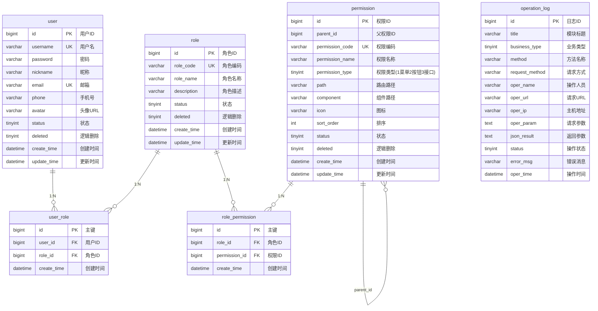
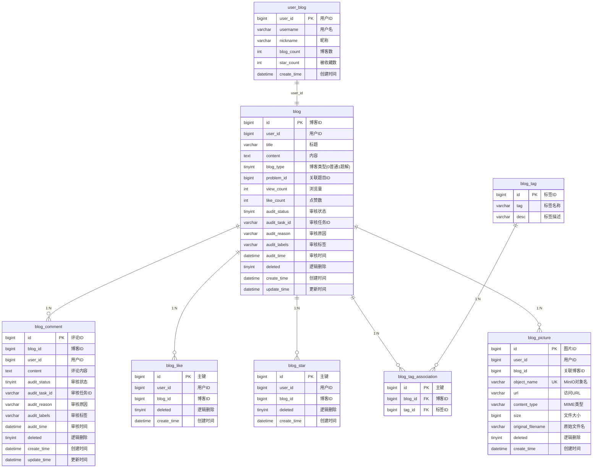
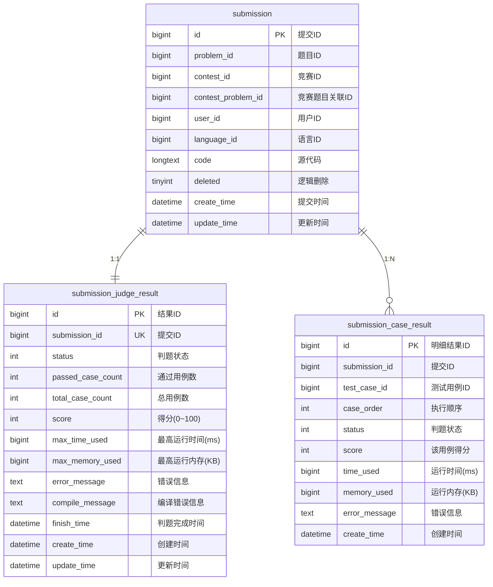
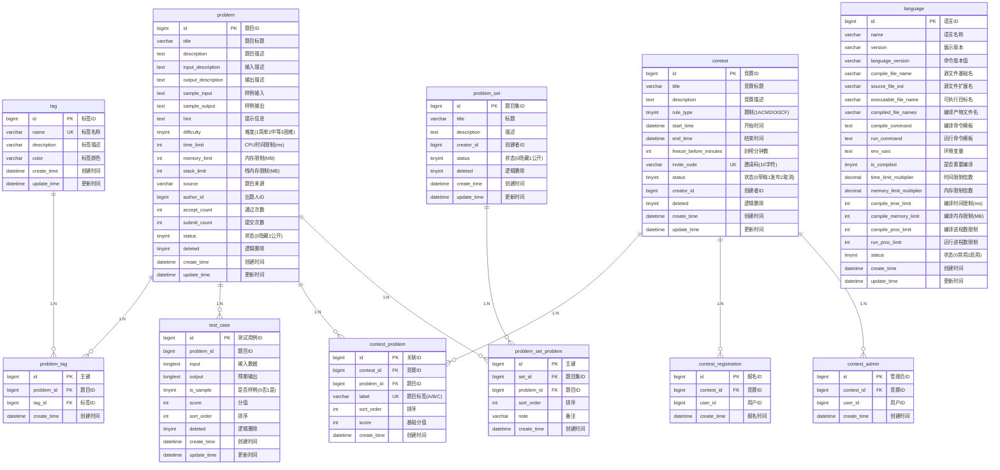

# EmiyaOJ-Cloud 在线判题系统

# 数据库设计说明书

**V1.0**

---

2026年05月

EmiyaOJ 开发团队

---

## 修订记录

| 版本 | 日期 | 修订内容 | 修订人 |
|------|------|---------|--------|
| V1.0 | 2026-05-27 | 初始版本，完整数据库设计 | EmiyaOJ 开发团队 |

---

## 目录

1. [标识符规范](#1-标识符规范)
2. [数据对象](#2-数据对象)
   - [2.1 数据表关系图（ER 图）](#21-数据表关系图er-图)
   - [2.2 数据表总体介绍](#22-数据表总体介绍)
   - [2.3 认证授权库（emiya_oj_auth）](#23-认证授权库emiya_oj_auth)
   - [2.4 博客内容库（emiya_oj_blog）](#24-博客内容库emiya_oj_blog)
   - [2.5 判题提交库（emiya_oj_judge）](#25-判题提交库emiya_oj_judge)
   - [2.6 题目竞赛库（emiya_oj_problem）](#26-题目竞赛库emiya_oj_problem)
3. [视图与触发器](#3-视图与触发器)
4. [索引汇总](#4-索引汇总)
5. [附录：判题状态枚举](#5-附录判题状态枚举)

---

## 1. 标识符规范

### 1.1 数据库环境

| 项目 | 说明 |
|------|------|
| 数据库管理系统 | MySQL 8.0.31 |
| 默认字符集 | utf8mb4 |
| 默认排序规则 | utf8mb4_unicode_ci |
| 存储引擎 | InnoDB |

### 1.2 命名规则

本项目采用**小写蛇形命名法（snake_case）**，未使用传统的 T_ / V_ / SP_ 前缀，以保持与 Spring Boot + MyBatis-Plus 生态的一致性。具体规范如下：

| 对象类型 | 命名规则 | 示例 |
|---------|---------|------|
| 数据库 | `emiya_oj_{模块}` | `emiya_oj_auth`、`emiya_oj_blog` |
| 数据表 | 全小写，下划线分隔 | `user`、`blog_comment`、`contest_registration` |
| 主键 | `id` | `id BIGINT AUTO_INCREMENT` |
| 外键 | `{关联表名}_id` | `user_id`、`problem_id`、`contest_id` |
| 唯一约束 | `uk_{表名}_{字段名}` | `uk_user_role`、`uk_contest_user` |
| 普通索引 | `idx_{字段名}` | `idx_user_id`、`idx_status` |
| 联合索引 | `idx_{字段1}_{字段2}` | `idx_submission_order` |
| 触发器 | `{before/after}_{表名}_{insert/update/delete}` | `after_blog_insert` |
| 逻辑删除字段 | `deleted` | `deleted TINYINT DEFAULT 0` |
| 创建时间 | `create_time` | `create_time DATETIME DEFAULT CURRENT_TIMESTAMP` |
| 更新时间 | `update_time` | `update_time DATETIME ON UPDATE CURRENT_TIMESTAMP` |

### 1.3 数据类型约定

| 数据类型 | 使用场景 |
|---------|---------|
| `BIGINT` | 主键 ID、外键关联字段 |
| `VARCHAR(N)` | 短文本（标题、名称、编码等），N ≤ 1024 |
| `TEXT` | 中等长度文本（描述、内容） |
| `LONGTEXT` | 长文本（源代码、测试用例输入/输出） |
| `TINYINT` | 状态标识、布尔值、枚举值 |
| `INT` | 计数字段、排序号、分数 |
| `DECIMAL(M,D)` | 精确小数（倍率系数） |
| `DATETIME` | 日期时间 |

---

## 2. 数据对象

### 2.1 数据表关系图（ER 图）

#### 2.1.1 认证授权库（emiya_oj_auth）

#### 2.1.2 博客内容库（emiya_oj_blog）

#### 2.1.3 判题提交库（emiya_oj_judge）

#### 2.1.4 题目竞赛库（emiya_oj_problem）

---

### 2.2 数据表总体介绍

系统共包含 **4 个数据库**、**28 张数据表**，按业务域垂直拆分：

| 序号 | Entity Name | Table Name | Primary Key | 所属数据库 | Memo |
|------|-------------|-----------|-------------|-----------|------|
| 1 | 用户信息 | user | id | emiya_oj_auth | 系统用户账号信息 |
| 2 | 角色信息 | role | id | emiya_oj_auth | RBAC 角色定义 |
| 3 | 权限信息 | permission | id | emiya_oj_auth | 树形权限（菜单/按钮/接口） |
| 4 | 用户-角色关联 | user_role | id | emiya_oj_auth | 用户与角色多对多关联 |
| 5 | 角色-权限关联 | role_permission | id | emiya_oj_auth | 角色与权限多对多关联 |
| 6 | 操作日志 | operation_log | id | emiya_oj_auth | 系统操作审计日志 |
| 7 | 博客信息 | blog | id | emiya_oj_blog | 博客/题解内容 |
| 8 | 博客评论 | blog_comment | id | emiya_oj_blog | 博客评论 |
| 9 | 博客点赞 | blog_like | id | emiya_oj_blog | 用户点赞记录 |
| 10 | 博客收藏 | blog_star | id | emiya_oj_blog | 用户收藏记录 |
| 11 | 博客图片 | blog_picture | id | emiya_oj_blog | 博客图片（MinIO存储） |
| 12 | 博客标签 | blog_tag | id | emiya_oj_blog | 博客标签字典 |
| 13 | 博客-标签关联 | blog_tag_association | id | emiya_oj_blog | 博客与标签多对多关联 |
| 14 | 用户博客统计 | user_blog | user_id | emiya_oj_blog | 用户博客数量与收藏统计 |
| 15 | 提交记录 | submission | id | emiya_oj_judge | 判题提交记录 |
| 16 | 判题汇总结果 | submission_judge_result | id | emiya_oj_judge | 单次提交的判题汇总 |
| 17 | 判题用例明细 | submission_case_result | id | emiya_oj_judge | 逐测试用例判题明细 |
| 18 | 题目信息 | problem | id | emiya_oj_problem | OJ 题目 |
| 19 | 题目标签 | tag | id | emiya_oj_problem | 题目算法标签字典 |
| 20 | 题目-标签关联 | problem_tag | id | emiya_oj_problem | 题目与标签多对多关联 |
| 21 | 测试用例 | test_case | id | emiya_oj_problem | 题目测试用例数据 |
| 22 | 测试用例生成器 | test_case_generator | id | emiya_oj_problem | 每题一个测试数据生成器描述与 Python 脚本 |
| 23 | 竞赛信息 | contest | id | emiya_oj_problem | 竞赛/比赛定义 |
| 24 | 竞赛-题目关联 | contest_problem | id | emiya_oj_problem | 竞赛包含的题目 |
| 25 | 竞赛报名 | contest_registration | id | emiya_oj_problem | 用户竞赛报名记录 |
| 26 | 竞赛管理员 | contest_admin | id | emiya_oj_problem | 竞赛管理员关联 |
| 27 | 编程语言 | language | id | emiya_oj_problem | 支持的编程语言配置 |
| 28 | 题目集 | problem_set | id | emiya_oj_problem | 题目集合/题单 |
| 29 | 题目集-题目关联 | problem_set_problem | id | emiya_oj_problem | 题目集包含的题目 |

---

### 2.3 认证授权库（emiya_oj_auth）

#### 2.3.1 用户信息（user）

存储系统所有用户的账号、个人资料与状态信息。

| Attribute / Logical Rolename | Column Name | Datatype | Null | Default | Definition |
|------------------------------|-------------|----------|------|---------|------------|
| 用户ID | id | BIGINT | N | AUTO_INCREMENT | 主键，自增 |
| 用户名 | username | VARCHAR(50) | N | — | 登录用户名，唯一 |
| 密码 | password | VARCHAR(100) | N | — | BCrypt 加密后的密码 |
| 昵称 | nickname | VARCHAR(50) | Y | NULL | 用户显示昵称 |
| 邮箱 | email | VARCHAR(100) | Y | NULL | 电子邮箱，唯一 |
| 手机号 | phone | VARCHAR(20) | Y | NULL | 手机号码 |
| 头像URL | avatar | VARCHAR(255) | Y | NULL | 头像图片地址 |
| 状态 | status | TINYINT | Y | 1 | 0-禁用，1-启用 |
| 逻辑删除 | deleted | TINYINT | Y | 0 | 0-未删除，1-已删除 |
| 创建时间 | create_time | DATETIME | Y | CURRENT_TIMESTAMP | 记录创建时间 |
| 更新时间 | update_time | DATETIME | Y | CURRENT_TIMESTAMP ON UPDATE | 记录更新时间 |
| 创建者 | create_by | BIGINT | Y | NULL | 创建人用户ID |
| 更新者 | update_by | BIGINT | Y | NULL | 最后更新人用户ID |

**索引**：

| 索引名 | 字段 | 类型 |
|--------|------|------|
| PRIMARY | id | 主键 |
| uk_username | username | 唯一索引 |
| uk_email | email | 唯一索引 |
| idx_status | status | 普通索引 |
| idx_create_time | create_time | 普通索引 |

---

#### 2.3.2 角色信息（role）

定义系统角色，支持 RBAC 权限模型。

| Attribute / Logical Rolename | Column Name | Datatype | Null | Default | Definition |
|------------------------------|-------------|----------|------|---------|------------|
| 角色ID | id | BIGINT | N | AUTO_INCREMENT | 主键，自增 |
| 角色编码 | role_code | VARCHAR(50) | N | — | 角色唯一编码，如 ADMIN、USER |
| 角色名称 | role_name | VARCHAR(50) | N | — | 角色显示名称 |
| 角色描述 | description | VARCHAR(255) | Y | NULL | 角色说明 |
| 状态 | status | TINYINT | Y | 1 | 0-禁用，1-启用 |
| 逻辑删除 | deleted | TINYINT | Y | 0 | 0-未删除，1-已删除 |
| 创建时间 | create_time | DATETIME | Y | CURRENT_TIMESTAMP | 记录创建时间 |
| 更新时间 | update_time | DATETIME | Y | CURRENT_TIMESTAMP ON UPDATE | 记录更新时间 |
| 创建者 | create_by | BIGINT | Y | NULL | 创建人用户ID |
| 更新者 | update_by | BIGINT | Y | NULL | 最后更新人用户ID |

**索引**：

| 索引名 | 字段 | 类型 |
|--------|------|------|
| PRIMARY | id | 主键 |
| uk_role_code | role_code | 唯一索引 |
| idx_status | status | 普通索引 |

---

#### 2.3.3 权限信息（permission）

树形权限结构，支持菜单、按钮、接口三种粒度。

| Attribute / Logical Rolename | Column Name | Datatype | Null | Default | Definition |
|------------------------------|-------------|----------|------|---------|------------|
| 权限ID | id | BIGINT | N | AUTO_INCREMENT | 主键，自增 |
| 父权限ID | parent_id | BIGINT | Y | 0 | 父级权限ID，0表示根节点 |
| 权限编码 | permission_code | VARCHAR(255) | N | — | 权限唯一编码，如 user:list |
| 权限名称 | permission_name | VARCHAR(50) | N | — | 权限显示名称 |
| 权限类型 | permission_type | TINYINT | N | — | 1-菜单，2-按钮，3-接口 |
| 路由路径 | path | VARCHAR(255) | Y | NULL | 前端路由路径（菜单类型） |
| 组件路径 | component | VARCHAR(255) | Y | NULL | 前端组件路径（菜单类型） |
| 图标 | icon | VARCHAR(50) | Y | NULL | 菜单图标 |
| 排序 | sort_order | INT | Y | 0 | 同级排序号，越小越靠前 |
| 状态 | status | TINYINT | Y | 1 | 0-禁用，1-启用 |
| 逻辑删除 | deleted | TINYINT | Y | 0 | 0-未删除，1-已删除 |
| 创建时间 | create_time | DATETIME | Y | CURRENT_TIMESTAMP | 记录创建时间 |
| 更新时间 | update_time | DATETIME | Y | CURRENT_TIMESTAMP ON UPDATE | 记录更新时间 |
| 创建者 | create_by | BIGINT | Y | NULL | 创建人用户ID |
| 更新者 | update_by | BIGINT | Y | NULL | 最后更新人用户ID |

**索引**：

| 索引名 | 字段 | 类型 |
|--------|------|------|
| PRIMARY | id | 主键 |
| uk_permission_code | permission_code | 唯一索引 |
| idx_parent_id | parent_id | 普通索引 |
| idx_permission_type | permission_type | 普通索引 |
| idx_status | status | 普通索引 |
| idx_sort_order | sort_order | 普通索引 |

---

#### 2.3.4 用户-角色关联（user_role）

用户与角色的多对多关联表。

| Attribute / Logical Rolename | Column Name | Datatype | Null | Default | Definition |
|------------------------------|-------------|----------|------|---------|------------|
| 主键ID | id | BIGINT | N | AUTO_INCREMENT | 主键，自增 |
| 用户ID | user_id | BIGINT | N | — | 外键，关联 user.id，级联删除 |
| 角色ID | role_id | BIGINT | N | — | 外键，关联 role.id，级联删除 |
| 创建时间 | create_time | DATETIME | Y | CURRENT_TIMESTAMP | 记录创建时间 |
| 创建者 | create_by | BIGINT | Y | NULL | 创建人用户ID |

**索引**：

| 索引名 | 字段 | 类型 |
|--------|------|------|
| PRIMARY | id | 主键 |
| uk_user_role | (user_id, role_id) | 联合唯一索引 |
| idx_user_id | user_id | 普通索引 |
| idx_role_id | role_id | 普通索引 |

**外键**：

| 外键列 | 引用表 | 引用列 | 删除规则 |
|--------|--------|--------|---------|
| user_id | user | id | CASCADE |
| role_id | role | id | CASCADE |

---

#### 2.3.5 角色-权限关联（role_permission）

角色与权限的多对多关联表。

| Attribute / Logical Rolename | Column Name | Datatype | Null | Default | Definition |
|------------------------------|-------------|----------|------|---------|------------|
| 主键ID | id | BIGINT | N | AUTO_INCREMENT | 主键，自增 |
| 角色ID | role_id | BIGINT | N | — | 外键，关联 role.id，级联删除 |
| 权限ID | permission_id | BIGINT | N | — | 外键，关联 permission.id，级联删除 |
| 创建时间 | create_time | DATETIME | Y | CURRENT_TIMESTAMP | 记录创建时间 |
| 创建者 | create_by | BIGINT | Y | NULL | 创建人用户ID |

**索引**：

| 索引名 | 字段 | 类型 |
|--------|------|------|
| PRIMARY | id | 主键 |
| uk_role_permission | (role_id, permission_id) | 联合唯一索引 |
| idx_role_id | role_id | 普通索引 |
| idx_permission_id | permission_id | 普通索引 |

**外键**：

| 外键列 | 引用表 | 引用列 | 删除规则 |
|--------|--------|--------|---------|
| role_id | role | id | CASCADE |
| permission_id | permission | id | CASCADE |

---

#### 2.3.6 操作日志（operation_log）

系统操作审计日志，记录用户的关键操作行为。

| Attribute / Logical Rolename | Column Name | Datatype | Null | Default | Definition |
|------------------------------|-------------|----------|------|---------|------------|
| 日志ID | id | BIGINT | N | AUTO_INCREMENT | 主键，自增 |
| 模块标题 | title | VARCHAR(50) | Y | NULL | 操作模块名称 |
| 业务类型 | business_type | TINYINT | Y | NULL | 业务操作类型编码 |
| 方法名称 | method | VARCHAR(100) | Y | NULL | 执行的类方法名 |
| 请求方式 | request_method | VARCHAR(10) | Y | NULL | HTTP 方法（GET/POST/PUT/DELETE） |
| 操作类别 | operator_type | TINYINT | Y | 0 | 操作人类型 |
| 操作人员 | oper_name | VARCHAR(50) | Y | NULL | 操作人用户名 |
| 请求URL | oper_url | VARCHAR(255) | Y | NULL | 请求接口地址 |
| 主机地址 | oper_ip | VARCHAR(50) | Y | NULL | 操作人 IP 地址 |
| 操作地点 | oper_location | VARCHAR(255) | Y | NULL | IP 地址归属地 |
| 请求参数 | oper_param | TEXT | Y | NULL | 请求参数 JSON |
| 返回参数 | json_result | TEXT | Y | NULL | 响应结果 JSON |
| 操作状态 | status | TINYINT | Y | 0 | 0-成功，1-失败 |
| 错误消息 | error_msg | VARCHAR(2000) | Y | NULL | 失败时的错误信息 |
| 操作时间 | oper_time | DATETIME | Y | CURRENT_TIMESTAMP | 操作发生时间 |

**索引**：

| 索引名 | 字段 | 类型 |
|--------|------|------|
| PRIMARY | id | 主键 |
| idx_title | title | 普通索引 |
| idx_business_type | business_type | 普通索引 |
| idx_status | status | 普通索引 |
| idx_oper_time | oper_time | 普通索引 |

---

### 2.4 博客内容库（emiya_oj_blog）

#### 2.4.1 博客信息（blog）

存储博客文章和题解内容，内嵌内容审核字段。

| Attribute / Logical Rolename | Column Name | Datatype | Null | Default | Definition |
|------------------------------|-------------|----------|------|---------|------------|
| 博客ID | id | BIGINT | N | AUTO_INCREMENT | 主键，自增 |
| 用户ID | user_id | BIGINT | N | — | 作者用户ID |
| 标题 | title | VARCHAR(255) | N | — | 博客标题 |
| 内容 | content | TEXT | N | — | 博客正文（Markdown 格式） |
| 博客类型 | blog_type | TINYINT | N | 0 | 0-普通博客，1-问题解决方案 |
| 关联题目ID | problem_id | BIGINT | Y | NULL | 当 blog_type=1 时关联的题目 |
| 浏览量 | view_count | INT | N | 0 | 累计浏览次数 |
| 点赞数 | like_count | INT | N | 0 | 累计点赞数 |
| 审核状态 | audit_status | TINYINT | N | 0 | 0-待审核，1-已批准，2-已拒绝，3-需人工审核 |
| 审核任务ID | audit_task_id | VARCHAR(64) | Y | NULL | 最近一次审核任务ID |
| 审核原因 | audit_reason | VARCHAR(1000) | Y | NULL | 审核结果说明 |
| 审核标签 | audit_labels | VARCHAR(512) | Y | NULL | 审核命中的风险标签 |
| 审核时间 | audit_time | DATETIME | Y | NULL | 审核完成时间 |
| 逻辑删除 | deleted | TINYINT | N | 0 | 0-未删除，1-已删除 |
| 创建时间 | create_time | DATETIME | N | CURRENT_TIMESTAMP | 发布时间 |
| 更新时间 | update_time | DATETIME | N | CURRENT_TIMESTAMP ON UPDATE | 最后修改时间 |

**索引**：

| 索引名 | 字段 | 类型 |
|--------|------|------|
| PRIMARY | id | 主键 |
| uk_user_problem_type_deleted | (user_id, problem_id, blog_type, deleted) | 联合唯一索引 |
| idx_user_id | user_id | 普通索引 |
| idx_problem_type | (problem_id, blog_type) | 联合索引 |
| idx_audit_status | audit_status | 普通索引 |
| idx_update_time | update_time | 普通索引 |

---

#### 2.4.2 博客评论（blog_comment）

存储博客的评论内容，同样内嵌审核字段。

| Attribute / Logical Rolename | Column Name | Datatype | Null | Default | Definition |
|------------------------------|-------------|----------|------|---------|------------|
| 评论ID | id | BIGINT | N | AUTO_INCREMENT | 主键，自增 |
| 博客ID | blog_id | BIGINT | N | — | 被评论的博客ID |
| 用户ID | user_id | BIGINT | N | — | 评论人用户ID |
| 评论内容 | content | TEXT | N | — | 评论正文 |
| 审核状态 | audit_status | TINYINT | N | 0 | 0-待审核，1-已批准，2-已拒绝，3-需人工审核 |
| 审核任务ID | audit_task_id | VARCHAR(64) | Y | NULL | 最近一次审核任务ID |
| 审核原因 | audit_reason | VARCHAR(1000) | Y | NULL | 审核结果说明 |
| 审核标签 | audit_labels | VARCHAR(512) | Y | NULL | 审核命中的风险标签 |
| 审核时间 | audit_time | DATETIME | Y | NULL | 审核完成时间 |
| 逻辑删除 | deleted | TINYINT | N | 0 | 0-未删除，1-已删除 |
| 创建时间 | create_time | DATETIME | N | CURRENT_TIMESTAMP | 评论时间 |
| 更新时间 | update_time | DATETIME | N | CURRENT_TIMESTAMP ON UPDATE | 最后修改时间 |

**索引**：

| 索引名 | 字段 | 类型 |
|--------|------|------|
| PRIMARY | id | 主键 |
| idx_blog_id | blog_id | 普通索引 |
| idx_user_id | user_id | 普通索引 |
| idx_audit_status | audit_status | 普通索引 |

---

#### 2.4.3 博客点赞（blog_like）

记录用户对博客的点赞行为，使用逻辑删除支持取消点赞。

| Attribute / Logical Rolename | Column Name | Datatype | Null | Default | Definition |
|------------------------------|-------------|----------|------|---------|------------|
| 主键ID | id | BIGINT | N | AUTO_INCREMENT | 主键，自增 |
| 用户ID | user_id | BIGINT | N | — | 点赞用户ID |
| 博客ID | blog_id | BIGINT | N | — | 被点赞的博客ID |
| 逻辑删除 | deleted | TINYINT | N | 0 | 0-已点赞，1-已取消 |
| 创建时间 | create_time | DATETIME | N | CURRENT_TIMESTAMP | 点赞时间 |

**索引**：

| 索引名 | 字段 | 类型 |
|--------|------|------|
| PRIMARY | id | 主键 |
| uk_user_blog | (user_id, blog_id) | 联合唯一索引 |
| idx_blog_id | blog_id | 普通索引 |

---

#### 2.4.4 博客收藏（blog_star）

记录用户对博客的收藏行为。

| Attribute / Logical Rolename | Column Name | Datatype | Null | Default | Definition |
|------------------------------|-------------|----------|------|---------|------------|
| 主键ID | id | BIGINT | N | AUTO_INCREMENT | 主键，自增 |
| 用户ID | user_id | BIGINT | N | — | 收藏用户ID |
| 博客ID | blog_id | BIGINT | N | — | 被收藏的博客ID |
| 逻辑删除 | deleted | TINYINT | N | 0 | 0-已收藏，1-已取消 |
| 创建时间 | create_time | DATETIME | N | CURRENT_TIMESTAMP | 收藏时间 |

**索引**：

| 索引名 | 字段 | 类型 |
|--------|------|------|
| PRIMARY | id | 主键 |
| uk_user_blog | (user_id, blog_id) | 联合唯一索引 |

---

#### 2.4.5 博客图片（blog_picture）

存储博客文章中引用的图片元信息，实际文件存储在 MinIO 对象存储中。

| Attribute / Logical Rolename | Column Name | Datatype | Null | Default | Definition |
|------------------------------|-------------|----------|------|---------|------------|
| 图片ID | id | BIGINT | N | AUTO_INCREMENT | 主键，自增 |
| 用户ID | user_id | BIGINT | N | — | 上传用户ID |
| 关联博客ID | blog_id | BIGINT | Y | NULL | 关联的博客ID |
| MinIO对象名 | object_name | VARCHAR(512) | N | — | MinIO 存储的对象名称，唯一 |
| 访问URL | url | VARCHAR(1024) | N | — | 图片访问地址 |
| MIME类型 | content_type | VARCHAR(100) | N | — | 如 image/png、image/jpeg |
| 文件大小 | size | BIGINT | N | — | 文件字节数 |
| 原始文件名 | original_filename | VARCHAR(255) | Y | NULL | 用户上传时的文件名 |
| 逻辑删除 | deleted | TINYINT | N | 0 | 0-未删除，1-已删除 |
| 创建时间 | create_time | DATETIME | N | CURRENT_TIMESTAMP | 上传时间 |

**索引**：

| 索引名 | 字段 | 类型 |
|--------|------|------|
| PRIMARY | id | 主键 |
| uk_object_name | object_name | 唯一索引 |
| idx_blog_id | blog_id | 普通索引 |
| idx_user_id | user_id | 普通索引 |

---

#### 2.4.6 博客标签（blog_tag）

博客分类标签字典表。

| Attribute / Logical Rolename | Column Name | Datatype | Null | Default | Definition |
|------------------------------|-------------|----------|------|---------|------------|
| 标签ID | id | BIGINT | N | AUTO_INCREMENT | 主键，自增 |
| 标签名称 | tag | VARCHAR(255) | N | — | 标签名 |
| 标签描述 | desc | VARCHAR(255) | N | — | 标签说明 |

**索引**：

| 索引名 | 字段 | 类型 |
|--------|------|------|
| PRIMARY | id | 主键 |

---

#### 2.4.7 博客-标签关联（blog_tag_association）

博客与标签的多对多关联表。

| Attribute / Logical Rolename | Column Name | Datatype | Null | Default | Definition |
|------------------------------|-------------|----------|------|---------|------------|
| 主键ID | id | BIGINT | N | AUTO_INCREMENT | 主键，自增 |
| 博客ID | blog_id | BIGINT | N | — | 关联 blog.id |
| 标签ID | tag_id | BIGINT | N | — | 关联 blog_tag.id |

**索引**：

| 索引名 | 字段 | 类型 |
|--------|------|------|
| PRIMARY | id | 主键 |
| uk_blog_tag | (blog_id, tag_id) | 联合唯一索引 |
| idx_blog_id | blog_id | 普通索引 |
| idx_tag_id | tag_id | 普通索引 |

---

#### 2.4.8 用户博客统计（user_blog）

用户维度的博客统计数据，通过 MySQL 触发器自动维护。

| Attribute / Logical Rolename | Column Name | Datatype | Null | Default | Definition |
|------------------------------|-------------|----------|------|---------|------------|
| 用户ID | user_id | BIGINT | N | — | 主键，用户ID |
| 用户名 | username | VARCHAR(50) | N | — | 冗余用户名，避免跨库查询 |
| 昵称 | nickname | VARCHAR(50) | N | — | 冗余昵称 |
| 博客数 | blog_count | INT | N | 0 | 已批准的博客总数 |
| 被收藏数 | star_count | INT | N | 0 | 博客被收藏的总次数 |
| 创建时间 | create_time | DATETIME | N | CURRENT_TIMESTAMP | 记录创建时间 |

**索引**：

| 索引名 | 字段 | 类型 |
|--------|------|------|
| PRIMARY | user_id | 主键 |

> **说明**：该表的 `blog_count` 和 `star_count` 由数据库触发器自动维护，详见 [3. 视图与触发器](#3-视图与触发器)。

---

### 2.5 判题提交库（emiya_oj_judge）

#### 2.5.1 提交记录（submission）

存储每次代码提交的基本信息。

| Attribute / Logical Rolename | Column Name | Datatype | Null | Default | Definition |
|------------------------------|-------------|----------|------|---------|------------|
| 提交ID | id | BIGINT | N | AUTO_INCREMENT | 主键，自增 |
| 题目ID | problem_id | BIGINT | N | — | 提交的题目ID |
| 竞赛ID | contest_id | BIGINT | Y | NULL | 竞赛提交时关联的竞赛ID |
| 竞赛题目关联ID | contest_problem_id | BIGINT | Y | NULL | 竞赛提交时关联的 contest_problem.id |
| 用户ID | user_id | BIGINT | N | — | 提交用户ID |
| 语言ID | language_id | BIGINT | N | — | 使用的编程语言ID |
| 源代码 | code | LONGTEXT | N | — | 提交的源代码 |
| 逻辑删除 | deleted | TINYINT | Y | 0 | 0-未删除，1-已删除 |
| 提交时间 | create_time | DATETIME | Y | CURRENT_TIMESTAMP | 代码提交时间 |
| 更新时间 | update_time | DATETIME | Y | CURRENT_TIMESTAMP ON UPDATE | 记录更新时间 |

**索引**：

| 索引名 | 字段 | 类型 |
|--------|------|------|
| PRIMARY | id | 主键 |
| idx_problem_id | problem_id | 普通索引 |
| idx_contest_id | contest_id | 普通索引 |
| idx_contest_problem_id | contest_problem_id | 普通索引 |
| idx_user_id | user_id | 普通索引 |
| idx_language_id | language_id | 普通索引 |
| idx_create_time | create_time | 普通索引 |

---

#### 2.5.2 判题汇总结果（submission_judge_result）

单次提交的整体判题结果汇总，与 submission 为一对一关系。

| Attribute / Logical Rolename | Column Name | Datatype | Null | Default | Definition |
|------------------------------|-------------|----------|------|---------|------------|
| 结果ID | id | BIGINT | N | AUTO_INCREMENT | 主键，自增 |
| 提交ID | submission_id | BIGINT | N | — | 关联 submission.id，唯一 |
| 判题状态 | status | INT | N | 0 | 判题状态码（详见附录） |
| 通过用例数 | passed_case_count | INT | N | 0 | 通过的测试用例数量 |
| 总用例数 | total_case_count | INT | N | 0 | 测试用例总数 |
| 得分 | score | INT | Y | 0 | 得分（0~100），非百分制时为0 |
| 最高运行时间 | max_time_used | BIGINT | Y | 0 | 所有用例中最高运行时间（毫秒） |
| 最高运行内存 | max_memory_used | BIGINT | Y | 0 | 所有用例中最高运行内存（KB） |
| 错误信息 | error_message | TEXT | Y | NULL | 运行错误/系统错误信息 |
| 编译错误信息 | compile_message | TEXT | Y | NULL | 编译失败时的错误输出 |
| 判题完成时间 | finish_time | DATETIME | Y | NULL | 判题结束时间 |
| 创建时间 | create_time | DATETIME | Y | CURRENT_TIMESTAMP | 记录创建时间 |
| 更新时间 | update_time | DATETIME | Y | CURRENT_TIMESTAMP ON UPDATE | 记录更新时间 |

**索引**：

| 索引名 | 字段 | 类型 |
|--------|------|------|
| PRIMARY | id | 主键 |
| uk_submission_id | submission_id | 唯一索引 |
| idx_status | status | 普通索引 |
| idx_finish_time | finish_time | 普通索引 |

---

#### 2.5.3 判题用例明细（submission_case_result）

逐测试用例的判题结果明细，与 submission 为一对多关系。

| Attribute / Logical Rolename | Column Name | Datatype | Null | Default | Definition |
|------------------------------|-------------|----------|------|---------|------------|
| 明细结果ID | id | BIGINT | N | AUTO_INCREMENT | 主键，自增 |
| 提交ID | submission_id | BIGINT | N | — | 关联 submission.id |
| 测试用例ID | test_case_id | BIGINT | N | — | 关联 test_case.id |
| 执行顺序 | case_order | INT | Y | 0 | 测试用例的执行序号 |
| 判题状态 | status | INT | N | — | 该用例的判题状态码 |
| 该用例得分 | score | INT | Y | 0 | 该测试用例获得的分值 |
| 运行时间 | time_used | BIGINT | Y | 0 | 该用例运行时间（毫秒） |
| 运行内存 | memory_used | BIGINT | Y | 0 | 该用例运行内存（KB） |
| 错误信息 | error_message | TEXT | Y | NULL | 该用例的错误详情 |
| 创建时间 | create_time | DATETIME | Y | CURRENT_TIMESTAMP | 记录创建时间 |

**索引**：

| 索引名 | 字段 | 类型 |
|--------|------|------|
| PRIMARY | id | 主键 |
| idx_submission_id | submission_id | 普通索引 |
| idx_test_case_id | test_case_id | 普通索引 |
| idx_submission_order | (submission_id, case_order) | 联合索引 |

---

### 2.6 题目竞赛库（emiya_oj_problem）

#### 2.6.1 题目信息（problem）

OJ 核心——题目定义，包含描述、限制条件与统计数据。

| Attribute / Logical Rolename | Column Name | Datatype | Null | Default | Definition |
|------------------------------|-------------|----------|------|---------|------------|
| 题目ID | id | BIGINT | N | AUTO_INCREMENT | 主键，自增 |
| 题目标题 | title | VARCHAR(255) | N | — | 题目标题 |
| 题目描述 | description | TEXT | N | — | 题目详细描述（Markdown） |
| 输入描述 | input_description | TEXT | Y | NULL | 输入格式说明 |
| 输出描述 | output_description | TEXT | Y | NULL | 输出格式说明 |
| 样例输入 | sample_input | TEXT | Y | NULL | 样例输入数据 |
| 样例输出 | sample_output | TEXT | Y | NULL | 样例输出数据 |
| 提示信息 | hint | TEXT | Y | NULL | 解题提示 |
| 难度 | difficulty | TINYINT | Y | 1 | 1-简单，2-中等，3-困难 |
| CPU时间限制 | time_limit | INT | N | — | CPU时间限制（毫秒） |
| 内存限制 | memory_limit | INT | N | — | 内存限制（MB） |
| 栈内存限制 | stack_limit | INT | Y | 128 | 栈内存限制（MB） |
| 题目来源 | source | VARCHAR(255) | Y | NULL | 题目来源（如 LeetCode、ACM 区域赛） |
| 出题人ID | author_id | BIGINT | Y | NULL | 出题人用户ID |
| 通过次数 | accept_count | INT | Y | 0 | 累计通过（AC）次数 |
| 提交次数 | submit_count | INT | Y | 0 | 累计提交次数 |
| 状态 | status | TINYINT | Y | 1 | 0-隐藏，1-公开 |
| 逻辑删除 | deleted | TINYINT | Y | 0 | 0-未删除，1-已删除 |
| 创建时间 | create_time | DATETIME | Y | CURRENT_TIMESTAMP | 记录创建时间 |
| 更新时间 | update_time | DATETIME | Y | CURRENT_TIMESTAMP ON UPDATE | 记录更新时间 |
| 创建者 | create_by | BIGINT | Y | NULL | 创建人用户ID |
| 更新者 | update_by | BIGINT | Y | NULL | 最后更新人用户ID |

**索引**：

| 索引名 | 字段 | 类型 |
|--------|------|------|
| PRIMARY | id | 主键 |
| idx_difficulty | difficulty | 普通索引 |
| idx_status | status | 普通索引 |
| idx_author_id | author_id | 普通索引 |
| idx_create_time | create_time | 普通索引 |

---

#### 2.6.2 题目标签（tag）

题目算法标签字典，如"动态规划"、"贪心"、"DFS"等。

| Attribute / Logical Rolename | Column Name | Datatype | Null | Default | Definition |
|------------------------------|-------------|----------|------|---------|------------|
| 标签ID | id | BIGINT | N | AUTO_INCREMENT | 主键，自增 |
| 标签名称 | name | VARCHAR(50) | N | — | 标签名称，唯一 |
| 标签描述 | description | VARCHAR(255) | Y | NULL | 标签说明 |
| 标签颜色 | color | VARCHAR(20) | Y | '#409EFF' | 标签展示颜色（十六进制） |
| 创建时间 | create_time | DATETIME | Y | CURRENT_TIMESTAMP | 记录创建时间 |
| 更新时间 | update_time | DATETIME | Y | CURRENT_TIMESTAMP ON UPDATE | 记录更新时间 |

**索引**：

| 索引名 | 字段 | 类型 |
|--------|------|------|
| PRIMARY | id | 主键 |
| uk_name | name | 唯一索引 |

---

#### 2.6.3 题目-标签关联（problem_tag）

题目与标签的多对多关联表。

| Attribute / Logical Rolename | Column Name | Datatype | Null | Default | Definition |
|------------------------------|-------------|----------|------|---------|------------|
| 主键ID | id | BIGINT | N | AUTO_INCREMENT | 主键，自增 |
| 题目ID | problem_id | BIGINT | N | — | 关联 problem.id |
| 标签ID | tag_id | BIGINT | N | — | 关联 tag.id |
| 创建时间 | create_time | DATETIME | Y | CURRENT_TIMESTAMP | 关联创建时间 |

**索引**：

| 索引名 | 字段 | 类型 |
|--------|------|------|
| PRIMARY | id | 主键 |
| uk_problem_tag | (problem_id, tag_id) | 联合唯一索引 |
| idx_problem_id | problem_id | 普通索引 |
| idx_tag_id | tag_id | 普通索引 |

---

#### 2.6.4 测试用例（test_case）

题目的输入/输出测试用例，支持样例和隐藏用例。

| Attribute / Logical Rolename | Column Name | Datatype | Null | Default | Definition |
|------------------------------|-------------|----------|------|---------|------------|
| 测试用例ID | id | BIGINT | N | AUTO_INCREMENT | 主键，自增 |
| 题目ID | problem_id | BIGINT | N | — | 关联 problem.id |
| 输入数据 | input | LONGTEXT | N | — | 标准输入数据 |
| 预期输出 | output | LONGTEXT | N | — | 标准输出数据 |
| 是否样例 | is_sample | TINYINT | Y | 0 | 0-隐藏测试用例，1-样例（对用户可见） |
| 分值 | score | INT | Y | 0 | 该测试用例的分值权重 |
| 排序 | sort_order | INT | Y | 0 | 用例执行顺序 |
| 逻辑删除 | deleted | TINYINT | Y | 0 | 0-未删除，1-已删除 |
| 创建时间 | create_time | DATETIME | Y | CURRENT_TIMESTAMP | 记录创建时间 |
| 更新时间 | update_time | DATETIME | Y | CURRENT_TIMESTAMP ON UPDATE | 记录更新时间 |

**索引**：

| 索引名 | 字段 | 类型 |
|--------|------|------|
| PRIMARY | id | 主键 |
| idx_problem_id | problem_id | 普通索引 |
| idx_is_sample | is_sample | 普通索引 |
| idx_sort_order | sort_order | 普通索引 |

---

#### 2.6.4.1 测试用例生成器（test_case_generator）

每个题目最多维护一份测试数据生成器描述和一份 Python 生成器脚本。生成器脚本通过 Judge Service 复用 Go-Judge 沙箱执行，执行成功后由 Problem Service 将 stdout 中的 JSON 测试用例写入 `test_case`。

| Attribute / Logical Rolename | Column Name | Datatype | Null | Default | Definition |
|------------------------------|-------------|----------|------|---------|------------|
| 生成器ID | id | BIGINT | N | AUTO_INCREMENT | 主键，自增 |
| 题目ID | problem_id | BIGINT | N | — | 关联 problem.id，每题唯一 |
| 生成器描述 | spec | LONGTEXT | N | — | TestCaseGeneratorSpec，说明数据范围、边界、分组等 |
| 生成器脚本 | generator_code | LONGTEXT | Y | NULL | Python TestCaseGenerator 脚本 |
| 逻辑删除 | deleted | TINYINT | Y | 0 | 0-未删除，1-已删除 |
| 创建时间 | create_time | DATETIME | Y | CURRENT_TIMESTAMP | 记录创建时间 |
| 更新时间 | update_time | DATETIME | Y | CURRENT_TIMESTAMP ON UPDATE | 记录更新时间 |
| 创建者 | create_by | BIGINT | Y | NULL | 创建用户ID |
| 更新者 | update_by | BIGINT | Y | NULL | 最近更新用户ID |

**索引**：

| 索引名 | 字段 | 类型 |
|--------|------|------|
| PRIMARY | id | 主键 |
| uk_problem_id | problem_id | 唯一索引 |
| idx_deleted | deleted | 普通索引 |

---

#### 2.6.5 竞赛信息（contest）

竞赛/比赛的定义，支持 ACM/ICPC、IOI、Codeforces 三种赛制。

| Attribute / Logical Rolename | Column Name | Datatype | Null | Default | Definition |
|------------------------------|-------------|----------|------|---------|------------|
| 竞赛ID | id | BIGINT | N | AUTO_INCREMENT | 主键，自增 |
| 竞赛标题 | title | VARCHAR(255) | N | — | 竞赛名称 |
| 竞赛描述 | description | TEXT | Y | NULL | 竞赛说明 |
| 赛制 | rule_type | TINYINT | N | — | 1-ACM/ICPC，2-IOI，3-Codeforces |
| 开始时间 | start_time | DATETIME | N | — | 竞赛开始时间 |
| 结束时间 | end_time | DATETIME | N | — | 竞赛结束时间 |
| 封榜分钟数 | freeze_before_minutes | INT | N | 60 | 距结束前多少分钟封榜；0 表示不封榜 |
| 邀请码 | invite_code | VARCHAR(10) | N | — | 10 字符唯一邀请码 |
| 状态 | status | TINYINT | N | 0 | 0-草稿，1-已发布，2-已取消 |
| 创建者ID | creator_id | BIGINT | N | — | 竞赛创建人用户ID |
| 逻辑删除 | deleted | TINYINT | N | 0 | 0-正常，1-已删除 |
| 创建时间 | create_time | DATETIME | Y | CURRENT_TIMESTAMP | 记录创建时间 |
| 更新时间 | update_time | DATETIME | Y | CURRENT_TIMESTAMP ON UPDATE | 记录更新时间 |
| 创建者 | create_by | BIGINT | Y | NULL | 创建人用户ID |
| 更新者 | update_by | BIGINT | Y | NULL | 最后更新人用户ID |

**索引**：

| 索引名 | 字段 | 类型 |
|--------|------|------|
| PRIMARY | id | 主键 |
| uk_invite_code | invite_code | 唯一索引 |
| idx_rule_type | rule_type | 普通索引 |
| idx_status | status | 普通索引 |
| idx_start_time | start_time | 普通索引 |
| idx_creator_id | creator_id | 普通索引 |

---

#### 2.6.6 竞赛-题目关联（contest_problem）

竞赛中包含的题目及其配置。

| Attribute / Logical Rolename | Column Name | Datatype | Null | Default | Definition |
|------------------------------|-------------|----------|------|---------|------------|
| 关联ID | id | BIGINT | N | AUTO_INCREMENT | 主键，自增 |
| 竞赛ID | contest_id | BIGINT | N | — | 关联 contest.id |
| 题目ID | problem_id | BIGINT | N | — | 关联 problem.id |
| 题目标签 | label | VARCHAR(20) | N | — | 竞赛中的题目编号（A、B、C...），同一竞赛内唯一 |
| 排序 | sort_order | INT | N | 0 | 题目在竞赛中的排序 |
| 基础分值 | score | INT | N | 100 | 该题目在竞赛中的基础分 |
| 创建时间 | create_time | DATETIME | Y | CURRENT_TIMESTAMP | 关联创建时间 |

**索引**：

| 索引名 | 字段 | 类型 |
|--------|------|------|
| PRIMARY | id | 主键 |
| uk_contest_problem | (contest_id, problem_id) | 联合唯一索引 |
| uk_contest_label | (contest_id, label) | 联合唯一索引 |
| idx_contest_id | contest_id | 普通索引 |
| idx_problem_id | problem_id | 普通索引 |
| idx_sort_order | sort_order | 普通索引 |

---

#### 2.6.7 竞赛报名（contest_registration）

用户报名参加竞赛的记录。

| Attribute / Logical Rolename | Column Name | Datatype | Null | Default | Definition |
|------------------------------|-------------|----------|------|---------|------------|
| 报名ID | id | BIGINT | N | AUTO_INCREMENT | 主键，自增 |
| 竞赛ID | contest_id | BIGINT | N | — | 关联 contest.id |
| 用户ID | user_id | BIGINT | N | — | 报名用户ID |
| 报名时间 | create_time | DATETIME | Y | CURRENT_TIMESTAMP | 报名时间 |

**索引**：

| 索引名 | 字段 | 类型 |
|--------|------|------|
| PRIMARY | id | 主键 |
| uk_contest_user | (contest_id, user_id) | 联合唯一索引 |
| idx_contest_id | contest_id | 普通索引 |
| idx_user_id | user_id | 普通索引 |

---

#### 2.6.8 竞赛管理员（contest_admin）

竞赛管理员的关联记录。

| Attribute / Logical Rolename | Column Name | Datatype | Null | Default | Definition |
|------------------------------|-------------|----------|------|---------|------------|
| 管理员ID | id | BIGINT | N | AUTO_INCREMENT | 主键，自增 |
| 竞赛ID | contest_id | BIGINT | N | — | 关联 contest.id |
| 用户ID | user_id | BIGINT | N | — | 管理员用户ID |
| 创建时间 | create_time | DATETIME | Y | CURRENT_TIMESTAMP | 授权时间 |
| 操作人 | create_by | BIGINT | Y | NULL | 授权操作人用户ID |

**索引**：

| 索引名 | 字段 | 类型 |
|--------|------|------|
| PRIMARY | id | 主键 |
| uk_contest_admin | (contest_id, user_id) | 联合唯一索引 |
| idx_contest_id | contest_id | 普通索引 |
| idx_user_id | user_id | 普通索引 |

---

#### 2.6.9 编程语言（language）

判题系统支持的编程语言配置，包含编译和运行命令模板。

| Attribute / Logical Rolename | Column Name | Datatype | Null | Default | Definition |
|------------------------------|-------------|----------|------|---------|------------|
| 语言ID | id | BIGINT | N | AUTO_INCREMENT | 主键，自增 |
| 语言名称 | name | VARCHAR(50) | N | — | 语言名称（C++、Java、Python3 等） |
| 展示版本 | version | VARCHAR(50) | N | — | 前端展示版本（C++20、Java 21） |
| 命令版本值 | language_version | VARCHAR(50) | N | — | Go-Judge 命令模板中的版本参数 |
| 源文件基础名 | compile_file_name | VARCHAR(100) | N | 'main' | 源文件名不含扩展名 |
| 源文件扩展名 | source_file_ext | VARCHAR(20) | N | — | 源文件扩展名（不含点） |
| 可执行目标名 | executable_file_name | VARCHAR(100) | N | 'main' | 运行命令中的可执行文件名 |
| 编译产物文件名 | compiled_file_names | VARCHAR(255) | Y | NULL | 编译生成的文件名（逗号分隔） |
| 编译命令模板 | compile_command | TEXT | Y | NULL | 编译命令，支持变量替换 |
| 运行命令模板 | run_command | TEXT | N | — | 运行命令，支持变量替换 |
| 环境变量 | env_vars | TEXT | Y | NULL | Go-Judge 环境变量 |
| 是否需要编译 | is_compiled | TINYINT | Y | 1 | 0-解释型（直接运行），1-编译型 |
| 时间限制倍数 | time_limit_multiplier | DECIMAL(5,2) | Y | 1.00 | 相对于题目 time_limit 的倍率 |
| 内存限制倍数 | memory_limit_multiplier | DECIMAL(5,2) | Y | 1.00 | 相对于题目 memory_limit 的倍率 |
| 编译时间限制 | compile_time_limit | INT | Y | 10000 | 编译阶段 CPU 时间限制（毫秒） |
| 编译内存限制 | compile_memory_limit | INT | Y | 512 | 编译阶段内存限制（MB） |
| 编译进程数限制 | compile_proc_limit | INT | Y | 50 | 编译阶段最大进程数 |
| 运行进程数限制 | run_proc_limit | INT | Y | 1 | 运行阶段最大进程数 |
| 状态 | status | TINYINT | Y | 1 | 0-禁用，1-启用 |
| 创建时间 | create_time | DATETIME | Y | CURRENT_TIMESTAMP | 记录创建时间 |
| 更新时间 | update_time | DATETIME | Y | CURRENT_TIMESTAMP ON UPDATE | 记录更新时间 |

**索引**：

| 索引名 | 字段 | 类型 |
|--------|------|------|
| PRIMARY | id | 主键 |
| uk_name_version | (name, version) | 联合唯一索引 |
| idx_status | status | 普通索引 |

**预置语言配置**：

| 语言 | 版本 | 是否编译 | 时间倍率 | 内存倍率 |
|------|------|---------|---------|---------|
| C++ | C++20 | 是 | 1.00 | 1.00 |
| C | C11 | 是 | 1.00 | 1.00 |
| C | C17 | 是 | 1.00 | 1.00 |
| Java | Java 21 | 是 | 2.00 | 2.00 |
| Python | Python 3.13 | 否 | 2.00 | 2.00 |
| Go | Go 1.24 | 是 | 1.00 | 1.00 |

---

#### 2.6.10 题目集（problem_set）

题目集合/题单，用于组织专题训练。

| Attribute / Logical Rolename | Column Name | Datatype | Null | Default | Definition |
|------------------------------|-------------|----------|------|---------|------------|
| 题目集ID | id | BIGINT | N | AUTO_INCREMENT | 主键，自增 |
| 标题 | title | VARCHAR(255) | N | — | 题目集名称 |
| 描述 | description | TEXT | Y | NULL | 题目集说明 |
| 创建者ID | creator_id | BIGINT | N | — | 创建人用户ID |
| 状态 | status | TINYINT | N | 1 | 0-隐藏，1-公开 |
| 逻辑删除 | deleted | TINYINT | N | 0 | 0-正常，1-已删除 |
| 创建时间 | create_time | DATETIME | Y | CURRENT_TIMESTAMP | 记录创建时间 |
| 更新时间 | update_time | DATETIME | Y | CURRENT_TIMESTAMP ON UPDATE | 记录更新时间 |
| 创建者 | create_by | BIGINT | Y | NULL | 创建人用户ID |
| 更新者 | update_by | BIGINT | Y | NULL | 最后更新人用户ID |

**索引**：

| 索引名 | 字段 | 类型 |
|--------|------|------|
| PRIMARY | id | 主键 |
| idx_creator_id | creator_id | 普通索引 |
| idx_status | status | 普通索引 |
| idx_create_time | create_time | 普通索引 |

---

#### 2.6.11 题目集-题目关联（problem_set_problem）

题目集包含的题目及排序。

| Attribute / Logical Rolename | Column Name | Datatype | Null | Default | Definition |
|------------------------------|-------------|----------|------|---------|------------|
| 主键ID | id | BIGINT | N | AUTO_INCREMENT | 主键，自增 |
| 题目集ID | set_id | BIGINT | N | — | 关联 problem_set.id |
| 题目ID | problem_id | BIGINT | N | — | 关联 problem.id |
| 排序 | sort_order | INT | N | 0 | 题目在题单中的排序 |
| 备注 | note | VARCHAR(255) | Y | NULL | 附加备注 |
| 创建时间 | create_time | DATETIME | Y | CURRENT_TIMESTAMP | 关联创建时间 |

**索引**：

| 索引名 | 字段 | 类型 |
|--------|------|------|
| PRIMARY | id | 主键 |
| uk_set_problem | (set_id, problem_id) | 联合唯一索引 |
| idx_set_id | set_id | 普通索引 |
| idx_problem_id | problem_id | 普通索引 |
| idx_sort_order | sort_order | 普通索引 |

---

## 3. 视图与触发器

### 3.1 用户博客统计维护机制

`user_blog` 表作为用户维度的博客统计快照，通过以下 MySQL 触发器自动维护，无需应用层干预：

| 触发器名称 | 关联表 | 触发时机 | 触发逻辑 |
|-----------|--------|---------|---------|
| `after_blog_insert` | blog | AFTER INSERT | 若新增博客审核状态为已批准（audit_status=1），则 `user_blog.blog_count += 1` |
| `after_blog_delete` | blog | AFTER UPDATE | 若博客被逻辑删除或审核状态变更，则重新计算 `user_blog.blog_count` |
| `after_blog_star_insert` | blog_star | AFTER INSERT | `user_blog.star_count += 1`（被收藏用户的 star_count） |
| `after_blog_star_delete` | blog_star | AFTER DELETE | `user_blog.star_count -= 1`（不低于 0） |

---

## 4. 索引汇总

### 4.1 唯一约束汇总

| 序号 | 表名 | 约束名 | 字段 | 说明 |
|------|------|--------|------|------|
| 1 | user | uk_username | username | 用户名唯一 |
| 2 | user | uk_email | email | 邮箱唯一 |
| 3 | role | uk_role_code | role_code | 角色编码唯一 |
| 4 | permission | uk_permission_code | permission_code | 权限编码唯一 |
| 5 | user_role | uk_user_role | (user_id, role_id) | 用户-角色不重复 |
| 6 | role_permission | uk_role_permission | (role_id, permission_id) | 角色-权限不重复 |
| 7 | blog | uk_user_problem_type_deleted | (user_id, problem_id, blog_type, deleted) | 同一用户对同一题目的题解不重复 |
| 8 | blog_like | uk_user_blog | (user_id, blog_id) | 同一用户对同一博客不重复点赞 |
| 9 | blog_star | uk_user_blog | (user_id, blog_id) | 同一用户对同一博客不重复收藏 |
| 10 | blog_picture | uk_object_name | object_name | MinIO 对象名唯一 |
| 11 | blog_tag_association | uk_blog_tag | (blog_id, tag_id) | 博客-标签不重复 |
| 12 | submission_judge_result | uk_submission_id | submission_id | 一次提交仅一条汇总结果 |
| 13 | tag | uk_name | name | 标签名唯一 |
| 14 | problem_tag | uk_problem_tag | (problem_id, tag_id) | 题目-标签不重复 |
| 15 | contest | uk_invite_code | invite_code | 竞赛邀请码唯一 |
| 16 | contest_problem | uk_contest_problem | (contest_id, problem_id) | 竞赛内题目不重复 |
| 17 | contest_problem | uk_contest_label | (contest_id, label) | 竞赛内题号不重复 |
| 18 | contest_registration | uk_contest_user | (contest_id, user_id) | 同一用户不重复报名 |
| 19 | contest_admin | uk_contest_admin | (contest_id, user_id) | 同一用户不重复为管理员 |
| 20 | language | uk_name_version | (name, version) | 语言-版本组合唯一 |
| 21 | problem_set_problem | uk_set_problem | (set_id, problem_id) | 题目集内题目不重复 |

### 4.2 外键关系汇总

| 序号 | 子表 | 外键列 | 父表 | 父表列 | 删除规则 |
|------|------|--------|------|--------|---------|
| 1 | user_role | user_id | user | id | CASCADE |
| 2 | user_role | role_id | role | id | CASCADE |
| 3 | role_permission | role_id | role | id | CASCADE |
| 4 | role_permission | permission_id | permission | id | CASCADE |

> **说明**：跨数据库的表间关系（如 submission.problem_id → problem.id）由应用层（MyBatis-Plus + Feign）维护，未在数据库层面建立外键约束，以保证微服务架构下的数据库独立性。

---

## 5. 附录：判题状态枚举

`submission_judge_result.status` 和 `submission_case_result.status` 字段使用以下统一状态码：

| 状态码 | 枚举值 | 缩写 | 说明 |
|--------|--------|------|------|
| 0 | Pending | PD | 等待判题 |
| 1 | Judging | JG | 判题中 |
| 2 | Accepted | AC | 答案正确 |
| 3 | Compile Error | CE | 编译错误 |
| 4 | System Error | SE | 系统错误（判题服务异常） |
| 5 | Wrong Answer | WA | 答案错误 |
| 6 | Time Limit Exceeded | TLE | 运行超时 |
| 7 | Memory Limit Exceeded | MLE | 内存超限 |
| 8 | Runtime Error | RE | 运行时错误 |
| 9 | Output Limit Exceeded | OLE | 输出超限 |
| 10 | Partial Accepted | PA | 部分通过 |

### 审核状态枚举

`blog.audit_status` 和 `blog_comment.audit_status` 字段使用以下状态码：

| 状态码 | 说明 |
|--------|------|
| 0 | 待审核（PENDING） |
| 1 | 已批准（APPROVED） |
| 2 | 已拒绝（REJECTED） |
| 3 | 需人工审核（MANUAL_REVIEW） |

### 竞赛赛制枚举

`contest.rule_type` 字段使用以下编码：

| 编码 | 赛制 | 排名规则 |
|------|------|---------|
| 1 | ACM/ICPC | 按解题数降序，罚时升序 |
| 2 | IOI | 按总分降序 |
| 3 | Codeforces | 按解题数降序，附带 Hack 机制 |

---

> **文档结束** — 本说明书基于项目实际 SQL 建表语句与 Java 实体类编写，覆盖 EmiyaOJ-Cloud v1.0 全部数据库对象。
