# 《EmiyaOJ-Cloud 在线判题系统》

# 概要设计说明书

版本号：V1.0  
日期：2026 年 5 月 11 日  
项目性质：大学生软件工程实训小组作业  
文档格式：Markdown  

---

## 1. 引言

### 1.1 编写目的

本文档用于描述 EmiyaOJ-Cloud 在线判题系统的总体设计方案，包括运行环境、设计原则、系统划分、总体架构、核心业务流程、数据库概要设计、公共接口设计和部署运行设计。本文档承接《系统实施计划》和《需求规格说明书》，作为后续详细设计、编码实现、接口联调、测试验收和项目答辩的重要依据。

概要设计阶段重点解决“系统如何划分、模块如何协作、数据如何组织、服务如何部署”的问题，不展开具体类方法实现和页面细节。

### 1.2 项目概况

EmiyaOJ-Cloud 是一个面向高校软件工程实训和在线编程训练场景的在线判题系统。系统采用前后端分离和 Spring Cloud 微服务架构，完整项目包含管理端、用户端和后端微服务。当前仓库主要体现后端微服务、SQL 脚本、Docker Compose 编排和文档资料；管理端与用户端为独立前端项目，不在当前仓库中体现，但属于系统联调、部署和验收范围。

系统核心能力包括用户认证与权限控制、题目与测试用例管理、编程语言配置、代码提交与异步判题、竞赛管理、题单管理、博客与题解社区、文本审核、AI 问答辅助以及 Jenkins 流水线部署。

### 1.3 术语定义

| 术语 | 定义 |
| --- | --- |
| OJ | Online Judge，在线判题系统 |
| 管理端 | 面向管理员、教师、审核人员的后台管理前端 |
| 用户端 | 面向普通用户和参赛用户的刷题前端 |
| Gateway | API 网关，负责统一入口、路由转发和认证上下文注入 |
| Auth | 认证服务，负责登录、登出、用户、角色、权限和 Token |
| Problem | 题目服务，负责题目、测试用例、语言、题单和竞赛 |
| Judge | 判题服务，负责代码提交、异步判题和提交记录 |
| Blog | 博客服务，负责博客、题解、评论、点赞、收藏和图片 |
| Moderation | 审核服务，负责文本审核任务消费和审核结果回写 |
| Chat | AI 聊天服务，负责用户代码问题和题目相关问答 |
| Go-Judge | 独立判题沙箱，用于隔离编译和运行用户代码 |
| RBAC | Role-Based Access Control，基于角色的访问控制 |
| JWT | JSON Web Token，用于用户身份认证和用户上下文传递 |
| Jenkins | 持续集成和流水线部署工具 |

### 1.4 参考资料

模板文件为 UTF-8 编码，读取时使用如下命令：

```powershell
Get-Content -Encoding UTF8 -Path docs\概要设计说明书模板.md
```

本文档主要参考以下资料：

| 资料 | 说明 |
| --- | --- |
| `docs/概要设计说明书模板.md` | 本文档模板来源 |
| `docs/EmiyaOJ-Cloud系统实施计划.md` | 实施范围、分工、进度、部署和验收依据 |
| `docs/EmiyaOJ-Cloud需求规格说明书.md` | 角色、功能需求、非功能需求和验收标准 |
| `docs/UML-Diagrams.md` | 用例、领域模型、架构、ER、时序、活动和部署图 |
| `docs/Judge-Submission-API.md` | 判题提交和提交记录查询接口 |
| `docs/Blog-API.md` | 博客、题解、图片、点赞等接口 |
| `docs/Blog-Moderation-API.md` | 博客审核状态和审核回写接口 |
| `docs/Contest-API.md` | 竞赛、报名、排行榜和提交校验接口 |
| `docs/Language-API.md` | 编程语言配置和命令模板接口 |
| `docs/ProblemSet-API.md` | 题单查询和题目关联接口 |
| `pom.xml` | Maven 父工程、模块结构和依赖版本 |
| `docker-compose.yml` | 容器化部署和服务端口配置 |
| `sql/*.sql`、`emiya-oj_final.sql` | 数据库和核心表结构 |

---

## 2. 系统概述

### 2.1 运行环境

#### 2.1.1 硬件环境

系统用于实训开发和演示环境，建议最低硬件配置如下：

| 资源 | 建议配置 |
| --- | --- |
| CPU | 4 核及以上 |
| 内存 | 8 GB 及以上，推荐 16 GB |
| 磁盘 | 20 GB 以上可用空间 |
| 网络 | 支持访问 Git 仓库、镜像仓库、AI/审核外部服务 |

由于 Docker Compose 会同时启动 MySQL、Redis、Nacos、RabbitMQ、MinIO、Go-Judge 和多个 Java 微服务，内存较低时可分批启动核心服务进行演示。

#### 2.1.2 软件环境

| 软件 | 版本/方案 | 用途 |
| --- | --- | --- |
| JDK | Java 21 | 后端运行与编译环境 |
| Maven | 3.9.x | 多模块项目构建 |
| Spring Boot | 3.5.5 | 微服务基础框架 |
| Spring Cloud | 2025.0.0 | 网关、服务治理、负载均衡 |
| Spring Cloud Alibaba | 2025.0.0.0 | Nacos 注册与配置 |
| MySQL | 8.0.31 | 业务数据存储 |
| Redis | 7-alpine | Token 白名单和缓存 |
| RabbitMQ | 3.13-management | 审核异步消息 |
| MinIO | RELEASE.2025-04-22 | 博客图片对象存储 |
| Nacos | 2.5.1 | 服务注册与配置中心 |
| Go-Judge | Docker 独立服务 | 代码编译与执行沙箱 |
| Docker Compose | 3.8 | 本地和演示环境编排 |
| Jenkins | Pipeline/Freestyle | 自动构建与部署 |

#### 2.1.3 数据结构

系统采用按业务域分库的方式存储数据：

| 数据库 | 所属服务 | 说明 |
| --- | --- | --- |
| `emiya_oj_auth` | Auth Service | 用户、角色、权限、用户角色、角色权限、操作日志 |
| `emiya_oj_problem` | Problem Service | 题目、标签、测试用例、语言、题单、竞赛 |
| `emiya_oj_judge` | Judge Service | 提交记录、测试用例判题明细、提交判题汇总 |
| `emiya_oj_blog` | Blog Service | 博客、评论、点赞、收藏、图片、标签、用户博客统计 |

### 2.2 需求概述（用户用例）

系统的主要用户包括访客、普通用户、管理员/教师、内容审核员和运维人员。其核心用例如下：

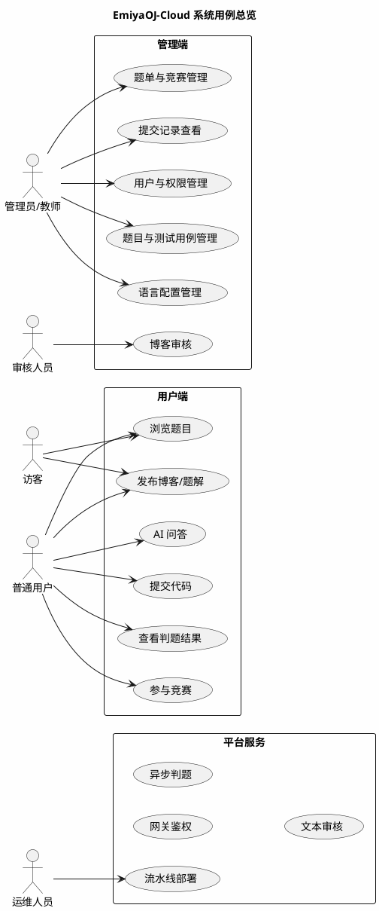

### 2.3 系统边界

| 范围 | 是否包含 | 说明 |
| --- | --- | --- |
| 后端微服务 | 包含 | 当前仓库核心内容 |
| 管理端前端 | 包含需求和联调范围 | 独立前端项目，不在当前仓库 |
| 用户端前端 | 包含需求和联调范围 | 独立前端项目，不在当前仓库 |
| Go-Judge 沙箱 | 包含 | 作为独立容器服务参与判题 |
| AI 外部服务 | 外部依赖 | 通过 Chat Service 调用 |
| 阿里云文本审核 | 外部依赖 | 通过 Moderation Service 调用 |
| Jenkins | 包含部署流程 | 用于自动构建、打包和部署 |

---

## 3. 原则与规范

### 3.1 设计原则

| 原则 | 设计说明 |
| --- | --- |
| 可靠性 | 基础设施设置健康检查；判题失败和审核失败均保留状态和错误原因 |
| 安全性 | 使用 JWT + Redis 白名单；管理端基于 RBAC 控制；用户代码通过 Go-Judge 沙箱隔离执行 |
| 易操作性 | 管理端按后台业务模块组织，用户端突出刷题、提交和结果查看路径 |
| 可扩展性 | 微服务按业务域拆分；编程语言通过配置扩展；审核与 AI 能力可替换外部服务 |
| 高内聚低耦合 | 各微服务内部完成本领域业务，跨服务通过 Feign 或消息队列交互 |
| 前后端分离 | 管理端、用户端均通过 Gateway 访问后端接口，不直接依赖单个微服务 |
| 容器化部署 | 通过 Docker Compose 管理基础设施和业务服务，降低演示环境搭建成本 |

### 3.2 设计规范

#### 3.2.1 命名规范

| 类型 | 规范 |
| --- | --- |
| Java 包名 | 使用 `com.emiyaoj` 作为基础包名 |
| Maven 模块 | 按业务域划分，如 `EmiyaOJ-Auth`、`EmiyaOJ-Problem`、`EmiyaOJ-Judge` |
| 子模块 | 业务服务采用 `api`、`dto`、`service` 三层结构 |
| 数据库 | 使用 `emiya_oj_业务域` 格式，如 `emiya_oj_auth` |
| 表名 | 使用小写下划线，如 `user_role`、`submission_case_result` |
| 接口路径 | 使用业务资源路径，如 `/auth`、`/problem`、`/judge`、`/blog` |

#### 3.2.2 接口规范

| 项目 | 规范 |
| --- | --- |
| 响应体 | JSON 接口统一返回 `ResponseResult<T>` |
| 分页 | 列表查询统一返回分页对象 |
| 用户上下文 | 网关注入 `X-User-Id` 等请求头，下游服务通过请求头获取当前用户 |
| 错误处理 | 业务异常由全局异常处理器统一转换为响应 |
| 文档 | 使用 SpringDoc OpenAPI/Swagger 支持接口联调 |

#### 3.2.3 数据库规范

| 项目 | 规范 |
| --- | --- |
| 字符集 | MySQL 使用 `utf8mb4` |
| 删除方式 | 业务数据优先采用逻辑删除 |
| ID 方案 | 使用 MyBatis-Plus 分布式 ID 或数据库自增方式 |
| 时间字段 | 表中保留创建时间、更新时间等审计字段 |
| 业务隔离 | 认证、题目、判题、博客数据按业务域分库 |

#### 3.2.4 代码规范

| 项目 | 规范 |
| --- | --- |
| Java 版本 | 使用 Java 21 |
| 数据访问 | 使用 MyBatis-Plus Mapper 和 Service |
| DTO/VO | 对外传输对象放在对应 `dto` 模块中 |
| Feign 接口 | 对外服务调用接口放在对应 `api` 模块中 |
| 配置 | 本地与 Docker 环境均通过环境变量覆盖敏感配置 |

#### 3.2.5 部署规范

| 项目 | 规范 |
| --- | --- |
| 容器网络 | 所有服务加入 `emiyaoj-network` |
| 基础设施 | MySQL、Redis、RabbitMQ、MinIO、Nacos 使用数据卷持久化 |
| 服务启动 | 通过 `depends_on` 和健康检查控制基础设施启动顺序 |
| Jenkins | 流水线记录构建日志和部署结果，敏感变量通过凭据或环境变量注入 |

---

## 4. 总体设计

### 4.1 系统划分及功能描述

系统按前端应用、后端微服务、基础设施和部署流水线进行划分。

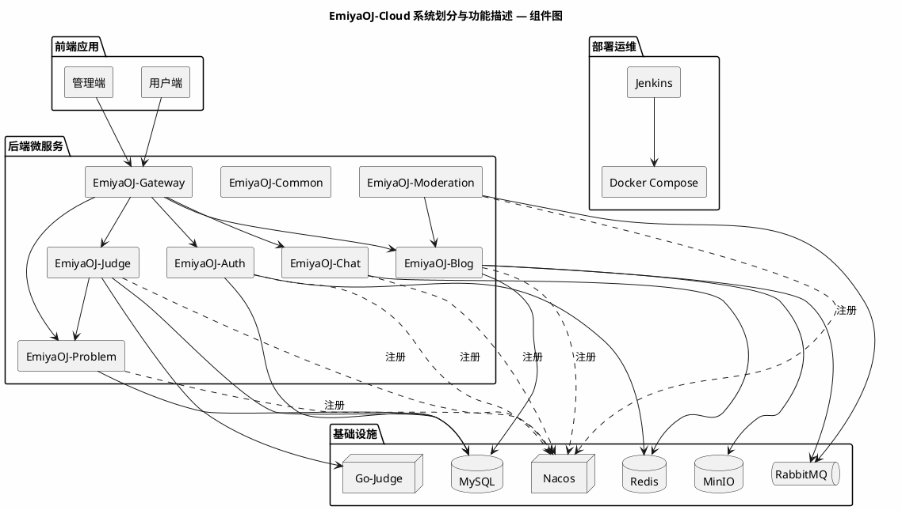

| 模块 | 功能描述 |
| --- | --- |
| 管理端 | 后台管理界面，负责用户、角色、权限、题目、测试用例、语言、竞赛、提交记录、博客审核 |
| 用户端 | 刷题和社区界面，负责题目浏览、代码提交、结果查询、竞赛参与、博客题解、AI 问答 |
| Gateway | 统一入口、路由转发、JWT 校验、Redis Token 白名单校验、用户上下文注入 |
| Common | 统一响应、分页、JWT、Redis、异常处理、MyBatis-Plus、OpenAPI 等公共能力 |
| Auth | 用户登录登出、用户管理、角色管理、权限管理、Token 解析 |
| Problem | 题目、测试用例、标签、语言配置、题单、竞赛、竞赛报名和排行榜 |
| Judge | 提交记录、异步判题、Go-Judge 调用、结果计算、提交查询 |
| Blog | 博客、题解、评论、点赞、收藏、图片上传、标签、用户博客统计 |
| Moderation | 审核任务消费、文本审核、审核结果回写 |
| Chat | AI 对话和代码问题辅助 |
| Jenkins | 自动拉取代码、构建、镜像打包、容器部署和健康检查 |

### 4.2 系统架构模型和实现样例

#### 4.2.1 系统架构模型

系统采用“前端应用 + API 网关 + 微服务 + 基础设施”的分层架构。

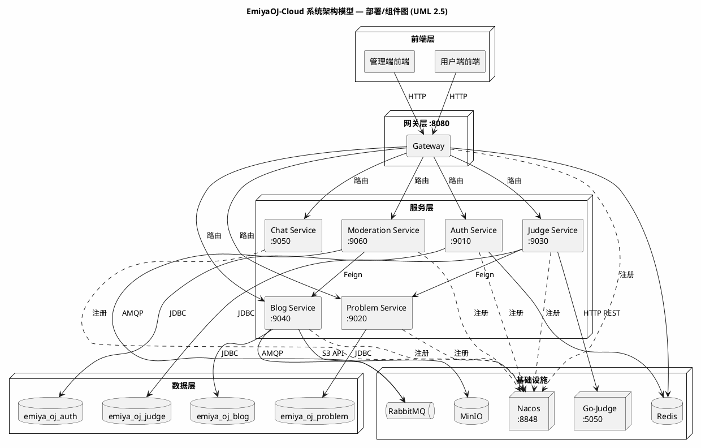

架构说明：

| 层次 | 设计说明 |
| --- | --- |
| 前端层 | 管理端和用户端独立部署，通过 HTTP API 访问 Gateway |
| 网关层 | 提供统一访问入口，完成认证校验和路由转发 |
| 服务层 | 按业务域拆分微服务，各服务独立实现自身业务逻辑 |
| 数据层 | 认证、题目、判题、博客按业务域分库 |
| 基础设施层 | Redis、Nacos、RabbitMQ、MinIO、Go-Judge 支撑缓存、注册、消息、存储和判题 |
| 运维层 | Jenkins + Docker Compose 实现自动构建和部署 |

#### 4.2.2 实现样例

以“用户端提交代码并完成判题”为核心实现样例：

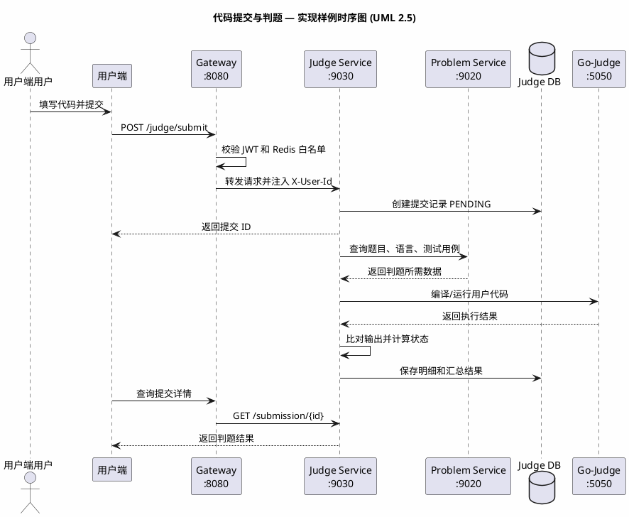

### 4.3 前端概要设计

| 前端 | 主要页面 | 设计说明 |
| --- | --- | --- |
| 管理端 | 登录页、仪表盘、用户管理、角色管理、权限管理、题目管理、测试用例管理、语言管理、题单管理、竞赛管理、提交记录、博客审核 | 以后台管理效率为主，菜单按业务模块组织，操作入口受权限控制 |
| 用户端 | 首页、题目列表、题目详情、代码提交、提交记录、竞赛列表、竞赛详情、排行榜、博客列表、题解详情、AI 问答 | 以刷题流程为主，突出题目浏览、提交代码和查看结果 |

前端统一通过 Gateway 访问后端接口，不直接请求某个业务微服务。登录后保存 Token，并在请求头中携带 `Authorization: Bearer {token}`。

### 4.4 后端微服务概要设计

#### 4.4.1 Gateway 设计

| 设计项 | 说明 |
| --- | --- |
| 主要职责 | 统一入口、路由转发、认证过滤、白名单放行、用户上下文注入 |
| 核心机制 | 解析 JWT，校验 Redis Token 白名单，向下游注入 `X-User-Id` 等请求头 |
| 依赖组件 | Redis、Nacos |
| 路由对象 | Auth、Problem、Judge、Blog、Chat、Moderation |

#### 4.4.2 Auth 服务设计

| 设计项 | 说明 |
| --- | --- |
| 主要职责 | 登录、登出、Token 解析、用户管理、角色管理、权限管理 |
| 数据库 | `emiya_oj_auth` |
| 核心模型 | User、Role、Permission、UserRole、RolePermission |
| 对外能力 | 提供认证接口和用户权限查询能力 |

#### 4.4.3 Problem 服务设计

| 设计项 | 说明 |
| --- | --- |
| 主要职责 | 题目、测试用例、标签、语言配置、题单、竞赛 |
| 数据库 | `emiya_oj_problem` |
| 核心模型 | Problem、TestCase、Tag、Language、ProblemSet、Contest |
| 对外能力 | 提供题目详情、测试用例、语言配置和竞赛提交校验给 Judge 服务 |

#### 4.4.4 Judge 服务设计

| 设计项 | 说明 |
| --- | --- |
| 主要职责 | 代码提交、异步判题、Go-Judge 调用、提交记录查询 |
| 数据库 | `emiya_oj_judge` |
| 核心模型 | Submission、SubmissionCaseResult、SubmissionJudgeResult |
| 外部依赖 | Problem Service、Go-Judge |
| 判题方式 | 接收提交后先创建记录，再异步执行编译、运行、输出比对和结果汇总 |

#### 4.4.5 Blog 服务设计

| 设计项 | 说明 |
| --- | --- |
| 主要职责 | 博客、题解、评论、点赞、收藏、图片上传、标签管理 |
| 数据库 | `emiya_oj_blog` |
| 外部依赖 | MinIO、RabbitMQ |
| 审核机制 | 保存博客或评论后投递审核任务，审核通过后公开展示 |

#### 4.4.6 Moderation 服务设计

| 设计项 | 说明 |
| --- | --- |
| 主要职责 | 消费审核任务、调用文本审核、回写审核结果 |
| 消息组件 | RabbitMQ |
| 外部依赖 | 阿里云文本审核服务、Blog Service |
| 安全控制 | 内部回写接口使用 `X-Moderation-Token` 校验 |

#### 4.4.7 Chat 服务设计

| 设计项 | 说明 |
| --- | --- |
| 主要职责 | AI 问答、代码问题辅助、题目相关问答 |
| 外部依赖 | 外部 AI 服务 API |
| 配置方式 | 使用环境变量注入 API Key |

#### 4.4.8 Common 公共模块设计

| 公共能力 | 说明 |
| --- | --- |
| 统一响应 | `ResponseResult<T>` |
| 分页对象 | `PageDTO`、`PageVO<T>` |
| JWT 工具 | Token 生成与解析 |
| Redis 工具 | Token、缓存读写 |
| 异常处理 | 全局异常拦截和统一错误响应 |
| 上下文 | 当前用户 ID 线程上下文 |
| 配置类 | Redis、Jackson、MyBatis-Plus、OpenAPI、Feign 等公共配置 |

### 4.5 核心业务流程设计

#### 4.5.1 登录认证流程

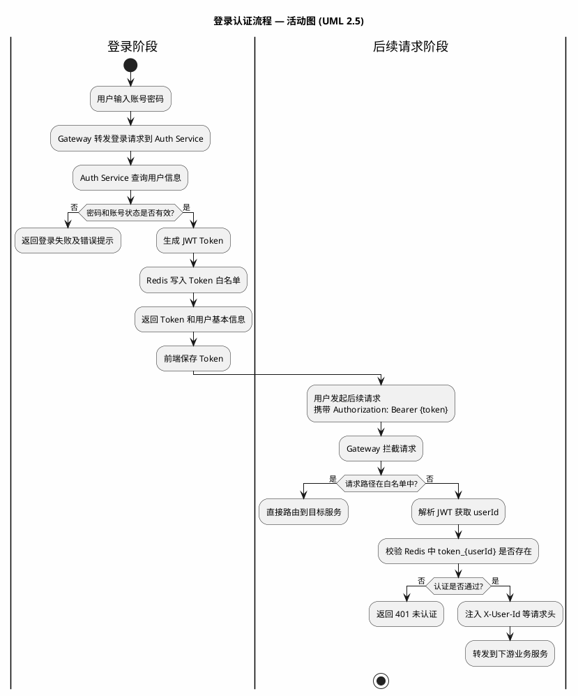

#### 4.5.2 代码提交与判题流程

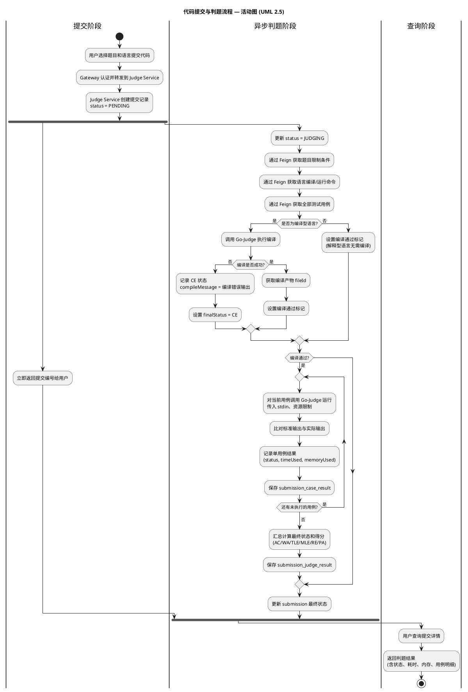

#### 4.5.3 博客审核流程

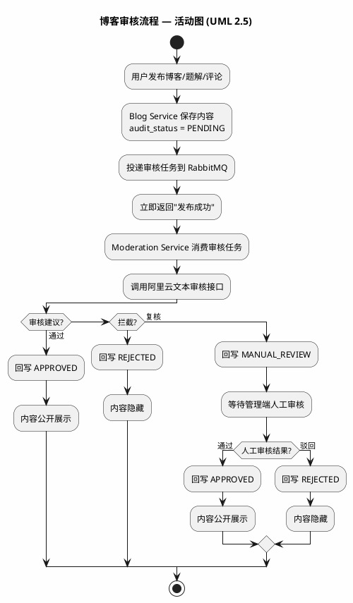

#### 4.5.4 Jenkins 流水线部署流程

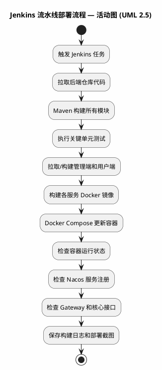

### 4.6 Maven 模块设计

```text
EmiyaOJ-Cloud
├── EmiyaOJ-Common
├── EmiyaOJ-Gateway
├── EmiyaOJ-Auth
│   ├── auth-api
│   ├── auth-dto
│   └── auth-service
├── EmiyaOJ-Problem
│   ├── problem-api
│   ├── problem-dto
│   └── problem-service
├── EmiyaOJ-Judge
│   ├── judge-api
│   ├── judge-dto
│   └── judge-service
├── EmiyaOJ-Blog
│   ├── blog-api
│   ├── blog-dto
│   └── blog-service
├── EmiyaOJ-Chat
│   ├── chat-api
│   ├── chat-dto
│   └── chat-service
└── EmiyaOJ-Moderation
    ├── moderation-api
    ├── moderation-dto
    └── moderation-service
```

---

## 5. 数据库概要设计

### 5.1 分库方案

系统按业务域分库，降低模块耦合，便于后续独立扩展。

| 数据库 | 服务 | 设计目的 |
| --- | --- | --- |
| `emiya_oj_auth` | Auth | 隔离认证授权数据 |
| `emiya_oj_problem` | Problem | 管理题库、语言、题单和竞赛数据 |
| `emiya_oj_judge` | Judge | 承载提交和判题结果的高频写入 |
| `emiya_oj_blog` | Blog | 管理博客社区、图片和审核状态 |

### 5.2 核心表设计

#### 5.2.1 认证数据库

| 表名 | 说明 |
| --- | --- |
| `user` | 用户基础信息 |
| `role` | 角色信息 |
| `permission` | 权限信息，支持菜单、按钮、接口等类型 |
| `user_role` | 用户与角色关联 |
| `role_permission` | 角色与权限关联 |
| `operation_log` | 操作日志 |

认证数据关系：

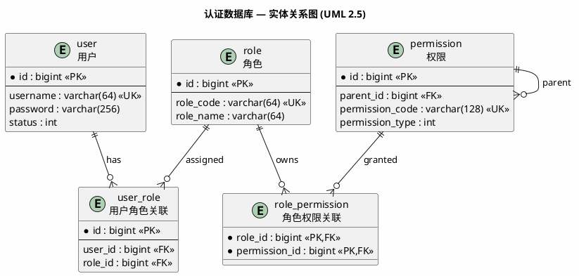

#### 5.2.2 题目数据库

| 表名 | 说明 |
| --- | --- |
| `problem` | 题目主表 |
| `test_case` | 题目测试用例 |
| `tag` | 题目标签 |
| `problem_tag` | 题目与标签关联 |
| `language` | 编程语言配置 |
| `problem_set` | 题单 |
| `problem_set_problem` | 题单与题目关联 |
| `contest` | 竞赛 |
| `contest_problem` | 竞赛题目 |
| `contest_registration` | 竞赛报名 |
| `contest_admin` | 竞赛管理员 |

题目与竞赛数据关系：

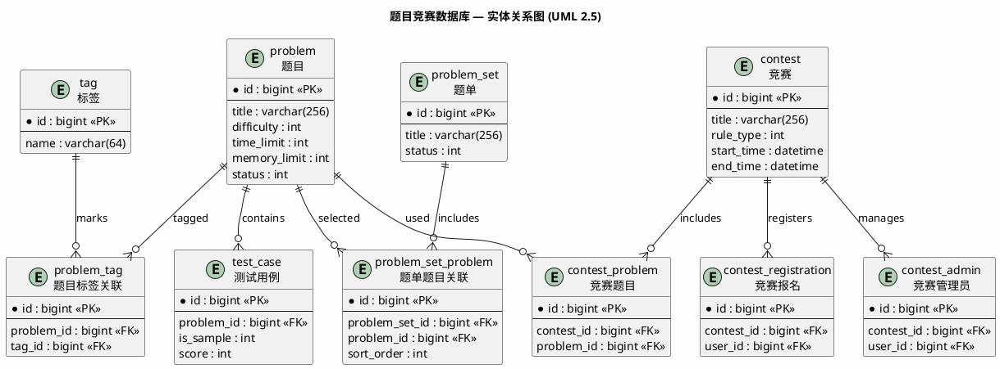

#### 5.2.3 判题数据库

| 表名 | 说明 |
| --- | --- |
| `submission` | 提交记录 |
| `submission_case_result` | 每个测试用例的判题明细 |
| `submission_judge_result` | 提交判题汇总结果 |

判题数据关系：

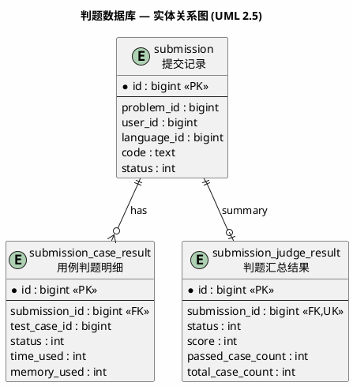

#### 5.2.4 博客数据库

| 表名 | 说明 |
| --- | --- |
| `blog` | 博客与题解 |
| `blog_comment` | 博客评论 |
| `blog_like` | 博客点赞 |
| `blog_star` | 博客收藏 |
| `blog_picture` | 博客图片 |
| `blog_tag` | 博客标签 |
| `blog_tag_association` | 博客与标签关联 |
| `user_blog` | 用户博客统计 |

博客数据关系：

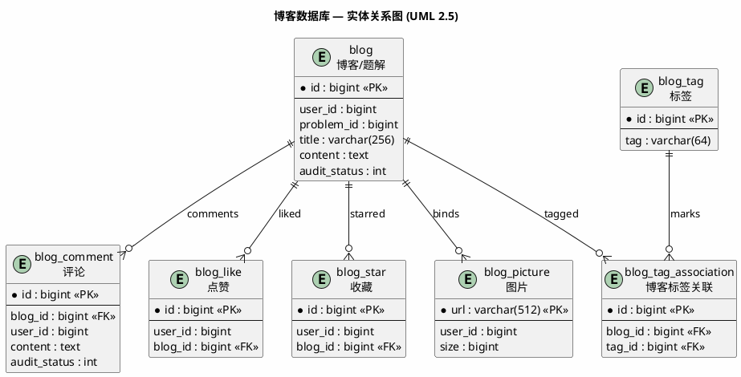

### 5.3 数据设计约束

| 约束 | 说明 |
| --- | --- |
| 字符集 | 数据库使用 `utf8mb4`，支持中文和特殊字符 |
| 逻辑删除 | 业务数据优先保留删除标记，便于恢复和审计 |
| 审计字段 | 核心表保留创建时间、更新时间、创建人、更新人等字段 |
| 数据隔离 | 各微服务只直接访问本服务所属数据库 |
| 服务间数据访问 | 跨业务域数据通过 Feign 或消息回写，不直接跨库查询 |

---

## 6. 接口与公共模块设计

### 6.1 统一响应设计

系统所有 JSON 接口统一返回响应体：

```json
{
  "code": 200,
  "message": "操作成功",
  "data": {}
}
```

| 字段 | 说明 |
| --- | --- |
| `code` | 业务状态码 |
| `message` | 提示信息 |
| `data` | 响应数据 |

### 6.2 分页设计

列表类接口统一支持分页查询，返回结果包含总数、页码、页大小和数据列表。典型场景包括题目列表、提交记录、博客列表、竞赛列表和用户列表。

### 6.3 异常处理设计

| 异常类型 | 处理方式 |
| --- | --- |
| 业务异常 | 转换为业务错误码和提示信息 |
| 参数校验异常 | 返回参数错误提示 |
| 未认证异常 | 返回未授权响应 |
| 无权限异常 | 返回禁止访问响应 |
| 未知异常 | 返回统一系统错误提示并记录日志 |

### 6.4 JWT 与用户上下文设计

| 设计项 | 说明 |
| --- | --- |
| Token 生成 | Auth 服务登录成功后生成 JWT |
| Token 存储 | Redis 保存 `token_{userId}` 白名单 |
| Token 校验 | Gateway 解析 JWT 并校验 Redis 白名单 |
| 上下文传递 | Gateway 向下游服务注入 `X-User-Id` 等请求头 |
| 登出处理 | Auth 删除 Redis 白名单，Token 立即失效 |

### 6.5 Feign 服务调用设计

| 调用方 | 被调用方 | 用途 |
| --- | --- | --- |
| Gateway | Auth | 可用于 Token 解析或用户信息查询 |
| Judge | Problem | 获取题目、测试用例、语言配置、竞赛提交校验 |
| Moderation | Blog | 回写博客或评论审核结果 |
| 其他服务 | Auth | 查询用户权限、用户信息等 |

### 6.6 消息接口设计

博客审核采用 RabbitMQ 异步消息：

| 阶段 | 说明 |
| --- | --- |
| 任务创建 | Blog 服务保存博客或评论后投递审核任务 |
| 任务消费 | Moderation 服务监听审核队列 |
| 审核执行 | 调用第三方文本审核接口 |
| 结果回写 | 通过 Blog 内部接口写回审核状态 |

### 6.7 OpenAPI 接口文档设计

系统使用 SpringDoc OpenAPI 生成接口文档。管理端、用户端和测试人员可通过 Swagger UI 查看接口路径、请求参数、响应结构和调试入口。

---

## 7. 部署与运行设计

### 7.1 服务端口设计

| 服务 | 端口 | 说明 |
| --- | --- | --- |
| Gateway | 8080 | 后端统一入口 |
| Auth Service | 9010 | 认证与权限 |
| Problem Service | 9020 | 题目、语言、题单、竞赛 |
| Judge Service | 9030 | 提交与判题 |
| Blog Service | 9040 | 博客、题解、图片 |
| Chat Service | 9050 | AI 问答 |
| Moderation Service | 9060 | 内容审核 |
| Go-Judge | 5050 | 判题沙箱 |
| MySQL | 3306 | 数据库 |
| Redis | 6379 | 缓存和 Token |
| Nacos | 8848 | 服务注册与配置 |
| RabbitMQ | 5672/15672 | 消息队列和管理控制台 |
| MinIO | 9000/9001 | 对象存储和管理控制台 |

### 7.2 Docker Compose 设计

Docker Compose 负责在演示环境中启动基础设施和业务服务：

| 类别 | 服务 |
| --- | --- |
| 基础设施 | MySQL、Redis、RabbitMQ、MinIO、Nacos |
| 判题沙箱 | Go-Judge |
| 业务服务 | Gateway、Auth、Problem、Judge、Blog、Chat、Moderation |
| 数据卷 | MySQL、Redis、RabbitMQ、MinIO 数据持久化 |
| 网络 | 所有服务加入 `emiyaoj-network` |

### 7.3 前端部署设计

管理端和用户端作为独立前端项目进行构建和部署。概要设计约束如下：

| 项目 | 设计说明 |
| --- | --- |
| 管理端 | 独立构建，部署为静态资源或前端容器，访问 Gateway 接口 |
| 用户端 | 独立构建，部署为静态资源或前端容器，访问 Gateway 接口 |
| 路由 | 前端路由由各自项目管理，后端接口通过统一网关域名访问 |
| Token | 前端保存登录 Token，请求时放入 Authorization 请求头 |

### 7.4 Jenkins 流水线设计

Jenkins 流水线用于固化构建部署过程：

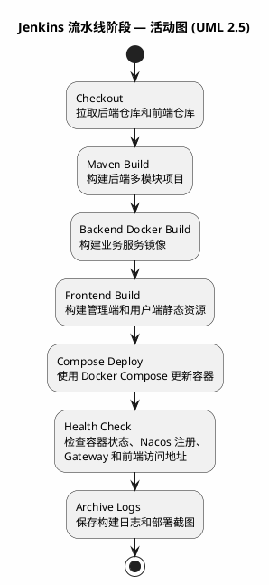

| 阶段 | 说明 |
| --- | --- |
| Checkout | 拉取后端仓库和前端仓库 |
| Maven Build | 构建后端多模块项目 |
| Docker Build | 构建业务服务镜像 |
| Frontend Build | 构建管理端和用户端静态资源 |
| Compose Deploy | 使用 Docker Compose 更新容器 |
| Health Check | 检查容器状态、Nacos 注册、Gateway 和前端访问地址 |
| Archive Logs | 保存构建日志和部署截图 |

### 7.5 外部依赖设计

| 外部依赖 | 用途 | 配置方式 |
| --- | --- | --- |
| AI 服务 API | 支持 Chat 服务问答 | `CHAT_API_KEY` 环境变量 |
| 阿里云文本审核 | 支持 Moderation 服务文本审核 | `ALIBABA_CLOUD_ACCESS_KEY_ID`、`ALIBABA_CLOUD_ACCESS_KEY_SECRET` |
| Git 仓库 | Jenkins 拉取代码 | Jenkins 凭据 |
| 镜像仓库 | 保存构建镜像，可选 | Jenkins 凭据或本地镜像 |

### 7.6 运行风险与处理

| 风险 | 处理方式 |
| --- | --- |
| Docker 资源不足 | 分批启动服务，优先保证 Gateway、Auth、Problem、Judge 主链路 |
| Go-Judge 权限不足 | 确认容器 `privileged` 配置和运行环境支持 |
| 外部 AI 或审核服务不可用 | 返回友好错误，演示时准备备用数据 |
| Jenkins 权限不足 | 提前配置 Docker、Git、服务器 SSH 或镜像仓库凭据 |
| 前后端接口不一致 | 以 Swagger/API 文档为准进行联调 |

---

## 8. 附录

### 8.1 判题状态码

| 状态码 | 状态 | 含义 |
| --- | --- | --- |
| 0 | PENDING | 待判题 |
| 1 | JUDGING | 判题中 |
| 2 | AC | 通过 |
| 3 | CE | 编译错误 |
| 4 | SE | 系统错误 |
| 5 | WA | 答案错误 |
| 6 | TLE | 时间超限 |
| 7 | MLE | 内存超限 |
| 8 | RE | 运行错误 |
| 9 | OLE | 输出超限 |
| 10 | PA | 部分通过 |

### 8.2 审核状态

| 状态值 | 状态 | 含义 |
| --- | --- | --- |
| 0 | PENDING | 待审核，默认隐藏 |
| 1 | APPROVED | 审核通过，可公开展示 |
| 2 | REJECTED | 审核驳回，默认隐藏 |
| 3 | MANUAL_REVIEW | 需要人工复核，默认隐藏 |

---

## 9. 项目总结目录对齐补充：概要设计与数据库设计

本节按照新下发的《项目总结》目录，对“概要设计”和“数据库设计”相关内容进行集中映射和补充。原第 4 章至第 7 章仍为概要设计主体，本节便于后续汇总成项目总结报告。

### 9.1 处理流程

系统核心处理流程可归纳为四条主线：

| 流程 | 关键步骤 | 主要服务 |
| --- | --- | --- |
| 认证访问流程 | 用户登录 -> Auth 签发 JWT -> Redis 保存 Token -> Gateway 校验 -> 下游服务读取用户上下文 | Gateway、Auth、Redis |
| 刷题判题流程 | 管理端配置题目/用例/语言 -> 用户端提交代码 -> Judge 获取判题数据 -> Go-Judge 执行 -> 保存结果 -> 用户查询 | Problem、Judge、Go-Judge |
| 竞赛流程 | 管理员创建竞赛 -> 配置题目和报名规则 -> 用户报名 -> 竞赛提交校验 -> 排行榜统计 | Problem、Judge |
| 博客审核流程 | 用户发布内容 -> Blog 保存待审核 -> RabbitMQ 投递任务 -> Moderation 审核 -> Blog 回写状态 -> 用户端公开展示 | Blog、RabbitMQ、Moderation |

### 9.2 总体结构设计

总体结构采用“前端应用 + Gateway + 微服务 + 基础设施 + CI/CD”的分层结构：

| 层级 | 组成 | 设计说明 |
| --- | --- | --- |
| 前端层 | 管理端、用户端 | 独立前端项目，通过 HTTP API 访问 Gateway |
| 网关层 | EmiyaOJ-Gateway | 统一入口、路由、Token 校验、上下文透传 |
| 业务服务层 | Auth、Problem、Judge、Blog、Chat、Moderation | 按业务域拆分，降低耦合 |
| 公共能力层 | Common、统一响应、异常、分页、工具类 | 供各服务复用 |
| 基础设施层 | MySQL、Redis、Nacos、RabbitMQ、MinIO、Go-Judge | 支撑存储、缓存、注册、消息、文件和判题 |
| 部署流水线 | Docker Compose、Jenkins | 支撑本地集成部署和答辩演示部署 |

### 9.3 功能设计

| 功能域 | 功能设计摘要 |
| --- | --- |
| 认证网关 | Gateway 完成统一入口和鉴权，Auth 完成用户、角色、权限和 Token 生命周期 |
| 题目竞赛 | Problem 统一管理题目、测试用例、标签、语言、题单、竞赛和排行榜 |
| 判题提交 | Judge 负责提交记录、判题执行、状态计算和提交查询 |
| 博客审核 | Blog 负责社区内容，Moderation 负责异步文本审核和结果回写 |
| AI 问答 | Chat 负责接收问题、调用外部 AI 服务并返回回答或友好异常 |
| 部署运维 | Jenkins 和 Docker Compose 负责构建、镜像、容器更新和健康检查 |

### 9.4 数据流转设计

| 数据流 | 流转说明 |
| --- | --- |
| 用户上下文 | Auth 登录生成 Token，Gateway 校验后向下游服务注入用户编号 |
| 题目数据 | 管理端写入 Problem 数据库，用户端查询公开题目，Judge 内部读取判题数据 |
| 判题数据 | 用户提交写入 Judge 数据库，Judge 调 Go-Judge 后写入明细和汇总结果 |
| 竞赛数据 | Problem 维护竞赛、题目和报名关系，Judge 提交时进行内部校验 |
| 博客数据 | Blog 保存博客、题解、评论和图片元数据，审核状态控制公开展示 |
| 审核数据 | Blog 投递 RabbitMQ，Moderation 消费并回写 Blog |
| 部署数据 | Jenkins 保存构建日志，Docker Compose 维护容器运行状态 |

### 9.5 用户界面设计

| 界面 | 设计摘要 |
| --- | --- |
| 管理端 | 以后台管理效率为主，按用户、角色、题目、语言、题单、竞赛、提交、博客审核组织菜单 |
| 用户端 | 以刷题和竞赛体验为主，突出题目浏览、代码提交、结果查询、竞赛、博客和 AI 问答 |
| 错误提示 | 登录失效、无权限、参数错误、外部服务异常等场景应以可理解提示展示 |
| 权限展示 | 管理端菜单和按钮受 RBAC 控制，用户端受登录状态和业务状态控制 |

### 9.6 数据结构设计

数据结构按业务域分库：

| 数据库 | 核心表 | 设计说明 |
| --- | --- | --- |
| `emiya_oj_auth` | `user`、`role`、`permission`、`user_role`、`role_permission`、`operation_log` | 认证授权和操作日志 |
| `emiya_oj_problem` | `problem`、`test_case`、`tag`、`problem_tag`、`language`、`problem_set`、`contest` 等 | 题目、语言、题单和竞赛 |
| `emiya_oj_judge` | `submission`、`submission_case_result`、`submission_judge_result` | 提交记录和判题结果 |
| `emiya_oj_blog` | `blog`、`blog_comment`、`blog_like`、`blog_star`、`blog_picture`、`blog_tag`、`user_blog` | 博客社区和审核状态 |

### 9.7 接口设计

#### 9.7.1 外部接口

| 接口对象 | 说明 |
| --- | --- |
| 管理端/用户端 -> Gateway | 所有前端请求通过 Gateway 统一入口 |
| Chat -> 外部 AI 服务 | 调用 AI 问答接口 |
| Moderation -> 阿里云文本审核 | 调用文本审核接口 |
| Jenkins -> Git/Maven/Docker | 拉取代码、构建产物、构建镜像和更新容器 |

#### 9.7.2 内部接口

| 调用关系 | 说明 |
| --- | --- |
| Gateway -> Auth/Problem/Judge/Blog/Chat/Moderation | 路由转发和用户上下文透传 |
| Judge -> Problem | 查询题目、测试用例、语言和竞赛提交校验 |
| Blog -> RabbitMQ -> Moderation | 异步审核任务 |
| Moderation -> Blog | 审核结果回写 |
| Judge -> Go-Judge | 编译和运行用户代码 |
| Blog -> MinIO | 图片上传、下载和删除 |

### 9.8 错误/异常处理设计

#### 9.8.1 错误/异常输出信息

| 异常类型 | 输出信息 |
| --- | --- |
| 网关未认证 | 返回 401 或统一未认证响应 |
| 权限不足 | 返回无权限提示，不执行业务写入 |
| 参数错误 | 返回字段级或业务级错误提示 |
| 业务异常 | 返回统一响应体中的业务错误码和消息 |
| 系统异常 | 返回通用系统错误并记录服务日志 |
| 外部依赖异常 | 返回友好提示，记录 Go-Judge、AI、审核、RabbitMQ、MinIO 等依赖异常 |

#### 9.8.2 错误/异常处理对策

| 异常场景 | 对策 |
| --- | --- |
| Token 失效 | 前端清理本地 Token 并跳转登录 |
| 判题沙箱异常 | 提交标记为 SE，记录错误原因 |
| 审核服务异常 | 内容保持待审核或进入人工复核 |
| AI 服务异常 | 返回友好提示，不影响题目和判题主链路 |
| Docker 资源不足 | 分批启动核心服务，优先保证演示主链路 |
| Jenkins 部署失败 | 根据阶段日志定位 Git、Maven、Docker 或环境变量问题 |

### 9.9 系统配置策略

| 配置类型 | 策略 |
| --- | --- |
| 敏感配置 | AI Key、阿里云 AK/SK、MinIO 密钥、数据库密码通过环境变量或 Jenkins Credentials 注入 |
| 服务地址 | Nacos、MySQL、Redis、RabbitMQ、MinIO、Go-Judge 地址按本地和 Docker 环境区分 |
| 权限配置 | 菜单、按钮、接口权限可通过 SQL 初始化或管理端维护 |
| 白名单配置 | 登录、公开题目、公开博客、Swagger 等路径可在 Gateway 配置 |

### 9.10 系统部署方案

部署方案以 Docker Compose 和 Jenkins 为主：

| 方案 | 说明 |
| --- | --- |
| 本地 Docker Compose | 启动 MySQL、Redis、Nacos、RabbitMQ、MinIO、Go-Judge 和后端服务，适合开发联调 |
| Jenkins 流水线 | 拉取后端和前端代码，执行 Maven 和前端构建，构建镜像并更新容器，适合演示环境 |
| 分批启动 | 资源不足时优先启动 Gateway、Auth、Problem、Judge，再启动 Blog、Moderation、Chat |

### 9.11 跨端应用架构设计

| 端 | 架构说明 |
| --- | --- |
| 管理端 | 面向管理员、教师、审核人员，主要调用 Auth、Problem、Judge、Blog、Moderation 接口 |
| 用户端 | 面向普通用户和参赛用户，主要调用 Auth、Problem、Judge、Blog、Chat 接口 |
| 后端 Gateway | 对两端提供统一 API 入口，避免前端直接依赖单个微服务地址 |
| 部署端 | 管理端和用户端可独立构建为静态资源或前端容器，通过环境变量配置 Gateway 地址 |

### 9.12 其他相关技术与方案

| 技术/方案 | 说明 |
| --- | --- |
| OpenAPI/Swagger | 支撑前后端联调和接口验收 |
| MyBatis-Plus | 简化 CRUD 和分页查询 |
| RabbitMQ | 支撑博客审核异步任务 |
| MinIO | 支撑博客图片对象存储 |
| Go-Judge | 隔离执行用户代码，降低安全风险 |
| Jenkins | 固化构建、部署和演示流程 |

### 9.13 数据库设计补充

数据库设计遵循“业务域分库、服务内直连、跨域接口调用”的原则。认证数据、题库竞赛数据、判题数据、博客数据分别存储在对应数据库，避免服务之间直接跨库访问。表结构命名采用小写下划线，核心表保留创建时间、更新时间、状态等审计字段。后续如需扩展，可增加 AI 对话历史表、判题队列表、审核任务表或操作审计表，但当前实训验收以现有 SQL 脚本为准。
