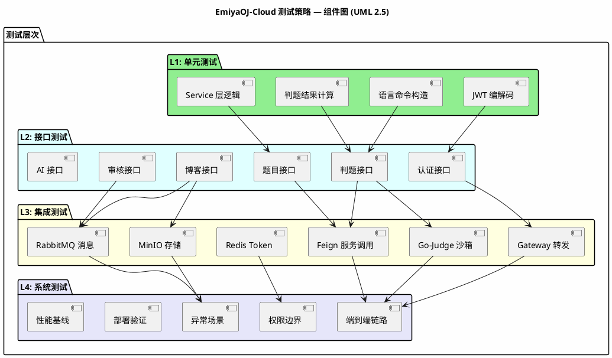
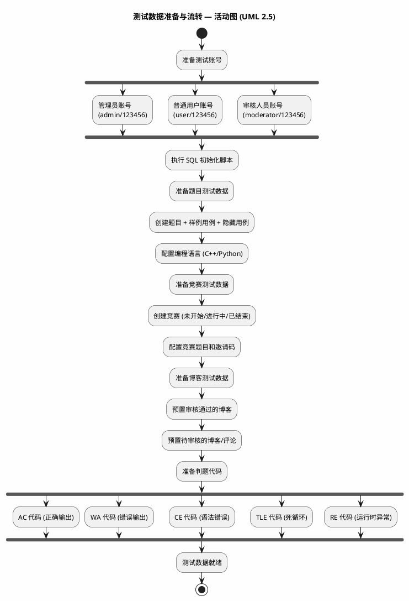
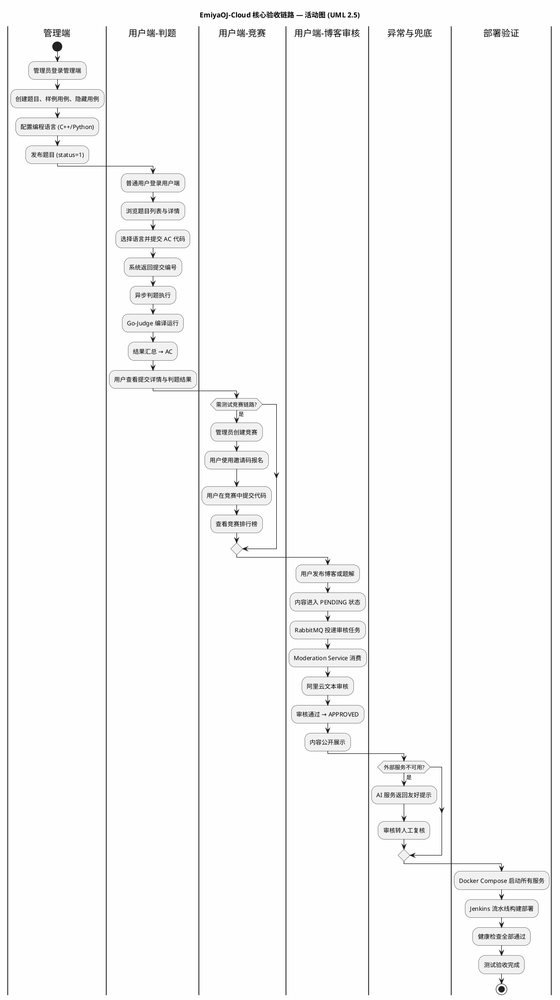
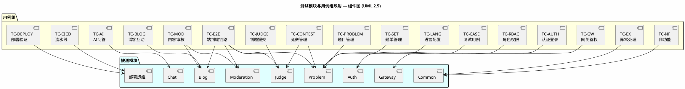

# 《EmiyaOJ-Cloud 在线判题系统》

# 测试方案与测试用例

| 项目 | 内容 |
| --- | --- |
| 文档名称 | EmiyaOJ-Cloud 测试方案与测试用例 |
| 所属系统 | EmiyaOJ-Cloud 在线判题系统 |
| 文档版本 | v1.0 |
| 编写日期 | 2026 年 5 月 13 日 |
| 项目性质 | 大学生软件工程实训小组作业 |
| 小组规模 | 5 人 |
| 文档格式 | Markdown |

## 1 测试计划

**测试策略总览：**



### 1.1 进度安排

本次测试计划安排在 2026 年 5 月 13 日至 2026 年 5 月 15 日进行，结合项目实施计划中的 Day7 测试与修复阶段完成。测试工作包含测试用例编写、单元测试执行、接口联调测试、页面联调测试、集成测试、权限与异常测试、Docker Compose 部署测试、Jenkins 流水线测试和最终演示验收测试。

| 阶段 | 时间 | 工作内容 | 负责人 |
| --- | --- | --- | --- |
| 测试准备 | 2026-05-13 | 阅读需求、概要设计、详细设计和 API 文档，准备测试数据与测试环境 | 成员 E 牵头，全体参与 |
| 单元与接口测试 | 2026-05-13 至 2026-05-14 | 执行已有自动化测试，验证登录、题目、语言、竞赛、判题、博客、审核、AI 接口 | 各模块负责人 |
| 集成与页面联调 | 2026-05-14 | 通过 Gateway 联调管理端和用户端核心页面，验证跨服务调用 | 全体成员 |
| 部署与流水线测试 | 2026-05-14 至 2026-05-15 | 验证 Docker Compose、Nacos 注册、Go-Judge、RabbitMQ、MinIO、Jenkins 流水线 | 成员 A、成员 E |
| 演示验收 | 2026-05-15 | 完成核心业务链路演示，整理测试结果、缺陷记录和截图材料 | 全体成员 |

### 1.2 测试目的

本次测试以《需求规格说明书》《概要设计说明书》《详细设计说明书》和接口文档为依据，验证 EmiyaOJ-Cloud 在线判题系统是否满足实训项目的功能、接口、权限、安全、部署和演示要求。测试重点如下：

| 目标 | 说明 |
| --- | --- |
| 功能正确性 | 验证登录、题目、竞赛、判题、博客、审核、AI 问答等核心功能可正常使用 |
| 接口一致性 | 验证接口路径、请求参数、响应结构和错误码符合文档约定 |
| 权限安全性 | 验证未登录、普通用户、管理员、审核人员等角色访问边界正确 |
| 数据一致性 | 验证题目、提交、判题结果、竞赛、博客审核状态等数据关系正确 |
| 外部依赖可用性 | 验证 Redis、Nacos、RabbitMQ、MinIO、Go-Judge、AI 和审核服务接入效果 |
| 部署可验收 | 验证 Docker Compose 与 Jenkins 可支撑测试环境和演示环境部署 |

### 1.3 测试条件

#### 1.3.1 参考资料与读取说明

模板文件为 UTF-8 编码，读取时使用如下命令：

```powershell
Get-Content -Encoding UTF8 -Path docs\测试方案与测试用例模板.md
```

| 资料 | 用途 |
| --- | --- |
| `docs/EmiyaOJ-Cloud系统实施计划.md` | 测试范围、人员分工、进度、Jenkins 与部署要求 |
| `docs/EmiyaOJ-Cloud需求规格说明书.md` | 功能需求、非功能需求和验收标准 |
| `docs/EmiyaOJ-Cloud概要设计说明书.md` | 系统架构、服务边界、数据库和部署设计 |
| `docs/详细设计/*.md` | 认证网关、题目竞赛、判题提交、博客审核、AI 与部署详细设计 |
| `docs/*-API.md` | 接口路径、请求参数、响应字段和业务规则 |
| `docs/Exception-API.md` | 统一响应格式、异常分类和错误码 |
| `pom.xml` | Maven 模块结构 |
| `sql/*.sql` | 数据库初始化和核心表结构 |

#### 1.3.2 测试环境

| 类别 | 要求 |
| --- | --- |
| 操作系统 | Windows 11 或 Linux 测试主机 |
| JDK | JDK 21 |
| 构建工具 | Maven 3.9.x |
| 数据库 | MySQL 8.0，初始化 `emiya_oj_auth`、`emiya_oj_problem`、`emiya_oj_judge`、`emiya_oj_blog` |
| 基础设施 | Redis、Nacos、RabbitMQ、MinIO、Go-Judge |
| 部署方式 | Docker Compose 本地部署，Jenkins 流水线部署 |
| 接口工具 | Swagger UI、Apifox、Postman 或 curl |
| 前端应用 | 管理端和用户端独立项目，通过 Gateway 访问后端 |

#### 1.3.3 测试数据

| 数据类型 | 示例 |
| --- | --- |
| 管理员用户 | 具备用户、角色、题目、竞赛、博客审核等管理权限 |
| 普通用户 | 可登录用户端，浏览题目、提交代码、参与竞赛、发布博客 |
| 审核用户 | 具备博客和评论人工审核权限 |
| 题目数据 | 至少 1 道可通过样例题，包含样例用例和隐藏用例 |
| 语言数据 | 至少启用 1 种编译型语言和 1 种解释型语言 |
| 竞赛数据 | 包含未开始、进行中、已结束、需报名等不同状态 |
| 博客数据 | 包含待审核、审核通过、审核驳回内容 |
| 判题代码 | AC、WA、CE、TLE、RE、SE 场景代码 |

**测试数据流转图：**



### 1.4 测试范围

| 测试类型 | 覆盖内容 |
| --- | --- |
| 单元测试 | JWT 编解码、语言命令构造、判题结果计算、测试用例服务、语言服务、竞赛服务 |
| 接口测试 | 登录、题目、语言、题单、竞赛、提交、博客、审核、AI 和异常响应 |
| 页面联调测试 | 管理端用户/角色/题目/语言/竞赛/博客审核页面，用户端题目/提交/竞赛/博客/AI 页面 |
| 集成测试 | Gateway 转发、Redis Token、Feign 调用、Go-Judge 调用、RabbitMQ 审核任务、MinIO 图片上传 |
| 权限测试 | 未登录拦截、普通用户越权、管理员权限、审核权限、隐藏用例保护 |
| 异常测试 | 参数错误、业务错误、网关 401、服务端 500、外部服务不可用 |
| 数据一致性测试 | 提交汇总与用例明细、题目关联、竞赛报名、审核任务回写、用户互动统计 |
| 部署测试 | Docker Compose 启动、数据库初始化、Nacos 注册、端口访问 |
| 流水线测试 | Jenkins 拉取代码、Maven 构建、镜像构建、容器更新、健康检查 |
| 回归测试 | 缺陷修复后复测关联模块和端到端核心链路 |
| 演示测试 | 从管理员配置题目到用户提交代码、查看结果、发布博客并审核通过的完整链路 |

**核心验收链路总览：**



### 1.5 准入与准出标准

| 标准类型 | 内容 |
| --- | --- |
| 测试准入 | 代码可编译，数据库脚本可执行，核心服务可启动，接口文档和设计文档已完成 |
| 测试准入 | 管理端和用户端具备可联调页面或接口入口 |
| 测试准出 | P0、P1 级缺陷全部关闭，P2 缺陷有记录和处理结论 |
| 测试准出 | 核心业务链路通过：登录、题目配置、提交判题、结果查询、博客审核 |
| 测试准出 | Docker Compose 或 Jenkins 至少一种方式可完成演示环境部署 |
| 测试准出 | 测试用例、缺陷记录、部署截图和演示材料整理完成 |

## 2 测试设计说明

### 2.1 系统测试设计考虑

#### 2.1.1 输入设计

| 输入类型 | 示例 | 关注点 |
| --- | --- | --- |
| 合法数据 | 正确账号密码、有效题目编号、启用语言编号、合规博客内容 | 功能是否成功 |
| 非法数据 | 错误密码、不存在的题目、禁用语言、非法审核状态 | 是否返回明确错误 |
| 边界数据 | 空标题、超长代码、空测试用例、最大分页大小 | 参数校验和性能影响 |
| 权限数据 | 未登录请求、普通用户访问管理接口、非本人查看提交详情 | 访问控制是否正确 |
| 状态数据 | 竞赛未开始、竞赛进行中、竞赛已结束、博客待审核 | 状态流转是否正确 |
| 重复数据 | 重复报名、重复点赞、重复收藏、重复审核回写、重复查询提交详情 | 幂等性和数据一致性是否正确 |
| 外部依赖异常 | Redis 不可用、Go-Judge 不可用、RabbitMQ 不可用、AI Key 未配置 | 是否可追踪并友好提示 |

#### 2.1.2 输出设计

| 输出类型 | 校验点 |
| --- | --- |
| 统一响应 | JSON 响应包含 `code`、`message`、`data`、`success` |
| 业务状态 | 登录成功、判题状态、审核状态、竞赛状态与预期一致 |
| 数据库结果 | 提交记录、用例结果、审核结果、关联表数据正确 |
| 页面反馈 | 页面提示清晰，按钮、菜单和跳转符合权限 |
| 消息队列 | 审核任务可投递、消费和回写 |
| 沙箱结果 | Go-Judge 返回耗时、内存、输出和错误信息 |
| 一致性结果 | 汇总状态与明细状态一致，重复操作不产生脏数据 |
| 日志记录 | 异常场景可通过服务日志或 Jenkins 日志定位 |

### 2.2 测试方法

| 方法 | 说明 |
| --- | --- |
| 黑盒测试 | 从用户和接口视角验证输入输出 |
| 白盒辅助 | 结合现有单元测试验证关键工具和服务逻辑 |
| 接口联调 | 使用 Swagger UI、Apifox、Postman 或 curl 调用接口 |
| 场景测试 | 按管理端和用户端核心业务流程执行 |
| 异常注入 | 使用错误参数、错误 Token、不可用外部服务验证异常处理 |
| 回归测试 | 缺陷修复后重复执行关联用例和核心链路 |

### 2.3 现有自动化测试参考

| 测试类 | 覆盖内容 |
| --- | --- |
| `JwtEncodeAndDecodeTest` | JWT 编码和解析 |
| `UserInitTest`、`UserRoleInitTest` | 用户和角色初始化 |
| `LanguageServiceTest` | 语言配置服务 |
| `TestCaseServiceTest` | 测试用例服务 |
| `ContestServiceTest` | 竞赛服务 |
| `LanguageCommandBuilderTest` | 语言编译和运行命令构造 |
| `JudgeResultCalculatorTest` | 判题结果汇总计算 |

## 3 测试目标矩阵

| 模块 | 测试目标 | 关键验收点 |
| --- | --- | --- |
| Common | 统一响应、异常处理、分页对象 | 响应结构一致，异常不暴露堆栈 |
| Gateway | 路由、白名单、Token 校验、上下文注入 | 未登录拦截，登录后转发成功 |
| Auth | 登录、登出、用户角色权限 | JWT 可用，登出后 Token 失效，RBAC 生效 |
| Problem | 题目、测试用例、标签、语言、题单、竞赛 | 题目可配置，隐藏用例不公开，竞赛规则生效 |
| Judge | 提交、判题、Go-Judge、结果查询 | 可返回 AC/WA/CE/TLE/RE/SE 等状态 |
| Blog | 博客、题解、评论、点赞、收藏、图片 | 内容可发布和互动，图片可上传 |
| Moderation | 审核任务、阿里云审核、审核回写、人工审核 | 审核状态可流转，内部回写受保护 |
| Chat | AI 问答、外部服务异常 | 可返回回答或友好异常 |
| 部署运维 | Docker Compose、Nacos、Jenkins | 服务可启动、注册、构建和部署 |

**测试模块与用例映射：**



## 4 测试用例描述

### 4.1 核心业务链路用例

| 用例编号 | 用例标题 | 优先级 | 前置条件 | 测试步骤与测试数据 | 期望结果 | 实际结果 | 是否通过 | 备注 |
| --- | --- | --- | --- | --- | --- | --- | --- | --- |
| TC-E2E-001 | 管理员配置题目并完成用户判题 | P0 | 数据库初始化，管理员和普通用户存在，Go-Judge 可用 | 1. 管理端登录管理员账号<br>2. 创建题目、样例用例、隐藏用例和启用语言<br>3. 用户端登录普通用户<br>4. 浏览题目详情并提交 AC 代码<br>5. 查询提交详情 | 管理员配置成功；用户可看到题目和样例；提交生成记录；最终状态为 AC；隐藏用例内容不向普通用户展示 | 执行后填写 | 执行后填写 | 核心演示链路 |
| TC-E2E-002 | 用户发布题解并通过审核公开展示 | P0 | 普通用户、审核用户存在，RabbitMQ 和审核服务可用 | 1. 用户登录并针对题目发布题解<br>2. 检查内容进入待审核状态<br>3. 审核服务消费任务或管理端人工通过<br>4. 用户端查询题解列表 | 题解保存成功；审核通过后可公开查询；审核原因和状态可追踪 | 执行后填写 | 执行后填写 | 博客审核链路 |
| TC-E2E-003 | 竞赛报名、提交和排行榜展示 | P0 | 存在进行中竞赛，已配置竞赛题目和语言 | 1. 用户报名竞赛<br>2. 用户进入竞赛题目提交代码<br>3. 查询竞赛提交记录<br>4. 查看排行榜 | 报名成功；竞赛提交被接受；提交记录带竞赛编号；排行榜包含该用户成绩 | 执行后填写 | 执行后填写 | 竞赛主链路 |
| TC-E2E-004 | 外部依赖异常下核心链路兜底 | P1 | 已准备 AI 或审核外部服务异常场景 | 1. 用户提交代码并查询结果<br>2. 用户发送 AI 问题<br>3. 用户发布博客并使用人工审核兜底 | 判题主链路不受 AI 异常影响；AI 返回友好提示；审核外部服务不可用时可通过人工审核完成演示 | 执行后填写 | 执行后填写 | 演示兜底 |

### 4.2 认证网关与权限用例

| 用例编号 | 用例标题 | 优先级 | 前置条件 | 测试步骤与测试数据 | 期望结果 | 实际结果 | 是否通过 | 备注 |
| --- | --- | --- | --- | --- | --- | --- | --- | --- |
| TC-AUTH-001 | 用户登录成功 | P0 | 存在启用用户 | 调用登录接口，输入正确账号和密码 | 返回统一响应；`data` 中包含 Token 和用户信息；Redis 写入 Token 状态 | 执行后填写 | 执行后填写 | 登录基础用例 |
| TC-AUTH-002 | 用户登录失败 | P0 | 存在用户 | 调用登录接口，输入错误密码 | 返回登录失败提示；不签发 Token | 执行后填写 | 执行后填写 | 异常输入 |
| TC-AUTH-003 | 登出后 Token 失效 | P0 | 用户已登录 | 1. 携带 Token 调用登出接口<br>2. 再次携带原 Token 访问受保护接口 | 登出成功；再次访问被拒绝 | 执行后填写 | 执行后填写 | Redis 白名单 |
| TC-AUTH-004 | 禁用用户登录 | P1 | 存在被禁用用户 | 使用禁用用户账号密码调用登录接口 | 登录被拒绝，返回账号状态异常提示，不签发 Token | 执行后填写 | 执行后填写 | 账号状态 |
| TC-GW-001 | 未登录访问受保护接口 | P0 | 无 Token | 不携带 `Authorization` 访问提交代码或发布博客接口 | Gateway 返回 401 或统一未认证响应 | 执行后填写 | 执行后填写 | 网关鉴权 |
| TC-GW-002 | 登录后访问受保护接口 | P0 | 用户已登录 | 携带合法 Token 查询我的提交或发布评论 | 请求被转发到业务服务；下游服务能识别用户编号 | 执行后填写 | 执行后填写 | 用户上下文 |
| TC-GW-003 | Token 格式异常或过期 | P0 | Gateway 可用 | 携带伪造、过期或缺少用户信息的 Token 访问受保护接口 | 请求被拒绝，返回未认证或 Token 异常提示，下游服务不执行业务写入 | 执行后填写 | 执行后填写 | Token 安全 |
| TC-RBAC-001 | 普通用户访问管理接口 | P1 | 普通用户已登录 | 携带普通用户 Token 访问题目新增、角色管理或审核管理接口 | 返回无权限；不写入业务数据 | 执行后填写 | 执行后填写 | 权限边界 |
| TC-RBAC-002 | 管理员访问管理接口 | P0 | 管理员已登录 | 携带管理员 Token 访问题目、语言、竞赛管理接口 | 请求成功，页面或接口返回管理数据 | 执行后填写 | 执行后填写 | 管理端权限 |
| TC-RBAC-003 | 审核人员权限边界 | P1 | 审核人员已登录 | 1. 访问博客审核接口<br>2. 访问用户角色管理接口 | 可访问审核接口；访问角色管理接口被拒绝 | 执行后填写 | 执行后填写 | 细粒度权限 |

### 4.3 题目、语言、题单与竞赛用例

| 用例编号 | 用例标题 | 优先级 | 前置条件 | 测试步骤与测试数据 | 期望结果 | 实际结果 | 是否通过 | 备注 |
| --- | --- | --- | --- | --- | --- | --- | --- | --- |
| TC-PROBLEM-001 | 题目列表查询 | P0 | 存在公开题目 | 用户端按分页、难度、关键字查询题目 | 返回分页数据；只包含可公开题目 | 执行后填写 | 执行后填写 | 题目浏览 |
| TC-PROBLEM-002 | 题目详情查询 | P0 | 存在公开题目和测试用例 | 查询题目详情 | 返回题面、输入输出说明、样例、限制和标签；不返回隐藏用例输入输出 | 执行后填写 | 执行后填写 | 隐藏数据保护 |
| TC-PROBLEM-003 | 管理员新增题目 | P0 | 管理员已登录 | 输入标题、描述、难度、时间限制、内存限制、标签并保存 | 题目保存成功，可在管理端查询 | 执行后填写 | 执行后填写 | 管理端 |
| TC-PROBLEM-004 | 题目必填与边界校验 | P1 | 管理员已登录 | 输入空标题、负数时间限制、负数内存限制或非法难度保存题目 | 保存失败，返回明确参数校验提示，不写入无效题目 | 执行后填写 | 执行后填写 | 参数边界 |
| TC-PROBLEM-005 | 被引用题目删除保护 | P1 | 题目已被题单或竞赛引用 | 管理端删除该题目 | 系统拒绝删除或给出业务提示，不破坏题单、竞赛和提交记录关联 | 执行后填写 | 执行后填写 | 数据一致性 |
| TC-CASE-001 | 测试用例维护 | P0 | 已存在题目 | 管理端新增样例用例和隐藏用例 | 保存成功；样例可在题目详情展示；隐藏用例仅判题内部使用 | 执行后填写 | 执行后填写 | 判题前置 |
| TC-CASE-002 | 空测试用例保存校验 | P1 | 已存在题目 | 管理端保存输入或输出为空的隐藏用例 | 系统按规则拒绝保存或提示配置异常，避免题目进入不可判题状态 | 执行后填写 | 执行后填写 | 用例质量 |
| TC-LANG-001 | 启用语言列表查询 | P0 | 存在启用和禁用语言 | 用户端查询 `/language/list` | 仅返回启用语言 | 执行后填写 | 执行后填写 | 用户端 |
| TC-LANG-002 | 禁用语言不可提交 | P1 | 存在禁用语言 | 使用禁用语言编号提交代码 | 提交被拒绝并返回语言不可用提示 | 执行后填写 | 执行后填写 | 提交校验 |
| TC-LANG-003 | 编译型语言命令缺失校验 | P1 | 管理员已登录 | 新增编译型语言但不填写编译命令 | 保存失败，返回编译型语言必须配置编译命令等提示 | 执行后填写 | 执行后填写 | 命令模板 |
| TC-SET-001 | 题单详情查询 | P1 | 存在公开题单并关联题目 | 查询题单详情 | 返回题单信息和按顺序排列的题目列表 | 执行后填写 | 执行后填写 | 题单练习 |
| TC-SET-002 | 题单题目排序调整 | P1 | 存在题单且关联多道题目 | 管理端调整题单题目顺序并查询详情 | 题单详情按新顺序返回，题目关联不丢失 | 执行后填写 | 执行后填写 | 排序一致性 |
| TC-CONTEST-001 | 竞赛报名成功 | P0 | 存在可报名竞赛 | 用户调用报名接口，必要时输入邀请码 | 报名成功；报名关系写入数据库 | 执行后填写 | 执行后填写 | 竞赛参与 |
| TC-CONTEST-002 | 未报名用户提交竞赛题目 | P0 | 竞赛要求报名，用户未报名 | 用户携带竞赛编号提交竞赛题目代码 | 提交被拒绝，返回未报名或无参赛资格提示 | 执行后填写 | 执行后填写 | 规则校验 |
| TC-CONTEST-003 | 竞赛时间外提交 | P0 | 存在未开始或已结束竞赛 | 用户携带竞赛编号提交代码 | 提交被拒绝，提示竞赛当前不可提交 | 执行后填写 | 执行后填写 | 时间状态 |
| TC-CONTEST-004 | 竞赛排行榜查询 | P1 | 竞赛已有提交结果 | 查询竞赛排行榜 | 返回参赛用户排名、通过题数、得分或耗时信息 | 执行后填写 | 执行后填写 | 排名展示 |
| TC-CONTEST-005 | 邀请码错误报名 | P1 | 存在需要邀请码的竞赛 | 用户输入错误邀请码报名 | 报名失败，返回邀请码错误或无权限提示，不写入报名关系 | 执行后填写 | 执行后填写 | 报名校验 |
| TC-CONTEST-006 | 竞赛开始前取消报名 | P1 | 用户已报名未开始竞赛 | 用户调用取消报名接口 | 取消成功；报名记录删除或状态更新；竞赛开始后再次取消应被拒绝 | 执行后填写 | 执行后填写 | 状态约束 |

### 4.4 判题提交用例

| 用例编号 | 用例标题 | 优先级 | 前置条件 | 测试步骤与测试数据 | 期望结果 | 实际结果 | 是否通过 | 备注 |
| --- | --- | --- | --- | --- | --- | --- | --- | --- |
| TC-JUDGE-001 | 普通代码提交成功 | P0 | 用户已登录，题目和语言可用 | 调用 `POST /judge/submit`，提交可通过代码 | 返回提交编号；提交状态进入待判题或判题中；最终为 AC | 执行后填写 | 执行后填写 | 主链路 |
| TC-JUDGE-002 | Wrong Answer 结果 | P0 | 存在可判题题目 | 提交能运行但输出错误的代码 | 最终状态为 WA；提交详情可查看失败状态 | 执行后填写 | 执行后填写 | 输出比对 |
| TC-JUDGE-003 | Compilation Error 结果 | P0 | 使用需编译语言 | 提交语法错误代码 | 最终状态为 CE；记录编译输出 | 执行后填写 | 执行后填写 | 编译错误 |
| TC-JUDGE-004 | Time Limit Exceeded 结果 | P1 | 题目有时间限制 | 提交死循环或超时代码 | 最终状态为 TLE；记录耗时信息 | 执行后填写 | 执行后填写 | 沙箱限制 |
| TC-JUDGE-005 | Runtime Error 结果 | P1 | 题目和语言可用 | 提交运行时异常代码 | 最终状态为 RE；错误信息可追踪 | 执行后填写 | 执行后填写 | 运行错误 |
| TC-JUDGE-006 | Go-Judge 不可用 | P1 | 模拟沙箱不可访问 | 提交代码或触发判题 | 提交被标记为 SE 或返回系统错误；服务日志记录原因 | 执行后填写 | 执行后填写 | 外部依赖 |
| TC-JUDGE-007 | 查询我的提交 | P0 | 用户已有多条提交 | 调用 `GET /submission/my` | 返回当前用户提交分页，不包含他人敏感数据 | 执行后填写 | 执行后填写 | 数据隔离 |
| TC-JUDGE-008 | 查看他人提交详情 | P1 | 普通用户 A、B 均存在 | 用户 A 查询用户 B 的完整提交详情 | 被拒绝或隐藏代码、隐藏用例等敏感信息 | 执行后填写 | 执行后填写 | 安全 |
| TC-JUDGE-009 | Memory Limit Exceeded 结果 | P1 | 题目有内存限制 | 提交内存占用超过限制的代码 | 最终状态为 MLE；记录内存使用信息 | 执行后填写 | 执行后填写 | 沙箱限制 |
| TC-JUDGE-010 | 空代码或超长代码提交 | P1 | 用户已登录，题目和语言可用 | 提交空代码或超过系统限制的代码 | 提交被拒绝，返回代码不能为空或长度超限提示 | 执行后填写 | 执行后填写 | 输入边界 |
| TC-JUDGE-011 | 判题汇总与明细一致性 | P0 | 已完成多用例判题 | 查询提交详情并核对汇总状态、单用例状态、耗时和内存 | 汇总状态与用例明细一致，失败原因可追踪 | 执行后填写 | 执行后填写 | 数据一致性 |
| TC-JUDGE-012 | 重复查询提交详情 | P2 | 已完成判题提交 | 连续多次查询同一提交详情 | 返回结果稳定一致，不产生额外判题或脏数据 | 执行后填写 | 执行后填写 | 幂等性 |

### 4.5 博客、审核与图片用例

| 用例编号 | 用例标题 | 优先级 | 前置条件 | 测试步骤与测试数据 | 期望结果 | 实际结果 | 是否通过 | 备注 |
| --- | --- | --- | --- | --- | --- | --- | --- | --- |
| TC-BLOG-001 | 发布普通博客 | P0 | 用户已登录 | 调用 `POST /blog`，输入标题和正文 | 博客保存成功并进入待审核状态 | 执行后填写 | 执行后填写 | 内容发布 |
| TC-BLOG-002 | 发布题解 | P0 | 用户已登录，题目存在 | 调用 `POST /blog/problems/{problemId}/solutions` | 题解保存并绑定题目，进入审核流程 | 执行后填写 | 执行后填写 | 题解 |
| TC-BLOG-003 | 查询审核通过博客 | P0 | 存在审核通过博客 | 用户端查询博客列表和详情 | 只展示可公开内容 | 执行后填写 | 执行后填写 | 内容展示 |
| TC-BLOG-004 | 点赞与取消点赞 | P1 | 用户已登录，博客存在 | 先点赞博客，再取消点赞 | 点赞关系正确创建和删除，统计同步更新 | 执行后填写 | 执行后填写 | 社区互动 |
| TC-BLOG-005 | 收藏与取消收藏 | P1 | 用户已登录，博客存在 | 先收藏博客，再取消收藏 | 收藏关系正确创建和删除 | 执行后填写 | 执行后填写 | 社区互动 |
| TC-BLOG-006 | 上传博客图片 | P0 | MinIO 可用，用户已登录 | 调用 `POST /blog/images` 上传合法图片 | 返回图片地址或下载标识；数据库保存图片元数据 | 执行后填写 | 执行后填写 | 文件存储 |
| TC-BLOG-007 | 待审核内容不可公开 | P0 | 用户已发布待审核博客或评论 | 访客或其他普通用户查询公开博客、题解或评论列表 | 待审核内容不公开展示，作者或管理端可查看审核状态 | 执行后填写 | 执行后填写 | 审核安全 |
| TC-BLOG-008 | 编辑已通过内容后重新审核 | P1 | 存在审核通过博客 | 作者编辑博客正文后查询状态 | 内容重新进入待审核或人工复核状态，未重新通过前不公开新内容 | 执行后填写 | 执行后填写 | 状态回退 |
| TC-BLOG-009 | 非本人编辑或删除博客 | P1 | 用户 A、B 存在，用户 B 有博客 | 用户 A 尝试编辑或删除用户 B 的博客 | 操作被拒绝，原博客内容不变 | 执行后填写 | 执行后填写 | 权限边界 |
| TC-BLOG-010 | 非法图片上传 | P1 | MinIO 可用，用户已登录 | 上传非法类型、空文件或超出大小限制的文件 | 上传失败，返回明确错误；不保存无效图片元数据 | 执行后填写 | 执行后填写 | 文件校验 |
| TC-MOD-001 | 审核任务投递与消费 | P0 | RabbitMQ 和审核服务可用 | 发布博客或评论后观察审核任务消费 | 任务被投递并消费，内容状态被回写 | 执行后填写 | 执行后填写 | 异步审核 |
| TC-MOD-002 | 审核回写 Token 校验 | P0 | 存在审核回写接口 | 不携带或携带错误内部 Token 调用回写接口 | 请求被拒绝；内容状态不被篡改 | 执行后填写 | 执行后填写 | 内部接口安全 |
| TC-MOD-003 | 人工审核通过 | P0 | 管理员或审核用户已登录 | 调用人工审核接口，将博客状态改为通过 | 状态更新为 APPROVED；用户端可查询 | 执行后填写 | 执行后填写 | 管理端审核 |
| TC-MOD-004 | 人工审核驳回 | P1 | 管理员或审核用户已登录 | 调用人工审核接口，将评论状态改为驳回并填写原因 | 状态更新为 REJECTED；用户端不公开展示 | 执行后填写 | 执行后填写 | 管理端审核 |
| TC-MOD-005 | 旧审核结果不覆盖新内容 | P1 | 同一博客已编辑并产生新审核任务 | 使用旧任务 ID 或旧审核结果调用回写接口 | 系统拒绝旧结果或保持新内容审核状态不被覆盖 | 执行后填写 | 执行后填写 | 任务一致性 |
| TC-MOD-006 | RabbitMQ 不可用时发布内容 | P1 | 模拟 RabbitMQ 不可用 | 用户发布博客或评论 | 内容保存为待审核或返回可理解错误，服务日志记录消息投递失败原因 | 执行后填写 | 执行后填写 | 消息异常 |

### 4.6 AI、部署与流水线用例

| 用例编号 | 用例标题 | 优先级 | 前置条件 | 测试步骤与测试数据 | 期望结果 | 实际结果 | 是否通过 | 备注 |
| --- | --- | --- | --- | --- | --- | --- | --- | --- |
| TC-AI-001 | AI 问答成功 | P1 | 用户已登录，AI Key 配置有效 | 用户端发送编程问题 | Chat Service 返回 AI 回答，响应结构统一 | 执行后填写 | 执行后填写 | 外部服务 |
| TC-AI-002 | AI 服务不可用 | P1 | 模拟 AI Key 缺失或外部服务异常 | 用户端发送问题 | 返回友好异常提示，不影响其他服务 | 执行后填写 | 执行后填写 | 可用性 |
| TC-AI-003 | 多轮对话上下文传递 | P2 | 用户已登录，AI Key 配置有效 | 连续发送相关问题，例如先问题意再追问代码思路 | 后续回答能结合上一轮上下文或在不支持时给出明确提示 | 执行后填写 | 执行后填写 | 对话体验 |
| TC-DEPLOY-001 | Docker Compose 启动服务 | P0 | Docker 环境可用 | 执行 Docker Compose 启动基础设施和业务服务 | MySQL、Redis、Nacos、RabbitMQ、MinIO、Go-Judge 和业务服务运行 | 执行后填写 | 执行后填写 | 部署验收 |
| TC-DEPLOY-002 | Nacos 服务注册 | P0 | 服务已启动 | 打开 Nacos 控制台或调用健康检查 | Gateway、Auth、Problem、Judge、Blog、Chat、Moderation 实例在线 | 执行后填写 | 执行后填写 | 服务发现 |
| TC-DEPLOY-003 | 数据库初始化 | P0 | MySQL 可用 | 执行 SQL 初始化脚本并检查核心表 | 认证、题目、判题、博客数据库和核心表创建成功 | 执行后填写 | 执行后填写 | 数据准备 |
| TC-DEPLOY-004 | 容器重启后核心服务恢复 | P1 | Docker Compose 服务已启动 | 重启 Gateway、Problem、Judge 或 Blog 容器后再次访问核心接口 | 服务重新注册到 Nacos，核心接口恢复可用 | 执行后填写 | 执行后填写 | 恢复能力 |
| TC-CICD-001 | Jenkins Maven 构建 | P1 | Jenkins 具备 Git、Maven、JDK 权限 | 触发流水线拉取后端代码库并执行 Maven 构建 | 构建成功，生成各微服务可运行产物 | 执行后填写 | 执行后填写 | 流水线 |
| TC-CICD-002 | Jenkins 镜像与容器更新 | P1 | 构建成功，Docker 权限可用 | 流水线构建镜像并更新 Docker Compose 服务 | 镜像构建成功，容器更新后服务可访问 | 执行后填写 | 执行后填写 | 流水线 |
| TC-CICD-003 | Jenkins 失败日志定位 | P2 | Jenkins 可触发构建 | 模拟 Maven 构建失败、Docker 权限失败或环境变量缺失 | 流水线失败阶段清晰，日志可定位原因 | 执行后填写 | 执行后填写 | 可维护性 |

### 4.7 公共异常与非功能用例

| 用例编号 | 用例标题 | 优先级 | 前置条件 | 测试步骤与测试数据 | 期望结果 | 实际结果 | 是否通过 | 备注 |
| --- | --- | --- | --- | --- | --- | --- | --- | --- |
| TC-EX-001 | 参数校验失败 | P0 | 接口服务可用 | 调用语言新增、提交代码、博客发布等接口，传入空必填字段 | 返回 400 或统一业务错误，`data` 为空或不写入业务数据 | 执行后填写 | 执行后填写 | 参数校验 |
| TC-EX-002 | 业务异常响应 | P0 | 接口服务可用 | 使用不存在的题目、竞赛或博客编号调用接口 | 返回业务错误码和可理解提示 | 执行后填写 | 执行后填写 | BaseException |
| TC-EX-003 | 网关 401 响应 | P0 | Gateway 可用 | 携带伪造 Token 访问受保护接口 | 返回 401 或统一未认证响应 | 执行后填写 | 执行后填写 | 网关异常 |
| TC-EX-004 | 服务端兜底异常 | P1 | 测试环境允许模拟异常 | 触发未处理异常或依赖异常 | 返回服务端错误，接口不暴露内部堆栈，日志可定位 | 执行后填写 | 执行后填写 | 稳定性 |
| TC-NF-001 | 分页查询 | P1 | 存在多条题目、博客或提交记录 | 调用分页查询接口，传入页码和页大小 | 返回总数、分页记录，响应时间可接受 | 执行后填写 | 执行后填写 | 性能基础 |
| TC-NF-002 | 敏感配置检查 | P1 | 代码库可检查 | 搜索 AI、阿里云、MinIO 等敏感密钥明文 | 代码库不提交真实密钥，配置通过环境变量注入 | 执行后填写 | 执行后填写 | 安全 |
| TC-NF-003 | 列表查询边界分页 | P2 | 存在题目、博客或提交记录 | 分别传入第一页、最后一页、超出最大页码和非法页大小 | 返回稳定分页结果或明确参数错误，不出现服务异常 | 执行后填写 | 执行后填写 | 边界分页 |
| TC-NF-004 | 核心链路回归测试 | P0 | 修复缺陷或调整配置后 | 重新执行 TC-E2E-001、TC-JUDGE-001、TC-BLOG-001、TC-MOD-001 | 核心链路仍通过，未引入回归问题 | 执行后填写 | 执行后填写 | 回归准出 |

## 5 测试执行记录模板

| 用例编号 | 执行人 | 执行日期 | 实际结果 | 是否通过 | 缺陷编号 | 备注 |
| --- | --- | --- | --- | --- | --- | --- |
| 示例：TC-AUTH-001 | 执行后填写 | 执行后填写 | 执行后填写 | 执行后填写 | 执行后填写 | 执行后填写 |

## 6 缺陷记录模板

| 缺陷编号 | 关联用例 | 严重级别 | 缺陷描述 | 复现步骤 | 当前状态 | 负责人 | 修复结果 |
| --- | --- | --- | --- | --- | --- | --- | --- |
| 示例：BUG-001 | TC-JUDGE-001 | P1 | 执行后填写 | 执行后填写 | 新建 | 执行后填写 | 执行后填写 |

严重级别说明：

| 级别 | 说明 |
| --- | --- |
| P0 | 阻断核心演示链路或导致系统无法启动 |
| P1 | 影响主要功能，但存在临时处理办法 |
| P2 | 影响局部功能、页面体验或提示文案 |
| P3 | 低风险问题，不影响验收主链路 |

## 7 验收结论

测试完成后，项目应满足以下条件：

| 验收项 | 标准 |
| --- | --- |
| 核心链路 | 管理员配置题目，用户提交代码并查看判题结果，用户发布内容并完成审核 |
| 接口联调 | 登录、网关、题目、语言、判题、竞赛、博客、审核、AI 接口可按文档调用 |
| 权限安全 | 未登录、普通用户、管理员、审核人员权限边界清晰 |
| 异常处理 | 参数错误、业务错误、外部依赖异常均有可理解提示 |
| 部署验证 | Docker Compose 或 Jenkins 可完成演示环境部署和健康检查 |
| 文档材料 | 测试用例、执行记录、缺陷记录、截图和演示说明整理完成 |
