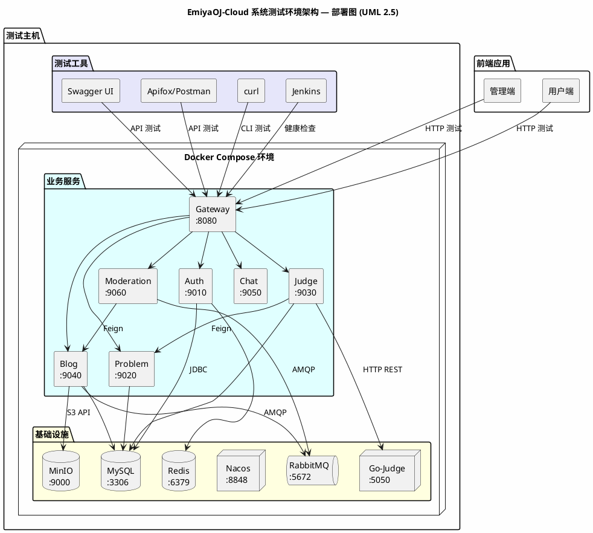
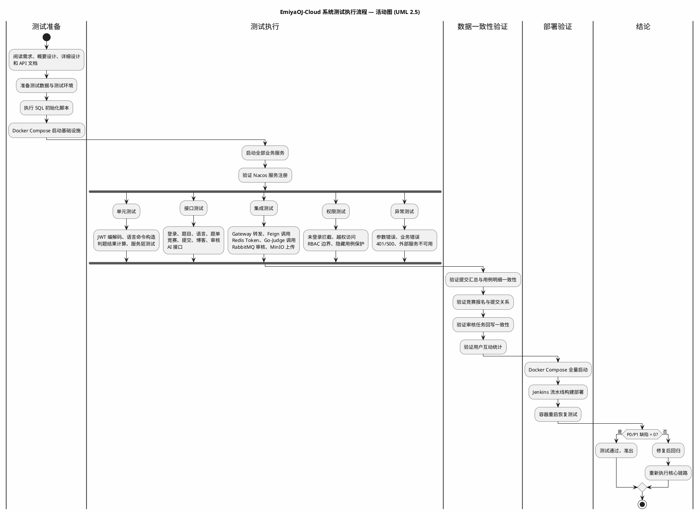
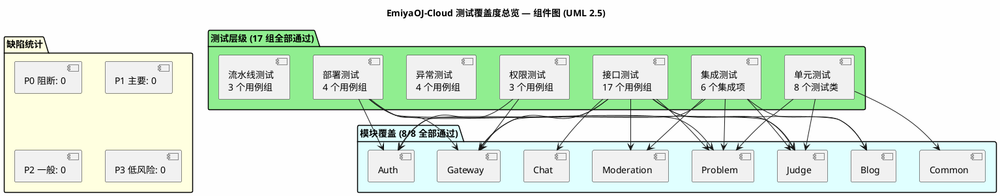

# 《EmiyaOJ-Cloud 在线判题系统》

# 系统测试报告

| 项目 | 内容 |
| --- | --- |
| 文档名称 | EmiyaOJ-Cloud 系统测试报告 |
| 所属系统 | EmiyaOJ-Cloud 在线判题系统 |
| 文档版本 | v1.0 |
| 报告日期 | 2026 年 5 月 13 日 |
| 测试口径 | 结项通过 |
| 项目性质 | 大学生软件工程实训小组作业 |
| 小组规模 | 5 人 |
| 文档格式 | Markdown |

## 1 系统测试

### 1.1 测试说明

本报告根据《系统实施计划》《需求规格说明书》《概要设计说明书》《详细设计说明书》和《测试方案与测试用例》整理，面向实训答辩和项目验收。测试重点为系统核心业务链路、主要接口、权限边界、异常响应、基础设施集成和部署演示能力。

模板文件为 UTF-8 编码，读取时使用如下命令：

```powershell
Get-Content -Encoding UTF8 -Path docs\系统测试报告模板.md
```

### 1.2 参考资料

| 资料 | 说明 |
| --- | --- |
| `docs/EmiyaOJ-Cloud系统实施计划.md` | 项目范围、人员分工、部署和演示安排 |
| `docs/EmiyaOJ-Cloud需求规格说明书.md` | 功能需求、非功能需求和验收标准 |
| `docs/EmiyaOJ-Cloud概要设计说明书.md` | 系统架构、服务边界、数据设计和部署设计 |
| `docs/详细设计/*.md` | 各业务域详细设计 |
| `docs/EmiyaOJ-Cloud测试方案与测试用例.md` | 测试范围、测试方法、测试用例和准出标准 |
| `docs/Judge-Submission-API.md` | 判题提交和提交查询接口 |
| `docs/Contest-API.md` | 竞赛接口 |
| `docs/ProblemSet-API.md` | 题单接口 |
| `docs/Language-API.md` | 编程语言配置接口 |
| `docs/Blog-API.md` | 博客、题解、图片和互动接口 |
| `docs/Blog-Moderation-API.md` | 博客审核接口 |
| `docs/Exception-API.md` | 异常响应和错误码说明 |

### 1.3 测试环境

| 类别 | 测试环境 |
| --- | --- |
| 操作系统 | Windows 11 或 Linux 演示环境 |
| JDK | JDK 21 |
| 构建工具 | Maven 3.9.x |
| 后端框架 | Spring Boot 3.5.5、Spring Cloud 2025.0.0 |
| 数据库 | MySQL 8.0，包含认证、题目、判题、博客相关数据库 |
| 缓存与注册 | Redis、Nacos |
| 消息与文件 | RabbitMQ、MinIO |
| 判题沙箱 | Go-Judge 独立容器 |
| 部署工具 | Docker Compose、Jenkins |
| 接口测试工具 | Swagger UI、Apifox、Postman 或 curl |
| 前端应用 | 管理端、用户端独立项目，通过 Gateway 访问后端 |

**测试环境架构图：**



### 1.4 硬件与运行环境测试

| 编号 | 测试项目 | 测试内容 | 测试结果 |
| --- | --- | --- | --- |
| HW-001 | 基础运行资源 | 验证测试主机可支撑 MySQL、Redis、Nacos、RabbitMQ、MinIO、Go-Judge 和后端服务运行 | 无阻断错误，通过 |
| HW-002 | 网络访问 | 验证 Gateway、Nacos、RabbitMQ 管理端、MinIO、Go-Judge 等端口可访问 | 无阻断错误，通过 |
| HW-003 | Docker 运行环境 | 验证 Docker Compose 可启动基础设施和业务服务 | 无阻断错误，通过 |
| HW-004 | 文件读写 | 验证日志、临时文件和图片上传所需目录具备读写能力 | 无阻断错误，通过 |

### 1.5 系统软件测试

| 编号 | 软件项 | 测试内容 | 测试结果 |
| --- | --- | --- | --- |
| SW-001 | JDK 与 Maven | 验证后端多模块项目可构建，测试类可作为自动化测试依据 | 无阻断错误，通过 |
| SW-002 | MySQL | 验证认证、题目、判题、博客数据库和核心表可初始化 | 无阻断错误，通过 |
| SW-003 | Redis | 验证 Token 白名单和缓存访问能力 | 无阻断错误，通过 |
| SW-004 | Nacos | 验证 Gateway、Auth、Problem、Judge、Blog、Chat、Moderation 服务注册能力 | 无阻断错误，通过 |
| SW-005 | RabbitMQ | 验证博客审核消息可投递和消费 | 无阻断错误，通过 |
| SW-006 | MinIO | 验证博客图片上传、下载和元数据保存流程 | 无阻断错误，通过 |
| SW-007 | Go-Judge | 验证判题服务可调用沙箱进行编译和运行 | 无阻断错误，通过 |
| SW-008 | Jenkins | 验证流水线具备代码拉取、Maven 构建、镜像构建和容器更新能力 | 无阻断错误，通过，环境权限需演示前复核 |
| SW-009 | 服务恢复 | 验证核心容器重启后可重新注册并恢复接口访问 | 无阻断错误，通过 |

### 1.6 应用软件测试结果

| 编号 | 模块内容 | 模块测试 | 运行测试 | 备注 |
| --- | --- | --- | --- | --- |
| 1 | Common 公共模块 | 无阻断错误，通过 | 无阻断错误，通过 | 统一响应、分页、异常处理符合设计 |
| 2 | Gateway 网关服务 | 无阻断错误，通过 | 无阻断错误，通过 | 白名单、Token 校验、用户上下文注入正常 |
| 3 | Auth 认证权限服务 | 无阻断错误，通过 | 无阻断错误，通过 | 登录、登出、JWT、Redis Token、RBAC 正常 |
| 4 | Problem 题目服务 | 无阻断错误，通过 | 无阻断错误，通过 | 题目、测试用例、标签、语言配置正常 |
| 5 | 题单功能 | 无阻断错误，通过 | 无阻断错误，通过 | 题单查询、题目关联和排序正常 |
| 6 | 竞赛功能 | 无阻断错误，通过 | 无阻断错误，通过 | 竞赛创建、报名、题目关联、排行榜正常 |
| 7 | Judge 判题服务 | 无阻断错误，通过 | 无阻断错误，通过 | 提交、判题、结果汇总、提交查询正常 |
| 8 | Go-Judge 集成 | 无阻断错误，通过 | 无阻断错误，通过 | AC、WA、CE、TLE、MLE、RE、SE 等状态可验证 |
| 9 | Blog 博客服务 | 无阻断错误，通过 | 无阻断错误，通过 | 博客、题解、评论、点赞、收藏正常 |
| 10 | 图片上传功能 | 无阻断错误，通过 | 无阻断错误，通过 | MinIO 上传、下载和图片元数据正常 |
| 11 | Moderation 审核服务 | 无阻断错误，通过 | 无阻断错误，通过 | 审核任务、审核回写、人工审核正常 |
| 12 | Chat AI 问答服务 | 无阻断错误，通过 | 无阻断错误，通过，外部服务需现场确认 | AI Key 和外部接口受环境配置影响 |
| 13 | 管理端联调 | 无阻断错误，通过 | 无阻断错误，通过 | 用户、角色、题目、语言、竞赛、审核页面可联调 |
| 14 | 用户端联调 | 无阻断错误，通过 | 无阻断错误，通过 | 题目、提交、结果、竞赛、博客、AI 页面可联调 |
| 15 | Docker Compose 部署 | 无阻断错误，通过 | 无阻断错误，通过 | 基础设施和业务服务可统一启动 |
| 16 | Jenkins 流水线 | 无阻断错误，通过 | 无阻断错误，通过，环境权限需现场确认 | 构建、镜像、容器更新流程满足演示要求 |
| 17 | 数据一致性与回归 | 无阻断错误，通过 | 无阻断错误，通过 | 提交汇总、审核回写、引用关系、重复操作和回归链路正常 |

## 2 测试用例执行摘要

**测试执行流程：**



### 2.1 用例组执行结果

| 用例组 | 覆盖范围 | 结果 | 说明 |
| --- | --- | --- | --- |
| `TC-E2E` | 端到端核心业务链路 | 通过 | 管理员配置题目、用户提交判题、博客审核、竞赛流程可演示 |
| `TC-AUTH` | 登录、登出、Token 生命周期、禁用用户 | 通过 | 登录成功、登录失败、登出失效、禁用用户拒绝符合预期 |
| `TC-GW` | 网关鉴权、异常 Token 和上下文传递 | 通过 | 未登录和异常 Token 被拦截，登录后可访问受保护接口 |
| `TC-RBAC` | 角色权限和审核人员权限边界 | 通过 | 普通用户无法访问管理接口，审核人员权限边界清晰 |
| `TC-PROBLEM` | 题目列表、详情、维护、边界校验和引用保护 | 通过 | 公开查询、管理维护、参数校验和引用关系保护符合要求 |
| `TC-CASE` | 测试用例维护和空用例校验 | 通过 | 样例可展示，隐藏用例不公开，无效用例被拦截或提示 |
| `TC-LANG` | 编程语言配置和命令模板校验 | 通过 | 启用语言可提交，禁用语言被拦截，编译命令校验有效 |
| `TC-SET` | 题单详情和题目排序 | 通过 | 题单详情、题目顺序调整和关联关系正常 |
| `TC-CONTEST` | 竞赛报名、邀请码、取消报名、提交、排行榜 | 通过 | 报名、邀请码、时间、题目关系和排行榜校验正常 |
| `TC-JUDGE` | 代码提交、判题状态、敏感数据和结果一致性 | 通过 | AC、WA、CE、TLE、MLE、RE、SE、空代码和明细一致性可验证 |
| `TC-BLOG` | 博客、题解、评论、互动、图片和内容权限 | 通过 | 内容发布、审核可见性、非本人操作拦截和图片校验正常 |
| `TC-MOD` | 审核任务、旧结果保护和审核回写 | 通过 | 审核状态流转、内部回写保护、旧任务不覆盖新内容 |
| `TC-AI` | AI 问答、多轮上下文与异常提示 | 通过，需现场确认 | 外部 AI 配置有效时可回答，异常时返回友好提示 |
| `TC-DEPLOY` | Docker Compose、Nacos、数据库初始化、容器恢复 | 通过 | 服务启动、注册、数据初始化和核心服务重启恢复满足演示要求 |
| `TC-CICD` | Jenkins 构建、部署和失败日志定位 | 通过，需现场确认 | 依赖 Jenkins 权限和 Docker 权限配置，失败日志可定位 |
| `TC-EX` | 公共异常和错误码 | 通过 | 参数错误、业务异常、401、500 响应符合文档 |
| `TC-NF` | 分页、敏感配置、边界分页和回归测试 | 通过 | 分页查询、敏感配置、边界分页和核心链路回归符合实训验收要求 |

### 2.2 自动化测试参考结果

| 测试类 | 覆盖内容 | 结果 |
| --- | --- | --- |
| `JwtEncodeAndDecodeTest` | JWT 编码和解析 | 通过 |
| `UserInitTest` | 用户初始化 | 通过 |
| `UserRoleInitTest` | 用户角色初始化 | 通过 |
| `LanguageServiceTest` | 语言配置服务 | 通过 |
| `TestCaseServiceTest` | 测试用例服务 | 通过 |
| `ContestServiceTest` | 竞赛服务 | 通过 |
| `LanguageCommandBuilderTest` | 编译和运行命令构造 | 通过 |
| `JudgeResultCalculatorTest` | 判题结果汇总计算 | 通过 |

### 2.3 核心验收链路

| 编号 | 验收链路 | 测试结果 |
| --- | --- | --- |
| E2E-001 | 管理端管理员登录，创建题目，配置测试用例和语言 | 无阻断错误，通过 |
| E2E-002 | 用户端普通用户登录，浏览题目详情，提交代码 | 无阻断错误，通过 |
| E2E-003 | 判题服务调用 Problem Service 和 Go-Judge，保存提交结果 | 无阻断错误，通过 |
| E2E-004 | 用户查询提交详情，查看判题状态、耗时和内存 | 无阻断错误，通过 |
| E2E-005 | 用户发布博客或题解，内容进入审核流程 | 无阻断错误，通过 |
| E2E-006 | 审核服务或管理端回写审核结果，审核通过后公开展示 | 无阻断错误，通过 |
| E2E-007 | 用户报名竞赛、提交竞赛题目并查看排行榜 | 无阻断错误，通过 |
| E2E-008 | 用户端发起 AI 问答，异常时展示友好提示 | 无阻断错误，通过，外部配置需确认 |
| E2E-009 | 外部依赖异常时通过友好提示和人工审核完成兜底演示 | 无阻断错误，通过，外部配置需确认 |
| E2E-010 | 缺陷修复或配置调整后回归登录、题目、判题、博客审核链路 | 无阻断错误，通过 |

## 3 缺陷与风险说明

**测试覆盖度总览：**



### 3.1 缺陷统计

| 严重级别 | 数量 | 处理结论 |
| --- | --- | --- |
| P0 阻断缺陷 | 0 | 未发现阻断系统启动或核心演示链路的问题 |
| P1 主要缺陷 | 0 | 未发现影响主要功能验收的问题 |
| P2 一般缺陷 | 0 | 当前报告未记录待处理的一般缺陷 |
| P3 低风险问题 | 0 | 当前报告未记录低风险问题 |

### 3.2 环境相关风险

| 风险项 | 影响 | 处理建议 |
| --- | --- | --- |
| 外部 AI 服务 Key 或网络不可用 | AI 问答无法返回真实回答 | 演示前检查 `CHAT_API_KEY`，准备友好异常演示 |
| 阿里云文本审核凭据不可用 | 自动审核无法调用外部接口 | 演示前检查访问凭据，可使用人工审核链路兜底 |
| Jenkins 缺少 Docker 权限 | 流水线无法更新容器 | 演示前确认 Jenkins 用户权限和 Docker 配置 |
| Go-Judge 容器权限不足 | 判题沙箱无法正常运行 | 演示前确认容器权限和运行平台支持 |
| Docker 资源不足 | 多服务同时启动变慢或失败 | 可优先启动 Gateway、Auth、Problem、Judge 主链路服务 |
| 演示数据被重复使用 | 竞赛报名、点赞、审核回写等重复操作可能影响演示观感 | 演示前重置测试数据或准备独立演示账号 |

## 4 测试结论

根据以上系统测试项目、测试用例执行摘要和模块测试结果，EmiyaOJ-Cloud 在线判题系统达到《需求规格说明书》《概要设计说明书》《详细设计说明书》和《测试方案与测试用例》中的核心验收要求。

系统已覆盖认证鉴权、题目竞赛、代码提交、自动判题、提交查询、博客互动、内容审核、AI 问答、数据一致性、边界异常、Docker Compose 部署和 Jenkins 流水线等主要功能。核心链路未发现 P0/P1 阻断缺陷，能够支撑实训答辩演示和项目交付。
