# 《EmiyaOJ-Cloud 在线判题系统》

# 软件工程实训综合报告

| 项目 | 内容 |
| --- | --- |
| 文档名称 | EmiyaOJ-Cloud 软件工程实训综合报告 |
| 所属系统 | EmiyaOJ-Cloud 在线判题系统 |
| 文档版本 | V1.0 |
| 编写日期 | 2026 年 5 月 13 日 |
| 项目性质 | 大学生软件工程实训小组作业 |
| 小组规模 | 5 人 |
| 文档格式 | Markdown |

> **编码说明**：本文档为 UTF-8 编码。若使用 PowerShell 读取，请使用以下命令：
> ```powershell
> Get-Content -Encoding UTF8 -Path docs\EmiyaOJ-Cloud软件工程实训大报告.md
> ```

---

## 队伍信息

| 队伍名 | [队伍名待填写] |
| --- | --- |

| 学号 | 姓名 | 角色任务 | 贡献度% |
| --- | --- | --- | --- |
| [学号待填] | 成员 A | 项目经理 / 架构负责人：进度管理、任务协调、总体架构、公共模块、网关服务、前后端集成、Jenkins 流水线 | [待填]% |
| [学号待填] | 成员 B | 认证权限负责人：Auth 服务、JWT、Redis Token、用户/角色/权限、RBAC 测试、管理端权限页面联调、数据库初始化整理 | [待填]% |
| [学号待填] | 成员 C | 题目与竞赛负责人：Problem 服务、题目、题单、测试用例、语言配置、竞赛功能、用户端题目页面联调、相关接口文档维护 | [待填]% |
| [学号待填] | 成员 D | 判题服务负责人：Judge 服务、提交记录、Go-Judge 沙箱调用、判题状态流转、用户端提交页面联调、核心业务演示 | [待填]% |
| [学号待填] | 成员 E | 博客/AI/测试负责人：Blog、Moderation、Chat 服务、图片上传、内容审核、管理端/用户端博客与 AI 页面联调、系统测试、演示 PPT 与测试报告 | [待填]% |

---

## 目录

1. [项目概述](#1-项目概述)
   - 1.1 项目背景
   - 1.2 项目定位（应用场景 / 目标人群）
   - 1.3 项目方案
   - 1.4 项目目标
   - 1.5 项目价值
2. [开发计划](#2-开发计划)
   - 2.1 最终呈现形式
   - 2.2 主要功能描述
   - 2.3 运行环境
   - 2.4 验收标准
   - 2.5 关键问题
   - 2.6 进度安排
   - 2.7 开发预算
3. [可行性分析](#3-可行性分析)
   - 3.1 技术可行性分析
   - 3.2 资源可行性分析
   - 3.3 市场可行性分析
4. [需求分析](#4-需求分析)
   - 4.1 数据需求
   - 4.2 功能需求
   - 4.3 性能需求
   - 4.4 界面需求
   - 4.5 接口需求
   - 4.6 其他需求
5. [概要设计](#5-概要设计)
   - 5.1 处理流程
   - 5.2 总体结构设计
   - 5.3 功能设计
   - 5.4 数据流转设计
   - 5.5 用户界面设计
   - 5.6 数据结构设计
   - 5.7 接口设计
   - 5.8 错误/异常处理设计
   - 5.9 系统配置策略
   - 5.10 系统部署方案
   - 5.11 跨端应用架构设计
   - 5.12 其他相关技术与方案
6. [数据库设计](#6-数据库设计)
7. [手机端侧部署设计](#7-手机端侧部署设计)
8. [详细设计](#8-详细设计)
9. [项目总结](#9-项目总结)

---

## 文档修订历史

| 序号 | 修订原因 | 版本号 | 作者 | 修订日期 | 备注 |
| --- | --- | --- | --- | --- | --- |
| 1 | 初稿编写 | V1.0 | [待填] | 2026-05-13 | 整合需求、设计、测试等全部文档 |

---

## 1. 项目概述

### 1.1 项目背景

在高校程序设计课程、算法训练和实验教学中，传统线下代码作业模式存在**批改效率低、结果反馈慢、过程数据不完整**等问题。学生提交代码后往往需要等待较长时间才能获得批改结果，教师也需要耗费大量精力进行人工检查，难以覆盖全面的边界测试用例。同时，普通在线练习平台虽然能够提供自动判题能力，但通常难以覆盖教师后台管理、竞赛组织、内容审核、AI 辅助问答和自动化部署演示等完整的实训教学需求。

在线判题系统（Online Judge，OJ）作为一种成熟的编程教学工具，在高校和编程社区中已有广泛应用。然而，传统单体式 OJ 系统在以下方面存在限制：所有功能耦合在单一应用中，某个模块的故障可能影响整个系统可用性；判题执行与业务逻辑混合部署带来安全风险；功能扩展需要修改整体代码，难以独立迭代。

近年来，随着微服务架构和容器化技术的普及，将 OJ 系统拆分为多个独立、可扩展的微服务已成为主流技术方案。Spring Cloud 生态提供了服务注册发现、API 网关、声明式调用和配置管理等成熟的微服务治理能力；Docker 容器化部署使得环境搭建和演示交付更加标准化和可复现。

在此背景下，本项目 **EmiyaOJ-Cloud** 基于 Spring Cloud 微服务架构，将认证授权、题目管理、判题执行、博客社区、内容审核、AI 辅助和部署运维等能力拆分为多个独立服务，通过 Docker Compose 统一编排，并利用 Jenkins 流水线固化构建和部署流程，形成一套可演示、可验收、可扩展的在线判题系统。

项目在设计上体现了以下创新思路：第一，采用**按业务域分库**策略，将认证、题目、判题和博客数据分别存储于独立数据库，各微服务仅直连自身数据库，跨域数据通过 Feign 或消息队列交互，从根本上避免了单体架构中数据库耦合带来的扩展瓶颈。第二，引入 **Go-Judge 独立沙箱**作为判题执行环境，用户代码在隔离容器中编译运行，支持 CPU 时间、真实时间、内存、进程数和输出大小等多维度资源限制，有效防止恶意代码和死循环对系统的破坏。第三，在判题服务内部实现**异步判题引擎**——提交接口立即返回提交编号而不阻塞等待判题完成，判题过程通过 @Async 异步执行，确保高并发提交场景下的用户体验。第四，构建了 **RabbitMQ 异步消息 + 阿里云文本审核 + 人工复核**的三级内容安全体系，既保证了审核的自动化效率，又保留了人工兜底的灵活性。第五，将 **Jenkins 流水线 + Docker Compose** 纳入实训交付范围，使得从代码提交到容器更新的全流程自动化，为答辩演示提供了稳定、可复现的部署保障。

### 1.2 项目定位

EmiyaOJ-Cloud 是一个面向高校软件工程实训和在线编程训练场景的综合 OJ 平台，定位如下：

| 定位 | 说明 |
| --- | --- |
| **教学训练平台** | 支持教师维护题目、测试用例、语言和题单，学生在线刷题并即时查看判题结果 |
| **竞赛组织平台** | 支持竞赛创建、报名、题目关联、提交校验和排行榜展示 |
| **社区交流平台** | 支持博客、题解、评论、点赞、收藏和图片上传 |
| **实训演示项目** | 展示 Spring Cloud 微服务、Docker Compose、Jenkins、Go-Judge、RabbitMQ、MinIO 等技术集成能力 |

#### 1.2.1 应用场景

系统面向以下典型应用场景，每个场景均聚焦于当前教学和开发实践中的具体**痛点**：

| 场景 | 典型流程 | 解决的痛点 |
| --- | --- | --- |
| **日常刷题** | 用户登录 → 浏览题目 → 提交代码 → 查看判题结果 | 传统作业批改周期长、反馈滞后；系统提供秒级判题反馈，帮助学生快速迭代代码 |
| **课程作业** | 教师配置题目和测试用例 → 学生提交 → 教师查看提交记录 | 人工检查代码工作量大、难以覆盖边界用例；系统通过隐藏测试用例自动化评测，保证评分的客观性和全面性 |
| **校内竞赛** | 管理员创建竞赛 → 用户报名 → 比赛提交 → 查看排行榜 | 缺乏统一的竞赛组织平台，报名、题目分发和排名统计依赖人工；系统提供从报名到排行榜的一站式竞赛管理 |
| **题解交流** | 用户发布题解 → 审核通过 → 其他用户浏览、点赞、收藏 | 优质题解缺少沉淀和分享渠道，学习资源分散；系统通过博客社区和内容审核保障交流质量与安全 |
| **实训答辩** | Jenkins 部署 → 展示前后端入口 → 演示核心链路和系统架构 | 实训项目环境搭建复杂、演示效果不稳定；系统通过 Docker Compose 和 Jenkins 固化部署流程，确保一致性 |

**日常刷题场景详解：** 学生用户在课余时间登录系统，按照难度或标签筛选感兴趣的题目，阅读题面描述和样例后在代码编辑器中编写解法。提交后系统立即返回提交编号，并在后台异步完成编译和测试用例执行。用户在提交记录页面可实时看到判题状态从 PENDING → JUDGING → 最终结果的变化过程。对于 WA（答案错误）的提交，用户可以查看通过了哪些用例，结合错误信息分析代码问题后再次提交。这种"提交即反馈"的闭环极大提高了学习效率，与传统的"写好代码→发给助教→等待批改"的线下模式形成了鲜明对比。

**课程作业场景详解：** 教师在管理端根据教学内容创建配套练习题，设置隐藏测试用例覆盖常规情况和边界条件（如空输入、极值、大数据量）。学生在规定时间内完成提交，系统自动评测并记录每次提交的详细信息。教师通过提交记录页面可查看全班学生的完成情况、通过率和常见错误分布，从而针对性地调整教学重点。隐藏测试用例的方案确保了评分的客观性——学生无法通过"面向测试用例编程"的方式投机取巧，必须真正理解题意并编写正确的通用解法。

**校内竞赛场景详解：** 学院或社团在管理端创建编程竞赛，设置 ACM/ICPC 或 IOI 规则，指定开始时间、结束时间和封榜时间，并配置竞赛专属题目。学生通过邀请码报名参赛。比赛期间，系统实时校验每次提交的竞赛资格（是否报名、是否在时间范围内、题目是否属于该竞赛），并根据竞赛规则计算排行榜——ACM 规则按通过题数和罚时排名，IOI 规则按总分排名。封榜后排行榜冻结，增加比赛的悬念和观赏性。

**题解交流场景详解：** 用户完成题目后可将自己的解题思路、算法分析和代码要点整理成题解发布。系统自动将题解与题目绑定，其他用户在题目详情页即可看到关联的题解列表。为了保障内容质量，所有博客和题解发布后进入异步审核流程——先由阿里云文本审核 API 自动检测违规内容，通过则公开展示，疑似违规则进入人工复核队列。审核人员可在管理端查看待审核内容并执行通过或驳回操作。点赞、收藏和评论功能进一步促进了社区互动，优质内容通过社区筛选机制获得更多曝光。

#### 1.2.2 目标人群

| 目标人群 | 主要诉求 |
| --- | --- |
| 普通学生用户 | 在线刷题、提交代码、查看结果、参与竞赛、阅读题解 |
| 教师/管理员 | 管理题目、语言、测试用例、竞赛、用户和提交记录 |
| 审核人员 | 审核博客、题解和评论内容，保障社区内容合规 |
| 实训评审人员 | 查看系统功能完整性、技术架构、部署流程和团队分工 |

### 1.3 项目方案

系统采用"管理端/用户端前端 + API Gateway + Spring Cloud 微服务 + 基础设施 + CI/CD"的整体方案。针对各核心问题，通过以下映射关系实现从问题空间到解空间的转化：

| 问题 | 解决方案 |
| --- | --- |
| 对于**传统单体型 OJ 扩展困难、模块耦合严重**的问题 | 该项目通过 **Spring Cloud 微服务架构按业务域拆分为 Auth、Problem、Judge、Blog、Chat、Moderation 六个独立服务**来实现高内聚低耦合和独立扩展 |
| 对于**用户代码直接在服务端执行存在安全风险**的问题 | 该项目通过 **Go-Judge 独立沙箱容器隔离编译和运行用户代码**来实现安全执行，业务服务不直接运行任何用户代码 |
| 对于**刷题后无法即时获得判题反馈**的问题 | 该项目通过**异步判题引擎 + Go-Judge 高性能沙箱**来实现快速创建提交记录并异步返回判题结果 |
| 对于**社区内容缺乏有效合规管控**的问题 | 该项目通过 **RabbitMQ 异步消息 + 阿里云文本审核 + 人工复核三级审核机制**来实现博客和评论的内容安全 |
| 对于**多环境部署复杂、演示一致性难以保证**的问题 | 该项目通过 **Docker Compose 统一编排 + Jenkins 自动化流水线**来实现一键部署和构建交付 |
| 对于**缺乏 AI 辅助编程学习能力**的问题 | 该项目通过 **Chat Service 集成外部 AI 大模型接口**来实现代码问题和题目思路的智能辅助 |
| 对于**前端直接依赖微服务地址导致耦合**的问题 | 该项目通过 **Spring Cloud Gateway 统一入口 + Nacos 服务发现**来实现前端透明访问和动态路由 |

### 1.4 项目目标

| 目标 | 验收方式 |
| --- | --- |
| 完成在线判题核心链路 | 用户可提交代码并查询 AC/WA/CE/TLE/MLE/RE/SE 等 11 种判题状态 |
| 完成管理端核心功能 | 管理员可维护用户、角色、题目、语言、题单、竞赛和审核 |
| 完成用户端核心功能 | 用户可刷题、参赛、发布题解、查看博客和使用 AI 问答 |
| 完成部署演示能力 | Docker Compose 或 Jenkins 可启动核心服务并完成健康检查 |
| 完成项目文档交付 | 需求、概要、详细设计、测试方案、测试报告等文档齐全 |

### 1.5 项目价值

| 价值类型 | 说明 |
| --- | --- |
| **教学价值** | 提升程序设计训练和作业评测效率，使教师从繁重的人工批改中解放，让学生获得即时判题反馈 |
| **工程价值** | 展示微服务拆分、服务治理、异步消息、沙箱判题和对象存储等企业级技术的完整集成实践 |
| **实训价值** | 形成从需求分析、系统设计、编码开发、测试验证到部署交付的完整软件工程闭环 |
| **扩展价值** | 后续可扩展更多编程语言、题目类型（如交互题、SPJ 特判）、竞赛规则、审核策略和 AI 辅助能力 |

---

## 2. 开发计划

### 2.1 最终呈现形式

| 形式 | 内容 |
| --- | --- |
| 后端源码 | 多模块 Maven 工程，包含 Common、Gateway、Auth、Problem、Judge、Blog、Chat、Moderation 共 8 个模块 |
| 管理端应用 | 独立前端项目或构建产物，提供用户、角色、题目、语言、竞赛、博客审核等后台管理页面 |
| 用户端应用 | 独立前端项目或构建产物，提供题目浏览、代码提交、竞赛参与、博客社区和 AI 问答页面 |
| 数据库脚本 | `sql/*.sql` 和 `emiya-oj_final.sql` 演示数据初始化脚本（覆盖 4 个业务数据库） |
| 部署环境 | Docker Compose 配置、各服务 Dockerfile、Jenkins 流水线配置和部署截图 |
| 项目文档 | 需求规格说明书、概要设计说明书、详细设计说明书（5 份子模块）、测试方案与测试用例、系统测试报告、演示 PPT |

### 2.2 主要功能描述

系统主要功能可归纳为六大功能域：

| 功能域 | 功能描述 |
| --- | --- |
| **认证权限** | 用户登录、登出、JWT 签发与校验、Redis Token 白名单管理、用户管理、角色管理、权限树管理（菜单/按钮/接口三级）、RBAC 访问控制、操作日志审计 |
| **题目竞赛** | 题目 CRUD、测试用例管理（样例/隐藏）、标签分类、编程语言配置（编译/运行命令模板）、题单组织、竞赛创建与管理、竞赛报名（邀请码）、竞赛题目关联、排行榜统计、竞赛提交校验 |
| **判题提交** | 代码提交、异步判题、Go-Judge 沙箱编译运行、输出比对、结果汇总计算（11 种判题状态）、单用例明细记录、提交记录分页查询、竞赛提交校验 |
| **博客审核** | 博客/题解发布与编辑、评论互动、点赞收藏、图片上传（MinIO 对象存储）、标签管理、用户博客统计、RabbitMQ 异步审核任务、阿里云文本审核、审核结果回写、人工审核 |
| **AI 聊天** | AI 问答对话、多轮对话上下文、代码问题辅助、题目相关问题解答、外部服务异常友好降级 |
| **部署运维** | Docker Compose 统一编排（MySQL、Redis、Nacos、RabbitMQ、MinIO、Go-Judge + 7 个业务服务）、Jenkins 流水线（拉取→构建→镜像→部署→检查）、Nacos 服务注册发现、健康检查和日志归档 |

### 2.3 运行环境

#### 2.3.1 硬件环境

| 资源 | 建议配置 |
| --- | --- |
| CPU | 4 核及以上 |
| 内存 | 8 GB 及以上，推荐 16 GB |
| 磁盘 | 20 GB 以上可用空间 |
| 网络 | 支持访问 Git 仓库、镜像仓库、AI/审核外部服务 |

#### 2.3.2 软件环境

| 软件 | 版本/方案 | 用途 |
| --- | --- | --- |
| JDK | Java 21 | 后端运行与编译环境 |
| Maven | 3.9.x | 多模块项目构建 |
| Spring Boot | 3.5.5 | 微服务基础框架 |
| Spring Cloud | 2025.0.0 | 网关、服务治理、负载均衡 |
| Spring Cloud Alibaba | 2025.0.0.0 | Nacos 注册与配置 |
| MySQL | 8.0.31 | 业务数据存储 |
| Redis | 7-alpine | Token 白名单和缓存 |
| RabbitMQ | 3.13-management | 审核异步消息 |
| MinIO | RELEASE.2025-04-22 | 博客图片对象存储 |
| Nacos | 2.5.1 | 服务注册与配置中心 |
| Go-Judge | Docker 独立服务 | 代码编译与执行沙箱 |
| Docker Compose | 3.8 | 本地和演示环境编排 |
| Jenkins | Pipeline/Freestyle | 自动构建与部署 |
| MyBatis-Plus | 3.5.16 | ORM、分页、逻辑删除 |
| JJWT | 0.12.6 | JWT 生成与解析 |
| SpringDoc OpenAPI | 2.8.6 | Swagger 接口文档 |

#### 2.3.3 服务端口规划

| 服务 | 端口 | 说明 |
| --- | --- | --- |
| Gateway | 8080 | 后端统一入口 |
| Auth Service | 9010 | 认证与权限 |
| Problem Service | 9020 | 题目、语言、题单、竞赛 |
| Judge Service | 9030 | 提交与判题 |
| Blog Service | 9040 | 博客、题解、图片 |
| Chat Service | 9050 | AI 问答 |
| Moderation Service | 9060 | 内容审核 |
| Go-Judge | 5050 | 判题沙箱 |
| MySQL | 3306 | 数据库 |
| Redis | 6379 | 缓存和 Token |
| Nacos | 8848 | 服务注册与配置 |
| RabbitMQ | 5672/15672 | 消息队列和管理控制台 |
| MinIO | 9000/9001 | 对象存储和管理控制台 |

### 2.4 验收标准

| 验收项 | 标准 |
| --- | --- |
| 核心判题链路 | 管理员配置题目 → 用户提交代码 → 系统自动判题 → 用户查看 AC/WA/CE/TLE 等结果，链路可完整演示 |
| 管理端联调 | 管理员可登录并操作用户管理、角色权限、题目维护、语言配置、竞赛管理和博客审核页面 |
| 用户端联调 | 普通用户可登录并浏览题目、提交代码、查看结果、参与竞赛、发布博客、使用 AI 问答 |
| 博客审核 | 内容发布后进入待审核状态，审核通过后公开展示，驳回后隐藏 |
| 部署验证 | Docker Compose 可启动基础设施和核心业务服务；Jenkins 流水线可完成构建和部署 |
| 文档齐备 | 需求、概要设计、详细设计、测试方案、测试报告、演示 PPT 等文档齐全 |

### 2.5 关键问题

| 关键问题 | 影响 | 处理策略 |
| --- | --- | --- |
| 微服务数量多、启动链路长 | 联调复杂度高，环境搭建耗时 | 优先保证 Gateway、Auth、Problem、Judge 主链路，再扩展 Blog、Moderation、Chat |
| 判题沙箱依赖容器权限 | 判题可能无法运行 | 提前在 Linux 或 Docker Desktop 环境验证 Go-Judge 容器权限，准备备用判题截图 |
| 外部 AI 和审核服务依赖密钥 | AI 问答或自动审核功能受限 | 通过环境变量配置，演示时准备友好异常或人工审核兜底 |
| 前端不在当前仓库 | 实施范围与交付物边界容易模糊 | 在交付物中单独列出管理端和用户端前端仓库、构建产物和访问地址 |
| Docker 资源不足 | 多服务同时启动变慢或失败 | 可优先启动核心链路服务（Gateway、Auth、Problem、Judge），其余按需启动 |
| Jenkins 环境缺少 Docker 权限 | 流水线无法构建或部署容器 | 提前配置 Jenkins 用户权限，必要时使用部署脚本或 SSH 到部署机执行 |
| 前后端接口字段不一致 | 页面调用失败或数据展示异常 | 以 Swagger/API 文档为准进行联调，关键接口固定请求和响应格式 |

### 2.6 进度安排

本项目按 8 天实训节奏安排：

| 序号 | 阶段 | 日期 | 主要任务 | 产出文档/成果 | 负责人 |
| --- | --- | --- | --- | --- | --- |
| 1 | 需求分析 | Day1 | 分析在线判题、题目管理、认证权限、博客社区、AI 辅助等核心需求 | 《需求规格说明书》、用例清单 | 全体成员 |
| 2 | 项目技术介绍 | Day1 | 学习 Spring Cloud、Nacos、Gateway、Feign、Redis、MyBatis-Plus、Docker | 技术学习记录 | 成员 A 牵头 |
| 3 | 概要设计 | Day1-Day2 | 明确微服务拆分、服务职责、接口关系、数据库分库方案 | 《概要设计说明书》、架构图 | 全体成员 |
| 4 | 搭建开发环境 | Day2 | 配置 JDK 21、Maven、Docker、MySQL、Redis、Nacos、RabbitMQ、MinIO、Go-Judge | 可运行开发环境 | 成员 A、成员 B |
| 5 | 详细设计 | Day2 | 设计各模块接口、DTO、数据库表、权限编码、判题流程、审核流程 | 5 份《详细设计说明书》、接口说明 | 各模块负责人 |
| 6 | 认证与网关模块 | Day3-Day4 | 完成登录/登出、Token 解析、权限管理、网关鉴权、路由转发 | Auth/Gateway 可运行代码 | 成员 A、成员 B |
| 7 | 题目与竞赛模块 | Day3-Day5 | 完成题目、测试用例、语言配置、题单、竞赛报名与排行榜 | Problem 可运行代码 | 成员 C |
| 8 | 判题模块 | Day4-Day6 | 完成代码提交、异步判题、Go-Judge 调用、结果计算、提交查询 | Judge 可运行代码 | 成员 D |
| 9 | 博客、审核与 AI 模块 | Day4-Day6 | 完成博客、评论、收藏、图片上传、文本审核、AI 对话 | Blog/Moderation/Chat 可运行代码 | 成员 E |
| 10 | 管理端与用户端联调 | Day6-Day7 | 联调管理端和用户端页面，验证登录、权限、题目、判题、博客、AI 等功能链路 | 前后端联调记录、页面截图 | 全体成员 |
| 11 | 系统集成 | Day6-Day7 | 使用 Docker Compose 启动基础设施与服务，完成跨服务联调 | 集成环境、联调记录 | 全体成员 |
| 12 | Jenkins 流水线部署 | Day7 | 配置流水线任务，完成后端构建、前端构建、镜像构建、容器更新和部署验证 | Jenkins 流水线记录、部署截图 | 成员 A |
| 13 | 测试与修复 | Day7 | 编写并执行接口测试、页面测试、异常测试、权限测试、判题测试 | 《测试方案和用例》、缺陷记录 | 成员 E 牵头 |
| 14 | 演示准备 | Day8 | 准备演示数据、PPT、答辩讲解分工，完成最终排练 | 演示 PPT、最终代码包 | 全体成员 |

### 2.7 开发预算

本项目为大学生软件工程实训项目，不涉及商业采购预算。预算按资源投入估算：

| 资源项 | 预算说明 |
| --- | --- |
| **人力投入** | 5 人小组按模块分工完成，主要成本为实训时间（约 8 天 × 5 人 = 40 人天） |
| **开发环境** | 使用个人电脑（4 核 / 16GB 内存）、开源 JDK 21、Maven 3.9.x、Docker Desktop、IntelliJ IDEA（社区版免费） |
| **基础设施** | MySQL 8.0、Redis 7、Nacos 2.5.1、RabbitMQ 3.13、MinIO — 均为开源免费组件 |
| **第三方服务** | AI 问答接口（如通义千问 qwen-turbo）和阿里云文本审核接口 — 按演示账号或免费/低额度测试资源使用 |
| **部署环境** | 本地 Docker Compose 或实验室/个人服务器；Jenkins 使用本地部署实例 |
| **开发工具** | Git（版本管理）、GitHub（代码托管）、Apifox/Postman（接口测试）— 均使用免费版本 |

---

## 3. 可行性分析

### 3.1 技术可行性分析

项目技术栈均为成熟开源或业界常用工程技术，技术可行性分析如下：

| 技术组件 | 成熟度 | 可行性说明 |
| --- | --- | --- |
| Spring Boot 3.5.5 | 成熟 | 业界广泛使用的 Java 微服务基础框架，生态完善，文档丰富 |
| Spring Cloud 2025.0.0 | 成熟 | 提供网关、服务发现、负载均衡、声明式调用等完整微服务治理能力 |
| Spring Cloud Alibaba 2025.0.0.0 | 成熟 | Nacos 作为注册和配置中心在国内有大量生产实践 |
| MyBatis-Plus 3.5.16 | 成熟 | 简化 CRUD 和分页开发，与 MySQL 配合良好，支持逻辑删除和自动填充 |
| MySQL 8.0.31 | 成熟 | 关系型数据库行业标准，支持事务、索引，utf8mb4 字符集支持中文 |
| Redis 7 | 成熟 | 高性能缓存和 Token 白名单存储，毫秒级响应 |
| RabbitMQ 3.13 | 成熟 | 可靠的消息队列，支持手动确认和消息持久化，满足审核异步任务需求 |
| MinIO | 成熟 | S3 兼容的对象存储，适合图片等非结构化数据存储 |
| Nacos 2.5.1 | 成熟 | 阿里巴巴开源的服务注册与配置中心，Spring Cloud Alibaba 原生集成 |
| Go-Judge | 可行 | 独立沙箱服务，通过 REST API 隔离执行用户代码，支持 CPU/内存/进程数等多维资源限制 |
| Docker Compose | 成熟 | 容器编排标准工具，一键启动多服务环境，支持数据卷持久化 |
| Jenkins | 成熟 | 持续集成行业标准，支持 Pipeline 流水线，凭据管理敏感配置 |
| JJWT 0.12.6 | 成熟 | JWT 标准 Java 实现，Token 签发和解析稳定可靠 |
| SpringDoc OpenAPI 2.8.6 | 成熟 | 自动生成 Swagger 接口文档，前后端联调基础 |

现有仓库已有完整的模块划分、SQL 脚本、API 文档和部分测试类（含 JWT 编解码、语言命令构造、判题结果计算、测试用例服务、竞赛服务等自动化测试），具备继续完善、联调和演示的技术基础。

在技术选型上，本项目的每一项技术决策都经过了审慎评估。选择 **Spring Cloud Gateway** 而非 Zuul 作为 API 网关，是因为 Gateway 基于 Reactor 和 WebFlux 构建，在高并发场景下具有更好的吞吐量和更低的内存占用，且与 Spring Cloud 2025.0.0 生态的集成更为紧密。选择 **Nacos** 而非 Eureka 作为注册中心，是因为 Nacos 同时提供了服务注册和配置管理两项能力，避免了额外部署 Config Server 的复杂度，且其控制台提供了直观的服务实例监控界面，便于演示时展示微服务拓扑。选择 **MyBatis-Plus** 而非 JPA 作为 ORM 框架，是因为 MyBatis-Plus 在复杂查询、分页和逻辑删除等场景下提供了更灵活的编程体验，其代码生成器也能显著提升开发效率。选择 **Go-Judge** 作为判题沙箱而非自行实现，是因为 Go-Judge 已在多个 OJ 项目中得到验证，提供了完善的资源限制和文件管理 API，避免了重复造轮子的工程浪费。

技术风险方面，主要关注以下三点：一是 **Go-Judge 的容器权限问题**——在非 Linux 环境（如 Windows Docker Desktop）下可能需要额外配置才能支持资源限制，预案是在演示环境中使用 Linux 虚拟机或云服务器运行 Go-Judge；二是 **微服务间的网络延迟**——虽然 Feign 调用在本地 Docker 网络中延迟很低（<10ms），但若部署到跨主机环境可能需要引入链路追踪和超时重试机制；三是 **Nacos 版本兼容性**——Spring Cloud Alibaba 2025.0.0.0 与 Nacos 2.5.1 的版本匹配已在项目 `pom.xml` 中锁定，升级前需验证兼容性。以上风险均有明确的应对措施，不影响核心功能的开发和演示。

### 3.2 资源可行性分析

| 资源维度 | 可行性说明 |
| --- | --- |
| **人力资源** | 项目小组 5 人分工明确，分别负责架构与部署、认证权限、题目竞赛、判题服务、博客/AI/测试。每人负责 1-2 个微服务模块，任务粒度合理 |
| **硬件资源** | 系统可在个人电脑（4 核 / 16GB 内存）上通过 Docker Compose 运行全部服务。资源不足时可分批启动核心服务（Gateway、Auth、Problem、Judge） |
| **软件资源** | 所有开发工具、框架和基础设施均为开源免费，无需商业授权 |
| **外部服务** | AI 和阿里云审核接口可使用免费额度或演示账号，不影响核心判题链路验收 |
| **前端资源** | 管理端和用户端虽不在当前后端仓库中，但已纳入实施、联调和验收范围，可通过独立仓库或构建产物交付 |
| **时间资源** | 8 天实训周期紧张但可管理，优先保证核心判题主链路和部署演示，博客和 AI 为加分项 |

### 3.3 市场可行性分析

在线判题系统在以下领域具有明确需求：

| 领域 | 需求分析 |
| --- | --- |
| **高校程序设计课程** | 教师需要自动化作业评测工具，减少人工批改工作量，同时获取学生提交和成绩数据 |
| **算法竞赛训练** | ACM/ICPC 等编程竞赛需要专业的判题和排名系统，支持多种竞赛规则 |
| **校内编程竞赛** | 学校或学院组织的编程比赛需要统一的报名、题目分发、实时排名和成绩导出平台 |
| **软件工程实训** | 实训课程需要完整的项目案例，涵盖需求、设计、开发、测试和部署全流程 |
| **自主学习社区** | 学生需要题解分享、代码讨论和 AI 辅助等学习支持能力 |

EmiyaOJ-Cloud 相比普通练习系统增加了管理端、博客审核、AI 问答和自动化部署能力，更适合作为课程实训、教学演示和小型团队工程实践项目。若后续继续完善稳定性、题库规模和用户体验，也可扩展为校内教学训练平台。

从市场定位来看，EmiyaOJ-Cloud 并非要与 LeetCode、牛客网等商业刷题平台直接竞争，而是精准切入**高校教学和实训**这一细分市场。在该市场中，教师的核心诉求是可定制的题库管理、客观的自动评测和完整的学生数据统计，而现有公共 OJ 平台往往以匿名刷题为主，缺乏面向班级和课程的管理能力。EmiyaOJ-Cloud 的管理端恰恰补足了这一空白——教师可独立维护题目和测试用例，发布仅对特定学生可见的作业题目，并通过提交记录掌握每个学生的学习进度。同时，竞赛功能为校内 ACM 集训队、程序设计社团提供了自主组织训练赛和选拔赛的能力，无需依赖第三方平台。博客社区和 AI 问答则进一步增强了平台的用户粘性和学习辅助价值。综上所述，本项目的市场定位清晰，目标用户明确，具备良好的落地可行性和持续发展潜力。

---

## 4. 需求分析

### 4.1 数据需求

数据是 OJ 系统的核心资产。题目、测试用例、提交记录和判题结果的完整性和一致性直接决定了系统的可用性和可信度。本节从静态数据、动态数据、数据词典和数据采集四个维度系统梳理项目的数据需求。

在数据分类上，静态数据与动态数据的区分遵循以下原则：**静态数据**是系统运行的基础配置，由管理员或部署人员预先维护，变动频率低（如角色权限、编程语言配置）；**动态数据**是用户使用系统过程中持续产生的业务数据，具有高增长性和时效性（如提交记录、判题结果、博客内容）。这一分类有助于后续数据库设计时确定索引策略——静态数据可适当使用缓存加速，动态数据需重点关注写入性能和分库分表空间。

#### 4.1.1 静态数据

静态数据指系统运行前需要预置或低频维护的数据：

| 数据类别 | 数据内容 | 来源 | 使用场景 |
| --- | --- | --- | --- |
| 角色权限数据 | 管理员、教师、审核人员、普通用户角色；菜单、按钮、接口权限 | `emiya_oj_auth` 初始化脚本或管理端维护 | 登录鉴权、菜单展示、接口访问控制 |
| 编程语言配置 | 语言名称、版本、源文件名、编译命令、运行命令、资源限制 | 管理端语言配置或 `emiya_oj_language.sql` | 用户提交代码、Judge 调用 Go-Judge |
| 题目基础数据 | 题目标题、描述、输入输出说明、难度、标签、限制条件 | 管理端题目维护 | 题目浏览、提交判题、竞赛题目 |
| 测试用例数据 | 样例用例、隐藏用例、输入输出、排序 | 管理端测试用例维护 | 样例展示、判题比对 |
| 系统配置数据 | Gateway 白名单、Nacos 地址、数据库连接、MinIO、RabbitMQ、AI Key、审核令牌 | 配置文件、环境变量、Jenkins Credentials | 服务启动、接口鉴权、外部服务调用 |

#### 4.1.2 动态数据

动态数据指用户使用过程中持续产生、更新或删除的数据：

| 数据类别 | 数据内容 | 产生时机 | 数据要求 |
| --- | --- | --- | --- |
| 登录会话 | JWT、Redis Token 白名单、用户上下文 | 用户登录、登出 | Token 可失效，用户上下文准确传递 |
| 提交记录 | 代码、语言、题目、竞赛编号、判题状态 | 用户提交代码 | 与用户、题目、语言、竞赛关系一致 |
| 判题结果 | 单用例结果、汇总状态、耗时、内存、错误信息 | Judge 调用 Go-Judge 后 | 汇总结果与明细结果一致 |
| 竞赛数据 | 报名记录、竞赛提交、排行榜 | 用户报名和参赛提交 | 时间、报名、题目关系校验准确 |
| 博客互动 | 博客、题解、评论、点赞、收藏、图片 | 用户发布和互动 | 审核状态正确，未审核内容不公开 |
| 审核任务 | 审核任务消息、回写状态、审核原因 | Blog 投递、Moderation 回写 | 任务 ID 匹配，旧结果不覆盖新内容 |
| AI 对话 | 用户问题、上下文、AI 响应 | 用户端 AI 问答 | 外部服务异常时返回友好提示 |

#### 4.1.3 数据词典

| 数据项 | 类型/取值 | 说明 |
| --- | --- | --- |
| `user_id` | Long | 用户唯一编号，Gateway 透传给下游服务 |
| `problem_id` | Long | 题目编号 |
| `language_id` | Long | 编程语言编号 |
| `contest_id` | Long，可为空 | 竞赛编号，普通提交为空 |
| `submission.status` | 0-10 | 0-PENDING, 1-JUDGING, 2-AC, 3-CE, 4-SE, 5-WA, 6-TLE, 7-MLE, 8-RE, 9-OLE, 10-PA |
| `audit_status` | 0/1/2/3 | 0-PENDING, 1-APPROVED, 2-REJECTED, 3-MANUAL_REVIEW |
| `role_code` | 字符串 | 角色编码，用于 RBAC 判断 |
| `permission_code` | 字符串 | 菜单、按钮或接口权限编码 |
| `time_limit` | 正整数（ms） | 题目或语言时间限制 |
| `memory_limit` | 正整数（KB） | 题目或语言内存限制 |
| `difficulty` | 1/2/3 | 题目难度：1-简单, 2-中等, 3-困难 |
| `deleted` | 0/1 | 逻辑删除标记：0-未删除, 1-已删除 |
| `status`（通用） | 0/1 | 通用启用状态：0-禁用, 1-启用 |
| `is_sample` | 0/1 | 测试用例类型：0-隐藏用例, 1-样例用例 |
| `is_compiled` | 0/1 | 语言类型：0-解释型, 1-编译型 |
| `permission_type` | 1/2/3 | 权限类型：1-菜单, 2-按钮, 3-接口 |

#### 4.1.4 数据采集

| 数据来源 | 采集方式 | 处理要求 |
| --- | --- | --- |
| 管理端录入 | 表单提交题目、测试用例、语言、题单、竞赛等数据 | 校验必填字段、边界值、引用关系和操作权限 |
| 用户端提交 | 登录、代码提交、博客发布、评论、点赞、收藏、AI 问答 | 校验用户身份、业务状态和敏感内容合规 |
| 系统采集 | 判题结果、审核结果、操作日志、构建结果 | 自动写入数据库或日志文件，便于追踪和审计 |
| 外部服务返回 | Go-Judge 运行结果（状态/耗时/内存/输出）、阿里云审核结果（标签/建议）、AI 响应 | 转换为系统统一状态码和响应格式 |

### 4.2 功能需求

#### 4.2.1 功能模块

**表 1 — 核心功能模块描述**

| 功能模块 | 功能 | 功能描述 | 优先级 |
| --- | --- | --- | --- |
| 认证网关 | 登录、登出、JWT、Redis Token 白名单、路由转发、上下文透传 | 用户通过账号密码登录获得 JWT；Gateway 统一完成白名单放行、Token 校验和用户上下文（X-User-Id 等）注入下游服务；登出时删除 Redis 白名单使 Token 即时失效 | P0 |
| 用户权限 | 用户管理、角色管理、权限树、RBAC | 管理员维护用户（增删改查、禁用/启用、重置密码、角色分配）、角色（增删改查、权限绑定）和权限（菜单/按钮/接口三级树）；管理端菜单和按钮受权限控制展示 | P0 |
| 题目管理 | 题目 CRUD、难度、状态、标签关联 | 管理员创建、编辑、发布、禁用题目；支持标题、描述（Markdown）、输入输出说明、样例、提示、难度（1-3）、时空限制、标签绑定和分页筛选 | P0 |
| 测试用例 | 样例用例、隐藏用例、排序、分值 | 管理员为题目的每个测试用例设置输入、期望输出、是否样例、分值和排序；隐藏用例的输入/输出不在用户端公开展示 | P0 |
| 语言配置 | 编程语言、版本、编译/运行命令模板、启用状态 | 管理员配置编译型和解释型语言的名称、版本、源文件扩展名、编译命令、运行命令、资源限制；用户端仅展示已启用的语言 | P0 |
| 题单管理 | 题单 CRUD、题目关联、排序、公开状态 | 管理员创建专题题单，关联多个题目并设置排序；题单可设为公开或隐藏；用户端可浏览公开题单并按顺序练习 | P1 |
| 竞赛管理 | 竞赛创建、题目关联、报名（邀请码）、管理员、排行榜、提交校验 | 管理员创建竞赛并设置时间、规则类型（ACM/ICPC/IOI/Codeforces）、邀请码；管理竞赛题目（支持别名/分值/排序）和报名用户；Judge Service 提交前通过 Feign 校验竞赛状态和报名关系；排行榜按竞赛规则统计 | P0 |
| 判题提交 | 代码提交、异步判题、Go-Judge 沙箱、结果汇总、提交查询 | 用户提交代码后立即返回提交编号；系统异步执行判题流程：Feign 获取判题数据 → Go-Judge 编译运行 → 逐用例比对输出 → 汇总状态和得分 → 保存结果；支持 11 种判题状态 | P0 |
| 博客题解 | 博客发布、题解绑定题目、编辑、删除、评论、标签 | 用户可发布普通博客或绑定题目的题解（同一用户同一题目仅一篇题解）；支持编辑、删除和标签分类；新发布或编辑后进入待审核状态 | P1 |
| 社区互动 | 点赞、收藏、评论、用户统计 | 用户可对博客点赞/取消、收藏/取消和发表评论（同样进入审核流程）；通过数据库触发器自动维护用户博客统计（发文数、收藏数等） | P1 |
| 图片上传 | MinIO 对象存储、图片元数据、上传/下载/删除 | 用户上传博客图片到 MinIO；数据库保存图片元数据和访问路径；支持下载和删除（仅限上传者或管理员）；校验文件类型和大小 | P1 |
| 内容审核 | RabbitMQ 异步消息、阿里云文本审核、审核回写、人工审核 | 博客/题解/评论保存后投递审核任务到 RabbitMQ；Moderation Service 消费任务并调用阿里云文本审核；审核结果通过内部接口（含 X-Moderation-Token 校验）回写 Blog Service；管理端支持人工通过/驳回 | P1 |
| AI 问答 | 编程问题问答、多轮对话、题目上下文、异常降级 | 用户端发送编程问题或题目相关问题；Chat Service 调用外部 AI 服务（通过环境变量注入 API Key）；成功返回 AI 回答，异常时返回友好提示 | P2 |
| 部署运维 | Docker Compose、Nacos、Jenkins 流水线、健康检查 | 通过 Docker Compose 启动 MySQL、Redis、Nacos、RabbitMQ、MinIO、Go-Judge 和 7 个业务服务；Jenkins 流水线自动拉取代码→Maven 构建→镜像构建→容器更新→健康检查 | P0 |

**系统总体用例图：**

系统用例图展示了访客、普通用户、管理员/教师、审核人员和运维人员五类角色与系统功能的交互关系。其中，访客仅能访问公开资源（浏览题目、查看公开博客），普通用户在访客基础上增加了代码提交、竞赛参与、博客发布和 AI 问答等核心用户端功能，管理员拥有管理端的全部后台管理权限，审核人员专注于博客内容的人工审核操作，运维人员负责 Jenkins 流水线部署。

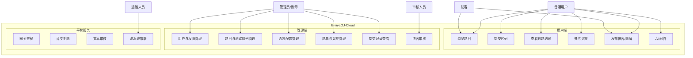

**表 2 — 用例规约：用户提交代码并查看判题结果**

| 项目 | 内容 |
| --- | --- |
| 用例名称 | 用户提交代码并查看判题结果 |
| 功能简述 | 登录用户在用户端选择题目和编程语言，提交源代码，系统异步判题后返回包含 11 种状态的判题结果 |
| 用例编号 | UC-JUDGE-001 |
| 执行者 | 普通用户（已登录） |
| 前置条件 | 用户已登录；题目存在且已发布（status=1）；目标语言已启用；测试用例已配置（至少包含隐藏用例） |
| 后置条件 | 提交记录保存到 `submission` 表；判题结果（含单用例明细 `submission_case_result` 和汇总 `submission_judge_result`）写入数据库；用户可查询到判题结果 |
| 涉众利益 | 用户希望快速获得准确的判题反馈；管理员希望判题过程安全可控、结果可追溯 |
| 基本路径 | 1. 用户浏览题目详情页；2. 选择编程语言；3. 编辑/粘贴代码；4. 点击提交按钮；5. 系统返回提交编号和 PENDING 状态；6. 系统异步执行判题（获取题目/语言/用例 → 编译 → 逐用例运行 → 输出比对 → 结果汇总）；7. 用户查询提交详情查看判题结果 |
| 扩展路径 | 3a. 提交空代码 → 拒绝并提示；3b. 选择禁用语言 → 拒绝并提示；6a. 编译失败 → 状态 CE，展示编译错误；6b. 用例超时 → 用例标记 TLE，继续执行剩余用例；6c. Go-Judge 不可用 → 状态 SE，记录错误；7a. 用户查询他人详情 → 隐藏代码和隐藏用例信息 |
| 字段列表 | problemId（题目编号）、languageId（语言编号）、code（源代码）、contestId（竞赛编号，可选） |
| 设计规则 | 用户代码必须在 Go-Judge 沙箱中隔离执行；判题过程异步进行；隐藏用例不向普通用户展示 |
| 未解决的问题 | 无 |
| 备注 | 核心演示链路用例 |

**表 3 — 用例规约：管理员审核博客内容**

| 项目 | 内容 |
| --- | --- |
| 用例名称 | 管理员审核博客内容 |
| 功能简述 | 审核人员或管理员在管理端查看待审核的博客/评论内容，执行通过或驳回操作 |
| 用例编号 | UC-MOD-001 |
| 执行者 | 管理员 / 审核人员 |
| 前置条件 | 执行者已登录且具备审核权限；存在待审核（PENDING 或 MANUAL_REVIEW）的博客或评论 |
| 后置条件 | 审核状态更新为 APPROVED 或 REJECTED；审核原因和操作人记录到数据库；通过的内容公开展示，驳回的隐藏 |
| 涉众利益 | 用户希望内容尽快通过审核展示；平台方希望保障内容合规安全 |
| 基本路径 | 1. 管理员登录管理端；2. 进入博客审核页面；3. 查看待审核内容列表；4. 点击内容查看详情；5. 确认合规后点击"通过"，或发现违规后点击"驳回"并填写原因；6. 系统更新审核状态 |
| 扩展路径 | 5a. 内容已被自动审核处理过 → 人工审核可覆盖自动结果 |
| 未解决的问题 | 无 |

### 4.3 性能需求

在线判题系统的性能直接影响用户体验和系统的实用价值。与普通 Web 应用不同，OJ 系统最核心的性能瓶颈不在数据库查询而在**判题执行效率**——每次代码提交都需要经过编译（可选）和全部测试用例的运行，这是一个 CPU 密集和 IO 密集混合的操作。因此，本系统的性能设计围绕"提交快响应、判题异步化、沙箱隔离执行"三条主线展开。

#### 4.3.1 时间特性

| 场景 | 时间要求 |
| --- | --- |
| 登录和普通查询接口 | 正常测试数据量下应在 1 秒内返回 |
| 题目、博客、提交分页查询 | 正常测试数据量下应在 2 秒内返回 |
| 代码提交接口 | 创建提交记录后快速返回提交编号（< 500ms），不等待全部判题完成 |
| 判题任务 | 根据题目时间限制和测试用例数量执行，超时应返回 TLE；单个用例受 Go-Judge 资源限制控制 |
| 审核任务 | RabbitMQ 消费后异步回写；外部审核调用不超过 5 秒，超时或失败进入人工复核 |
| 图片上传/下载 | 受文件大小和网络影响，应在可接受时间内完成 |
| Jenkins 构建部署 | 后端构建 2-5 分钟，镜像构建与容器更新 1-3 分钟 |

#### 4.3.2 适应性

| 适应性要求 | 说明 |
| --- | --- |
| 编程语言扩展 | 通过 `language` 表配置扩展编译和运行命令模板，不修改判题主流程代码 |
| 微服务扩展 | 按 Auth、Problem、Judge、Blog、Chat、Moderation 业务域独立演进，支持独立部署和扩容 |
| 部署环境适配 | 支持本地 Docker Compose（开发联调）和 Jenkins 演示环境，通过环境变量区分配置 |
| 前端适配 | 管理端和用户端均通过 Gateway 统一入口访问后端，不依赖单个微服务地址 |
| 外部服务替换 | AI 服务和文本审核服务通过接口抽象，可替换供应商或降级（如外部不可用时转人工审核兜底） |

### 4.4 界面需求

用户界面是系统与用户交互的直接载体。良好的界面设计不仅关乎用户体验，更直接影响实训答辩时的演示效果。本项目包含管理端和用户端两个独立前端应用，各自面向不同角色和使用场景，在界面设计上遵循以下原则：**管理端**以操作效率为核心，采用左侧菜单导航 + 右侧内容区的经典后台布局，功能入口按业务模块组织，数据展示以表格和表单为主；**用户端**以刷题体验为核心，突出代码编辑器和判题结果展示，界面风格简洁明快，判题状态使用不同颜色标签（绿 AC/红 WA/黄 CE/橙 TLE 等）直观区分。

| 界面 | 需求说明 |
| --- | --- |
| **管理端登录页** | 居中登录表单（用户名、密码、登录按钮）；失败时在表单上方显示红色错误提示 |
| **管理端仪表盘** | 卡片式布局展示系统核心统计指标（用户数、题目数、今日提交数、待审核内容数等） |
| **管理端用户管理** | 顶部搜索/筛选栏（用户名、状态）；分页表格展示用户列表；行内操作：详情、编辑、角色分配、密码重置、启用/禁用 |
| **管理端角色权限** | 角色分页列表；新增/编辑弹窗含角色编码、名称、描述；权限分配使用树形复选框（菜单/按钮/接口三级） |
| **管理端权限管理** | 树形表格展示权限层级（支持展开/折叠）；新增/编辑含父级权限、编码、名称、类型、路径等字段 |
| **管理端题目管理** | 分页表格（标题、难度标签色、状态标签、通过数/提交数）；新增/编辑页面含 Markdown 编辑器和标签多选器 |
| **管理端测试用例** | 题目详情页内嵌 Tab；表格展示用例列表（序号、是否样例、分值）；点击展开输入/输出内容 |
| **管理端语言配置** | 表格展示语言列表；新增/编辑弹窗含名称、版本、编译命令、运行命令、扩展名等字段 |
| **管理端题单管理** | 表格展示题单；详情页可拖拽排序题目 |
| **管理端竞赛管理** | 表格展示竞赛（时间、规则类型标签、状态）；新增/编辑含时间选择器、规则下拉、邀请码；内嵌题目管理和报名管理 |
| **管理端博客审核** | 表格展示待审核内容（类型标签：博客/评论/题解）；操作列含通过/驳回按钮和审核原因输入框 |
| **用户端登录/注册** | 居中表单，支持账号密码登录和注册 |
| **用户端首页** | 顶部搜索栏；题目推荐卡片；最新博客动态列表 |
| **用户端题目列表** | 分页卡片或表格列表；左侧筛选栏（难度、标签）；每行显示标题、难度标签、通过率 |
| **用户端题目详情** | 题面 Markdown 渲染、输入输出说明、样例 Tab 切换、时空限制标签；右侧语言下拉和代码编辑器（语法高亮）；底部提交按钮 |
| **用户端提交记录** | 分页表格（状态标签颜色区分：绿 AC、红 WA、黄 CE/TLE）；点击展开详情（通过用例数、耗时、内存、错误信息） |
| **用户端竞赛页面** | 竞赛卡片列表（标题、时间、状态标签）；详情含题目列表、提交入口、排行榜表格（排名/用户/通过题数/罚时） |
| **用户端博客社区** | 文章卡片列表（标题、摘要、标签、作者、时间、点赞/评论数）；详情页 Markdown 正文、评论列表、点赞/收藏按钮 |
| **用户端 AI 问答** | 类聊天界面：对话历史和输入区域；外部服务异常时展示友好降级提示 |

### 4.5 接口需求

#### 4.5.1 硬件接口

本系统主要为 Web 软件系统，无专用硬件接口。Go-Judge 运行环境需要宿主机或容器平台支持必要的隔离和资源限制能力。

**答：无。**

#### 4.5.2 软件接口

| 接口类型 | 接口对象 | 说明 |
| --- | --- | --- |
| HTTP API | 管理端/用户端 → Gateway | 前端统一访问 Gateway（端口 8080），JSON 格式，认证请求携带 `Authorization: Bearer {token}` |
| Feign（服务间调用） | Judge → Problem | 获取题目详情、测试用例列表、语言配置、竞赛提交校验 |
| Feign（服务间调用） | Moderation → Blog | 回写博客/评论审核结果（携带 X-Moderation-Token 内部令牌） |
| Feign（服务间调用） | Gateway → Auth | 解析 Token，获取用户权限信息 |
| RabbitMQ（消息） | Blog → Moderation | 博客/评论审核任务投递与消费 |
| HTTP REST | Judge → Go-Judge | 提交编译和运行任务（POST /api/judge），传入命令参数、资源限制和文件映射 |
| S3 API | Blog → MinIO | 上传/下载/删除博客图片 |
| HTTP | Chat → 外部 AI 服务 | 调用大模型问答接口（API Key 环境变量注入） |
| HTTP | Moderation → 阿里云文本审核 | 调用内容安全文本审核接口（AK/SK 环境变量注入） |
| CI/CD | Jenkins → Git/Maven/Docker | 自动拉取代码、构建、镜像打包和容器更新 |

### 4.6 其他需求

| 需求类型 | 说明 |
| --- | --- |
| **安全性** | 用户密码采用 BCrypt 不可逆加密存储；JWT + Redis 白名单双重认证（登出即时失效）；管理端 RBAC 权限控制（菜单/按钮/接口三级）；用户代码在 Go-Judge 沙箱中隔离执行；AI Key、阿里云 AK/SK、MinIO 密钥等敏感配置通过环境变量注入，不写入代码仓库；内部审核回写接口通过 X-Moderation-Token 校验调用来源；普通用户不能访问隐藏测试用例、管理接口和他人敏感提交详情 |
| **可维护性** | 后端按 api/dto/service 三层 Maven 子模块组织；公共响应、异常处理、JWT、Redis 等通用能力沉淀在 Common 模块；代码遵循统一的命名规范和包结构（`com.emiyaoj`）；Git 提交遵循 `feat:/fix:/docs:/test:` 规范 |
| **可移植性** | 基于 Docker 容器化部署，可在任何支持 Docker 的操作系统上运行；Java 21 保证跨平台兼容；环境变量方式管理差异配置 |
| **可观测性** | 关键异常、判题、审核、部署失败均有日志记录；Jenkins 流水线保存构建日志和部署截图；Nacos 控制台可查看服务注册状态；各服务提供 Swagger UI 页面 |

---

## 5. 概要设计

### 5.1 处理流程

系统核心处理流程可归纳为四条主线，覆盖了从用户认证到业务执行再到部署交付的完整闭环。以下通过 Mermaid 流程图逐一描述每条主线的逻辑控制流。

#### 5.1.1 登录认证流程

登录认证是系统的安全入口。该流程涉及用户、Gateway 和 Auth Service 三方协作，核心设计思想是**JWT 无状态认证 + Redis 白名单实现主动登出**。JWT 本身不依赖服务端存储，但为了实现"登出后 Token 立即失效"的需求，系统在 Redis 中维护了 Token 白名单。Gateway 在处理每个非白名单请求时，先本地解析 JWT 获取 userId，再查询 Redis 确认该 Token 仍处于白名单中，两步校验均通过后才放行请求。这种设计既保留了 JWT 的无状态优势，又解决了 JWT 无法主动失效的固有问题。

```mermaid
flowchart TD
    A[用户输入账号密码] --> B[Gateway 转发登录请求到 Auth Service]
    B --> C[Auth Service 查询用户信息]
    C --> D{密码和账号状态是否有效}
    D -- 否 --> E[返回登录失败及错误提示]
    D -- 是 --> F[生成 JWT Token]
    F --> G[Redis 写入 Token 白名单]
    G --> H[返回 Token 和用户基本信息]
    H --> I[前端保存 Token]
    I --> J[后续请求携带 Authorization: Bearer {token}]
    J --> K[Gateway 拦截请求]
    K --> L{是否在白名单路径}
    L -- 是 --> M[直接路由到目标服务]
    L -- 否 --> N[解析 JWT 并校验 Redis 白名单]
    N --> O{认证是否通过}
    O -- 否 --> P[返回 401 未认证]
    O -- 是 --> Q[注入 X-User-Id 等请求头]
    Q --> R[转发到下游业务服务]
```

#### 5.1.2 代码提交与判题流程

代码提交与判题是系统的核心业务链路。该流程的设计关键点在于**提交与判题解耦**——提交接口仅负责校验和创建记录，判题过程通过 `@Async` 异步执行。这样设计的优势是：即使判题队列积压或 Go-Judge 响应变慢，用户的提交操作也不会被阻塞，始终能在 500ms 内获得提交编号。判题执行过程中，Judge Service 通过 Feign 从 Problem Service 获取判题所需的全部数据（题目限制、语言命令、测试用例），然后调用 Go-Judge 沙箱逐个执行编译和用例运行。每个测试用例的执行结果独立记录，最终通过汇总算法确定整体判题状态。

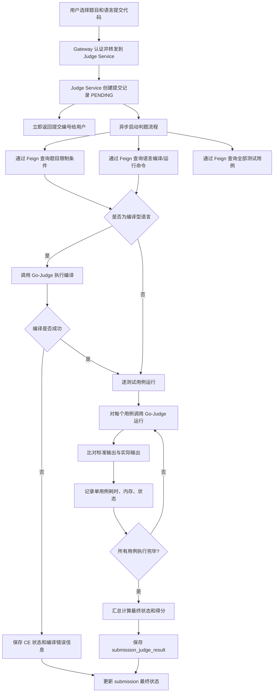

#### 5.1.3 博客审核流程

博客审核流程体现了系统的内容安全管控能力。流程设计的核心思路是**\"发布与审核异步分离\"**——用户发布内容后立即得到\"发布成功\"的反馈，审核过程通过 RabbitMQ 异步消息在后台完成，用户无需等待。Moderation Service 消费审核任务后调用阿里云文本审核 API，根据审核建议将内容标记为通过（APPROVED）、驳回（REJECTED）或人工复核（MANUAL_REVIEW）。管理端审核页面为内容审核人员提供了便捷的人工复核界面，可以覆盖自动审核的结果。回写接口通过 X-Moderation-Token 内部令牌和任务 ID 版本校验，防止未授权访问和旧审核结果覆盖新内容。

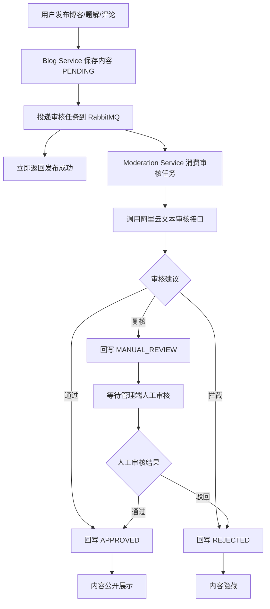

#### 5.1.4 Jenkins 流水线部署流程

Jenkins 流水线是项目交付的自动化保障。通过将代码拉取、Maven 构建、单元测试、Docker 镜像构建、容器更新和健康检查串联为一条自动化流水线，团队可以一键完成从源码到运行环境的全流程部署。流水线的每个阶段都有明确的成功/失败判定标准，失败时自动停止并提供详细的错误日志，极大降低了手动部署的出错概率和排查成本。


### 5.2 总体结构设计

系统采用"前端应用 + API 网关 + 微服务 + 基础设施 + CI/CD"的分层架构。分层设计遵循**上层依赖下层、同层独立部署、跨层通过接口交互**的原则：前端层通过 HTTP 协议访问网关层，网关层通过 Nacos 服务发现将请求路由到业务服务层，业务服务层通过 JDBC/Redis API/S3 API/AMQP 等协议访问基础设施层。每一层都可以独立扩展或替换——例如前端可以从 Nginx 静态部署切换为 CDN 分发而不影响后端，基础设施中的 MySQL 可以从单实例升级为主从集群而无需修改业务服务代码（通过连接池配置透明切换）。

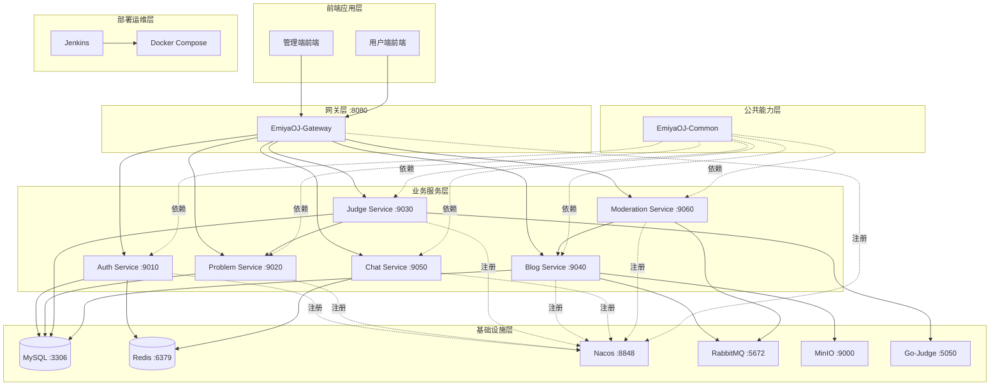

**架构层次说明：**

| 层次 | 组成 | 设计说明 |
| --- | --- | --- |
| 前端应用层 | 管理端、用户端 | 独立前端项目，通过 HTTP API 访问 Gateway，不直接依赖单个微服务地址 |
| 网关层 | EmiyaOJ-Gateway | 统一入口、白名单放行、JWT 解析、Redis Token 白名单校验、用户上下文注入（X-User-Id 等） |
| 业务服务层 | Auth、Problem、Judge、Blog、Chat、Moderation | 按业务域拆分为 6 个独立微服务，各自独立数据库和业务逻辑，通过 Feign 或消息队列跨服务交互 |
| 公共能力层 | EmiyaOJ-Common | 沉淀统一响应、分页对象、JWT 工具、Redis 工具、全局异常处理、OpenAPI 配置等 |
| 基础设施层 | MySQL、Redis、Nacos、RabbitMQ、MinIO、Go-Judge | 支撑数据存储、缓存、注册发现、消息队列、对象存储和代码沙箱 |
| 部署运维层 | Jenkins、Docker Compose | 自动构建、镜像打包、容器更新和健康检查 |

### 5.3 功能设计

| 功能域 | 功能设计摘要 |
| --- | --- |
| **认证网关** | Gateway 完成统一入口和路由转发；Auth Service 完成用户登录/登出、JWT 签发、用户/角色/权限 CRUD、RBAC 控制 |
| **题目竞赛** | Problem Service 统一管理题目、测试用例、标签、语言、题单和竞赛；为 Judge Service 提供 Feign 接口获取判题数据和竞赛校验 |
| **判题提交** | Judge Service 负责接收提交、异步判题（Feign 获取数据 → Go-Judge 编译运行 → 比对输出 → 汇总结果）、提供提交查询 |
| **博客审核** | Blog Service 负责博客/题解/评论/图片/互动；Moderation Service 通过 RabbitMQ 异步审核并回写结果；管理端支持人工审核 |
| **AI 问答** | Chat Service 调用外部 AI 大模型接口返回回答，API Key 环境变量管理，异常时友好降级 |
| **部署运维** | Docker Compose 编排所有服务；Jenkins 流水线固化构建→镜像→部署→检查全流程 |

**功能模块结构图：**

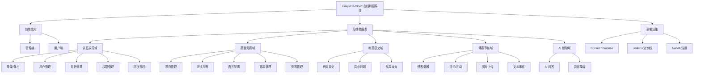

### 5.4 数据流转设计

**数据流转总览：**

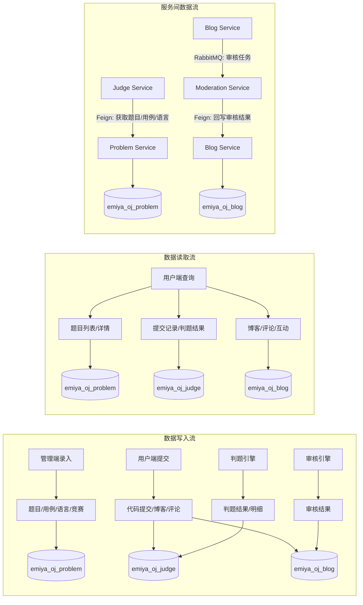

**数据流说明：**

| 数据流 | 流转说明 |
| --- | --- |
| 用户上下文 | Auth → JWT → Redis 白名单 → Gateway 解析校验 → 注入 X-User-Id 请求头 → 下游服务 |
| 题目数据 | 管理端 → emiya_oj_problem；用户端查询公开题目；Judge Service 通过 Feign 内部读取 |
| 判题数据 | 用户提交 → emiya_oj_judge（submission）；Judge → Go-Judge → 写入明细和汇总 |
| 竞赛数据 | Problem → 维护竞赛/题目/报名；Judge → Feign 校验提交；排行榜基于提交结果统计 |
| 博客数据 | Blog → emiya_oj_blog；审核状态控制可见性 |
| 审核数据 | Blog → RabbitMQ → Moderation → 阿里云审核 → Feign 回写 Blog |
| 部署数据 | Jenkins 构建日志 → Docker Compose 容器状态 → Nacos 注册实例 |

### 5.5 用户界面设计

系统包含管理端和用户端两个独立前端，概要设计如下：

| 界面分组 | 主要页面 | 设计说明 |
| --- | --- | --- |
| **管理端** | 登录页、仪表盘、用户管理、角色管理、权限管理、题目管理、测试用例、语言配置、题单管理、竞赛管理、提交记录、博客审核 | 以后台管理效率为主，菜单按业务模块组织，操作入口受 RBAC 权限控制；登录失败显示红色错误提示 |
| **用户端** | 登录/注册、首页、题目列表、题目详情、代码提交、提交记录、竞赛列表、竞赛详情、排行榜、博客列表、博客详情、AI 问答 | 以刷题流程为主，突出题目浏览、提交代码和查看结果；判题状态以颜色标签区分（绿 AC/红 WA/黄 CE 等） |

### 5.6 数据结构设计

数据结构按业务域分库，降低耦合。分库策略的核心依据是**数据访问模式**——认证数据被所有服务高频读取但写入极少，适合独立的读优化库；题目数据被 Judge Service 在判题时整批读取（获取全部测试用例和语言配置），适合批量查询；判题数据是系统最高频的写入数据（每次提交产生多条用例结果写入），需要独立的写入优化库；博客数据包含大文本字段（正文内容）和审核状态字段，读写混合且需要全文检索潜力，独立分库有利于后续优化。

| 数据库 | 核心表 | 设计说明 |
| --- | --- | --- |
| `emiya_oj_auth` | `user`、`role`、`permission`、`user_role`、`role_permission`、`operation_log` | 认证授权和操作日志；用户-角色多对多，角色-权限多对多；权限支持树形层级 |
| `emiya_oj_problem` | `problem`、`test_case`、`tag`、`problem_tag`、`language`、`problem_set`、`problem_set_problem`、`contest`、`contest_problem`、`contest_registration`、`contest_admin` | 题目、语言、题单和竞赛；多对多关系均通过中间表维护 |
| `emiya_oj_judge` | `submission`、`submission_case_result`、`submission_judge_result` | 提交记录和判题结果；一次提交对应多条用例明细和一条汇总 |
| `emiya_oj_blog` | `blog`、`blog_comment`、`blog_like`、`blog_star`、`blog_picture`、`blog_tag`、`blog_tag_association`、`user_blog` | 博客社区和审核状态；用户统计通过触发器维护 |

**设计约束：** utf8mb4 字符集、逻辑删除优先、审计字段标配、服务间不跨库直查。

### 5.7 接口设计

系统接口设计遵循 RESTful 风格，以前后端分离和微服务间协作为核心目标。接口分为外部接口（面向前端和第三方服务）和内部接口（微服务之间以及微服务与基础设施之间），二者在设计原则上有明确区分：外部接口注重易用性和向后兼容，统一返回 `ResponseResult<T>` 结构；内部接口注重性能和安全性，如审核回写接口要求携带内部令牌、判题数据获取接口需要返回完整的隐藏用例数据。

#### 5.7.1 外部接口

| 接口对象 | 说明 |
| --- | --- |
| 管理端/用户端 → Gateway | 所有前端请求通过 HTTP 统一访问 Gateway（:8080），JSON 格式，认证携带 Bearer Token |
| Chat → 外部 AI 服务 | 调用 AI 大模型问答 API，API Key 通过 `CHAT_API_KEY` 环境变量注入 |
| Moderation → 阿里云文本审核 | 通过阿里云 SDK 调用文本审核接口，AK/SK 环境变量注入 |
| Jenkins → Git/Maven/Docker | 流水线自动拉取代码、构建、镜像打包和容器更新 |

#### 5.7.2 内部接口

| 调用关系 | 方式 | 说明 |
| --- | --- | --- |
| Gateway → 各业务服务 | HTTP 路由转发 | 按路径前缀转发，注入 X-User-Id 等请求头 |
| Judge → Problem | Feign | 获取题目、测试用例、语言配置、竞赛校验 |
| Moderation → Blog | Feign | 回写审核结果（含 X-Moderation-Token 校验） |
| Blog → RabbitMQ → Moderation | 异步消息 | 审核任务投递与消费 |
| Judge → Go-Judge | HTTP REST | 编译和运行代码（POST /api/judge） |
| Blog → MinIO | S3 API | 图片上传/下载/删除 |

**统一响应格式：** 所有 JSON 接口返回 `{"code": 200, "message": "...", "data": {...}, "success": true}`。

### 5.8 错误/异常处理设计

统一的错误/异常处理机制是保障系统健壮性和用户体验的基础。本项目的异常处理设计遵循**"分类捕获、统一响应、日志追踪"**三大原则：业务代码中根据异常类型抛出对应的自定义异常（如 `BadRequestException`、`CustomerAuthenticationException`），由 Common 模块中的 `GlobalExceptionHandler` 全局拦截并转换为统一 JSON 响应；未预期的运行时异常由兜底处理器捕获，返回通用系统错误提示并记录完整堆栈日志。这种设计使得前端只需关注统一响应体的 `code` 和 `message` 字段即可完成错误提示，无需感知后端异常类型。

#### 5.8.1 错误/异常输出信息

| 异常类型 | 输出信息 | HTTP 状态码 |
| --- | --- | --- |
| 未认证（无 Token） | `{"code": 401, "message": "未登录或登录已过期"}` | 401 |
| Token 过期/无效 | `{"code": 401, "message": "Token无效或已过期"}` | 401 |
| 权限不足 | `{"code": 403, "message": "无权限访问该资源"}` | 403 |
| 参数校验失败 | `{"code": 400, "message": "参数校验失败: {具体原因}"}` | 400 |
| 业务异常 | `{"code": {错误码}, "message": "{中文提示}"}` | 200/400 |
| 系统异常 | `{"code": 500, "message": "系统繁忙，请稍后重试"}` | 500 |

#### 5.8.2 错误/异常处理对策

| 异常场景 | 对策 |
| --- | --- |
| Token 失效 | 前端拦截 401，清理 Token 跳转登录页 |
| Go-Judge 不可用/超时 | 提交标记 SE，记录 `error_message`，日志记录堆栈 |
| RabbitMQ 不可用 | 内容保持 PENDING，恢复后继续消费积压消息；管理端可人工审核兜底 |
| AI 服务异常 | 返回"AI 服务暂时不可用"友好提示，不影响判题主链路 |
| Docker 资源不足 | 分批启动核心服务，优先保证 Gateway/Auth/Problem/Judge |
| Jenkins 部署失败 | 根据阶段日志定位（Git/Maven/Docker/环境变量），Jenkins 控制台输出详细错误 |
| Nacos 注册失败 | 检查服务日志、Nacos 地址、容器网络连通性 |

### 5.9 系统配置策略

| 配置类型 | 策略 |
| --- | --- |
| 敏感配置 | AI Key、阿里云 AK/SK、MinIO 密钥、数据库密码、JWT 密钥 → 环境变量或 Jenkins Credentials 注入 |
| 服务地址 | Nacos/MySQL/Redis/RabbitMQ/MinIO 地址按本地（localhost）和 Docker（容器名）环境区分 |
| 权限配置 | 基础角色权限通过 SQL 初始化脚本预置，后续管理端动态维护 |
| 白名单配置 | 登录、公开题目、公开博客、Swagger 路径在 Gateway 配置中维护 |
| 判题配置 | 语言编译/运行命令模板、资源限制存储在 `language` 表中，管理端动态调整 |

### 5.10 系统部署方案

本项目的部署设计覆盖了从开发联调到演示验收的完整生命周期。三种部署方案针对不同使用场景进行了优化：

| 方案 | 说明 |
| --- | --- |
| **本地 Docker Compose** | 开发联调：启动所有基础设施和业务服务；各服务通过容器名互相访问；支持 IDE 中断点调试单个服务 |
| **Jenkins 流水线** | 演示验收：自动拉取代码 → Maven 构建 → 单元测试 → Docker 镜像构建 → Compose 容器更新 → 健康检查 |
| **分批启动** | 资源不足时：第一批（MySQL/Redis/Nacos），第二批（Gateway/Auth/Problem/Judge），第三批（Blog/Moderation/Chat/MinIO/RabbitMQ） |

**本地 Docker Compose 方案**是团队成员日常开发的首选。在 `docker-compose.yml` 中，所有基础设施服务配置了健康检查（`healthcheck`），业务服务通过 `depends_on` 声明了启动依赖顺序。例如，Auth Service 依赖 MySQL 和 Redis 先启动并通过健康检查。数据卷（`volumes`）将 MySQL 数据、Redis 数据、MinIO 文件持久化到宿主机目录，容器重启后数据不丢失。开发模式下，成员可以将正在修改的服务从 Compose 中移除，改为 IDE 本地启动（通过 `spring.cloud.nacos.discovery.ip` 注册为宿主机 IP），其余依赖服务仍通过 Compose 运行，实现了"1 个服务本地调试 + N 个服务容器运行"的高效开发体验。

**Jenkins 流水线方案**是答辩演示的部署保障。流水线中的每个 Stage 都有明确的成功/失败判定：Maven 构建失败则停止后续步骤、单元测试未通过则标记构建为 UNSTABLE、Docker 镜像构建失败则输出 Dockerfile 检查提示、容器更新后通过 `docker ps` 和 `curl` 逐一验证服务可用性。流水线参数化支持选择构建分支（main/develop）和部署目标（本地/演示服务器），灵活适配不同场景。敏感配置（数据库密码、API Key）存储在 Jenkins Credentials 中，流水线执行时自动注入，全程不在控制台或日志中明文显示。

### 5.11 跨端应用架构设计

| 端 | 架构说明 |
| --- | --- |
| 管理端 | 面向管理员/教师/审核人员；调用 Auth/Problem/Judge/Blog/Moderation 接口 |
| 用户端 | 面向普通用户/参赛用户；调用 Auth/Problem/Judge/Blog/Chat 接口 |
| Gateway | 对两端提供统一 API 入口（:8080），避免前端直接依赖微服务地址 |
| 部署端 | 管理端和用户端独立构建（Nginx 静态资源或前端容器），通过环境变量配置 Gateway 地址 |

### 5.12 其他相关技术与方案

| 技术/方案 | 说明 |
| --- | --- |
| OpenAPI/Swagger | SpringDoc OpenAPI 2.8.6 自动生成接口文档；各服务独立 Swagger UI 页面支撑联调 |
| MyBatis-Plus | 3.5.16 版本，提供分页插件、逻辑删除（`@TableLogic`）、自动填充审计字段 |
| RabbitMQ | 3.13-management，direct/topic 交换机路由审核消息；手动确认保证可靠消费 |
| MinIO | S3 兼容对象存储；Blog Service 通过 Java SDK 操作；图片按用户维度分目录 |
| Go-Judge | 独立 Docker 容器；支持 CPU/内存/进程数/输出大小多维资源限制 |
| Jenkins | Pipeline 流水线固化构建部署流程；参数化构建支持分支选择；凭据管理敏感配置 |

上述技术与方案在本项目中的具体应用说明如下：

**OpenAPI/Swagger** 方面，每个业务服务的 `*-service` 模块均配置了 SpringDoc，在开发阶段通过 `http://localhost:{端口}/swagger-ui.html` 访问独立文档页面。Gateway 也聚合了各服务的 Swagger 文档地址，便于团队在联调阶段快速查阅接口定义。接口文档的自动生成减少了前后端沟通成本——前端开发人员只需查看 Swagger 页面即可了解所有接口的请求路径、参数类型和响应结构。

**MyBatis-Plus** 在本项目中承担了主要的数据库访问职责。分页插件通过拦截器自动将 `PageDTO` 转换为 MyBatis-Plus 的 `Page` 对象并执行物理分页，避免了大量重复的分页代码。逻辑删除功能通过 `@TableLogic` 注解实现——所有 DELETE 操作被自动转换为 UPDATE deleted=1，SELECT 操作自动附加 WHERE deleted=0 条件，业务代码中无需关心删除逻辑。自动填充功能用于 `createTime`、`updateTime`、`createBy`、`updateBy` 等审计字段。

**RabbitMQ** 在博客审核链路中扮演了关键角色。Blog Service 作为消息生产者，将审核任务投递到 `moderation.queue` 队列；Moderation Service 作为消息消费者，通过 `@RabbitListener` 注解监听队列并处理任务。消息采用手动确认模式（`acknowledgeMode = MANUAL`），只有当审核接口调用成功且回写 Blog 成功后，消息才会被确认并从队列中移除。若处理失败，消息会重新入队或进入死信队列，确保审核任务不丢失。

**MinIO** 为博客图片提供了高性能的对象存储方案。相比于将图片直接存储在 MySQL 或本地文件系统，MinIO 的优势在于：支持 S3 兼容的 REST API，便于后续迁移到云存储；内置了 Web 管理控制台（端口 9001），可直接预览和下载上传的文件；支持 Bucket 级别的访问策略配置。Blog Service 中封装了 `MinioTemplate` 工具类，统一管理 Bucket 初始化、文件上传下载和预签名 URL 生成。

**Go-Judge** 是判题安全的核心保障。其 REST API 设计简洁而强大——通过 `Cmd` 结构指定执行命令、环境变量、资源限制（CPU 时间、真实时间、内存、进程数）和文件映射。Judge Service 中的 `GoJudgeService` 封装了与 Go-Judge 的 HTTP 通信细节，将语言配置中的编译/运行命令模板填充参数后构造为 Go-Judge 请求，并解析 Go-Judge 返回的执行结果（状态、退出码、时间、内存、输出文件内容）。

**Jenkins** 流水线将构建、测试和部署串联为自动化流程。流水线脚本采用声明式语法，清晰定义了每个 Stage 的执行步骤和失败处理。在 Jenkins Credentials 中集中管理了 Git 仓库凭据、数据库密码、AI API Key 等敏感信息，流水线执行时通过环境变量注入到构建和部署步骤中，杜绝了凭据泄露风险。

---

## 6. 数据库设计

数据库设计是系统设计的重要环节，直接影响数据完整性、查询性能和系统可扩展性。本项目遵循"**业务域分库、服务内直连、跨域接口调用**"的核心设计原则——认证、题目、判题、博客四个业务域各自独立数据库，每个微服务仅直连自身数据库，跨域数据访问必须通过 Feign 或消息队列接口完成。这种设计从根本上杜绝了"多个服务争抢同一数据库连接池"和"某服务的低效查询拖慢其他服务"的问题，也为后续数据库独立扩容（如对高频写入的 emiya_oj_judge 单独升级硬件或增加只读副本）奠定了基础。

在表结构设计上，遵循以下统一规范：所有表使用 `utf8mb4` 字符集以支持中文和特殊字符；核心业务表采用逻辑删除（`deleted` 字段 + MyBatis-Plus `@TableLogic` 自动处理）；审计字段（`create_time`、`update_time`、`create_by`、`update_by`）覆盖所有核心表，支撑操作追踪和数据恢复；ID 生成策略根据表特性在 MyBatis-Plus ASSIGN_ID（雪花算法）和 AUTO_INCREMENT 之间选择——ASSIGN_ID 适用于分布式场景下的高频插入表（如 submission），AUTO_INCREMENT 适用于管理端维护的低频表（如 role、permission）。

### 6.1 分库方案

系统按业务域分为 4 个独立数据库，各微服务仅直接访问本服务所属数据库：

| 数据库 | 所属服务 | 核心表数量 | 设计目的 |
| --- | --- | --- | --- |
| `emiya_oj_auth` | Auth Service | 6 | 隔离认证授权数据 |
| `emiya_oj_problem` | Problem Service | 11 | 管理题库、语言、题单和竞赛数据 |
| `emiya_oj_judge` | Judge Service | 3 | 承载提交和判题结果的高频写入 |
| `emiya_oj_blog` | Blog Service | 8 | 管理博客社区、图片和审核状态 |

### 6.2 全局 ER 图

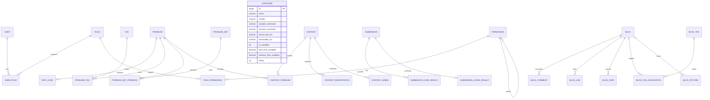

### 6.3 认证数据库（emiya_oj_auth）

#### 6.3.1 user 表

| 字段名 | 类型 | 说明 | 约束 |
| --- | --- | --- | --- |
| `id` | bigint | 用户唯一编号 | PK, ASSIGN_ID |
| `username` | varchar(64) | 用户名（登录账号） | NOT NULL, UNIQUE |
| `password` | varchar(256) | 密码（BCrypt 加密） | NOT NULL |
| `nickname` | varchar(64) | 昵称 | |
| `email` | varchar(128) | 邮箱 | UNIQUE |
| `phone` | varchar(20) | 手机号 | |
| `avatar` | varchar(512) | 头像地址 | |
| `status` | int | 状态：0-禁用, 1-启用 | NOT NULL, DEFAULT 1 |
| `deleted` | int | 逻辑删除：0-未删除, 1-已删除 | NOT NULL, DEFAULT 0 |
| `create_time` | datetime | 创建时间 | NOT NULL |
| `update_time` | datetime | 更新时间 | |
| `create_by` | bigint | 创建人 | |
| `update_by` | bigint | 更新人 | |

#### 6.3.2 role 表

| 字段名 | 类型 | 说明 | 约束 |
| --- | --- | --- | --- |
| `id` | bigint | 角色编号 | PK, AUTO |
| `role_code` | varchar(64) | 角色编码 | NOT NULL, UNIQUE |
| `role_name` | varchar(64) | 角色名称 | NOT NULL |
| `description` | varchar(256) | 角色描述 | |
| `status` | int | 状态：0-禁用, 1-启用 | DEFAULT 1 |
| `deleted` | int | 逻辑删除 | DEFAULT 0 |
| `create_time` | datetime | 创建时间 | |
| `update_time` | datetime | 更新时间 | |
| `create_by` | bigint | 创建人 | |
| `update_by` | bigint | 更新人 | |

#### 6.3.3 permission 表

| 字段名 | 类型 | 说明 | 约束 |
| --- | --- | --- | --- |
| `id` | bigint | 权限编号 | PK, AUTO |
| `parent_id` | bigint | 父权限编号（树形结构） | |
| `permission_code` | varchar(128) | 权限编码 | NOT NULL, UNIQUE |
| `permission_name` | varchar(64) | 权限名称 | NOT NULL |
| `permission_type` | int | 类型：1-菜单, 2-按钮, 3-接口 | NOT NULL |
| `path` | varchar(256) | 路径或接口 URL | |
| `component` | varchar(256) | 前端组件路径 | |
| `icon` | varchar(64) | 图标 | |
| `sort_order` | int | 排序 | |
| `status` | int | 状态 | DEFAULT 1 |
| `deleted` | int | 逻辑删除 | DEFAULT 0 |
| `create_time` | datetime | 创建时间 | |
| `update_time` | datetime | 更新时间 | |
| `create_by` | bigint | 创建人 | |
| `update_by` | bigint | 更新人 | |

#### 6.3.4 user_role 表

| 字段名 | 类型 | 说明 | 约束 |
| --- | --- | --- | --- |
| `id` | bigint | 编号 | PK |
| `user_id` | bigint | 用户编号 | NOT NULL |
| `role_id` | bigint | 角色编号 | NOT NULL |
| `create_time` | datetime | 创建时间 | |
| `create_by` | bigint | 创建人 | |

- 联合唯一索引：(user_id, role_id)

#### 6.3.5 role_permission 表

| 字段名 | 类型 | 说明 | 约束 |
| --- | --- | --- | --- |
| `role_id` | bigint | 角色编号 | PK（联合） |
| `permission_id` | bigint | 权限编号 | PK（联合） |
| `create_time` | datetime | 创建时间 | |

#### 6.3.6 operation_log 表

| 字段名 | 类型 | 说明 |
| --- | --- | --- |
| `id` | bigint | 日志编号，PK |
| `user_id` | bigint | 操作用户 |
| `operation` | varchar(128) | 操作名称 |
| `method` | varchar(256) | 请求方法 |
| `params` | text | 请求参数 |
| `ip` | varchar(64) | IP 地址 |
| `create_time` | datetime | 操作时间 |

### 6.4 题目数据库（emiya_oj_problem）

#### 6.4.1 problem 表

| 字段名 | 类型 | 说明 | 约束 |
| --- | --- | --- | --- |
| `id` | bigint | 题目编号 | PK |
| `title` | varchar(256) | 题目标题 | NOT NULL |
| `description` | text | 题目描述（Markdown） | |
| `input_description` | text | 输入说明 | |
| `output_description` | text | 输出说明 | |
| `sample_input` | text | 样例输入 | |
| `sample_output` | text | 样例输出 | |
| `hint` | text | 提示 | |
| `difficulty` | int | 难度：1-简单, 2-中等, 3-困难 | |
| `time_limit` | int | 时间限制（ms） | |
| `memory_limit` | int | 内存限制（KB） | |
| `stack_limit` | int | 栈限制 | |
| `source` | varchar(256) | 题目来源 | |
| `author_id` | bigint | 作者编号 | |
| `accept_count` | int | 通过次数 | DEFAULT 0 |
| `submit_count` | int | 提交次数 | DEFAULT 0 |
| `status` | int | 状态：0-隐藏, 1-公开 | DEFAULT 1 |
| `deleted` | int | 逻辑删除 | DEFAULT 0 |
| `create_time` | datetime | 创建时间 | |
| `update_time` | datetime | 更新时间 | |
| `create_by` | bigint | 创建人 | |
| `update_by` | bigint | 更新人 | |

#### 6.4.2 test_case 表

| 字段名 | 类型 | 说明 | 约束 |
| --- | --- | --- | --- |
| `id` | bigint | 用例编号 | PK |
| `problem_id` | bigint | 题目编号 | NOT NULL |
| `input` | text | 输入内容 | |
| `output` | text | 期望输出 | |
| `is_sample` | int | 是否样例：0-隐藏, 1-样例 | DEFAULT 0 |
| `score` | int | 分值 | |
| `sort_order` | int | 排序 | |
| `deleted` | int | 逻辑删除 | DEFAULT 0 |
| `create_time` | datetime | 创建时间 | |
| `update_time` | datetime | 更新时间 | |

#### 6.4.3 language 表

| 字段名 | 类型 | 说明 | 约束 |
| --- | --- | --- | --- |
| `id` | bigint | 语言编号 | PK |
| `name` | varchar(64) | 语言名称 | NOT NULL |
| `version` | varchar(32) | 语言版本 | |
| `compile_command` | varchar(512) | 编译命令模板 | |
| `execute_command` | varchar(512) | 运行命令模板 | |
| `source_file_ext` | varchar(16) | 源文件扩展名 | |
| `executable_ext` | varchar(16) | 可执行文件扩展名 | |
| `is_compiled` | int | 是否编译型：0-否, 1-是 | |
| `time_limit_multiplier` | decimal | 时间限制倍率 | |
| `memory_limit_multiplier` | decimal | 内存限制倍率 | |
| `status` | int | 状态：0-禁用, 1-启用 | DEFAULT 1 |
| `create_time` | datetime | 创建时间 | |
| `update_time` | datetime | 更新时间 | |

#### 6.4.4 tag 表

| 字段名 | 类型 | 说明 |
| --- | --- | --- |
| `id` | bigint | 标签编号，PK |
| `name` | varchar(64) | 标签名称 |
| `description` | varchar(256) | 描述 |
| `color` | varchar(16) | 颜色 |
| `create_time` | datetime | 创建时间 |
| `update_time` | datetime | 更新时间 |

#### 6.4.5 problem_tag 表

| 字段名 | 类型 | 说明 |
| --- | --- | --- |
| `id` | bigint | 编号，PK |
| `problem_id` | bigint | 题目编号 |
| `tag_id` | bigint | 标签编号 |
| `create_time` | datetime | 创建时间 |

#### 6.4.6 problem_set 表

| 字段名 | 类型 | 说明 |
| --- | --- | --- |
| `id` | bigint | 题单编号，PK |
| `title` | varchar(256) | 题单标题 |
| `description` | text | 题单描述 |
| `status` | int | 状态：0-隐藏, 1-公开 |
| `create_by` | bigint | 创建人 |
| `create_time` | datetime | 创建时间 |
| `update_time` | datetime | 更新时间 |

#### 6.4.7 problem_set_problem 表

| 字段名 | 类型 | 说明 |
| --- | --- | --- |
| `id` | bigint | 编号，PK |
| `problem_set_id` | bigint | 题单编号 |
| `problem_id` | bigint | 题目编号 |
| `sort_order` | int | 排序 |
| `create_time` | datetime | 创建时间 |

#### 6.4.8 contest 表

| 字段名 | 类型 | 说明 |
| --- | --- | --- |
| `id` | bigint | 竞赛编号，PK |
| `title` | varchar(256) | 竞赛标题 |
| `description` | text | 竞赛描述 |
| `rule_type` | int | 规则：1-ACM/ICPC, 2-IOI, 3-Codeforces |
| `start_time` | datetime | 开始时间 |
| `end_time` | datetime | 结束时间 |
| `freeze_time` | datetime | 封榜时间 |
| `invite_code` | varchar(64) | 邀请码 |
| `status` | int | 状态：0-隐藏, 1-公开 |
| `deleted` | int | 逻辑删除 |
| `create_by` | bigint | 创建人 |
| `create_time` | datetime | 创建时间 |
| `update_time` | datetime | 更新时间 |

#### 6.4.9 contest_problem 表

| 字段名 | 类型 | 说明 |
| --- | --- | --- |
| `id` | bigint | 编号，PK |
| `contest_id` | bigint | 竞赛编号 |
| `problem_id` | bigint | 题目编号 |
| `problem_alias` | varchar(16) | 题目标号（如 A, B, C） |
| `score` | int | 分值 |
| `sort_order` | int | 排序 |
| `create_time` | datetime | 创建时间 |

#### 6.4.10 contest_registration 表

| 字段名 | 类型 | 说明 |
| --- | --- | --- |
| `id` | bigint | 编号，PK |
| `contest_id` | bigint | 竞赛编号 |
| `user_id` | bigint | 用户编号 |
| `status` | int | 报名状态 |
| `create_time` | datetime | 报名时间 |

#### 6.4.11 contest_admin 表

| 字段名 | 类型 | 说明 |
| --- | --- | --- |
| `id` | bigint | 编号，PK |
| `contest_id` | bigint | 竞赛编号 |
| `user_id` | bigint | 管理员编号 |
| `create_time` | datetime | 创建时间 |

### 6.5 判题数据库（emiya_oj_judge）

#### 6.5.1 submission 表

| 字段名 | 类型 | 说明 | 约束 |
| --- | --- | --- | --- |
| `id` | bigint | 提交编号 | PK |
| `problem_id` | bigint | 题目编号 | NOT NULL |
| `user_id` | bigint | 用户编号 | NOT NULL |
| `language_id` | bigint | 语言编号 | NOT NULL |
| `contest_id` | bigint | 竞赛编号（可为空） | |
| `code` | text | 源代码 | NOT NULL |
| `status` | int | 判题状态：0-PENDING 到 10-PA | NOT NULL |
| `score` | int | 得分 | |
| `time_used` | int | 最大耗时（ms） | |
| `memory_used` | int | 最大内存（KB） | |
| `error_message` | text | 错误信息 | |
| `compile_message` | text | 编译信息 | |
| `pass_rate` | decimal | 通过率 | |
| `deleted` | int | 逻辑删除 | DEFAULT 0 |
| `create_time` | datetime | 提交时间 | |
| `update_time` | datetime | 更新时间 | |

#### 6.5.2 submission_case_result 表

| 字段名 | 类型 | 说明 |
| --- | --- | --- |
| `id` | bigint | 编号，PK |
| `submission_id` | bigint | 提交编号 |
| `test_case_id` | bigint | 测试用例编号 |
| `status` | int | 用例状态 |
| `time_used` | int | 耗时（ms） |
| `memory_used` | int | 内存（KB） |
| `error_message` | text | 错误信息 |
| `create_time` | datetime | 创建时间 |

#### 6.5.3 submission_judge_result 表

| 字段名 | 类型 | 说明 |
| --- | --- | --- |
| `id` | bigint | 编号，PK |
| `submission_id` | bigint | 提交编号 |
| `status` | int | 汇总状态 |
| `score` | int | 得分 |
| `compile_output` | text | 编译输出 |
| `judge_message` | text | 判题信息 |
| `create_time` | datetime | 创建时间 |

### 6.6 博客数据库（emiya_oj_blog）

#### 6.6.1 blog 表

| 字段名 | 类型 | 说明 | 约束 |
| --- | --- | --- | --- |
| `id` | bigint | 博客编号 | PK |
| `user_id` | bigint | 作者编号 | NOT NULL |
| `problem_id` | bigint | 关联题目编号（题解） | |
| `title` | varchar(256) | 标题 | NOT NULL |
| `content` | text | 正文 | NOT NULL |
| `audit_status` | int | 审核状态：0-PENDING, 1-APPROVED, 2-REJECTED, 3-MANUAL_REVIEW | DEFAULT 0 |
| `audit_reason` | varchar(512) | 审核原因 | |
| `audit_time` | datetime | 审核时间 | |
| `audit_user_id` | bigint | 审核人 | |
| `deleted` | int | 逻辑删除 | DEFAULT 0 |
| `create_time` | datetime | 创建时间 | |
| `update_time` | datetime | 更新时间 | |

#### 6.6.2 blog_comment 表

| 字段名 | 类型 | 说明 | 约束 |
| --- | --- | --- | --- |
| `id` | bigint | 评论编号 | PK |
| `blog_id` | bigint | 博客编号 | NOT NULL |
| `user_id` | bigint | 评论人 | NOT NULL |
| `content` | text | 评论内容 | NOT NULL |
| `parent_comment_id` | bigint | 父评论编号 | |
| `audit_status` | int | 审核状态 | DEFAULT 0 |
| `audit_reason` | varchar(512) | 审核原因 | |
| `audit_time` | datetime | 审核时间 | |
| `deleted` | int | 逻辑删除 | DEFAULT 0 |
| `create_time` | datetime | 创建时间 | |
| `update_time` | datetime | 更新时间 | |

#### 6.6.3 blog_like 表

| 字段名 | 类型 | 说明 |
| --- | --- | --- |
| `id` | bigint | 编号，PK |
| `blog_id` | bigint | 博客编号 |
| `user_id` | bigint | 用户编号 |
| `create_time` | datetime | 点赞时间 |

#### 6.6.4 blog_star 表

| 字段名 | 类型 | 说明 |
| --- | --- | --- |
| `id` | bigint | 编号，PK |
| `blog_id` | bigint | 博客编号 |
| `user_id` | bigint | 用户编号 |
| `create_time` | datetime | 收藏时间 |

#### 6.6.5 blog_picture 表

| 字段名 | 类型 | 说明 |
| --- | --- | --- |
| `url` | varchar(512) | 图片 URL/路径，PK |
| `user_id` | bigint | 上传者 |
| `original_name` | varchar(256) | 原始文件名 |
| `content_type` | varchar(64) | MIME 类型 |
| `size` | bigint | 文件大小 |
| `deleted` | int | 逻辑删除 |
| `create_time` | datetime | 上传时间 |

#### 6.6.6 blog_tag 表

| 字段名 | 类型 | 说明 |
| --- | --- | --- |
| `id` | bigint | 标签编号，PK |
| `tag` | varchar(64) | 标签名称 |
| `desc` | varchar(256) | 描述 |

#### 6.6.7 blog_tag_association 表

| 字段名 | 类型 | 说明 |
| --- | --- | --- |
| `id` | bigint | 编号，PK |
| `blog_id` | bigint | 博客编号 |
| `tag_id` | bigint | 标签编号 |

#### 6.6.8 user_blog 表

| 字段名 | 类型 | 说明 |
| --- | --- | --- |
| `user_id` | bigint | 用户编号，PK |
| `username` | varchar(64) | 用户名 |
| `nickname` | varchar(64) | 昵称 |
| `blog_count` | int | 博客数 |
| `star_count` | int | 收藏数 |
| `create_time` | datetime | 创建时间 |

### 6.7 设计约束总结

| 约束 | 说明 |
| --- | --- |
| 字符集 | 所有数据库和表使用 `utf8mb4`，支持中文和 Emoji 等特殊字符 |
| 逻辑删除 | 核心业务表使用 `deleted` 字段（0/1），MyBatis-Plus `@TableLogic` 自动处理 |
| 审计字段 | 核心表保留 `create_time`、`update_time`、`create_by`、`update_by` |
| 数据隔离 | 各微服务只能访问自己所属数据库；跨域数据通过 Feign 或消息队列获取 |
| ID 策略 | 使用 MyBatis-Plus ASSIGN_ID（雪花算法）或 AUTO_INCREMENT |
| 命名规范 | 表名和字段名使用小写下划线（snake_case） |

---

## 7. 手机端侧部署设计

### 7.1 手机环境需求

EmiyaOJ-Cloud 为 Web 应用系统，前端通过浏览器访问。当前实训阶段未开发独立的手机端 App。管理端和用户端前端页面采用响应式布局或独立移动端适配后，可在手机浏览器中访问。

移动端浏览器访问的核心要求：

| 需求项 | 说明 |
| --- | --- |
| 网络连通 | 手机需与后端 Gateway 处于同一网络或可访问的公网环境 |
| 浏览器支持 | 支持主流移动浏览器（Chrome、Safari、微信内置浏览器等） |
| 屏幕适配 | 前端页面需做响应式设计或提供移动端专用布局 |
| HTTPS | 生产环境建议使用 HTTPS 保证 Token 传输安全 |

**当前实训阶段结论：手机端部署不作为本次实训的交付重点，前端页面以桌面端浏览器为主要适配目标。后续可扩展移动端适配或开发独立 App。**

---

## 8. 详细设计

本章对各功能模块进行逐一详述，每个模块按照"功能描述 → 性能描述 → 输入 → 输出 → 程序逻辑 → 限制条件"六要素展开。程序逻辑采用 Mermaid 流程图直观展示模块内部的算法的控制流和判定分支。详细设计阶段的重点在于将概要设计中的模块职责转化为可编码实现的具体方案，明确每个模块的数据边界、处理步骤和约束条件，为后续编码实现提供无歧义的依据。

### 8.1 认证网关功能模块

#### 8.1.1 功能描述

完成用户登录、登出、JWT 签发与校验、Redis Token 白名单管理、Gateway 统一鉴权、路由转发和用户上下文注入。Gateway 作为系统唯一入口，对白名单路径（登录、公开题目、公开博客等）直接放行，对其他路径校验 Bearer Token 的合法性和 Redis 白名单状态。Auth Service 负责用户、角色、权限的完整生命周期管理。

认证网关模块是系统安全体系的第一道防线。在微服务架构中，若每个服务各自实现认证逻辑，不仅代码重复，更可能导致认证策略不一致的安全漏洞。因此，本项目将所有认证逻辑集中在 Gateway 的 `AuthGlobalFilter` 中统一处理——该过滤器实现了 `GlobalFilter` 和 `Ordered` 接口，在请求路由到业务服务之前完成全部认证校验。认证通过后，Gateway 通过修改请求头（ServerWebExchange.mutate().request().header()）的方式向下游服务注入用户上下文，下游服务只需从请求头中读取 X-User-Id 即可获取当前用户身份，无需关心认证细节。这种"网关认证、服务消费"的模式是微服务安全的最佳实践。

#### 8.1.2 性能描述

Gateway 不处理复杂业务逻辑，仅进行轻量级 JWT 解析和 Redis 查询；登录、鉴权和普通权限查询应在 1 秒内返回。

#### 8.1.3 输入

- 登录：username、password
- 鉴权：Authorization 请求头中的 Bearer Token
- 用户管理：userSaveDTO（账号、密码、昵称、邮箱、状态等）
- 角色管理：roleSaveDTO（角色编码、名称、描述、状态）
- 权限管理：permissionSaveDTO（父级、编码、名称、类型、路径等）

#### 8.1.4 输出

- JWT Token、用户信息、权限摘要
- 统一响应体（code/message/data/success）
- 下游请求头注入：X-User-Id、X-User-Name、X-User-Roles

#### 8.1.5 程序逻辑

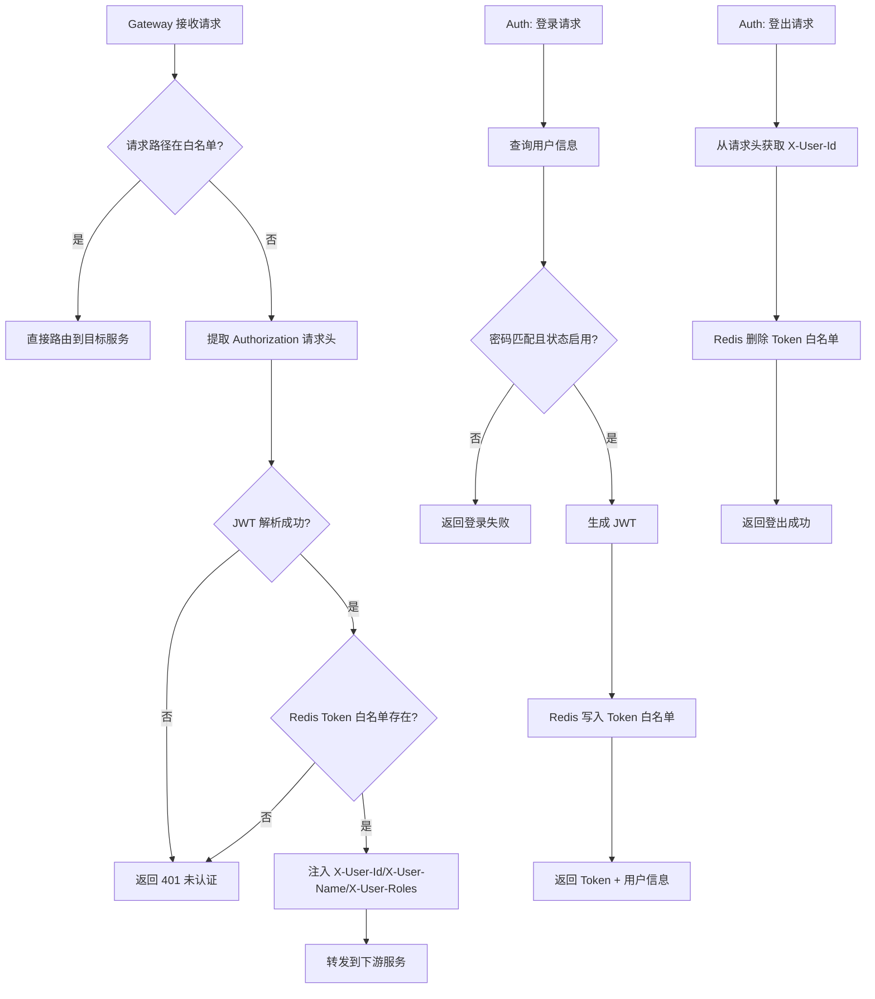

#### 8.1.6 限制条件

- Redis 不可用会影响 Token 白名单校验，导致所有非白名单请求被拒绝
- 管理接口必须具备管理员角色权限
- 前端必须通过 Gateway 访问后端，不能直接请求业务服务
- JWT 密钥必须通过环境变量配置，不写入代码仓库

### 8.2 用户角色权限功能模块

#### 8.2.1 功能描述

管理用户、角色、权限树、用户-角色关系和角色-权限关系。支撑管理端菜单、按钮和接口三级权限控制。用户可绑定多个角色，角色可绑定多个权限。权限编码全局唯一，支持树形层级（父子关系）。管理端根据当前用户权限集合控制可见菜单和可操作按钮。

#### 8.2.2 性能描述

用户、角色、权限列表应支持分页或树形加载，避免一次返回过多数据。权限树通过 parent_id 递归组装。

#### 8.2.3 输入

- 用户资料、角色编码、权限编码、菜单路径、按钮标识、绑定关系

#### 8.2.4 输出

- 用户分页列表、角色分页列表、权限树、绑定结果、操作日志

#### 8.2.5 程序逻辑

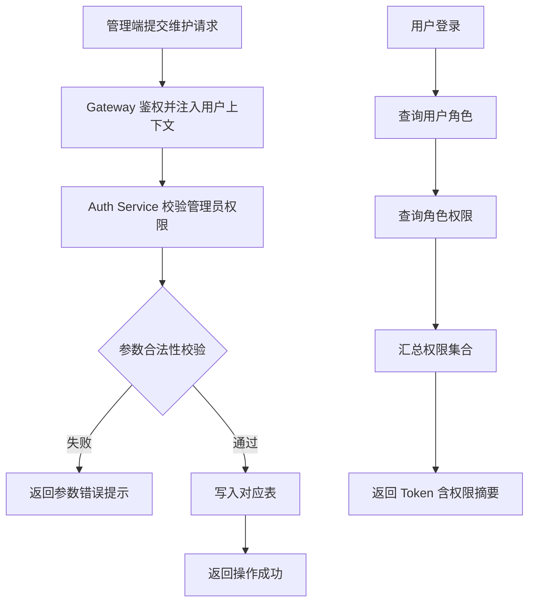

#### 8.2.6 限制条件

- 权限编码应保持全局唯一
- 禁用用户不可登录
- 删除角色或权限前需考虑已有绑定关系

### 8.3 题目管理功能模块

#### 8.3.1 功能描述

管理题目标题、描述（Markdown）、输入输出说明、难度、标签、时间限制、内存限制和发布状态。管理员可创建、编辑、删除、发布和禁用题目。用户端按公开状态和筛选条件分页查询题目。

#### 8.3.2 性能描述

题目列表按分页查询（默认每页 20 条）；详情接口不返回隐藏用例以减少敏感数据暴露。

#### 8.3.3 输入

- 题目基础字段（title、description、inputDescription、outputDescription、sampleInput、sampleOutput、hint、difficulty、timeLimit、memoryLimit）
- 标签绑定：tagIds 列表
- 分页和筛选条件

#### 8.3.4 输出

- 题目分页列表（PageVO\<ProblemVO\>）
- 题目详情（含样例用例、标签、不包含隐藏用例）
- 操作结果

#### 8.3.5 程序逻辑

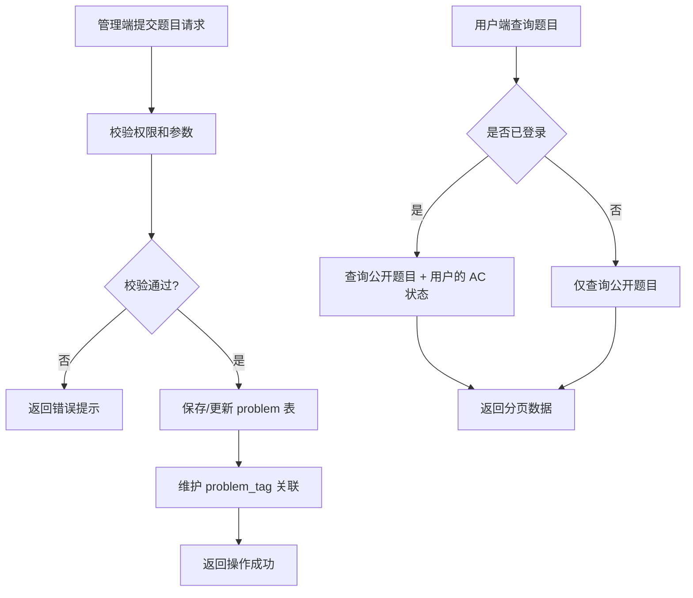

#### 8.3.6 限制条件

- 已被题单、竞赛或提交引用的题目删除需谨慎（逻辑删除，保留引用关系）
- 隐藏测试用例不得通过公开接口返回
- 标题必填，时空限制必须为正数

### 8.4 测试用例与语言配置功能模块

#### 8.4.1 功能描述

**测试用例**：维护样例用例（用户端可查看输入输出）和隐藏用例（仅判题时使用）。用例支持排序和分值设置。

**语言配置**：管理编程语言的名称、版本、源文件扩展名、编译命令模板、运行命令模板和资源限制倍率。用户端仅展示已启用语言列表。

#### 8.4.2 性能描述

测试用例仅在题目详情页和判题内部接口按需返回；语言列表返回全部启用语言（数据量小）。

#### 8.4.3 输入

- 测试用例：problemId、input、output、isSample、score、sortOrder
- 语言：name、version、compileCommand、executeCommand、sourceFileExt、executableExt、isCompiled、timeLimitMultiplier、memoryLimitMultiplier、status

#### 8.4.4 输出

- 样例用例数据（公开）
- 全部测试用例（判题内部接口）
- 启用语言列表
- 操作结果

#### 8.4.5 程序逻辑

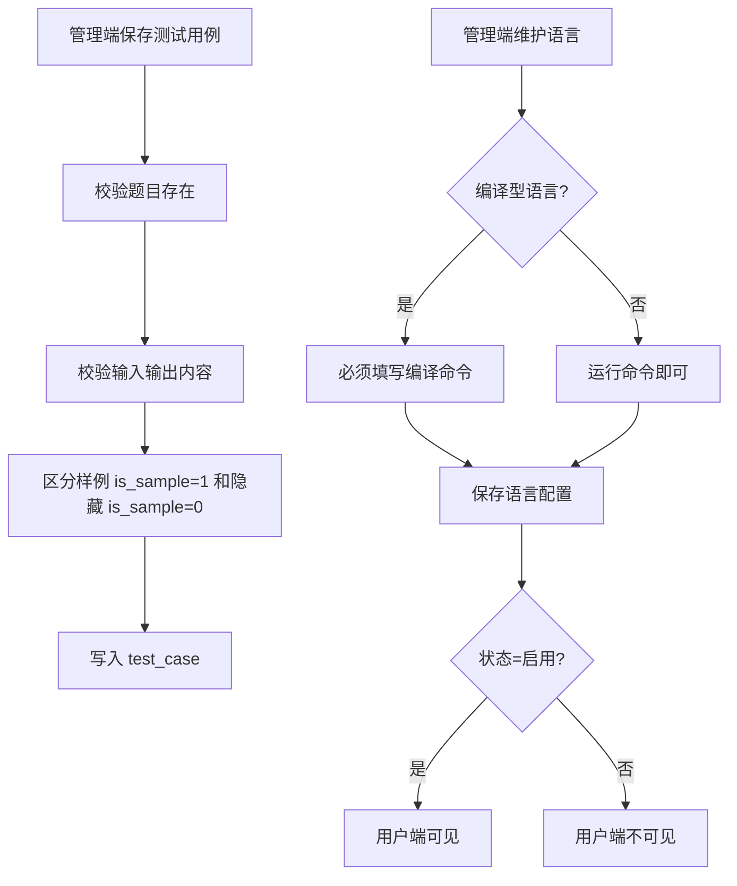

#### 8.4.6 限制条件

- 编译型语言必须配置编译命令
- 测试用例为空会影响判题（无法比对）
- 禁用语言不可用于提交
- 用户端语言列表仅返回 status=1 的语言

### 8.5 题单竞赛功能模块

#### 8.5.1 功能描述

**题单**：管理员创建专题题单并关联题目（支持排序），设置公开/隐藏状态。用户端按顺序练习。

**竞赛**：管理员创建竞赛并设置时间范围、规则类型（ACM/ICPC/IOI/Codeforces）、邀请码和状态。管理竞赛题目（别名/分值/排序）、报名用户和管理员。Judge Service 提交前通过 Feign 调用校验接口。

#### 8.5.2 性能描述

竞赛列表、题单列表和排行榜应分页或按竞赛范围查询，避免大范围数据扫描。

#### 8.5.3 输入

- 题单：title、description、status、题目编号列表及排序
- 竞赛：title、description、ruleType、startTime、endTime、freezeTime、inviteCode、status
- 报名：contestId、inviteCode

#### 8.5.4 输出

- 题单详情（含排序后的题目列表）
- 竞赛详情、报名结果、排行榜
- Judge Service 提交校验结果（允许/拒绝及原因）

#### 8.5.5 程序逻辑

**竞赛提交校验流程：**

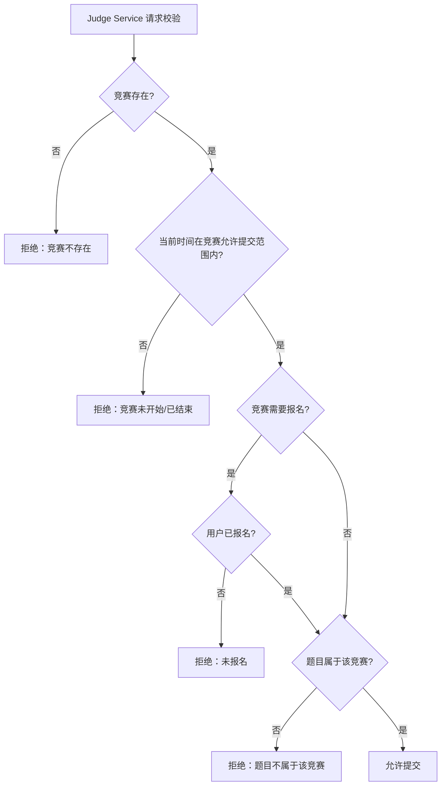

#### 8.5.6 限制条件

- 竞赛时间、报名状态和题目关联必须同时满足
- 未报名、未开始、已结束或非竞赛题目的提交应被拒绝
- 封榜期间非管理员查看排行榜应按规则隐藏部分结果

### 8.6 代码提交功能模块

#### 8.6.1 功能描述

接收用户提交的题目编号、语言编号、源代码和可选竞赛编号，进行业务校验后创建提交记录，并触发异步判题流程。提交接口立即返回提交编号和 PENDING 状态，不阻塞等待判题完成。

代码提交是判题链路的起点，也是系统并发压力的集中点。在竞赛场景中，数百名用户可能在比赛开始后的几分钟内集中提交代码，因此提交接口的设计必须以"快速响应"为首要原则。本模块通过以下策略保障性能：第一，提交接口仅执行必要的同步校验（登录态、题目存在性、语言启用状态、竞赛资格），校验通过后立即写入数据库并返回，整个同步过程控制在 500ms 以内；第二，耗时操作（判题执行）通过 Spring `@Async` 注解移交到异步线程池处理，线程池大小根据服务器 CPU 核数配置，避免异步任务耗尽系统资源；第三，数据库写入采用 MyBatis-Plus 的单表插入，避免复杂关联查询阻塞提交流程。

#### 8.6.2 性能描述

提交接口应快速返回提交编号（< 500ms），判题过程异步执行不长时间阻塞前端请求。

#### 8.6.3 输入

| 字段 | 类型 | 说明 |
| --- | --- | --- |
| `problemId` | Long | 题目编号 |
| `languageId` | Long | 编程语言编号 |
| `code` | String | 用户源代码 |
| `contestId` | Long（可选） | 竞赛编号 |

#### 8.6.4 输出

- `submissionId`（提交编号）
- 初始状态（PENDING）
- 提交时间

#### 8.6.5 程序逻辑

```mermaid
flowchart TD
    A[接收提交请求] --> B[校验登录态]
    B --> C[校验题目存在且已发布]
    C --> D[校验语言已启用]
    D --> E{是否竞赛提交?}
    E -- 是 --> F[调用 Problem Service 竞赛校验]
    F --> G{校验通过?}
    G -- 否 --> H[返回拒绝原因]
    E -- 否 --> I[创建 submission PENDING]
    G -- 是 --> I
    I --> J[保存到数据库]
    J --> K[返回 submissionId]
    K --> L[@Async 启动判题执行流程]
```

#### 8.6.6 限制条件

- 代码不能为空或超长
- 禁用语言、无效题目和不可提交的竞赛应被拒绝
- 用户代码必须在 Go-Judge 沙箱中执行

### 8.7 判题执行功能模块

#### 8.7.1 功能描述

异步执行完整的判题流程：通过 Feign 从 Problem Service 获取题目限制、语言配置和测试用例；调用 Go-Judge 沙箱完成编译（编译型语言）和逐用例运行；比对标准输出和实际输出；保存单用例结果（submission_case_result）和汇总结果（submission_judge_result）；更新 submission 最终状态。

判题执行模块是系统技术复杂度最高的模块，需要协调服务间调用、沙箱通信、文件管理、结果计算和状态更新等多个环节。在架构设计上，Judge Service 通过 ProblemFeignClient 从 Problem Service 获取判题数据，这种服务间数据获取方式（而非 Judge Service 直连 Problem 数据库）遵循了微服务"每个服务独享数据库"的原则——Judge Service 不感知 Problem 数据库的表结构和数据分布，仅通过 Feign 接口契约获取所需数据，确保了服务间的低耦合。在 Go-Judge 交互设计上，编译和运行分别调用 Go-Judge 的 `/api/judge` 接口，编译时将源代码文件通过 Base64 编码传入，运行前获取编译产物的 fileId 并注入到运行请求中。输出比对采用字符串严格匹配（trim 首尾空白后比较），竞赛模式下可扩展为按空白字符分隔后逐个 token 比较（适用于忽略多余空格和换行的场景）。

#### 8.7.2 性能描述

按题目时间限制和内存限制执行；超时、超内存和沙箱异常应快速终止并记录。判题优先级建议：CE → SE → RE → TLE → MLE → WA → AC。

#### 8.7.3 输入

- 提交记录（submissionId）
- 题目限制（timeLimit、memoryLimit）
- 语言命令（compileCommand、executeCommand）
- 测试用例（input、output）

#### 8.7.4 输出

- 单用例状态、耗时、内存、实际输出
- 编译输出（CE 场景）
- 汇总状态、得分、通过用例数/总用例数

#### 8.7.5 程序逻辑

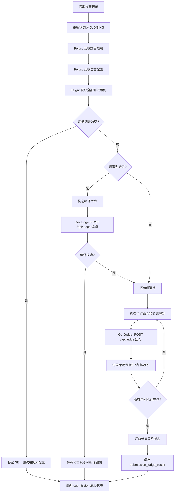

**判题状态判定规则：**

| 状态 | 判定规则 |
| --- | --- |
| AC (Accepted) | 所有测试用例均通过，输出与期望完全匹配 |
| WA (Wrong Answer) | 程序正常结束但输出不匹配 |
| TLE (Time Limit Exceeded) | 单用例运行时间 × 语言倍率 > 题目时间限制 |
| MLE (Memory Limit Exceeded) | 单用例内存 × 语言倍率 > 题目内存限制 |
| CE (Compilation Error) | 编译命令执行失败（非零退出码） |
| RE (Runtime Error) | 运行阶段异常退出（非零退出码或信号终止） |
| SE (System Error) | 题目配置错误、沙箱不可用、Feign 调用失败等 |
| OLE (Output Limit Exceeded) | 用户程序输出超过限制 |
| PA (Partial Accepted) | 部分用例通过（非 ACM 规则下） |

#### 8.7.6 限制条件

- 用户代码必须在 Go-Judge 中隔离执行
- 测试用例为空或沙箱不可用应标记为 SE
- 判题超时应立即终止当前用例并标记 TLE，继续执行剩余用例（或根据规则终止）

### 8.8 提交查询功能模块

#### 8.8.1 功能描述

提供"我的提交"分页列表、提交详情查询和管理端多条件分页查询。提交详情按权限过滤敏感字段：普通用户只能查看自己的完整代码和详细输出；管理员可按条件查询全站提交记录。

#### 8.8.2 性能描述

提交列表必须分页（默认每页 20 条）；详情接口按权限过滤敏感字段，不返回隐藏用例输入/输出给普通用户。

#### 8.8.3 输入

- 提交编号（id）
- 用户编号（userId）
- 题目编号（problemId）
- 竞赛编号（contestId）
- 判题状态（status）
- 分页参数（pageNum、pageSize）

#### 8.8.4 输出

- 提交分页列表（PageVO\<SubmissionVO\>）
- 提交详情（代码、状态标签、通过用例数/总用例数、最大耗时、最大内存、编译信息、错误信息）

#### 8.8.5 程序逻辑

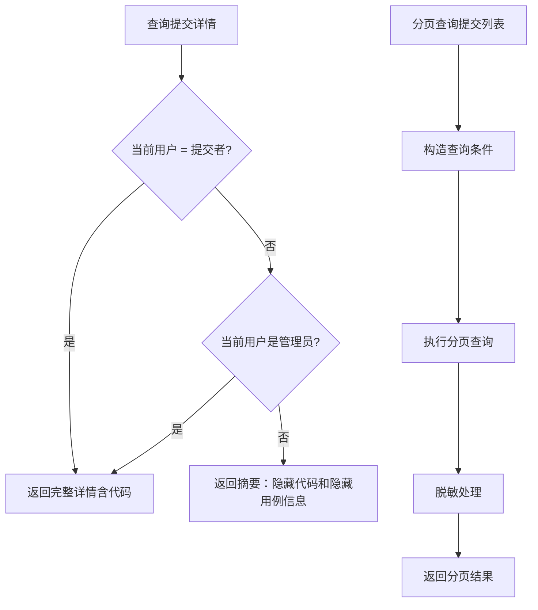

#### 8.8.6 限制条件

- 隐藏用例输入、标准输出和他人代码不得向普通用户公开
- 竞赛期间的代码和结果按竞赛规则限制可见性

### 8.9 博客题解功能模块

#### 8.9.1 功能描述

支持博客和题解发布、编辑、查询、删除，以及评论、点赞、收藏和标签。题解绑定题目编号，同一用户对同一题目只能保留一篇题解。新发布或编辑后的内容进入待审核状态（PENDING）。查询接口按审核状态和权限过滤内容（默认只展示 APPROVED 内容）。

#### 8.9.2 性能描述

博客列表和评论列表分页查询；图片和正文按需加载。

#### 8.9.3 输入

- 发布/编辑：title、content、tagIds、problemId（题解）
- 评论：content、parentCommentId
- 查询：pageNum、pageSize、userId、tagId、auditStatus

#### 8.9.4 输出

- 博客详情（含标签、评论数、点赞数、收藏数）
- 博客分页列表
- 评论分页列表
- 用户博客统计（blogCount、starCount）

#### 8.9.5 程序逻辑

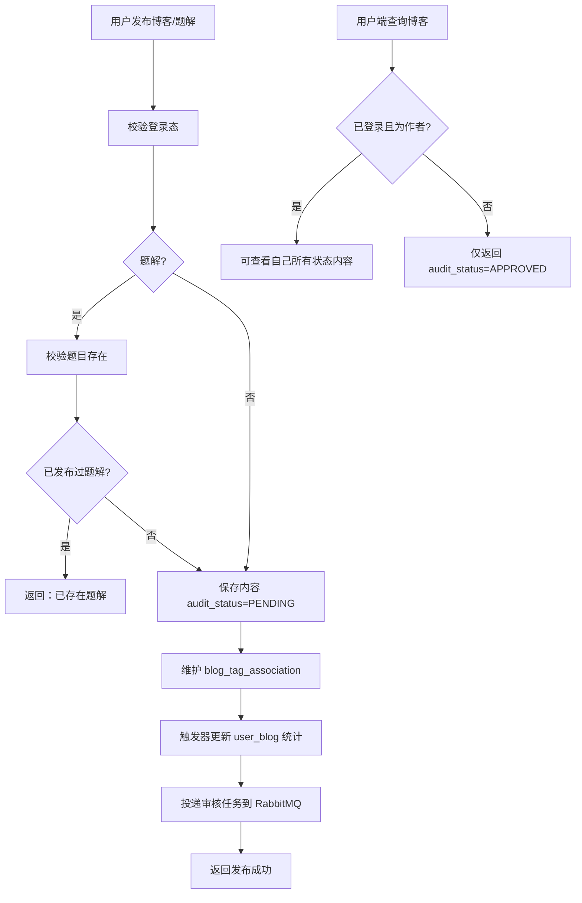

#### 8.9.6 限制条件

- 待审核和驳回内容默认不公开
- 非本人不得编辑或删除他人内容
- 题解同一用户同一题目仅限一篇
- 编辑已通过内容后需重新审核

### 8.10 图片上传功能模块

#### 8.10.1 功能描述

支持博客图片上传到 MinIO 对象存储。数据库保存图片元数据（URL、原始文件名、MIME 类型、大小、上传者）。提供图片下载和删除功能。删除时需校验上传者或管理员权限。

#### 8.10.2 性能描述

图片文件直接通过 MinIO SDK 上传，不经过业务服务中转大文件；接口仅返回和保存元数据。

#### 8.10.3 输入

- 上传：图片文件（multipart/form-data）
- 删除：图片 URL 或 ID

#### 8.10.4 输出

- 图片编号、访问地址（URL）
- 下载结果（文件流或重定向）
- 删除结果

#### 8.10.5 程序逻辑

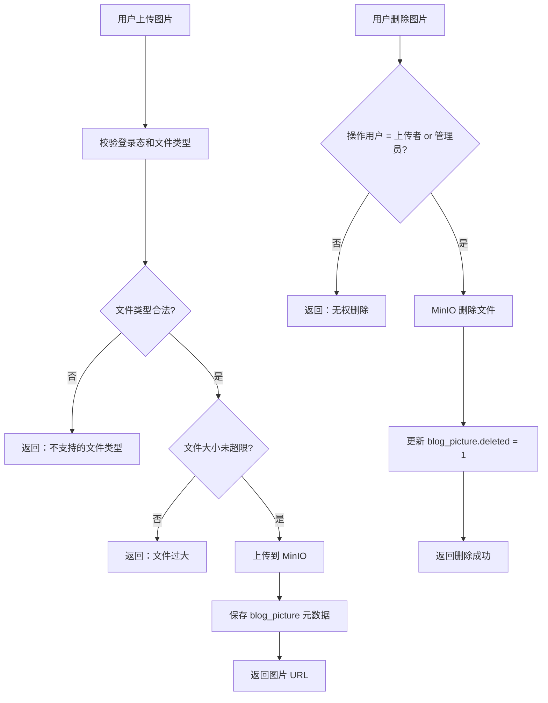

#### 8.10.6 限制条件

- 支持常见图片格式（jpg、png、gif、webp 等）
- 文件大小限制（如单文件 ≤ 10MB）
- MinIO 异常需记录日志并返回友好提示

### 8.11 内容审核功能模块

#### 8.11.1 功能描述

Blog Service 在保存博客/题解/评论后投递审核任务到 RabbitMQ。Moderation Service 消费任务，调用阿里云文本审核接口，生成审核结果后通过内部 Feign 接口回写 Blog Service。管理端支持人工审核（通过/驳回）并覆盖自动审核结果。回写接口需要校验 X-Moderation-Token 内部令牌和任务 ID 新旧。

内容审核模块是社区功能的安全屏障。设计上采用了**\"自动审核 + 人工兜底\"**的双层策略：自动审核通过阿里云内容安全 API 对文本进行涉黄、涉政、涉恐、辱骂等多维度检测，返回建议（pass/block/review）；对于 API 返回 review 建议或 API 调用失败的内容，自动进入 MANUAL_REVIEW 状态，由审核人员在管理端人工判定。模块中还有一项重要的防护设计——**任务版本控制**：当用户编辑已发布的内容后，Blog Service 会生成新的审核任务（携带新的任务 ID 或版本号），Moderation Service 回写结果时需校验任务 ID 是否与当前内容的最新审核任务匹配，若内容已被再次编辑，则旧审核结果被丢弃，从而防止\"审核通过旧内容后覆盖新内容\"的安全漏洞。

#### 8.11.2 性能描述

发布接口不等待外部审核完成；审核结果异步回写。外部审核调用超时或失败时保留原因并进入人工复核。

#### 8.11.3 输入

- 审核任务：内容类型、内容编号、文本内容、审核任务 ID
- 审核结果：审核状态、审核原因/标签
- 内部令牌：X-Moderation-Token

#### 8.11.4 输出

- 审核状态（PENDING → APPROVED / REJECTED / MANUAL_REVIEW）
- 审核原因、审核时间
- 回写结果

#### 8.11.5 程序逻辑

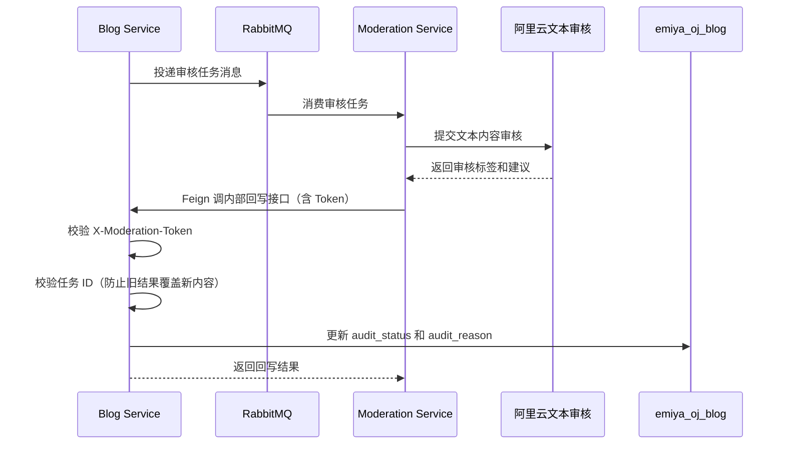

#### 8.11.6 限制条件

- 旧审核结果不得覆盖新内容（通过任务 ID 版本校验）
- 内部回写接口不能对外开放（必须校验 X-Moderation-Token）
- 外部审核不可用时可进入人工复核
- 管理端人工审核可覆盖自动审核结果

### 8.12 AI 聊天功能模块

#### 8.12.1 功能描述

用户端发送编程问题或题目相关问题到 Chat Service。Chat Service 校验问题内容后调用外部 AI 大模型接口（如通义千问 qwen-turbo），返回 AI 回答。支持多轮对话上下文和题目相关信息传递。外部服务不可用时返回友好异常提示。

#### 8.12.2 性能描述

AI 请求受外部服务响应时间影响（通常 2-10 秒）；超时或失败时应快速返回友好提示（5 秒超时）。

#### 8.12.3 输入

- 用户编号（X-User-Id 请求头）
- 问题内容（message）
- 可选上下文：题目编号（problemId）、对话历史（history: List\<ChatMessageDTO\>）

#### 8.12.4 输出

- AI 回答文本
- 错误提示（外部服务不可用时）

#### 8.12.5 程序逻辑

```mermaid
flowchart TD
    A[用户发送 AI 问题] --> B[Gateway 鉴权并转发到 Chat]
    B --> C[Chat: 校验问题非空且长度合法]
    C --> D{CHAT_API_KEY 已配置?}
    D -- 否 --> E[返回：AI 服务暂未配置]
    D -- 是 --> F[构造 AI 请求：系统提示 + 上下文 + 用户问题]
    F --> G[调用外部 AI 接口]
    G --> H{调用成功?}
    H -- 是 --> I[返回 AI 回答]
    H -- 否 --> J[返回：AI 服务暂时不可用，请稍后再试]
```

#### 8.12.6 限制条件

- API Key 不得写入代码库（通过环境变量配置）
- 外部服务不可用不应影响判题主链路
- 空问题或超长问题应被拒绝

### 8.13 Docker Compose 部署功能模块

#### 8.13.1 功能描述

使用 Docker Compose 统一编排和启动系统的全部基础设施和业务服务。所有服务加入 `emiyaoj-network` 自定义网络，通过容器名互相访问。数据卷持久化 MySQL、Redis、RabbitMQ、MinIO 数据。通过环境变量注入各服务的配置。

Docker Compose 是项目开发联调和演示部署的统一基础设施层。在 `docker-compose.yml` 中，每个服务都定义了镜像、端口映射、环境变量、数据卷挂载和健康检查。基础设施服务的启动顺序通过 `depends_on` 和健康检查条件（`condition: service_healthy`）控制——例如 Auth Service 只有在 MySQL 和 Redis 的健康检查通过后才会启动，避免了"数据库未就绪导致服务启动失败"的常见问题。网络隔离方面，所有容器加入 `emiyaoj-network` 桥接网络，业务服务通过容器名（如 `mysql:3306`、`redis:6379`）访问基础设施，无需暴露不必要的端口到宿主机。

#### 8.13.2 性能描述

演示环境资源有限时支持分批启动，优先保证核心链路服务（Gateway、Auth、Problem、Judge）。单个业务服务的容器镜像基于 `eclipse-temurin:21-jre-alpine`，镜像大小约 200MB，启动时间约 10-30 秒。

#### 8.13.3 输入

- Docker Compose 配置文件（docker-compose.yml）
- 各服务 Dockerfile
- 环境变量配置

#### 8.13.4 输出

- 运行中的容器（基础设施 + 7 个业务服务）
- 服务端口可访问
- Nacos 服务注册实例

#### 8.13.5 程序逻辑

```mermaid
flowchart TD
    A[docker compose up -d] --> B[创建网络 emiyaoj-network]
    B --> C[启动基础设施容器]
    C --> C1[MySQL :3306]
    C --> C2[Redis :6379]
    C --> C3[Nacos :8848]
    C --> C4[RabbitMQ :5672/:15672]
    C --> C5[MinIO :9000/:9001]
    C --> C6[Go-Judge :5050]
    C1 --> D{基础设施健康检查通过?}
    C2 --> D
    C3 --> D
    D --> E[启动业务服务容器]
    E --> E1[Gateway :8080]
    E --> E2[Auth :9010]
    E --> E3[Problem :9020]
    E --> E4[Judge :9030]
    E --> E5[Blog :9040]
    E --> E6[Chat :9050]
    E --> E7[Moderation :9060]
    E1 --> F[检查 Nacos 注册状态]
    F --> G[检查 Gateway 端口可访问]
```

#### 8.13.6 限制条件

- Docker 资源不足会影响启动，可分批启动核心服务
- Go-Judge 可能依赖容器 `privileged` 权限
- 数据卷需提前创建或由 Compose 自动创建

### 8.14 Jenkins 流水线功能模块

#### 8.14.1 功能描述

Jenkins 流水线自动拉取后端仓库代码，执行 Maven 构建，拉取并构建前端项目，构建各服务 Docker 镜像，通过 Docker Compose 更新容器，最后检查容器状态、Nacos 注册、Gateway 端口和核心接口可用性。

Jenkins 流水线是本项目 CI/CD 能力的集中体现。流水线采用 Jenkins Pipeline（声明式）语法编写，存储在项目仓库根目录的 `Jenkinsfile` 中，实现了"Pipeline as Code"的理念——流水线配置与代码版本同步，避免了 Jenkins 任务配置漂移的问题。流水线中集成了凭据管理（Credentials Binding），Git 拉取凭据、Docker Hub 登录凭据和部署服务器 SSH 私钥均通过 Jenkins 凭据 ID 引用，全程不在脚本中明文出现。在"构建后操作"阶段，流水线自动归档构建日志（`archiveArtifacts`），并记录每次构建的耗时、成功率和触发人，为实训答辩提供了量化的交付过程数据。

#### 8.14.2 性能描述

构建耗时取决于网络、依赖缓存、镜像构建和服务器资源（总计约 5-15 分钟）。

#### 8.14.3 输入

- Git 仓库地址、分支
- JDK/Maven/Docker 环境配置
- 环境变量和 Jenkins Credentials

#### 8.14.4 输出

- 构建日志
- Jar 包产物
- Docker 镜像
- 容器运行状态
- 部署截图

#### 8.14.5 程序逻辑

```mermaid
flowchart TD
    A[触发 Jenkins 流水线] --> B[拉取后端仓库代码]
    B --> C[Maven clean package]
    C --> D{构建成功?}
    D -- 否 --> E[终止并输出 Maven 错误日志]
    D -- 是 --> F[执行关键单元测试]
    F --> G[拉取管理端和用户端前端仓库]
    G --> H[前端 npm install & build]
    H --> I[构建各服务 Docker 镜像]
    I --> J[docker compose up -d 更新容器]
    J --> K[等待容器启动]
    K --> L[检查容器状态 docker ps]
    L --> M[检查 Nacos 服务注册]
    M --> N[curl 检查 Gateway 健康接口]
    N --> O[保存构建日志和部署截图]
```

#### 8.14.6 限制条件

- Jenkins 用户需要 Git、Maven、Docker 的执行权限
- 敏感配置（数据库密码、API Key 等）应通过 Jenkins Credentials 或环境变量注入
- 构建失败时根据阶段日志快速定位问题

---

## 9. 项目总结

本项目历时 8 天，5 人团队协作完成了 EmiyaOJ-Cloud 在线判题系统的需求分析、系统设计、编码实现、测试验证和部署交付全流程。以下从团队整体视角总结项目经验，各成员的个人收获与反思在后续小节中分别阐述。

**工具选择方面**，团队在项目启动阶段对技术栈进行了审慎评估。后端选择 Spring Cloud 微服务全家桶而非更轻量的 Spring Boot 单体架构，虽然增加了初期学习成本和配置工作量，但换来了服务独立部署、故障隔离和团队并行开发的巨大优势——5 名成员可以各自负责 1-2 个微服务，代码仓库虽有交集但互不阻塞。Docker Compose 作为演示环境编排工具，让"在我的机器上能跑"不再成为团队协作的障碍。Jenkins 流水线的引入虽然在 Day7 才完成配置，但它将部署过程从"手动执行 10+ 条命令"简化为"点击一次构建按钮"，为答辩演示的稳定性和可复现性提供了关键保障。

**系统资源利用方面**，团队面临的最大挑战是在有限的硬件资源（个人电脑 4 核 / 16GB）上运行全部 12+ 个 Docker 容器。解决方案是分批启动策略：先启动 MySQL、Redis、Nacos 三个核心基础设施容器（约占 2GB 内存），再启动 Gateway、Auth、Problem、Judge 四个核心链路服务（约占 3GB 内存），最后按需启动 Blog、Moderation、Chat、MinIO、RabbitMQ、Go-Judge。各成员在本地开发时通常只启动自己负责的 1-2 个服务（其余依赖通过直连公共环境的容器），IDE 中通过断点调试，有效降低了对个人电脑的资源压力。

**项目计划及管理方面**，8 天的实训周期虽然紧张但通过每日同步和严格的模块边界划分得以有效管理。项目经理（成员 A）在 Day1 即制定了详细的进度表和模块分工表，每位成员的职责边界清晰——例如"题目竞赛"由成员 C 独立负责 Problem Service 的全部接口和数据库，"判题服务"由成员 D 独立负责 Judge Service，两个服务之间仅通过 Feign 接口契约耦合。这种高内聚低耦合的分工方式使得各成员可以高度自治地推进开发，减少了沟通成本和代码冲突。每日 10-15 分钟的站会及时暴露了阻塞问题（如 Docker 网络配置、Go-Judge 权限等），项目经理快速协调解决。

**知识学习方面**，本项目为团队成员提供了将课堂理论知识转化为工程实践的机会。成员 A 深入学习了 Spring Cloud Gateway 的过滤器链机制和 Redis 响应式编程模型；成员 B 系统掌握了 JWT + RBAC 的认证授权体系设计与 MyBatis-Plus 的高级查询；成员 C 积累了 RESTful API 设计和竞赛业务建模经验；成员 D 攻克了 Go-Judge 沙箱集成和异步判题引擎的技术难点；成员 E 贯通了 RabbitMQ 消息队列、MinIO 对象存储和外部 API 集成的全链路。团队整体在微服务架构、容器化部署和 CI/CD 方面的能力得到了显著提升。

**小组沟通配合方面**，团队采用了"Git 分支 + Pull Request + 代码评审"的协作模式。每个功能模块在独立的 feature 分支上开发，合并到 develop 分支前由至少一名其他成员进行代码评审。接口联调阶段，团队利用 Swagger UI 和 Apifox 进行前后端接口验证，避免了大量的口头沟通和文档不同步问题。在 Day6-Day7 的集成阶段，团队集中办公，以"联调马拉松"的方式完成了管理端和用户端的全功能链路联调，及时发现并修复了跨服务调用中的接口不匹配和状态不一致问题。

### 9.1 经验成果

#### 9.1.1 成员 A 收获

[待填写：请成员 A 从工具选择、系统资源利用、项目计划及管理、知识学习等方面总结个人收获]

#### 9.1.2 成员 B 收获

[待填写：请成员 B 从工具选择、系统资源利用、项目计划及管理、知识学习等方面总结个人收获]

#### 9.1.3 成员 C 收获

[待填写：请成员 C 从工具选择、系统资源利用、项目计划及管理、知识学习等方面总结个人收获]

#### 9.1.4 成员 D 收获

[待填写：请成员 D 从工具选择、系统资源利用、项目计划及管理、知识学习等方面总结个人收获]

#### 9.1.5 成员 E 收获

[待填写：请成员 E 从工具选择、系统资源利用、项目计划及管理、知识学习等方面总结个人收获]

### 9.2 反思

#### 9.2.1 成员 A 反思

[待填写：请成员 A 从小组沟通配合、技术难点攻克、进度把控、不足与改进等方面进行反思]

#### 9.2.2 成员 B 反思

[待填写：请成员 B 从小组沟通配合、技术难点攻克、进度把控、不足与改进等方面进行反思]

#### 9.2.3 成员 C 反思

[待填写：请成员 C 从小组沟通配合、技术难点攻克、进度把控、不足与改进等方面进行反思]

#### 9.2.4 成员 D 反思

[待填写：请成员 D 从小组沟通配合、技术难点攻克、进度把控、不足与改进等方面进行反思]

#### 9.2.5 成员 E 反思

[待填写：请成员 E 从小组沟通配合、技术难点攻克、进度把控、不足与改进等方面进行反思]

---

**All Rights Reserved**
