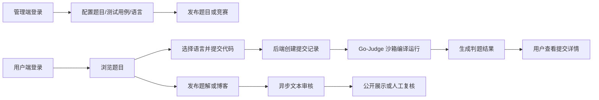

# 《EmiyaOJ-Cloud 在线判题系统》

# 需求规格说明书

版本号：V1.0  
日期：2026 年 5 月 11 日  
项目性质：大学生软件工程实训小组作业  
文档格式：Markdown  

---

## 1. 引言

### 1.1 编写目的

本文档用于描述 EmiyaOJ-Cloud 在线判题系统的业务目标、用户角色、功能需求、非功能需求、部署环境和验收标准，为后续概要设计、详细设计、编码实现、系统测试、部署演示和项目验收提供统一依据。

软件开发小组的每一位成员均应阅读本文档，以明确系统最终应具备的功能、质量要求和交付边界。经小组确认后的需求规格说明书，可作为后续设计评审、测试用例编写、功能验收和答辩说明的重要参考。

### 1.2 适用范围

本文档适用于 EmiyaOJ-Cloud 在线判题系统的实训开发全过程。系统采用前后端分离与微服务架构，完整项目包含：

| 范围 | 说明 |
| --- | --- |
| 管理端前端 | 面向管理员、教师和审核人员，提供用户、权限、题目、语言、竞赛、提交记录、博客审核等管理页面 |
| 用户端前端 | 面向普通用户和参赛用户，提供题目浏览、代码提交、判题结果、竞赛参与、博客社区、AI 问答等页面 |
| 后端微服务 | 当前仓库体现的核心内容，包括网关、认证、题目、判题、博客、聊天、审核、公共模块 |
| 基础设施 | MySQL、Redis、Nacos、RabbitMQ、MinIO、Go-Judge、Docker Compose、Jenkins 流水线 |

需要说明的是，管理端前端和用户端前端不在当前后端仓库中体现，但它们属于完整系统的需求、联调、测试和验收范围。

### 1.3 背景

在线判题系统（Online Judge，OJ）广泛应用于高校程序设计教学、算法训练、竞赛组织和编程能力评测。传统单体式 OJ 系统在功能扩展、服务隔离、判题安全、部署维护方面存在一定限制。本项目基于 Spring Cloud 微服务架构，将认证、题目、判题、博客、AI 辅助和内容审核等能力拆分为多个服务，以提高系统的可维护性、扩展性和演示完整度。

本项目为大学生软件工程实训小组作业，目标是在有限周期内完成一个可运行、可演示、可讲解的在线判题平台，覆盖从管理端配置题目到用户端提交代码、自动判题、结果查询、博客交流和流水线部署的完整业务链路。

### 1.4 术语、定义、缩写

| 术语 | 说明 |
| --- | --- |
| OJ | Online Judge，在线判题系统 |
| 管理端 | 面向管理员、教师和审核人员的后台管理前端 |
| 用户端 | 面向普通用户和参赛用户的在线刷题前端 |
| Gateway | API 网关，统一接收前端请求并转发至后端服务 |
| JWT | JSON Web Token，用于用户认证和身份传递 |
| RBAC | Role-Based Access Control，基于角色的访问控制 |
| Nacos | 服务注册与配置中心 |
| Feign | 微服务之间的声明式 HTTP 调用组件 |
| Go-Judge | 独立判题沙箱，用于编译和运行用户代码 |
| MinIO | 对象存储服务，用于保存博客图片等文件 |
| RabbitMQ | 消息队列，用于异步文本审核任务 |
| Jenkins | 持续集成与流水线部署工具 |
| AC/WA/TLE/CE | 判题状态，分别表示通过、答案错误、超时、编译错误 |

### 1.5 文档概述

本文档在原模板基础上进行重构，去除原示例业务内容，并结合 EmiyaOJ-Cloud 项目的实际功能进行编写。文档主要包括：

| 章节 | 内容 |
| --- | --- |
| 第 1 章 | 文档目的、适用范围、项目背景、术语和参考资料 |
| 第 2 章 | 系统目标、用户特点、角色划分、假定与约束、总体业务流程 |
| 第 3 章 | 按角色和模块描述功能需求 |
| 第 4 章 | 安全、性能、可用性、可维护性、扩展性、兼容性等非功能需求 |
| 第 5 章 | 开发环境、运行环境、前端部署、后端部署、流水线部署和外部依赖 |
| 第 6 章 | 核心业务链路、接口联调、页面联调、部署验证和演示验收标准 |

### 1.6 参考资料

模板文件为 UTF-8 编码，读取时使用如下命令：

```powershell
Get-Content -Encoding UTF8 -Path docs\需求规格说明书模板.md
```

本文档主要参考以下资料：

| 资料 | 说明 |
| --- | --- |
| `docs/需求规格说明书模板.md` | 本文档的章节模板来源 |
| `docs/EmiyaOJ-Cloud系统实施计划.md` | 项目实施范围、人员分工、部署和验收依据 |
| `docs/UML-Diagrams.md` | 用例图、领域模型、微服务架构、ER、时序、部署图 |
| `docs/Judge-Submission-API.md` | 判题提交、判题状态和提交记录查询需求 |
| `docs/Blog-API.md` | 博客、题解、点赞、图片上传等需求 |
| `docs/Blog-Moderation-API.md` | 博客文本审核、审核回写和人工审核需求 |
| `docs/Contest-API.md` | 竞赛、报名、管理员、排行榜和竞赛提交校验需求 |
| `docs/Language-API.md` | 编程语言配置和判题命令模板需求 |
| `docs/ProblemSet-API.md` | 题单创建、查询、题目关联需求 |
| `pom.xml`、`docker-compose.yml`、`sql/*.sql` | 项目模块、技术栈、部署和数据库依据 |

---

## 2. 系统概述

### 2.1 系统目标

EmiyaOJ-Cloud 的总体目标是提供一个面向高校软件工程实训和在线编程训练的综合 OJ 平台。系统应支持管理员维护题库、语言、竞赛和内容审核，支持普通用户在线刷题、提交代码、查看判题结果、参与竞赛、发布题解和博客，并提供 AI 辅助问答能力。

具体目标如下：

| 目标 | 说明 |
| --- | --- |
| 在线编程练习 | 用户可以浏览题目、选择语言、提交代码并查看自动判题结果 |
| 题库管理 | 管理员可以维护题目、测试用例、标签、题单和编程语言配置 |
| 竞赛组织 | 管理员可以创建竞赛、配置题目、管理报名和查看排行榜 |
| 用户与权限管理 | 系统支持用户、角色、权限管理，并通过 RBAC 控制后台功能 |
| 博客社区 | 用户可以发布博客和题解，进行点赞、收藏、评论和图片上传 |
| 内容审核 | 系统对博客和评论进行异步文本审核，并支持人工复核 |
| AI 辅助 | 用户可以通过 AI 聊天服务获取代码问题或题目思路辅助 |
| 自动化部署 | 项目使用 Jenkins 和 Docker Compose 支持自动构建与部署 |

### 2.2 用户特点

系统面向的用户主要包括访客、普通用户、管理员/教师、审核人员和系统运维人员。

| 用户类型 | 特点 | 主要关注点 |
| --- | --- | --- |
| 访客 | 未登录访问系统的用户 | 浏览公开题目、查看公开博客、注册登录 |
| 普通用户 | 已注册并登录的刷题用户 | 刷题、提交代码、查看结果、参与竞赛、发布题解 |
| 管理员/教师 | 负责平台管理和教学组织的用户 | 用户权限、题库、测试用例、语言、竞赛、提交记录 |
| 审核人员 | 负责内容合规处理的用户 | 博客和评论审核、人工复核、驳回原因维护 |
| 运维人员 | 负责部署和环境维护的用户 | Docker 容器状态、Jenkins 构建、服务健康、日志排查 |

### 2.3 角色划分

| 角色 | 权限范围 |
| --- | --- |
| 访客 | 可访问公开题目列表、题目详情、公开博客和登录注册页面 |
| 注册用户 | 拥有用户端功能，包括代码提交、提交记录、竞赛报名、博客互动和 AI 问答 |
| 竞赛管理员 | 可维护自己创建或被授权管理的竞赛、竞赛题目和报名用户 |
| 平台管理员 | 可进入管理端，维护用户、角色、权限、题目、语言、题单、竞赛、提交记录和博客标签 |
| 内容审核员 | 可处理博客、评论的审核状态和人工复核结果 |
| 系统运维人员 | 可查看部署、流水线、服务状态和基础设施运行情况 |

### 2.4 假定与约束

| 类型 | 内容 |
| --- | --- |
| 项目周期 | 项目按照大学生软件工程实训周期推进，核心功能应优先保证可演示 |
| 小组规模 | 开发小组共 5 人，按系统实施计划中的成员 A 至成员 E 分工 |
| 仓库边界 | 当前仓库主要体现后端微服务，两个前端项目作为独立项目参与联调 |
| 技术约束 | 后端使用 Java 21、Spring Boot、Spring Cloud、MyBatis-Plus、MySQL、Redis 等技术 |
| 部署约束 | 本地和演示环境优先使用 Docker Compose，流水线部署使用 Jenkins |
| 安全约束 | 判题执行必须通过 Go-Judge 沙箱隔离，不允许后端直接执行用户代码 |
| 外部依赖 | AI 问答、阿里云文本审核等能力依赖外部 API Key 和第三方服务可用性 |

### 2.5 系统总体业务流程

系统核心业务流程如下：



---

## 3. 功能需求

### 3.1 总体功能模块框架

系统总体功能可划分为前端应用、后端服务和部署运维三类模块。

| 类别 | 模块 | 主要功能 |
| --- | --- | --- |
| 前端应用 | 管理端 | 登录、仪表盘、用户管理、角色权限、题目管理、语言管理、题单、竞赛、提交记录、博客审核 |
| 前端应用 | 用户端 | 题目浏览、题目详情、代码提交、提交记录、竞赛参与、排行榜、博客社区、AI 问答 |
| 后端服务 | 网关服务 | 统一入口、路由转发、JWT 校验、用户上下文注入 |
| 后端服务 | 认证服务 | 登录登出、用户、角色、权限、Token 解析 |
| 后端服务 | 题目服务 | 题目、测试用例、标签、语言、题单、竞赛 |
| 后端服务 | 判题服务 | 代码提交、异步判题、结果汇总、提交查询 |
| 后端服务 | 博客服务 | 博客、题解、评论、点赞、收藏、图片上传、标签 |
| 后端服务 | 审核服务 | 文本审核任务消费、第三方审核调用、审核结果回写 |
| 后端服务 | AI 聊天服务 | 用户对话、代码问题辅助、题目相关问答 |
| 部署运维 | Jenkins 流水线 | 代码拉取、构建、镜像打包、容器部署、健康检查 |

### 3.2 登录、登出与认证

#### 3.2.1 用户登录

系统应支持用户通过账号和密码登录。登录成功后，系统返回 JWT Token 和用户基础信息，前端后续请求应携带 Token 访问受保护资源。

| 需求编号 | 需求描述 |
| --- | --- |
| FR-AUTH-001 | 系统应支持用户输入用户名和密码进行登录 |
| FR-AUTH-002 | 系统应校验用户账号状态、密码正确性和登录权限 |
| FR-AUTH-003 | 登录成功后，系统应生成 JWT Token，并将 Token 写入 Redis 白名单 |
| FR-AUTH-004 | 登录成功后，前端应根据用户权限展示对应菜单和功能入口 |
| FR-AUTH-005 | 登录失败时，系统应返回明确错误提示，不暴露密码等敏感信息 |

#### 3.2.2 用户登出

系统应支持用户主动登出。登出后，当前 Token 应失效，用户回到登录页面或未登录状态。

| 需求编号 | 需求描述 |
| --- | --- |
| FR-AUTH-006 | 用户应可以在管理端或用户端主动退出登录 |
| FR-AUTH-007 | 登出时系统应删除 Redis 中对应 Token 白名单记录 |
| FR-AUTH-008 | 登出后再次访问受保护接口时，系统应拒绝请求 |

#### 3.2.3 网关认证与用户上下文

系统应通过 Gateway 统一完成认证入口控制。

| 需求编号 | 需求描述 |
| --- | --- |
| FR-GW-001 | 网关应支持白名单路径放行，例如登录、公开题目、公开博客等接口 |
| FR-GW-002 | 网关应从请求头提取 Bearer Token 并校验其有效性 |
| FR-GW-003 | 网关应校验 Redis Token 白名单，支持主动登出后 Token 失效 |
| FR-GW-004 | 认证通过后，网关应向下游服务注入用户 ID、用户名、权限等上下文信息 |
| FR-GW-005 | 认证失败时，网关应返回未授权响应 |

### 3.3 管理端功能需求

管理端面向管理员、教师和审核人员，提供平台后台管理能力。

#### 3.3.1 用户管理

| 需求编号 | 需求描述 |
| --- | --- |
| FR-ADMIN-USER-001 | 管理员应可以分页查询用户列表，并按用户名、状态等条件筛选 |
| FR-ADMIN-USER-002 | 管理员应可以查看用户详情 |
| FR-ADMIN-USER-003 | 管理员应可以新增、编辑、删除用户 |
| FR-ADMIN-USER-004 | 管理员应可以重置用户密码 |
| FR-ADMIN-USER-005 | 管理员应可以启用或禁用用户 |
| FR-ADMIN-USER-006 | 管理员应可以为用户分配角色 |
| FR-ADMIN-USER-007 | 管理员应可以查询用户拥有的权限和角色 |

#### 3.3.2 角色与权限管理

| 需求编号 | 需求描述 |
| --- | --- |
| FR-ADMIN-RBAC-001 | 管理员应可以维护角色信息，包括新增、修改、删除、启用和禁用 |
| FR-ADMIN-RBAC-002 | 管理员应可以为角色分配权限 |
| FR-ADMIN-RBAC-003 | 管理员应可以维护权限树，支持菜单、按钮、接口等权限类型 |
| FR-ADMIN-RBAC-004 | 系统应根据用户权限控制管理端菜单和操作按钮 |
| FR-ADMIN-RBAC-005 | 系统应支持判断指定用户是否拥有某项权限或角色 |

#### 3.3.3 题目管理

| 需求编号 | 需求描述 |
| --- | --- |
| FR-ADMIN-PROBLEM-001 | 管理员应可以创建题目，填写标题、描述、输入输出说明、样例、提示、难度、时间限制、内存限制等信息 |
| FR-ADMIN-PROBLEM-002 | 管理员应可以编辑、删除和查询题目 |
| FR-ADMIN-PROBLEM-003 | 管理员应可以维护题目标签，并为题目绑定标签 |
| FR-ADMIN-PROBLEM-004 | 管理员应可以维护题目状态，控制题目是否对用户端可见 |
| FR-ADMIN-PROBLEM-005 | 题目信息应支持分页查询和条件筛选 |

#### 3.3.4 测试用例管理

| 需求编号 | 需求描述 |
| --- | --- |
| FR-ADMIN-CASE-001 | 管理员应可以为题目新增测试用例 |
| FR-ADMIN-CASE-002 | 管理员应可以批量维护题目的测试用例 |
| FR-ADMIN-CASE-003 | 管理员应可以设置测试用例是否为样例 |
| FR-ADMIN-CASE-004 | 管理员应可以设置测试用例分值和排序 |
| FR-ADMIN-CASE-005 | 隐藏测试用例的输入、输出和实际结果不应在用户端公开展示 |

#### 3.3.5 编程语言配置

| 需求编号 | 需求描述 |
| --- | --- |
| FR-ADMIN-LANG-001 | 管理员应可以新增、编辑、启用、禁用和删除编程语言配置 |
| FR-ADMIN-LANG-002 | 系统应支持编译型语言和解释型语言 |
| FR-ADMIN-LANG-003 | 语言配置应包含名称、版本、源文件扩展名、编译命令、运行命令、资源限制等信息 |
| FR-ADMIN-LANG-004 | 系统应校验命令模板，防止危险命令字符进入判题执行流程 |
| FR-ADMIN-LANG-005 | 用户端提交代码时，只能选择已启用的编程语言 |

#### 3.3.6 题单管理

| 需求编号 | 需求描述 |
| --- | --- |
| FR-ADMIN-SET-001 | 管理员或题单创建者应可以创建题单 |
| FR-ADMIN-SET-002 | 题单应支持公开和隐藏状态 |
| FR-ADMIN-SET-003 | 题单应支持按顺序关联多个题目 |
| FR-ADMIN-SET-004 | 题单创建者应可以编辑、删除题单，并维护题单中的题目关系 |
| FR-ADMIN-SET-005 | 用户端应可以查看公开题单及其题目列表 |

#### 3.3.7 竞赛管理

| 需求编号 | 需求描述 |
| --- | --- |
| FR-ADMIN-CONTEST-001 | 管理员应可以创建竞赛，填写标题、描述、规则类型、开始时间、结束时间、封榜时间、邀请码和状态 |
| FR-ADMIN-CONTEST-002 | 竞赛应支持 ACM/ICPC、IOI、Codeforces 等规则类型 |
| FR-ADMIN-CONTEST-003 | 竞赛创建者应自动成为竞赛管理员 |
| FR-ADMIN-CONTEST-004 | 竞赛管理员应可以维护竞赛题目、题目标号、排序和分值 |
| FR-ADMIN-CONTEST-005 | 竞赛管理员应可以管理报名用户和竞赛管理员 |
| FR-ADMIN-CONTEST-006 | 系统应支持竞赛排行榜查询，并支持封榜期间非管理员隐藏部分提交结果 |
| FR-ADMIN-CONTEST-007 | 判题服务在接收竞赛提交前，应校验竞赛状态、报名状态和题目归属 |

#### 3.3.8 提交记录管理

| 需求编号 | 需求描述 |
| --- | --- |
| FR-ADMIN-SUB-001 | 管理员应可以查询全部用户提交记录 |
| FR-ADMIN-SUB-002 | 提交记录应支持按用户、题目、竞赛、状态、时间等条件筛选 |
| FR-ADMIN-SUB-003 | 管理员应可以查看提交详情、判题状态、得分、耗时、内存和错误信息 |
| FR-ADMIN-SUB-004 | 系统应保护用户代码和隐藏测试用例信息，避免非授权泄露 |

#### 3.3.9 博客与审核管理

| 需求编号 | 需求描述 |
| --- | --- |
| FR-ADMIN-BLOG-001 | 管理员应可以查询博客、题解、评论和博客标签 |
| FR-ADMIN-BLOG-002 | 管理员应可以维护博客标签 |
| FR-ADMIN-BLOG-003 | 系统应支持博客和评论的审核状态管理，包括待审核、通过、驳回和人工复核 |
| FR-ADMIN-BLOG-004 | 审核人员应可以人工更新博客或评论审核状态，并填写处理原因 |
| FR-ADMIN-BLOG-005 | 普通公开查询默认只展示审核通过内容 |

### 3.4 用户端功能需求

用户端面向普通用户和参赛用户，提供在线刷题和社区交流能力。

#### 3.4.1 注册与个人访问

| 需求编号 | 需求描述 |
| --- | --- |
| FR-USER-AUTH-001 | 访客应可以进入登录或注册页面 |
| FR-USER-AUTH-002 | 用户登录后应进入用户端首页或上一次访问页面 |
| FR-USER-AUTH-003 | 用户端应根据登录状态展示不同操作入口 |
| FR-USER-AUTH-004 | 未登录用户访问提交、评论、点赞等受保护功能时，应提示登录 |

#### 3.4.2 题目浏览与查询

| 需求编号 | 需求描述 |
| --- | --- |
| FR-USER-PROBLEM-001 | 访客和登录用户应可以浏览公开题目列表 |
| FR-USER-PROBLEM-002 | 用户应可以按题目标题、难度、标签等条件筛选题目 |
| FR-USER-PROBLEM-003 | 用户应可以查看题目详情，包括题面、输入输出说明、样例、限制和提示 |
| FR-USER-PROBLEM-004 | 用户应可以查看题目可用编程语言列表 |
| FR-USER-PROBLEM-005 | 系统应在用户端隐藏管理字段和隐藏测试用例详情 |

#### 3.4.3 代码提交与判题结果

| 需求编号 | 需求描述 |
| --- | --- |
| FR-USER-JUDGE-001 | 登录用户应可以选择题目和语言提交代码 |
| FR-USER-JUDGE-002 | 系统应在提交后创建提交记录，并异步执行判题 |
| FR-USER-JUDGE-003 | 用户应可以查看自己的提交列表 |
| FR-USER-JUDGE-004 | 用户应可以查看提交详情，包括状态、得分、通过用例数、总用例数、耗时、内存、错误信息和编译信息 |
| FR-USER-JUDGE-005 | 系统应支持 PENDING、JUDGING、AC、WA、TLE、MLE、RE、CE、SE、OLE、PA 等判题状态 |
| FR-USER-JUDGE-006 | 判题过程中，系统应调用 Go-Judge 沙箱执行编译和运行，不得在业务服务中直接执行用户代码 |
| FR-USER-JUDGE-007 | 隐藏测试用例的输入、标准输出和实际输出不应展示给普通用户 |

#### 3.4.4 竞赛参与

| 需求编号 | 需求描述 |
| --- | --- |
| FR-USER-CONTEST-001 | 用户应可以浏览已发布竞赛列表和竞赛详情 |
| FR-USER-CONTEST-002 | 用户应可以使用邀请码报名竞赛 |
| FR-USER-CONTEST-003 | 用户应可以在竞赛开始前取消报名 |
| FR-USER-CONTEST-004 | 用户应可以在竞赛期间查看竞赛题目并提交代码 |
| FR-USER-CONTEST-005 | 系统应拒绝未报名、竞赛未开始、竞赛已结束或题目不属于竞赛的提交 |
| FR-USER-CONTEST-006 | 用户应可以查看竞赛排行榜，封榜期间按规则隐藏部分结果 |

#### 3.4.5 题单使用

| 需求编号 | 需求描述 |
| --- | --- |
| FR-USER-SET-001 | 用户应可以浏览公开题单列表 |
| FR-USER-SET-002 | 用户应可以查看题单详情和题单内题目顺序 |
| FR-USER-SET-003 | 用户应可以通过题单进入题目详情页进行练习 |

#### 3.4.6 博客、题解与互动

| 需求编号 | 需求描述 |
| --- | --- |
| FR-USER-BLOG-001 | 用户应可以浏览审核通过的博客和题解 |
| FR-USER-BLOG-002 | 用户应可以发布普通博客 |
| FR-USER-BLOG-003 | 用户应可以针对题目发布题解，同一用户对同一题目只能保留一篇题解 |
| FR-USER-BLOG-004 | 用户应可以编辑和删除自己的博客或题解 |
| FR-USER-BLOG-005 | 用户应可以对博客进行点赞、取消点赞、收藏和取消收藏 |
| FR-USER-BLOG-006 | 用户应可以对博客发表评论 |
| FR-USER-BLOG-007 | 用户应可以上传博客图片，图片应保存到对象存储并返回可访问地址 |
| FR-USER-BLOG-008 | 新发布或编辑后的博客、题解、评论应进入待审核状态，审核通过后公开展示 |

#### 3.4.7 AI 问答

| 需求编号 | 需求描述 |
| --- | --- |
| FR-USER-AI-001 | 用户应可以在用户端向 AI 助手发送问题 |
| FR-USER-AI-002 | AI 助手应支持普通编程问题和题目相关问题 |
| FR-USER-AI-003 | 系统应支持多轮对话历史传递 |
| FR-USER-AI-004 | 外部 AI 服务不可用时，系统应返回友好错误提示 |

### 3.5 后端服务功能需求

#### 3.5.1 公共能力

| 需求编号 | 需求描述 |
| --- | --- |
| FR-COMMON-001 | 所有 JSON 接口应使用统一响应体，包含状态码、提示信息和数据 |
| FR-COMMON-002 | 系统应提供统一分页对象，支持列表分页查询 |
| FR-COMMON-003 | 系统应提供统一异常处理，避免接口返回未处理异常堆栈 |
| FR-COMMON-004 | 系统应支持 OpenAPI/Swagger 接口文档，便于前后端联调 |

#### 3.5.2 异步判题

| 需求编号 | 需求描述 |
| --- | --- |
| FR-SVC-JUDGE-001 | 判题服务接收提交后，应先返回提交记录，再异步执行判题 |
| FR-SVC-JUDGE-002 | 判题服务应通过 Feign 获取题目信息、测试用例和语言配置 |
| FR-SVC-JUDGE-003 | 判题服务应根据语言配置生成编译命令和运行命令 |
| FR-SVC-JUDGE-004 | 判题服务应汇总每个测试用例结果，计算最终状态、得分、最大耗时和最大内存 |
| FR-SVC-JUDGE-005 | 判题服务应记录编译错误、运行错误、系统错误等异常信息 |

#### 3.5.3 文本审核

| 需求编号 | 需求描述 |
| --- | --- |
| FR-SVC-MOD-001 | 博客服务在保存博客或评论后，应投递文本审核任务 |
| FR-SVC-MOD-002 | 审核服务应通过 RabbitMQ 消费审核任务 |
| FR-SVC-MOD-003 | 审核服务应调用第三方文本审核接口，并生成审核结果 |
| FR-SVC-MOD-004 | 审核服务应通过内部接口回写审核结果 |
| FR-SVC-MOD-005 | 审核回写应校验内部令牌和任务 ID，避免旧审核结果覆盖新内容 |

#### 3.5.4 文件存储

| 需求编号 | 需求描述 |
| --- | --- |
| FR-SVC-FILE-001 | 系统应支持上传博客图片 |
| FR-SVC-FILE-002 | 图片文件应存储在 MinIO 中 |
| FR-SVC-FILE-003 | 系统应限制图片格式和大小 |
| FR-SVC-FILE-004 | 用户只能删除自己上传的图片 |

### 3.6 Jenkins 流水线部署需求

| 需求编号 | 需求描述 |
| --- | --- |
| FR-CICD-001 | 系统应支持通过 Jenkins 拉取后端仓库代码 |
| FR-CICD-002 | Jenkins 应执行 Maven 构建并生成各微服务可运行 Jar 包 |
| FR-CICD-003 | Jenkins 应支持拉取管理端和用户端前端项目并执行打包 |
| FR-CICD-004 | Jenkins 应支持构建后端服务镜像，必要时构建前端 Nginx 镜像 |
| FR-CICD-005 | Jenkins 应支持通过 Docker Compose 更新容器 |
| FR-CICD-006 | Jenkins 部署完成后应检查容器状态、Nacos 注册、Gateway 端口和前端访问地址 |
| FR-CICD-007 | Jenkins 构建日志和部署截图应作为项目验收材料 |

---

## 4. 非功能需求

### 4.1 安全性需求

| 需求编号 | 需求描述 |
| --- | --- |
| NFR-SEC-001 | 用户密码应采用不可逆加密方式保存 |
| NFR-SEC-002 | 系统应通过 JWT 和 Redis 白名单实现认证和主动登出 |
| NFR-SEC-003 | 管理端功能应受 RBAC 权限控制 |
| NFR-SEC-004 | 用户代码必须在 Go-Judge 沙箱中编译和运行 |
| NFR-SEC-005 | 系统不得在代码仓库中明文提交 AI、阿里云、MinIO 等敏感凭据 |
| NFR-SEC-006 | 内部审核回写接口应通过内部令牌校验调用来源 |
| NFR-SEC-007 | 普通用户不得访问隐藏测试用例、管理接口和他人敏感数据 |

### 4.2 性能需求

| 需求编号 | 需求描述 |
| --- | --- |
| NFR-PERF-001 | 题目列表、博客列表、提交记录等查询应支持分页 |
| NFR-PERF-002 | 判题任务应异步执行，避免提交接口长时间阻塞 |
| NFR-PERF-003 | 网关认证应尽量减少跨服务调用，优先使用本地 JWT 解析和 Redis 校验 |
| NFR-PERF-004 | 图片文件应通过对象存储访问，避免占用业务服务磁盘空间 |
| NFR-PERF-005 | 常用配置、Token 等数据应使用 Redis 提高访问效率 |

### 4.3 可用性与可靠性需求

| 需求编号 | 需求描述 |
| --- | --- |
| NFR-REL-001 | 基础设施容器应配置健康检查或启动顺序控制 |
| NFR-REL-002 | 业务服务启动后应注册到 Nacos，便于网关和服务调用发现 |
| NFR-REL-003 | 判题失败时应记录错误状态和错误原因 |
| NFR-REL-004 | 审核服务调用第三方接口失败时，应保留可追踪的审核原因 |
| NFR-REL-005 | Jenkins 构建或部署失败时，应能通过控制台日志定位失败阶段 |

### 4.4 可维护性需求

| 需求编号 | 需求描述 |
| --- | --- |
| NFR-MAIN-001 | 后端服务应按 `api`、`dto`、`service` 三层 Maven 子模块组织 |
| NFR-MAIN-002 | 公共响应、异常处理、JWT、Redis 等通用能力应沉淀在公共模块 |
| NFR-MAIN-003 | 服务接口和主要 DTO 应有清晰命名，便于前后端联调 |
| NFR-MAIN-004 | 项目文档应覆盖需求、实施计划、API、部署和测试说明 |
| NFR-MAIN-005 | Git 提交应遵循清晰的提交信息规范 |

### 4.5 可扩展性需求

| 需求编号 | 需求描述 |
| --- | --- |
| NFR-EXT-001 | 系统应支持后续新增编程语言配置 |
| NFR-EXT-002 | 判题服务应支持通过语言配置扩展编译和运行命令 |
| NFR-EXT-003 | 微服务架构应支持后续独立扩展题目、判题、博客、AI 等服务 |
| NFR-EXT-004 | 内容审核能力应支持后续扩展图片审核或更多审核规则 |
| NFR-EXT-005 | Jenkins 流水线应支持后续增加自动测试、镜像推送和远程部署阶段 |

### 4.6 兼容性需求

| 需求编号 | 需求描述 |
| --- | --- |
| NFR-COMP-001 | 后端运行环境应兼容 Java 21 |
| NFR-COMP-002 | 数据库应兼容 MySQL 8.0 |
| NFR-COMP-003 | 前端应通过 Gateway 统一访问后端接口，避免直接依赖单个服务地址 |
| NFR-COMP-004 | Docker Compose 部署应适配本地开发和实训演示环境 |

### 4.7 易用性需求

| 需求编号 | 需求描述 |
| --- | --- |
| NFR-UX-001 | 管理端菜单应按业务模块组织，便于管理员快速定位功能 |
| NFR-UX-002 | 用户端应突出题目浏览、提交代码、查看结果等核心路径 |
| NFR-UX-003 | 表单校验失败时，系统应提示具体字段和原因 |
| NFR-UX-004 | 判题状态应以用户易理解的中文或状态标签展示 |
| NFR-UX-005 | AI、审核、外部服务异常时，前端应展示友好提示 |

### 4.8 数据一致性需求

| 需求编号 | 需求描述 |
| --- | --- |
| NFR-DATA-001 | 用户、题目、判题、博客等业务数据应分别存储在对应数据库或表中 |
| NFR-DATA-002 | 删除题目、题单、竞赛、博客等数据时，应优先采用逻辑删除方式 |
| NFR-DATA-003 | 竞赛提交应保证提交记录与竞赛题目关系一致 |
| NFR-DATA-004 | 博客审核结果回写应保证任务 ID 匹配，防止过期结果覆盖新内容 |
| NFR-DATA-005 | 判题汇总结果和测试用例明细结果应保持关联一致 |

---

## 5. 部署环境

### 5.1 开发环境

| 工具 | 建议版本/说明 |
| --- | --- |
| 操作系统 | Windows、Linux 或 macOS |
| JDK | Java 21 |
| Maven | 3.9.x |
| IDE | IntelliJ IDEA |
| Git | 用于代码版本管理 |
| Docker Desktop | 支持 Docker Compose v2 |
| 接口测试工具 | Apifox、Postman 或 Swagger UI |

### 5.2 后端运行环境

| 组件 | 版本/方案 | 用途 |
| --- | --- | --- |
| Spring Boot | 3.5.5 | 后端基础框架 |
| Spring Cloud | 2025.0.0 | 微服务组件 |
| Spring Cloud Alibaba | 2025.0.0.0 | Nacos 服务注册与配置 |
| MyBatis-Plus | 3.5.16 | 数据访问 |
| MySQL | 8.0.31 | 业务数据库 |
| Redis | 7-alpine | Token 白名单和缓存 |
| Nacos | 2.5.1 | 服务注册与配置中心 |
| RabbitMQ | 3.13-management | 审核消息队列 |
| MinIO | RELEASE.2025-04-22 | 图片对象存储 |
| Go-Judge | Docker 独立服务 | 判题沙箱 |

### 5.3 前端部署环境

管理端和用户端前端作为独立项目管理。部署时可采用以下方式：

| 项目 | 部署方式 | 说明 |
| --- | --- | --- |
| 管理端 | Nginx 静态资源部署或前端容器部署 | 面向管理员、教师和审核人员 |
| 用户端 | Nginx 静态资源部署或前端容器部署 | 面向普通用户和参赛用户 |
| 接口访问 | 统一访问 Gateway | 避免前端直接访问单个微服务 |

前端项目的具体框架、构建命令和仓库地址以实际前端项目为准。需求规格说明书仅约束其业务功能和联调范围。

### 5.4 Docker Compose 部署环境

系统应支持通过 Docker Compose 启动以下服务：

| 服务 | 端口 | 说明 |
| --- | --- | --- |
| Gateway | 8080 | 后端统一入口 |
| Auth Service | 9010 | 认证与权限 |
| Problem Service | 9020 | 题目、题单、竞赛、语言 |
| Judge Service | 9030 | 提交和判题 |
| Blog Service | 9040 | 博客和图片 |
| Chat Service | 9050 | AI 问答 |
| Moderation Service | 9060 | 内容审核 |
| Go-Judge | 5050 | 判题沙箱 |
| MySQL | 3306 | 数据库 |
| Redis | 6379 | 缓存和 Token |
| Nacos | 8848 | 注册与配置中心 |
| RabbitMQ | 5672/15672 | 消息队列和管理控制台 |
| MinIO | 9000/9001 | 对象存储和管理控制台 |

### 5.5 Jenkins 流水线环境

Jenkins 流水线应具备以下能力：

| 阶段 | 需求 |
| --- | --- |
| 代码拉取 | 拉取后端仓库，以及管理端、用户端前端仓库 |
| 后端构建 | 执行 Maven 构建，生成微服务 Jar 包 |
| 前端构建 | 执行前端依赖安装和打包 |
| 镜像构建 | 构建业务服务镜像和必要的前端镜像 |
| 容器部署 | 通过 Docker Compose 更新容器 |
| 部署验证 | 检查容器状态、服务注册、Gateway、前端访问地址和核心接口 |
| 结果归档 | 保存构建日志、部署截图和验收材料 |

### 5.6 外部依赖

| 外部依赖 | 用途 | 约束 |
| --- | --- | --- |
| AI 服务 API | 支持用户 AI 问答 | 需要配置 `CHAT_API_KEY` |
| 阿里云文本审核 | 支持博客和评论审核 | 需要配置访问凭据 |
| 镜像仓库 | 保存 Docker 镜像，可选 | 实训环境可使用本地镜像 |
| Git 仓库 | 代码托管和流水线拉取 | 需要 Jenkins 凭据或访问权限 |

---

## 6. 验收标准

### 6.1 核心业务链路验收

系统验收时应至少完成以下完整链路：

1. 管理端管理员登录。
2. 管理员创建或维护题目、测试用例和编程语言配置。
3. 用户端普通用户登录。
4. 用户浏览题目详情并提交代码。
5. 系统创建提交记录并异步判题。
6. 用户查看判题结果和提交详情。
7. 用户发布题解或博客。
8. 系统对内容进行审核，审核通过后公开展示。

### 6.2 接口联调验收

| 验收项 | 标准 |
| --- | --- |
| 登录接口 | 能正确返回 Token，失败时返回错误提示 |
| 网关鉴权 | 未登录访问受保护接口被拒绝，登录后可访问 |
| 题目接口 | 可完成题目列表、详情、新增、编辑、删除 |
| 测试用例接口 | 可为题目维护测试用例 |
| 语言接口 | 可维护语言配置，用户端仅展示启用语言 |
| 判题接口 | 可提交代码并查询结果 |
| 竞赛接口 | 可创建竞赛、报名、提交、查看排行榜 |
| 博客接口 | 可发布、查询、点赞、上传图片 |
| 审核接口 | 可完成审核任务投递和结果回写 |
| AI 接口 | 可完成一次用户问答或返回友好异常 |

### 6.3 页面联调验收

| 前端 | 验收标准 |
| --- | --- |
| 管理端 | 登录后可看到符合权限的菜单，用户、角色、题目、语言、竞赛、博客审核页面可正常操作 |
| 用户端 | 用户可浏览题目、提交代码、查看结果、参与竞赛、查看博客、发布题解、使用 AI 问答 |

### 6.4 部署验收

| 验收项 | 标准 |
| --- | --- |
| Docker Compose | 基础设施和业务服务容器启动成功 |
| Nacos | 各微服务成功注册 |
| MySQL | 数据库和核心表初始化成功 |
| Redis | Token 白名单读写正常 |
| RabbitMQ | 审核消息可投递和消费 |
| MinIO | 图片可上传和访问 |
| Go-Judge | 判题服务可调用沙箱执行代码 |
| Jenkins | 流水线可完成构建、部署和结果检查 |

### 6.5 文档验收

| 验收项 | 标准 |
| --- | --- |
| 需求规格说明书 | 内容覆盖系统目标、角色、功能、非功能、部署和验收标准 |
| 系统实施计划 | 与需求范围一致，包含 5 人分工、进度、Jenkins 和前端联调 |
| API 文档 | 可支撑前后端接口联调 |
| 演示材料 | 能清晰说明系统架构、功能链路、分工和部署方式 |

---

## 7. 附录

### 7.1 判题状态说明

| 状态码 | 状态 | 含义 |
| --- | --- | --- |
| 0 | PENDING | 待判题 |
| 1 | JUDGING | 判题中 |
| 2 | AC | 通过 |
| 3 | CE | 编译错误 |
| 4 | SE | 系统错误 |
| 5 | WA | 答案错误 |
| 6 | TLE | 时间超限 |
| 7 | MLE | 内存超限 |
| 8 | RE | 运行错误 |
| 9 | OLE | 输出超限 |
| 10 | PA | 部分通过 |

### 7.2 审核状态说明

| 状态值 | 状态 | 含义 |
| --- | --- | --- |
| 0 | PENDING | 待审核，默认隐藏 |
| 1 | APPROVED | 审核通过，可公开展示 |
| 2 | REJECTED | 审核驳回，默认隐藏 |
| 3 | MANUAL_REVIEW | 需要人工复核，默认隐藏 |

### 7.3 竞赛规则类型

| 值 | 规则 |
| --- | --- |
| 1 | ACM/ICPC |
| 2 | IOI |
| 3 | Codeforces |

---

## 8. 项目总结目录对齐补充：需求分析

本节根据新下发的《项目总结》目录，对“需求分析”部分进行集中补充。原第 3 章和第 4 章仍作为正式需求规格主体，本节用于项目总结报告整合。

### 8.1 数据需求

#### 8.1.1 静态数据

静态数据指系统运行前需要预置或低频维护的数据，通常由管理员、教师或部署人员配置。

| 数据类别 | 数据内容 | 来源 | 使用场景 |
| --- | --- | --- | --- |
| 角色权限数据 | 管理员、教师、审核人员、普通用户角色，菜单、按钮、接口权限 | `emiya_oj_auth` 初始化脚本或管理端维护 | 登录鉴权、菜单展示、接口访问控制 |
| 编程语言配置 | 语言名称、版本、源文件名、编译命令、运行命令、资源限制 | 管理端语言配置或 `emiya_oj_language.sql` | 用户提交代码、Judge 调用 Go-Judge |
| 题目基础数据 | 题目标题、描述、输入输出说明、难度、标签、限制条件 | 管理端题目维护 | 题目浏览、提交判题、竞赛题目 |
| 测试用例数据 | 样例用例、隐藏用例、输入输出、排序 | 管理端测试用例维护 | 样例展示、判题比对 |
| 系统配置数据 | Gateway 白名单、Nacos 地址、数据库连接、MinIO、RabbitMQ、AI Key、审核令牌 | 配置文件、环境变量、Jenkins Credentials | 服务启动、接口鉴权、外部服务调用 |

#### 8.1.2 动态数据

动态数据指用户使用过程中持续产生、更新或删除的数据。

| 数据类别 | 数据内容 | 产生时机 | 数据要求 |
| --- | --- | --- | --- |
| 登录会话 | JWT、Redis Token 白名单、用户上下文 | 用户登录、登出 | Token 可失效，用户上下文准确传递 |
| 提交记录 | 代码、语言、题目、竞赛编号、判题状态 | 用户提交代码 | 与用户、题目、语言、竞赛关系一致 |
| 判题结果 | 单用例结果、汇总状态、耗时、内存、错误信息 | Judge 调用 Go-Judge 后 | 汇总结果与明细结果一致 |
| 竞赛数据 | 报名记录、竞赛提交、排行榜 | 用户报名和参赛提交 | 时间、报名、题目关系校验准确 |
| 博客互动 | 博客、题解、评论、点赞、收藏、图片 | 用户发布和互动 | 审核状态正确，未审核内容不公开 |
| 审核任务 | 审核任务消息、回写状态、审核原因 | Blog 投递、Moderation 回写 | 任务 ID 匹配，旧结果不覆盖新内容 |
| AI 对话 | 用户问题、上下文、AI 响应 | 用户端 AI 问答 | 外部服务异常时返回友好提示 |

#### 8.1.3 数据词典

| 数据项 | 类型/取值 | 说明 |
| --- | --- | --- |
| `user_id` | Long | 用户唯一编号，Gateway 透传给下游服务 |
| `problem_id` | Long | 题目编号 |
| `language_id` | Long | 编程语言编号 |
| `contest_id` | Long，可为空 | 竞赛编号，普通提交为空 |
| `submission.status` | 0-10 | 判题状态，见附录 7.1 |
| `audit_status` | 0/1/2/3 | 内容审核状态，见附录 7.2 |
| `role_code` | 字符串 | 角色编码，用于 RBAC 判断 |
| `permission_code` | 字符串 | 菜单、按钮或接口权限编码 |
| `time_limit` | 正整数 | 题目或语言时间限制 |
| `memory_limit` | 正整数 | 题目或语言内存限制 |

#### 8.1.4 数据采集

| 数据来源 | 采集方式 | 处理要求 |
| --- | --- | --- |
| 管理端录入 | 表单提交题目、测试用例、语言、题单、竞赛等数据 | 校验必填、边界、引用关系和权限 |
| 用户端提交 | 登录、代码提交、博客发布、评论、点赞、收藏、AI 问答 | 校验用户身份、业务状态和敏感内容 |
| 系统采集 | 判题结果、审核结果、日志、构建结果 | 自动写入数据库或日志，便于追踪 |
| 外部服务返回 | Go-Judge 运行结果、阿里云审核结果、AI 响应 | 转换为系统统一状态和响应格式 |

### 8.2 功能需求补充

#### 8.2.1 功能模块

| 功能模块 | 子功能 | 优先级 | 说明 |
| --- | --- | --- | --- |
| 认证网关 | 登录、登出、JWT、Redis Token、白名单、上下文透传 | P0 | 系统访问入口和身份基础 |
| 用户权限 | 用户管理、角色管理、权限树、RBAC | P0 | 管理端权限控制 |
| 题目竞赛 | 题目、测试用例、标签、语言、题单、竞赛、排行榜 | P0 | OJ 核心资源管理 |
| 判题提交 | 代码提交、Go-Judge、结果汇总、提交查询 | P0 | OJ 核心业务链路 |
| 博客审核 | 博客、题解、评论、点赞、收藏、图片、文本审核 | P1 | 社区交流和内容安全 |
| AI 问答 | 编程问题问答、多轮上下文、异常提示 | P2 | 辅助学习能力 |
| 部署运维 | Docker Compose、Nacos、Jenkins、日志和健康检查 | P0 | 实训演示和验收保障 |

### 8.3 性能需求补充

#### 8.3.1 时间特性

| 场景 | 时间要求 |
| --- | --- |
| 登录和普通查询接口 | 正常测试数据量下应在 1 秒内返回 |
| 题目、博客、提交分页查询 | 正常测试数据量下应在 2 秒内返回 |
| 代码提交接口 | 创建提交记录后快速返回提交编号，不等待全部判题完成 |
| 判题任务 | 根据题目时间限制和测试用例数量执行，超时应返回 TLE |
| 审核任务 | RabbitMQ 消费后异步回写，外部服务异常时保留原因 |
| Jenkins 构建部署 | 以演示环境资源为准，应能在可接受时间内完成后端构建和容器更新 |

#### 8.3.2 适应性

| 适应性要求 | 说明 |
| --- | --- |
| 编程语言扩展 | 通过语言配置扩展编译和运行命令，不修改提交主流程 |
| 微服务扩展 | 按 Auth、Problem、Judge、Blog、Chat、Moderation 业务域独立演进 |
| 部署环境适配 | 支持本地 Docker Compose 和 Jenkins 演示环境 |
| 前端适配 | 管理端和用户端均通过 Gateway 接口访问后端 |
| 外部服务替换 | AI 和文本审核服务通过配置接入，可替换供应商或降级演示 |

### 8.4 界面需求

| 界面 | 需求说明 |
| --- | --- |
| 管理端登录页 | 支持管理员、教师、审核人员登录，失败时提示明确 |
| 管理端后台 | 菜单按用户、角色、题目、语言、题单、竞赛、提交、博客审核组织 |
| 用户端题目页 | 支持题目列表、筛选、详情、样例和语言选择 |
| 用户端提交页 | 支持代码编辑、语言选择、提交按钮、判题状态展示 |
| 用户端竞赛页 | 支持竞赛列表、报名、题目、提交和排行榜 |
| 用户端博客页 | 支持博客/题解浏览、发布、评论、点赞、收藏和图片展示 |
| 用户端 AI 页 | 支持输入问题、展示回答、外部服务异常时友好提示 |

### 8.5 接口需求

#### 8.5.1 硬件接口

本系统主要为 Web 软件系统，无专用硬件接口。硬件相关接口体现为服务器网络端口、Docker 容器网络、文件存储和判题沙箱运行权限。Go-Judge 运行环境需要宿主机或容器平台支持必要的隔离和资源限制能力。

#### 8.5.2 软件接口

| 接口类型 | 接口对象 | 说明 |
| --- | --- | --- |
| HTTP API | 管理端、用户端 -> Gateway | 所有前端请求统一访问 Gateway |
| 服务间调用 | Judge -> Problem | 获取题目、测试用例、语言和竞赛校验信息 |
| 服务间调用 | Moderation -> Blog | 回写博客或评论审核结果 |
| 消息接口 | Blog -> RabbitMQ -> Moderation | 博客和评论文本审核任务 |
| 沙箱接口 | Judge -> Go-Judge | 编译和运行用户代码 |
| 文件接口 | Blog -> MinIO | 上传、下载、删除博客图片 |
| 外部接口 | Chat -> AI 服务 | AI 问答 |
| 外部接口 | Moderation -> 阿里云文本审核 | 文本内容审核 |
| CI/CD 接口 | Jenkins -> Git/Maven/Docker | 自动构建、镜像和部署 |

### 8.6 其他需求

| 需求类型 | 说明 |
| --- | --- |
| 安全需求 | JWT + Redis 白名单、RBAC、隐藏用例保护、审核回写令牌、敏感配置环境变量化 |
| 可维护需求 | 多模块 Maven 工程、统一异常、统一响应、API 文档和测试文档齐全 |
| 可观测需求 | 关键异常、判题、审核、部署失败应有日志或截图支撑 |
| 文档需求 | 项目总结、需求、概要、详细设计、测试方案、测试报告应保持模块口径一致 |
