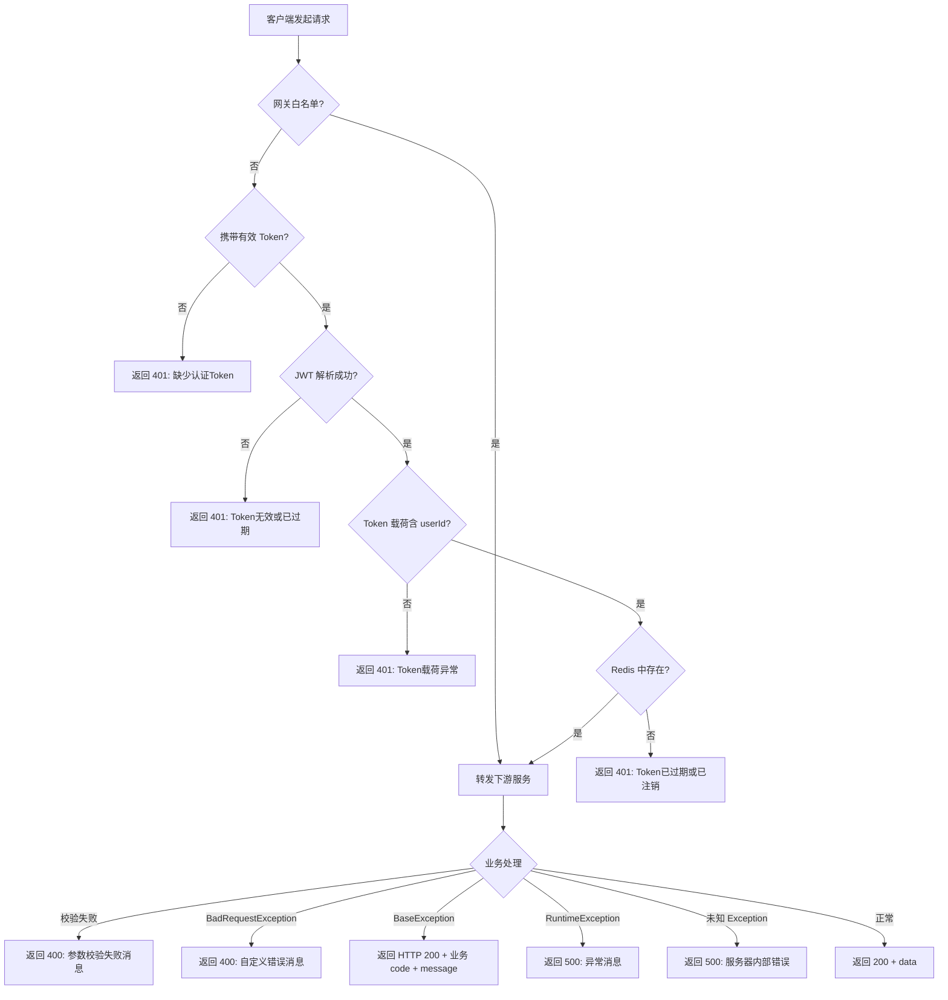

# EmiyaOJ-Cloud 异常响应接口文档

> 面向前端开发者，本文档描述了 EmiyaOJ-Cloud 所有 API 接口可能返回的错误响应格式及错误码说明。

---

## 一、统一响应格式

所有接口（包括正常响应和异常响应）均采用统一的 JSON 格式：

```json
{
  "code": 200,
  "message": "操作成功",
  "data": null
}
```

| 字段 | 类型 | 说明 |
|------|------|------|
| `code` | `int` | 状态码，与 HTTP 语义对齐（200 = 成功，4xx = 客户端错误，5xx = 服务端错误） |
| `message` | `string` | 提示信息，可直接展示给用户 |
| `data` | `any` | 响应数据体。**注意：异常响应中 `data` 始终为 `null`** |

---

## 二、异常分类总览

异常响应来源于两个层面：**网关层**（认证拦截）和 **服务层**（业务 / 系统异常）。

| 来源 | HTTP 状态码 | `code` | 说明 |
|------|-------------|--------|------|
| 网关（Gateway） | `401` | `401` | 未认证 / Token 无效 |
| 服务（GlobalExceptionHandler） | `400` | `400` | 请求参数错误 / 业务校验失败 |
| 服务（GlobalExceptionHandler） | `400` | 自定义 | 业务异常（`BaseException` 可携带任意 code） |
| 服务（GlobalExceptionHandler） | `500` | `500` | 服务器内部错误 / 未知异常 |

---

## 三、网关层异常（401 Unauthorized）

网关 `AuthGlobalFilter` 在请求到达下游服务之前进行 JWT 认证校验。认证失败时直接返回 401，请求**不会进入业务服务**。

**响应示例：**

```json
{
  "code": 401,
  "message": "缺少认证Token",
  "data": null
}
```

**所有网关层错误消息：**

| `message` | 触发条件 | 前端处理建议 |
|-----------|----------|-------------|
| `缺少认证Token` | 请求头未携带 `Authorization` | 跳转登录页 |
| `Token无效或已过期` | JWT 解析失败（格式错误、签名不匹配等） | 清除本地 Token，跳转登录页 |
| `Token载荷异常` | JWT 解析成功但缺少 `userId` 字段 | 清除本地 Token，跳转登录页 |
| `Token已过期或已注销` | Redis 中无对应 Token 记录（用户已登出或 Token TTL 到期） | 清除本地 Token，跳转登录页 |

> **提示**：前端收到任意 `code === 401` 的响应时，应统一清除本地存储的 Token 并引导用户重新登录。

---

## 四、服务层异常

服务层异常由 `GlobalExceptionHandler` 统一处理，根据异常类型返回不同响应。

### 4.1 请求参数校验失败（400 Bad Request）

**触发场景**：`@Valid` / `@Validated` 校验失败（如字段为空、格式不正确等）。

**HTTP 状态码**：`400`

**响应示例：**

```json
{
  "code": 400,
  "message": "标题不能为空; 内容长度必须在10-5000之间",
  "data": null
}
```

> `message` 由多个字段的错误信息用 `"; "` 拼接而成，前端可直接展示。

---

### 4.2 BadRequestException（400 Bad Request）

**触发场景**：业务层主动抛出 `BadRequestException`，表示请求参数不符合业务规则。

**HTTP 状态码**：`400`

**响应示例：**

```json
{
  "code": 400,
  "message": "语言名称不能为空",
  "data": null
}
```

**已知错误消息一览：**

| 模块 | `message` 示例 |
|------|---------------|
| Language | `请求体不能为空`、`语言ID不能为空`、`语言名称不能为空`、`展示版本不能为空`、`语言版本不能为空`、`源文件扩展名不能为空`、`源文件基础名不能为空`、`可执行目标名不能为空`、`运行命令不能为空`、`编译型语言必须配置编译命令`、`状态只能为0或1`、`是否需要编译只能为0或1`、`同名同版本的语言已存在` |
| ProblemSet | `Request body cannot be empty`、`Problem set id cannot be empty`、`Problem set title cannot be empty`、`Problem set status must be 0 or 1`、`problemId cannot be empty`、`Some problems do not exist` |
| Contest | `problemId cannot be empty`、`Some problems do not exist` |

---

### 4.3 IllegalArgumentException（400 Bad Request）

**触发场景**：方法接收到非法参数（如数值越界、不支持的枚举值等）。

**HTTP 状态码**：`400`

**响应示例：**

```json
{
  "code": 400,
  "message": "Invalid difficulty value: 99",
  "data": null
}
```

---

### 4.4 BaseException — 业务异常（自定义 code）

**触发场景**：业务层主动抛出 `BaseException`，携带自定义错误码和消息。这是业务异常的最常见形式。

**HTTP 状态码**：`200`（响应体 `code` 字段承载真实错误码）

**响应格式**：

```json
{
  "code": "<业务错误码>",
  "message": "<错误描述>",
  "data": null
}
```

> **重要**：`BaseException` 的 HTTP 状态码始终为 `200`，前端应**以响应体中的 `code` 字段为准**判断成功或失败。

---

## 五、业务错误码速查表

以下梳理了各微服务中 `BaseException` 抛出的常见 `code` 及 `message`。

### 5.1 通用错误码（ResultEnum）

| `code` | 语义 | 说明 |
|--------|------|------|
| `200` | 成功 | 操作成功 |
| `400` | 请求参数错误 | 客户端请求有误 |
| `401` | 未认证 | Token 缺失或无效 |
| `403` | 权限不足 | 已认证但无操作权限 |
| `404` | 资源不存在 | 请求的资源未找到 |
| `409` | 资源冲突 | 数据冲突（如重复创建） |
| `500` | 服务器内部错误 | 未知异常兜底 |
| `503` | 服务暂不可用 | 服务降级或维护中 |

---

### 5.2 Blog 博客服务

| `code` | `message` | 触发场景 |
|--------|-----------|----------|
| `400` | `题解必须关联题目` | 创建题解类型博客时未指定题目 |
| `400` | `标签不存在` | 引用了不存在的标签 |
| `400` | `图片不存在` | 引用的图片资源不存在 |
| `400` | `只能绑定自己上传的有效图片` | 绑定了非自己上传的图片 |
| `400` | `Invalid audit status` | 审核状态值非法 |
| `403` | `只能修改自己的博客` | 尝试修改他人博客 |
| `403` | `No moderation permission` | 无审核权限 |
| `404` | `博客不存在` | 博客 ID 不存在 |
| `404` | `标签不存在` | 标签 ID 不存在 |
| `404` | `题目不存在` | 关联的题目不存在 |
| `500` | `添加失败` | 博客创建失败（无明确 code） |

---

### 5.3 Problem 题目服务

#### Language（语言管理）

| `code` | `message` | 触发场景 |
|--------|-----------|----------|
| `404` | `语言不存在` | 语言 ID 不存在 |

#### ProblemSet（题单管理）

| `code` | `message` | 触发场景 |
|--------|-----------|----------|
| `400` | `problemId cannot be empty` | 题单操作时题目 ID 为空 |
| `400` | `Some problems do not exist` | 题单中包含不存在的题目 |
| `403` | `Only the creator can manage this problem set` | 非题单创建者尝试管理题单 |
| `404` | `Problem set does not exist` | 题单 ID 不存在 |

#### Contest（竞赛管理）

| `code` | `message` | 触发场景 |
|--------|-----------|----------|
| `400` | `Contest is not published` | 竞赛未发布时尝试注册 |
| `400` | `Contest has ended` | 竞赛已结束后尝试注册 |
| `400` | `Invite code is invalid` | 邀请码无效 |
| `400` | `Invite code already exists` | 邀请码已存在（创建时冲突） |
| `400` | `Registration cannot be cancelled after contest starts` | 竞赛开始后尝试取消注册 |
| `400` | `User {userId} does not have CONTEST permission` | 指定用户无竞赛管理权限 |
| `403` | `Only contest admins can perform this action` | 非竞赛管理员操作 |
| `404` | `Contest does not exist` | 竞赛 ID 不存在 |
| `500` | `Failed to query contest admin candidates` | 查询竞赛管理员候选失败 |
| `500` | `Failed to generate invite code` | 生成邀请码失败 |
| `500` | `Failed to query contest submissions` | 查询竞赛提交失败 |

---

### 5.4 Judge 判题服务

| `code` | `message` | 触发场景 |
|--------|-----------|----------|
| `400` | `Problem does not exist` | 提交的题目 ID 不存在 |
| `400` | `Language does not exist` | 提交的编程语言 ID 不存在 |
| `400` | （动态消息） | 提交校验失败（如代码长度超限等） |

---

### 5.5 图片服务（Blog 子模块）

| `code` | `message` | 触发场景 |
|--------|-----------|----------|
| `500` | `图片上传失败，请检查对象存储服务是否可用` | OSS 对象存储服务异常 |

---

## 六、RuntimeException / Exception（兜底异常）

当服务端抛出未预期的 `RuntimeException` 或任何未被精确匹配的 `Exception` 时：

| 异常类型 | HTTP 状态码 | `code` | `message` |
|----------|-------------|--------|-----------|
| `RuntimeException` | `500` | `500` | 原始异常消息（`e.getMessage()`） |
| `Exception`（兜底） | `500` | `500` | `服务器内部错误`（固定文案） |

> 兜底异常表示系统遇到未知错误，前端可展示通用错误提示，如"系统繁忙，请稍后重试"。

---

## 七、前端处理最佳实践

### 7.1 统一拦截器 / 响应中间件

推荐在 HTTP 客户端（Axios / Fetch 封装层）中统一处理异常响应：

```typescript
// Axios 响应拦截器示例
http.interceptors.response.use(
  (response) => {
    const { code, message, data } = response.data;
    
    // 1. 成功
    if (code === 200) return data;
    
    // 2. 401 未认证 → 跳转登录
    if (code === 401) {
      clearToken();
      router.push('/login');
      return Promise.reject(new Error(message));
    }
    
    // 3. 403 无权限 → 提示用户
    if (code === 403) {
      showToast(message || '权限不足');
      return Promise.reject(new Error(message));
    }
    
    // 4. 其他业务异常 → 按需处理
    showToast(message || '操作失败');
    return Promise.reject(new Error(message));
  },
  (error) => {
    // HTTP 状态码异常（如 500）
    const message = error.response?.data?.message || '网络异常，请稍后重试';
    showToast(message);
    return Promise.reject(error);
  }
);
```

### 7.2 核心原则

| 原则 | 说明 |
|------|------|
| **以响应体 `code` 为准** | 不要依赖 HTTP 状态码判断业务成功/失败，`BaseException` 的 HTTP 状态码固定为 200 |
| **401 统一跳登录** | 无论 `message` 是什么，`code === 401` 都应清除 Token 并跳转登录页 |
| **`message` 可直接展示** | 错误消息均面向终端用户设计，可直接 `toast` / `alert` 展示 |
| **`data` 为空即异常** | 异常响应中 `data` 恒为 `null`，可据此作为辅助判断 |
| **400 场景展示字段级错误** | 参数校验失败的 `message` 可能包含多条信息（`"; "` 分隔），可逐条展示或直接整体显示 |

---

## 八、异常处理流程图



---

## 九、附录：HTTP 状态码与响应体 `code` 对照

| 场景 | HTTP Status | 响应体 `code` | 典型 `message` |
|------|-------------|---------------|----------------|
| 成功 | `200` | `200` | `操作成功` |
| 网关认证失败 | `401` | `401` | `缺少认证Token` 等 |
| 参数校验失败 | `400` | `400` | 字段校验错误信息 |
| BadRequestException | `400` | `400` | 业务校验错误信息 |
| IllegalArgumentException | `400` | `400` | 参数非法描述 |
| BaseException（业务） | `200` | 自定义 | 业务错误描述 |
| RuntimeException | `500` | `500` | 异常消息原文 |
| Exception 兜底 | `500` | `500` | `服务器内部错误` |

> **再次强调**：前端应始终以响应体 `code` 字段作为业务判断依据，**不要**依赖 HTTP 状态码。
