# EmiyaOJ-Cloud — UML 2.0 完整建模文档

> **项目**: EmiyaOJ-Cloud 在线判题系统  
> **架构**: 微服务 (Spring Cloud + Spring Boot + Nacos + Redis + MySQL)  
> **建模日期**: 2026-04-28

---

## 目录

1. [用例图 (Use Case Diagram)](#1-用例图-use-case-diagram)
2. [领域模型类图 (Domain Model / Class Diagram)](#2-领域模型类图)
3. [微服务架构图 (Microservice Architecture Diagram)](#3-微服务架构图)
4. [ER 图 / 数据库关系图](#4-er-图--数据库关系图)
5. [时序图 (Sequence Diagrams)](#5-时序图)
6. [活动图 (Activity Diagram)](#6-活动图)
7. [组件图 (Component Diagram)](#7-组件图)
8. [部署图 (Deployment Diagram)](#8-部署图)

---

## 1. 用例图 (Use Case Diagram)

```mermaid
graph TB
    subgraph "EmiyaOJ-Cloud 在线判题系统"
        subgraph "认证模块"
            UC1[用户注册]
            UC2[用户登录]
            UC3[Token 验证]
            UC4[角色管理]
            UC5[权限管理]
        end

        subgraph "题目模块"
            UC6[浏览题目列表]
            UC7[查看题目详情]
            UC8[创建/编辑题目]
            UC9[管理测试用例]
            UC10[管理编程语言]
            UC11[管理标签]
        end

        subgraph "判题模块"
            UC12[提交代码]
            UC13[查看提交记录]
            UC14[查看判题结果]
            UC15[管理判题沙箱]
        end

        subgraph "博客模块"
            UC16[发布博客]
            UC17[编辑/删除博客]
            UC18[评论博客]
            UC19[收藏博客]
            UC20[管理博客标签]
        end

        subgraph "AI 助手"
            UC21[发送消息]
            UC22[获取代码建议]
        end
    end

    Visitor((访客)) --> UC6
    Visitor --> UC7
    Visitor --> UC1
    Visitor --> UC2

    User((注册用户)) --> UC6
    User --> UC7
    User --> UC12
    User --> UC13
    User --> UC14
    User --> UC16
    User --> UC17
    User --> UC18
    User --> UC19
    User --> UC21
    User --> UC22

    Admin((管理员)) --> User
    Admin --> UC4
    Admin --> UC5
    Admin --> UC8
    Admin --> UC9
    Admin --> UC10
    Admin --> UC11
    Admin --> UC15
    Admin --> UC20
    Admin --> UC3

    GoJudge((Go-Judge 沙箱)) -.-> UC15
```

---

## 2. 领域模型类图

### 2.1 认证服务领域模型 (Auth)

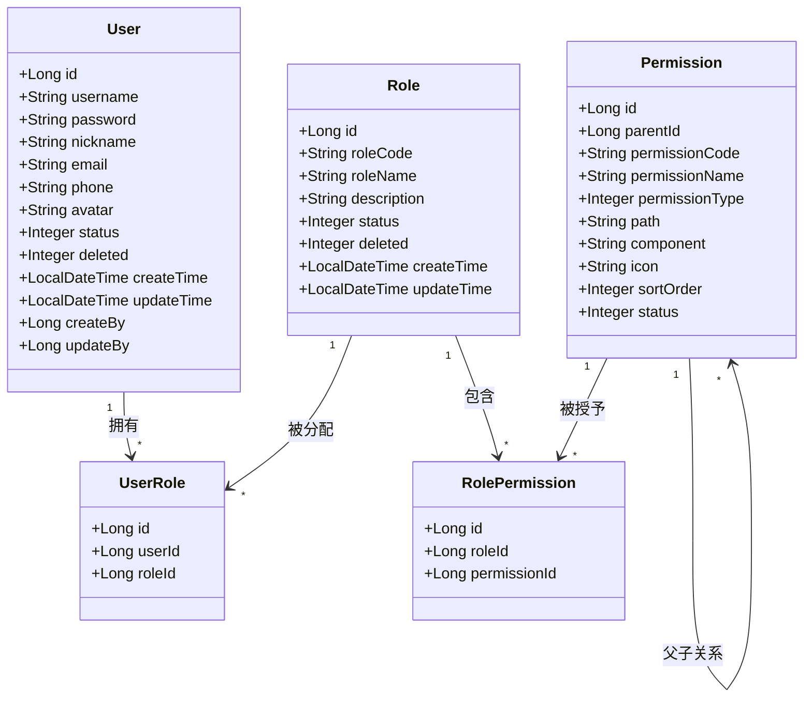

### 2.2 题目服务领域模型 (Problem)

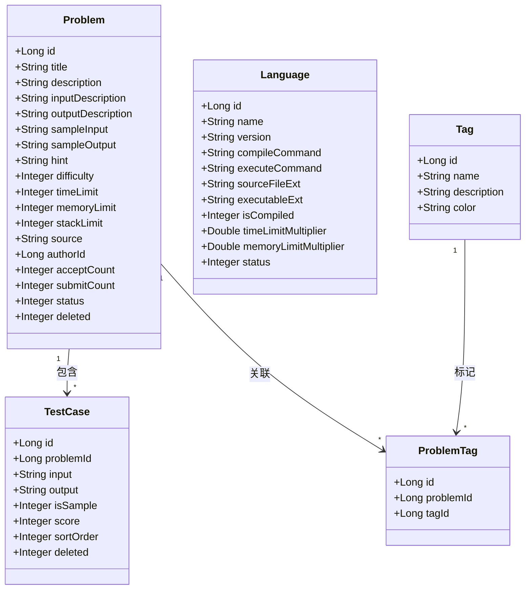

### 2.3 判题服务领域模型 (Judge)

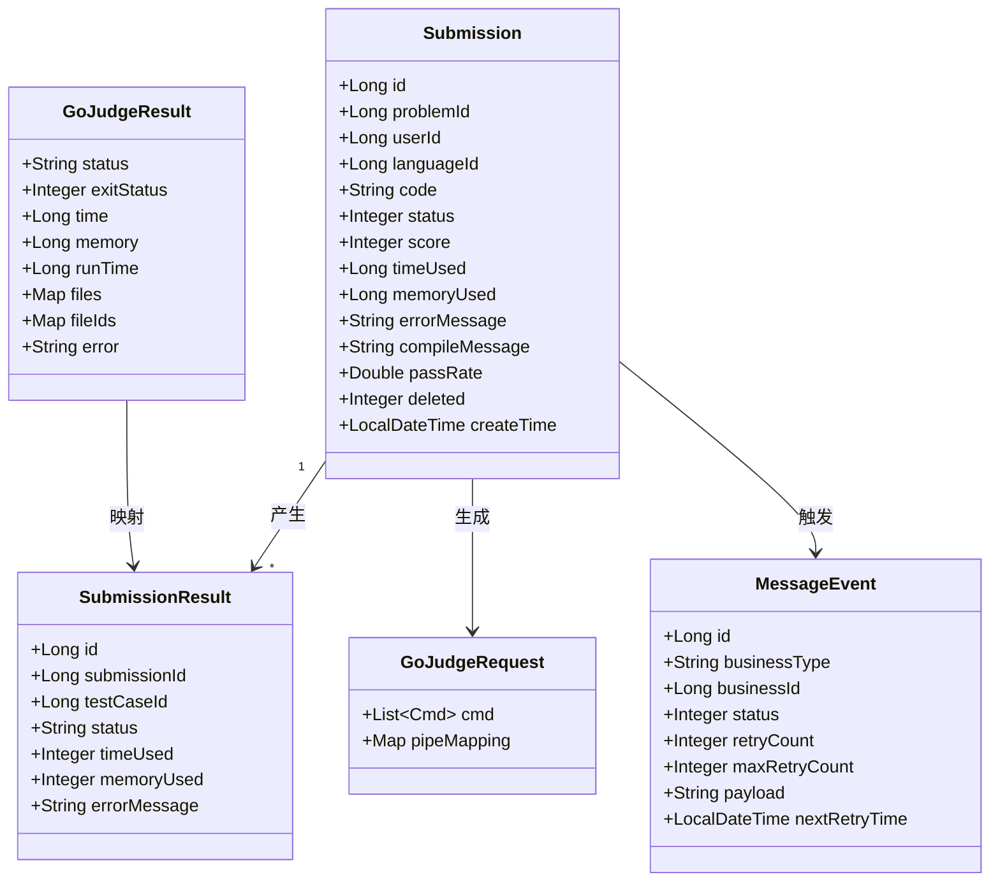

### 2.4 博客服务领域模型 (Blog)

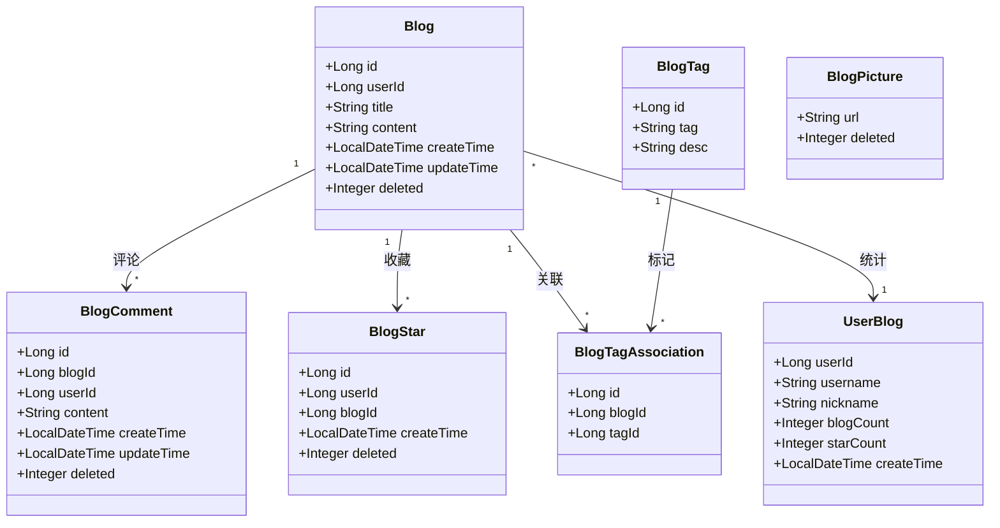

### 2.5 公共模块 (Common)

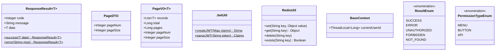

---

## 3. 微服务架构图

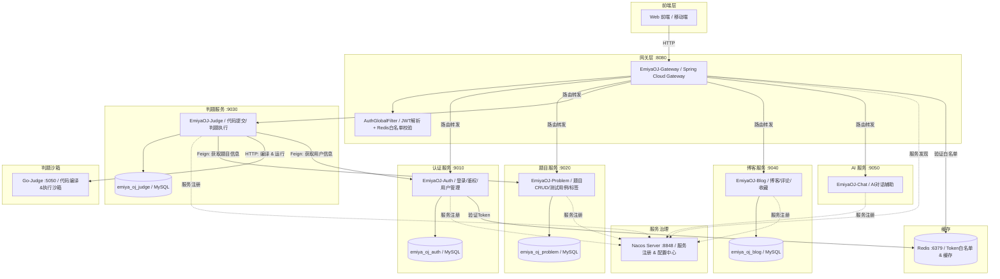

---

## 4. ER 图 / 数据库关系图

### 4.1 认证数据库 (emiya_oj_auth)

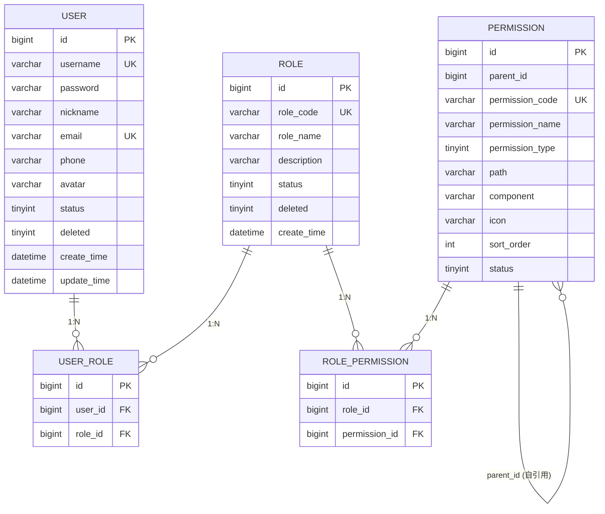

### 4.2 题目数据库 (emiya_oj_problem)

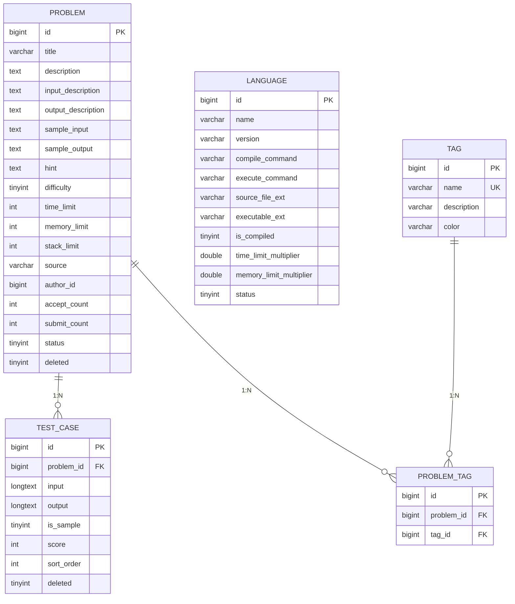

### 4.3 判题数据库 (emiya_oj_judge)

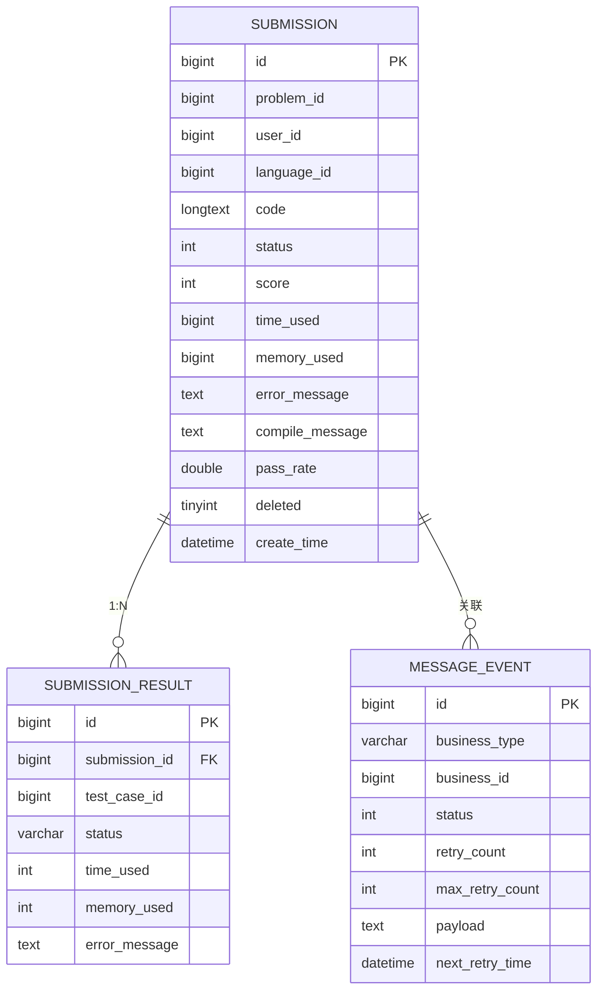

### 4.4 博客数据库 (emiya_oj_blog)

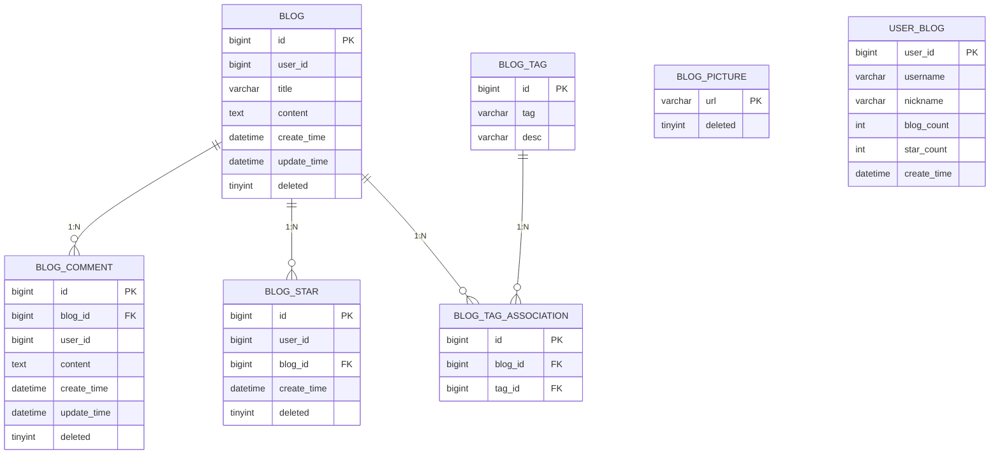

---

## 5. 时序图

### 5.1 用户登录与 Token 验证

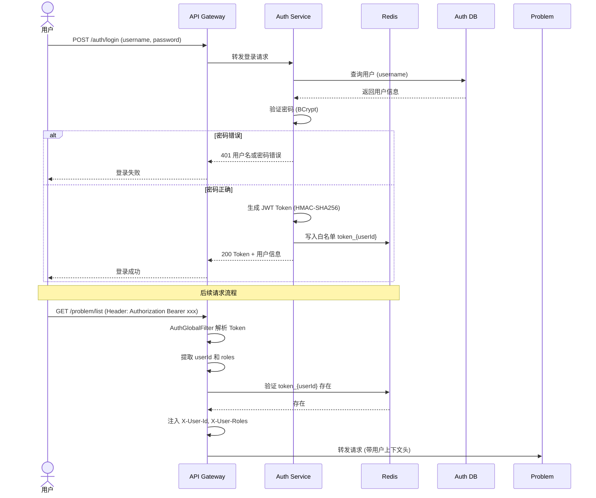

### 5.2 代码提交与判题执行

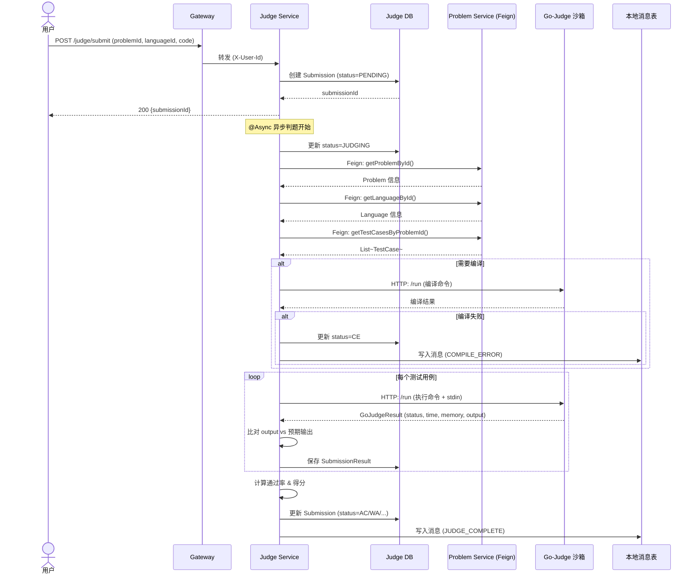

### 5.3 博客发布与评论

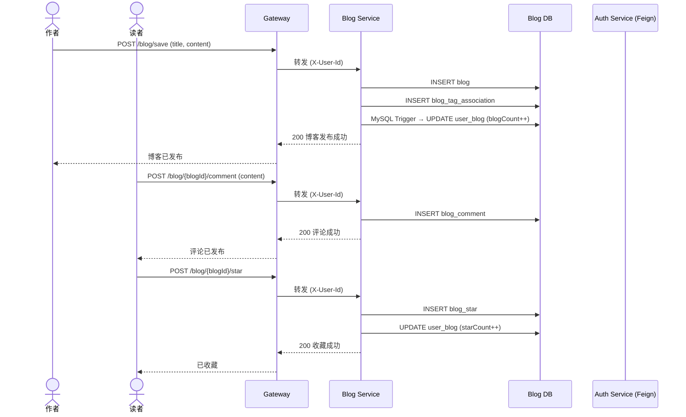

---

## 6. 活动图

### 6.1 判题执行活动图

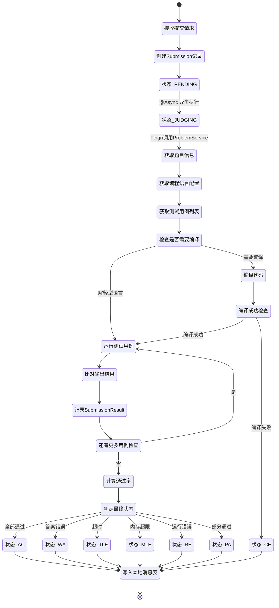

### 6.2 用户认证活动图

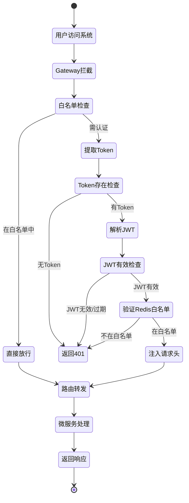

---

## 7. 组件图

```mermaid
graph TB
    subgraph Gateway["EmiyaOJ-Gateway 网关"]
        GW_Filter["AuthGlobalFilter 全局认证过滤器"]
        GW_Route["路由规则配置"]
        GW_Config["GatewayConfig 白名单/JWT属性配置"]
        GW_Filter --> GW_Route
        GW_Config --> GW_Filter
    end

    subgraph Auth["EmiyaOJ-Auth 认证服务"]
        Auth_Ctrl["AuthController 登录/登出"]
        User_Ctrl["UserController 用户CRUD"]
        Role_Ctrl["RoleController 角色管理"]
        Perm_Ctrl["PermissionController 权限管理"]
        Auth_Svc["AuthService"]
        UserDetails_Svc["UserDetailsServiceImpl"]
        Auth_Feign["AuthFeignClient"]
        Auth_Entities["实体: User, Role, Permission"]
        Auth_Mapper["MyBatis-Plus Mapper"]
        Auth_Ctrl --> Auth_Svc
        User_Ctrl --> UserDetails_Svc
        Role_Ctrl --> Auth_Mapper
        Perm_Ctrl --> Auth_Mapper
        Auth_Svc --> Auth_Mapper
        Auth_Feign --> Auth_Svc
    end

    subgraph Problem["EmiyaOJ-Problem 题目服务"]
        Prob_Ctrl["ProblemController"]
        TC_Ctrl["TestCaseController"]
        Lang_Ctrl["LanguageController"]
        Prob_Svc["ProblemService"]
        TC_Svc["TestCaseService"]
        Lang_Svc["LanguageService"]
        Prob_Feign["ProblemFeignClient"]
        Prob_Mapper["MyBatis-Plus Mapper"]
        Prob_Ctrl --> Prob_Svc
        TC_Ctrl --> TC_Svc
        Lang_Ctrl --> Lang_Svc
        Prob_Feign --> Prob_Svc
        Prob_Feign --> TC_Svc
        Prob_Feign --> Lang_Svc
    end

    subgraph Judge["EmiyaOJ-Judge 判题服务"]
        Judge_Ctrl["JudgeController"]
        Sub_Ctrl["SubmissionController"]
        Sub_Svc["SubmissionService"]
        Judge_Exec["JudgeExecutor @Async"]
        GoJudge_Svc["GoJudgeService HTTP客户端"]
        Judge_Msg["MessageEvent 本地消息表"]
        Judge_Ctrl --> Sub_Svc
        Sub_Ctrl --> Sub_Svc
        Sub_Svc --> Judge_Exec
        Judge_Exec --> GoJudge_Svc
        Judge_Exec --> Judge_Msg
    end

    subgraph Blog["EmiyaOJ-Blog 博客服务"]
        Blog_Ctrl["BlogController"]
        Blog_Svc["IBlogService"]
        UserBlog_Svc["IUserBlogService"]
        Blog_Feign["BlogFeignClient"]
        Blog_Mapper["MyBatis-Plus Mapper"]
        Blog_Ctrl --> Blog_Svc
        Blog_Ctrl --> UserBlog_Svc
        Blog_Feign --> Blog_Svc
    end

    subgraph Chat["EmiyaOJ-Chat AI服务"]
        Chat_Ctrl["ChatController"]
        Chat_Svc["IChatService"]
        Chat_Feign["ChatFeignClient"]
        Chat_Config["ChatServiceConfig"]
        Chat_Ctrl --> Chat_Svc
        Chat_Svc --> Chat_Config
    end

    subgraph Common["EmiyaOJ-Common 公共模块"]
        Com_Result["ResponseResult T"]
        Com_Page["PageDTO / PageVO T"]
        Com_JWT["JwtUtil HMAC-SHA256"]
        Com_Redis["RedisUtil"]
        Com_Context["BaseContext ThreadLocal"]
        Com_Handler["GlobalExceptionHandler"]
        Com_Config["MybatisPlus/Jackson/Feign/Redis Config"]
    end

    Auth_Ctrl -.->|"依赖"| Com_Result
    Prob_Ctrl -.->|"依赖"| Com_Result
    Judge_Ctrl -.->|"依赖"| Com_Result
    Blog_Ctrl -.->|"依赖"| Com_Result
    Chat_Ctrl -.->|"依赖"| Com_Result
```

---

## 8. 部署图

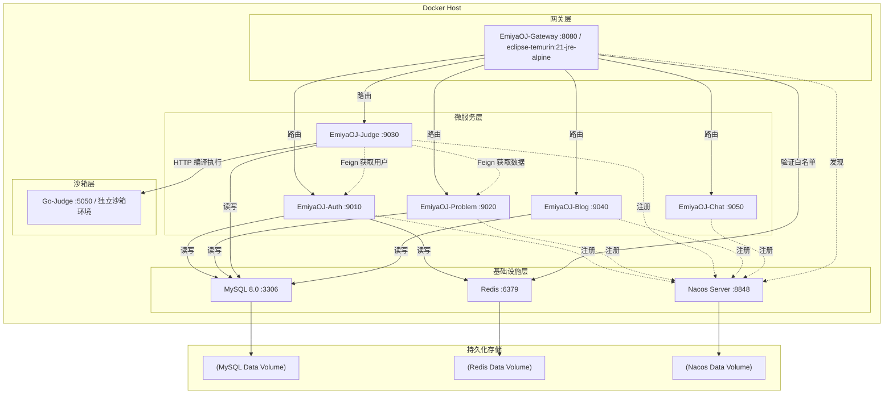

---

## 附录：判题状态码速查

| 状态码 | 枚举值 | 含义 |
|--------|--------|------|
| 0 | PENDING | 待判题 |
| 1 | JUDGING | 判题中 |
| 2 | AC (Accepted) | 通过 |
| 3 | CE (Compile Error) | 编译错误 |
| 4 | SE (System Error) | 系统错误 |
| 5 | WA (Wrong Answer) | 答案错误 |
| 6 | TLE (Time Limit Exceeded) | 时间超限 |
| 7 | MLE (Memory Limit Exceeded) | 内存超限 |
| 8 | RE (Runtime Error) | 运行错误 |
| 9 | OLE (Output Limit Exceeded) | 输出超限 |
| 10 | PA (Partially Accepted) | 部分通过 |

---

> **建模工具**: Mermaid.js | **文档版本**: v1.0 | **作者**: GitHub Copilot
