# EmiyaOJ-Cloud — UML 2.0 完整建模文档 (Mermaid 版)

> **项目**: EmiyaOJ-Cloud 在线判题系统  
> **架构**: Spring Cloud 微服务 (Gateway + Auth + Problem + Judge + Blog + Chat + Moderation)  
> **建模标准**: UML 2.0 (Unified Modeling Language)  
> **图格式**: Mermaid  
> **建模日期**: 2026-05-20  
> **对应 PlantUML 版**: `docs/UML2.0-完整建模.md`

---

## 目录

| 章节 | 内容 | 图数 |
|------|------|------|
| [一、系统用例图](#一系统用例图-use-case-diagram) | 全系统参与者与用例关系 | 1 |
| [二、重点用例①：代码提交与自动判题](#二重点用例代码提交与自动判题) | 活动图 / 类图 / 时序图 / 通信图 / 构件图 / 部署图 | 6 |
| [三、重点用例②：用户认证与授权访问](#三重点用例用户认证与授权访问) | 活动图 / 类图 / 时序图 / 通信图 / 构件图 / 部署图 | 6 |
| [附录](#附录) | Mermaid 渲染说明与 PlantUML 版交叉引用 | — |

> **总计 14 张图**  
> **渲染**: VS Code 安装 `Markdown Preview Mermaid Support` 插件，或使用 [Mermaid Live Editor](https://mermaid.live/)

---

## 一、系统用例图 (Use Case Diagram)

### 1.1 全系统用例图

> ⚠️ Mermaid 不原生支持 UML 用例图，使用 flowchart + subgraph 近似表示。

```mermaid
graph TB
    subgraph Actors["参与者"]
        Visitor(("fa:fa-user 访客"))
        User(("fa:fa-user-plus 注册用户"))
        Admin(("fa:fa-user-shield 管理员"))
        Moderator(("fa:fa-user-check 审核人员"))
        GoJudge(("fa:fa-server Go-Judge沙箱"))
        AliyunMod(("fa:fa-cloud 阿里云审核"))
    end

    subgraph System["EmiyaOJ-Cloud 在线判题系统"]
        subgraph M1["认证模块"]
            UC_Register["用户注册"]
            UC_Login["用户登录"]
            UC_Logout["用户登出"]
            UC_Token["Token 验证"]
        end

        subgraph M2["题目模块"]
            UC_BrowseProblem["浏览题目列表"]
            UC_ViewProblem["查看题目详情"]
            UC_ManageProblem["创建/编辑题目"]
            UC_ManageTestCase["管理测试用例"]
            UC_ManageLanguage["管理编程语言"]
            UC_ManageTag["管理题目标签"]
        end

        subgraph M3["判题模块"]
            UC_SubmitCode["提交代码"]
            UC_ViewSubmission["查看提交记录"]
            UC_ViewResult["查看判题结果"]
            UC_ExecuteJudge["执行代码编译运行"]
        end

        subgraph M4["博客模块"]
            UC_BrowseBlog["浏览博客"]
            UC_PublishBlog["发布/编辑博客"]
            UC_Comment["发表评论"]
            UC_StarBlog["收藏/点赞博客"]
            UC_ManageBlogTag["管理博客标签"]
        end

        subgraph M5["竞赛模块"]
            UC_BrowseContest["浏览竞赛"]
            UC_RegisterContest["报名竞赛"]
            UC_ManageContest["创建/管理竞赛"]
            UC_ViewRanking["查看排行榜"]
        end

        subgraph M6["AI 助手模块"]
            UC_AIChat["发送 AI 消息"]
            UC_AISuggest["获取代码建议"]
        end

        subgraph M7["审核模块"]
            UC_AutoMod["自动文本审核"]
            UC_ManualMod["人工审核复核"]
        end

        subgraph M8["管理模块"]
            UC_ManageUser["用户管理"]
            UC_ManageRole["角色管理"]
            UC_ManagePerm["权限管理"]
            UC_ManageSubmission["提交记录管理"]
        end
    end

    %% 访客关联
    Visitor --> UC_Register
    Visitor --> UC_Login
    Visitor --> UC_BrowseProblem
    Visitor --> UC_ViewProblem
    Visitor --> UC_BrowseBlog
    Visitor --> UC_BrowseContest

    %% 注册用户（继承访客）
    User -.->|继承| Visitor
    User --> UC_Logout
    User --> UC_SubmitCode
    User --> UC_ViewSubmission
    User --> UC_ViewResult
    User --> UC_PublishBlog
    User --> UC_Comment
    User --> UC_StarBlog
    User --> UC_RegisterContest
    User --> UC_ViewRanking
    User --> UC_AIChat
    User --> UC_AISuggest

    %% 管理员（继承注册用户）
    Admin -.->|继承| User
    Admin --> UC_ManageProblem
    Admin --> UC_ManageTestCase
    Admin --> UC_ManageLanguage
    Admin --> UC_ManageTag
    Admin --> UC_ManageContest
    Admin --> UC_ManageBlogTag
    Admin --> UC_ManageUser
    Admin --> UC_ManageRole
    Admin --> UC_ManagePerm
    Admin --> UC_ManageSubmission
    Admin --> UC_ManualMod

    %% 审核人员
    Moderator --> UC_ManualMod
    Moderator --> UC_AutoMod

    %% 外部系统
    GoJudge --> UC_ExecuteJudge
    AliyunMod --> UC_AutoMod

    %% 用例间关系
    UC_SubmitCode -.->|include| UC_ExecuteJudge
    UC_ManageSubmission -.->|extend| UC_ViewResult
    UC_PublishBlog -.->|include| UC_AutoMod
    UC_Comment -.->|include| UC_AutoMod
    UC_SubmitCode -.->|include| UC_Token
    UC_RegisterContest -.->|include| UC_Token

    style Visitor fill:#BBDEFB,stroke:#1565C0
    style User fill:#C8E6C9,stroke:#2E7D32
    style Admin fill:#FFCDD2,stroke:#C62828
    style Moderator fill:#FFF9C4,stroke:#F9A825
    style GoJudge fill:#D1C4E9,stroke:#512DA8
    style AliyunMod fill:#D1C4E9,stroke:#512DA8
```

### 1.2 用例图说明

| 要素 | 说明 |
|------|------|
| 4 类人员参与者 | 访客、注册用户、管理员、审核人员 |
| 2 类外部系统 | Go-Judge 判题沙箱、阿里云内容审核服务 |
| 8 个功能模块 | 认证、题目、判题、博客、竞赛、AI助手、审核、管理 |
| 25 个用例 | 覆盖用户端和管理端全部功能 |
| 虚线箭头 | `-.->` 表示角色继承 / `<<include>>` / `<<extend>>` 依赖 |

---

## 二、重点用例 ①：代码提交与自动判题

> **用例编号**: UC-JUDGE-001  
> **参与角色**: 注册用户（主参与者）、Go-Judge沙箱（辅助参与者）  
> **前置条件**: 用户已登录，题目存在且公开，编程语言已启用  
> **后置条件**: 系统创建提交记录，异步完成判题并更新状态  

---

### 2.1 活动图 (Activity Diagram)

描述从用户提交代码到判题结果生成的完整业务流程。

```mermaid
graph TD
    Start([开始]) --> A[选择题目和编程语言]
    A --> B[编写/粘贴源代码]
    B --> C[点击"提交代码"]
    C --> D{Gateway: Token 有效?}
    D -->|否| E[返回 401 未授权]
    E --> End1([结束])
    D -->|是| F[注入 X-User-Id 请求头]
    F --> G{Judge: 题目存在且公开?}
    G -->|否| H[返回"题目不可用"]
    H --> End2([结束])
    G -->|是| I{Judge: 语言已启用?}
    I -->|否| J[返回"语言不可用"]
    J --> End3([结束])
    I -->|是| K[创建 Submission 记录<br/>status = PENDING(0)]
    K --> L[返回 submissionId 给用户]
    L --> M[更新状态为 JUDGING(1)]

    M --> N[Feign 获取题目/语言/测试用例]

    N --> O{语言需要编译?}
    O -->|是| P[调用 GoJudgeService.compile()]
    P --> Q[Go-Judge 沙箱编译]
    Q --> R{编译成功?}
    R -->|否| S[保存编译错误信息]
    S --> T[更新状态为 CE(3)]
    T --> End4([结束])
    R -->|是| U[准备运行环境]
    O -->|否| U

    U --> V[逐测试用例运行]

    V --> W{还有未运行用例?}
    W -->|是| X[GoJudgeService.run()<br/>传入用例输入和资源限制]
    X --> Y[Go-Judge 沙箱运行代码]
    Y --> Z{运行结果判定}
    Z -->|超时| Z1[标记 TLE]
    Z -->|超内存| Z2[标记 MLE]
    Z -->|运行异常| Z3[标记 RE]
    Z -->|输出不匹配| Z4[标记 WA]
    Z -->|通过| Z5[标记 AC]
    Z1 --> AA[保存 SubmissionCaseResult]
    Z2 --> AA
    Z3 --> AA
    Z4 --> AA
    Z5 --> AA
    AA --> W

    W -->|否| AB[汇总最终判题状态]
    AB --> AC[计算总分和通过率]
    AC --> AD[更新 Submission<br/>status/score/time/memory]
    AD --> AE[更新结束时间]
    AE --> AF[更新 Problem 提交数/通过数]

    AF --> AG[用户轮询/刷新查看结果]
    AG --> AH[展示状态及详细结果]
    AH --> End5([结束])

    style Start fill:#C8E6C9,stroke:#2E7D32
    style End1 fill:#FFCDD2,stroke:#C62828
    style End2 fill:#FFCDD2,stroke:#C62828
    style End3 fill:#FFCDD2,stroke:#C62828
    style End4 fill:#FFCDD2,stroke:#C62828
    style End5 fill:#C8E6C9,stroke:#2E7D32
    style D fill:#FFF9C4,stroke:#F9A825
    style G fill:#FFF9C4,stroke:#F9A825
    style I fill:#FFF9C4,stroke:#F9A825
    style O fill:#FFF9C4,stroke:#F9A825
    style R fill:#FFF9C4,stroke:#F9A825
    style W fill:#FFF9C4,stroke:#F9A825
    style Z fill:#FFF9C4,stroke:#F9A825
```

---

### 2.2 类图 (Class Diagram)

展示判题模块的核心实体类、服务类及跨服务 Feign 调用关系。

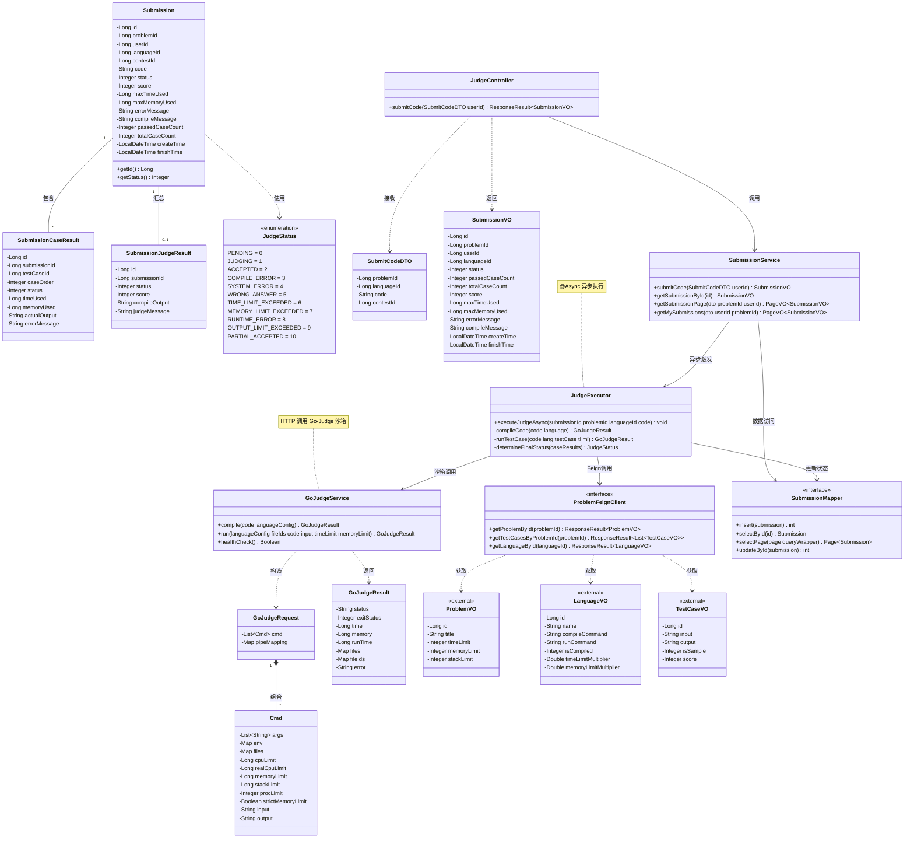

---

### 2.3 时序图 (Sequence Diagram)

展示代码提交与异步判题的完整交互消息链。

```mermaid
sequenceDiagram
    actor User as 用户
    participant FE as 用户端<br/>(Frontend)
    participant GW as Gateway<br/>:8080
    participant JC as JudgeController<br/>:9030
    participant SS as SubmissionService
    participant JE as JudgeExecutor<br/>(@Async)
    participant PFC as ProblemFeignClient
    participant PS as ProblemService<br/>:9020
    participant GJS as GoJudgeService
    participant GJ as Go-Judge沙箱<br/>:5050
    participant DB as MySQL<br/>(emiya_oj_judge)

    %% 阶段1: 代码提交
    rect rgb(232, 245, 233)
        Note over User,DB: 阶段1: 代码提交
        User ->> FE: 选择题目、语言，粘贴代码并提交
        FE ->> GW: POST /judge/submit<br/>{problemId, languageId, code}
        GW ->> GW: AuthGlobalFilter<br/>解析JWT & 验证Redis白名单
        GW ->> JC: 转发请求<br/>(Header: X-User-Id)
        JC ->> SS: submitCode(dto, userId)
        SS ->> DB: INSERT submission<br/>(status = 0 PENDING)
        SS -->> JC: SubmissionVO (submissionId)
        JC -->> GW: ResponseResult~SubmissionVO~
        GW -->> FE: {code:200, data: {id, status:0}}
        FE --) User: 展示"判题中..."
    end

    %% 阶段2: 异步判题
    rect rgb(255, 243, 224)
        Note over SS,DB: 阶段2: 异步判题
        SS ->> JE: @Async executeJudgeAsync<br/>(submissionId, problemId, languageId, code)

        activate JE
        JE ->> DB: UPDATE status = 1 (JUDGING)

        JE ->> PFC: getProblemById(problemId)
        PFC ->> PS: GET /problem/{id}
        PS --) PFC: ProblemVO (timeLimit, memoryLimit...)
        PFC --) JE: ProblemVO

        JE ->> PFC: getLanguageById(languageId)
        PFC ->> PS: GET /language/{id}
        PS --) PFC: LanguageVO (编译/运行命令...)
        PFC --) JE: LanguageVO

        JE ->> PFC: getTestCasesByProblemId(problemId)
        PFC ->> PS: GET /test-case/problem/{problemId}
        PS --) PFC: List~TestCaseVO~
        PFC --) JE: List~TestCaseVO~

        alt 编译型语言
            JE ->> GJS: compile(code, languageConfig)
            GJS ->> GJ: HTTP POST /api/judge<br/>(compile cmd)
            GJ --) GJS: GoJudgeResult (编译结果)
            GJS --) JE: GoJudgeResult
            alt 编译失败
                JE ->> DB: UPDATE status = 3 (CE)<br/>compileMessage = 错误信息
                deactivate JE
            end
        end

        loop 逐个测试用例
            JE ->> GJS: run(language, fileIds, code, input, timeLimit, memoryLimit)
            GJS ->> GJ: HTTP POST /api/judge<br/>(run cmd + input)
            GJ --) GJS: GoJudgeResult<br/>(status, time, memory, output)
            GJS --) JE: GoJudgeResult
            JE ->> JE: 比对 output 与 标准答案
            JE ->> DB: INSERT SubmissionCaseResult<br/>(status, timeUsed, memoryUsed)
        end

        JE ->> JE: 汇总最终状态<br/>(AC/WA/TLE/PA...)
        JE ->> DB: UPDATE submission<br/>status, score, maxTimeUsed,<br/>maxMemoryUsed, passedCaseCount, finishTime
        JE ->> DB: INSERT SubmissionJudgeResult<br/>(汇总结果)
        deactivate JE
    end

    %% 阶段3: 用户查看结果
    rect rgb(227, 242, 253)
        Note over User,DB: 阶段3: 用户查看结果
        User ->> FE: 刷新提交详情页
        FE ->> GW: GET /submission/{id}
        GW ->> JC: 转发
        JC ->> SS: getSubmissionById(id)
        SS ->> DB: SELECT submission + caseResults
        SS --) JC: SubmissionVO (完整结果)
        JC --) FE: 判题详情
        FE --) User: 展示状态、得分、<br/>通过用例、耗时、内存
    end
```

---

### 2.4 通信图 (Communication Diagram)

> ⚠️ Mermaid 不原生支持 UML 通信图，使用 flowchart LR + 编号消息近似表示。

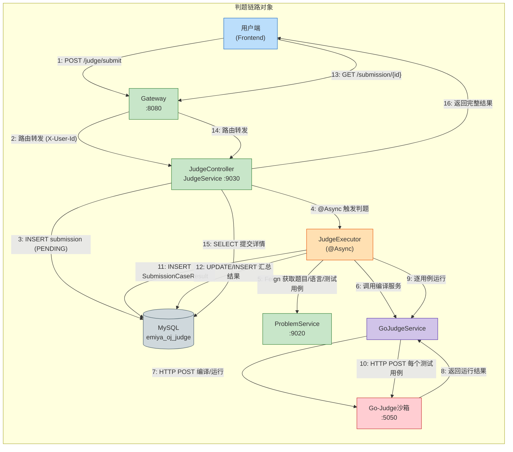

---

### 2.5 构件图 (Component Diagram)

> ⚠️ Mermaid 不原生支持 UML 构件图，使用 flowchart + subgraph 近似表示。

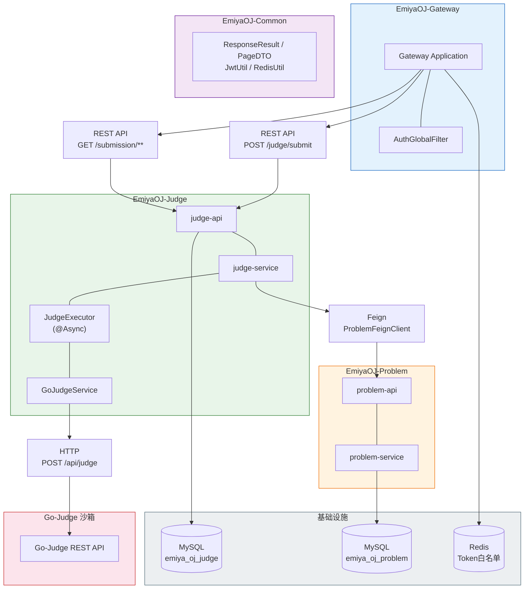

---

### 2.6 部署图 (Deployment Diagram)

> ⚠️ Mermaid 不原生支持 UML 部署图，使用 flowchart + subgraph 近似表示。

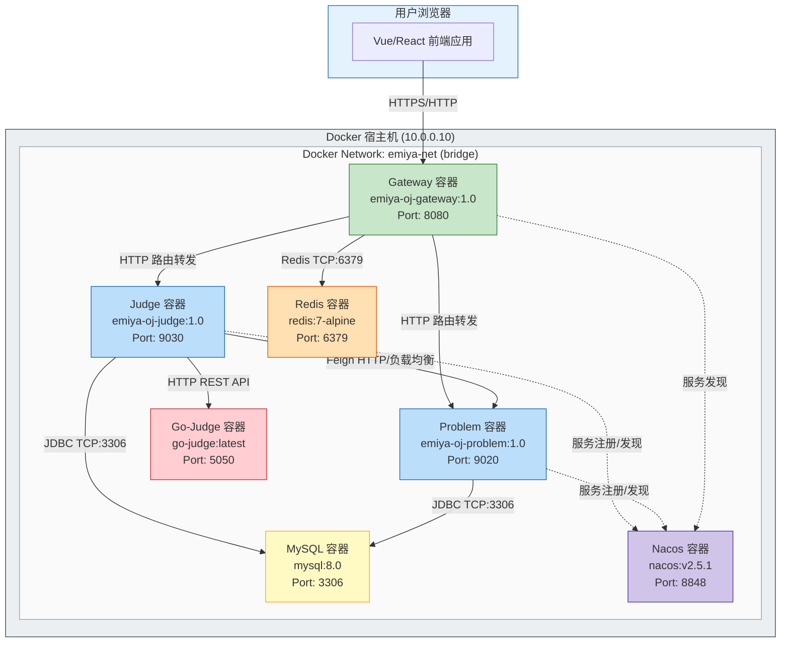

---

## 三、重点用例 ②：用户认证与授权访问

> **用例编号**: UC-AUTH-001  
> **参与角色**: 访客（注册/登录）、注册用户（登出/鉴权访问）、管理员（RBAC管理）  
> **前置条件**: 系统已部署 Gateway / Auth / Redis / MySQL  
> **后置条件**: 用户获得 JWT Token，可访问受保护资源  

---

### 3.1 活动图 (Activity Diagram)

描述用户登录、Token 签发、请求鉴权与 RBAC 权限校验的完整流程。

```mermaid
graph TD
    Start([开始]) --> A[访问系统]
    A --> B{Gateway: 请求路径在白名单?}
    B -->|是| C{是登录请求?}
    B -->|否| D{请求头包含 Authorization: Bearer?}

    C -->|是| E[接收用户名密码]
    E --> F[UserDetailsService.loadUserByUsername]
    F --> G[校验密码 PasswordEncoder]
    G --> H{密码正确且账号启用?}
    H -->|否| I[返回"用户名或密码错误"]
    I --> End1([结束])
    H -->|是| J[查询用户角色和权限]
    J --> K[JwtUtil.createJWT 生成 Token]
    K --> L[Redis.set 写入 Token 白名单<br/>key: token_{userId}]
    L --> M[返回 UserLoginVO<br/>id, username, nickname, token]
    M --> N[前端存储 Token]
    N --> End2([结束])

    C -->|否| O[返回公开资源]
    O --> End3([结束])

    D -->|否| P[返回 401 未授权]
    P --> End4([结束])
    D -->|是| Q[提取 Bearer Token]
    Q --> R[JwtUtil.parseJWT 解析 Token]
    R --> S{JWT 解析成功且未过期?}
    S -->|否| T[返回 401 Token无效或过期]
    T --> End5([结束])
    S -->|是| U[提取 userId from Claims]
    U --> V[Redis.get token_{userId}]
    V --> W{Redis 中存在且值匹配?}
    W -->|否| X[返回 401 Token已失效(已登出)]
    X --> End6([结束])
    W -->|是| Y[注入请求头<br/>X-User-Id / X-User-Name / X-User-Roles]

    Y --> Z{接口需要特定权限?}
    Z -->|是| AA[从 X-User-Roles 检查权限]
    AA --> AB{有权限?}
    AB -->|否| AC[返回 403 无权限]
    AC --> End7([结束])
    AB -->|是| AD[执行业务逻辑]
    Z -->|否| AD
    AD --> AE[返回 ResponseResult]
    AE --> End8([结束])

    %% 登出子流程
    subgraph Logout["用户登出"]
        LO1[点击"退出登录"] --> LO2[POST /auth/logout]
        LO2 --> LO3[删除 Redis 白名单记录]
        LO3 --> LO4[清除本地 Token]
        LO4 --> LO5([登出成功])
    end

    style Start fill:#C8E6C9,stroke:#2E7D32
    style End1 fill:#FFCDD2,stroke:#C62828
    style End2 fill:#C8E6C9,stroke:#2E7D32
    style End3 fill:#C8E6C9,stroke:#2E7D32
    style End4 fill:#FFCDD2,stroke:#C62828
    style End5 fill:#FFCDD2,stroke:#C62828
    style End6 fill:#FFCDD2,stroke:#C62828
    style End7 fill:#FFCDD2,stroke:#C62828
    style End8 fill:#C8E6C9,stroke:#2E7D32
    style LO5 fill:#C8E6C9,stroke:#2E7D32
    style B fill:#FFF9C4,stroke:#F9A825
    style C fill:#FFF9C4,stroke:#F9A825
    style D fill:#FFF9C4,stroke:#F9A825
    style H fill:#FFF9C4,stroke:#F9A825
    style S fill:#FFF9C4,stroke:#F9A825
    style W fill:#FFF9C4,stroke:#F9A825
    style Z fill:#FFF9C4,stroke:#F9A825
    style AB fill:#FFF9C4,stroke:#F9A825
    style Logout fill:#FCE4EC,stroke:#C62828
```

---

### 3.2 类图 (Class Diagram)

展示认证授权模块的核心实体类、服务类、Spring Security 集成及网关过滤器。

```mermaid
classDiagram
    class User {
        -Long id
        -String username
        -String password
        -String nickname
        -String email
        -String phone
        -String avatar
        -Integer status
        -Integer deleted
        -LocalDateTime createTime
        -LocalDateTime updateTime
        -Long createBy
        -Long updateBy
        +getAuthorities() Collection~GrantedAuthority~
    }

    class Role {
        -Long id
        -String roleCode
        -String roleName
        -String description
        -Integer status
        -Integer deleted
        -LocalDateTime createTime
        -LocalDateTime updateTime
    }

    class Permission {
        -Long id
        -Long parentId
        -String permissionCode
        -String permissionName
        -Integer permissionType
        -String path
        -String component
        -String icon
        -Integer sortOrder
        -Integer status
        -List~Permission~ children
    }

    class UserRole {
        -Long id
        -Long userId
        -Long roleId
        -LocalDateTime createTime
        -Long createBy
    }

    class RolePermission {
        -Long roleId
        -Long permissionId
        -LocalDateTime createTime
    }

    class LoginUser {
        -User user
        -Collection~GrantedAuthority~ authorities
        -List~String~ permissions
        +getAuthorities() Collection~GrantedAuthority~
        +getPassword() String
        +getUsername() String
        +isAccountNonLocked() boolean
        +isEnabled() boolean
    }

    class PermissionTypeEnum {
        <<enumeration>>
        MENU = 1
        BUTTON = 2
        API = 3
    }

    class UserLoginDTO {
        -String username
        -String password
    }

    class UserLoginVO {
        -Long id
        -String username
        -String nickname
        -String token
    }

    class UserAuthDTO {
        -Long userId
        -String username
        -List~String~ permissions
    }

    class AuthController {
        +login(UserLoginDTO) ResponseResult~UserLoginVO~
        +logout(userId) ResponseResult
        +parseToken(token) ResponseResult~UserAuthDTO~
    }

    class UserController {
        +page(PageDTO) ResponseResult~PageVO~UserVO~~
        +getById(id) ResponseResult~UserVO~
        +save(UserSaveDTO) ResponseResult~Void~
        +update(UserSaveDTO) ResponseResult~Void~
        +delete(id) ResponseResult~Void~
        +resetPassword(id) ResponseResult~Void~
        +updateStatus(id status) ResponseResult~Void~
        +assignRoles(id roleIds) ResponseResult~Void~
        +hasPermission(id code) ResponseResult~Boolean~
        +hasRole(id code) ResponseResult~Boolean~
    }

    class RoleController {
        +page(RoleQueryDTO) ResponseResult~PageVO~RoleVO~~
        +list() ResponseResult~List~RoleVO~~
        +getById(id) ResponseResult~RoleVO~
        +save(RoleSaveDTO) ResponseResult~Void~
        +update(RoleSaveDTO) ResponseResult~Void~
        +delete(id) ResponseResult~Void~
        +updateStatus(id status) ResponseResult~Void~
        +assignPermissions(id permIds) ResponseResult~Void~
        +exists(code) ResponseResult~Boolean~
    }

    class PermissionController {
        +list(dto) ResponseResult~List~PermissionVO~~
        +tree(dto) ResponseResult~List~PermissionVO~~
        +getById(id) ResponseResult~PermissionVO~
        +save(dto) ResponseResult~Void~
        +update(dto) ResponseResult~Void~
        +delete(id) ResponseResult~Void~
        +updateStatus(id status) ResponseResult~Void~
        +exists(code) ResponseResult~Boolean~
    }

    class AuthService {
        +login(UserLoginDTO) UserLoginVO
        +logout(userId) void
        +parseToken(token) UserAuthDTO
    }

    class UserServiceImpl {
        +selectUserPage(PageDTO) PageVO~UserVO~
        +selectUserById(id) UserVO
        +saveUser(UserSaveDTO) void
        +updateUser(UserSaveDTO) void
        +deleteUser(id) void
        +resetPassword(id) void
        +updateUserStatus(id status) void
        +assignRoles(id roleIds) void
        +hasPermission(id code) Boolean
        +hasRole(id code) Boolean
    }

    class RoleServiceImpl {
        +selectRolePage(dto) PageVO~RoleVO~
        +selectAllRoles() List~RoleVO~
        +selectRoleById(id) RoleVO
        +saveRole(dto) void
        +updateRole(dto) void
        +deleteRole(id) void
        +updateRoleStatus(id status) void
        +assignPermissions(id permIds) void
        +existsRoleCode(code) Boolean
    }

    class PermissionServiceImpl {
        +selectPermissionList(dto) List~PermissionVO~
        +selectPermissionTree(dto) List~PermissionVO~
        +selectPermissionById(id) PermissionVO
        +savePermission(dto) void
        +updatePermission(dto) void
        +deletePermission(id) void
        +updatePermissionStatus(id status) void
        +existsPermissionCode(code) Boolean
    }

    class UserDetailsServiceImpl {
        +loadUserByUsername(username) UserDetails
    }

    class SecurityConfig {
        +authenticationManager() AuthenticationManager
        +passwordEncoder() PasswordEncoder
        +securityFilterChain(http) SecurityFilterChain
    }

    class AuthGlobalFilter {
        -JwtUtil jwtUtil
        -RedisUtil redisUtil
        -GatewayWhitelistProperties whitelist
        +filter(exchange chain) Mono~Void~
        -isWhitelistPath(path) Boolean
        -extractToken(request) String
        -validateToken(token) Claims
        -injectUserHeaders(exchange claims) void
    }

    class JwtUtil {
        -String secretKey
        -Long ttlMillis
        +createJWT(claims) String
        +parseJWT(token) Claims
        -getKey() SecretKey
    }

    class RedisUtil {
        -StringRedisTemplate redisTemplate
        +set(key value) void
        +set(key value ttl) void
        +get(key) String
        +delete(key) void
        +exists(key) Boolean
    }

    class UserMapper {
        <<interface>>
    }
    class RoleMapper {
        <<interface>>
    }
    class PermissionMapper {
        <<interface>>
    }

    %% 实体关系
    User "1" -- "*" UserRole : 拥有
    Role "1" -- "*" UserRole : 被分配
    Role "1" -- "*" RolePermission : 包含
    Permission "1" -- "*" RolePermission : 被授予
    Permission "1" -- "*" Permission : 父子递归

    %% Controller → Service
    AuthController --> AuthService : 调用
    UserController --> UserServiceImpl : 调用
    RoleController --> RoleServiceImpl : 调用
    PermissionController --> PermissionServiceImpl : 调用

    %% Service → Mapper
    UserServiceImpl --> UserMapper : 数据访问
    RoleServiceImpl --> RoleMapper : 数据访问
    PermissionServiceImpl --> PermissionMapper : 数据访问

    %% AuthService 依赖
    AuthService --> UserDetailsServiceImpl : 认证
    AuthService --> JwtUtil : 生成Token
    AuthService --> RedisUtil : 白名单管理

    %% Security
    UserDetailsServiceImpl ..|> UserDetailsService : <<interface>>
    UserDetailsServiceImpl --> UserMapper : 查询用户
    SecurityConfig --> UserDetailsServiceImpl : 配置
    LoginUser ..|> UserDetails : <<interface>>
    LoginUser --> User : 包装

    %% Gateway Filter
    AuthGlobalFilter --> JwtUtil : 解析Token
    AuthGlobalFilter --> RedisUtil : 验证白名单

    %% DTO 使用
    AuthController ..> UserLoginDTO : 接收
    AuthController ..> UserLoginVO : 返回
    Permission ..> PermissionTypeEnum : 类型

    note for AuthGlobalFilter "implements GlobalFilter, Ordered"
    note for SecurityConfig "@EnableWebSecurity Spring Security 6.x"
```

---

### 3.3 时序图 (Sequence Diagram)

#### 3.3.1 用户登录流程

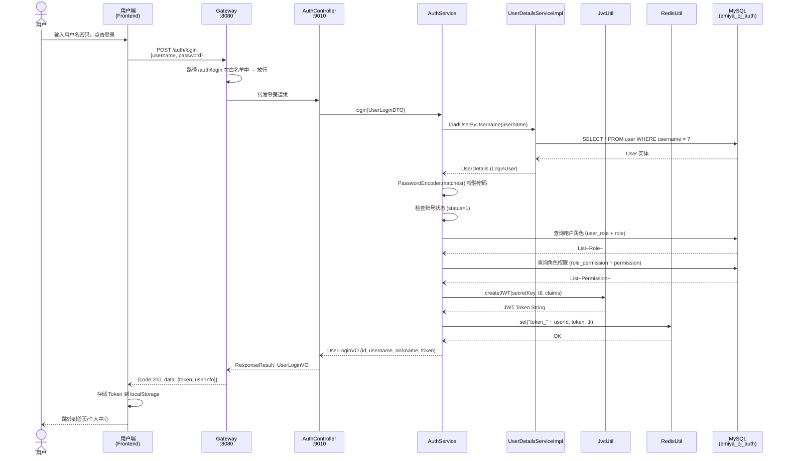

#### 3.3.2 请求鉴权流程

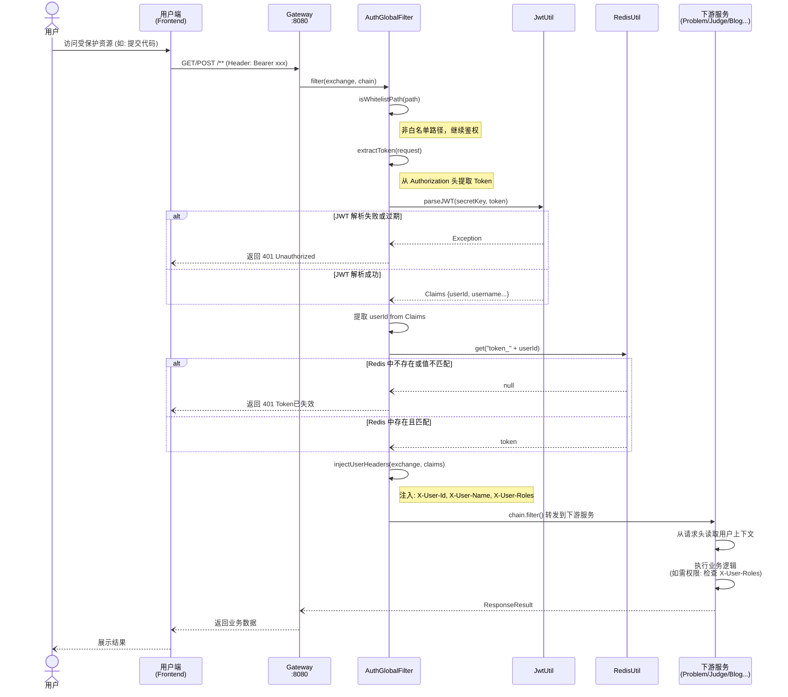

---

### 3.4 通信图 (Communication Diagram)

> ⚠️ Mermaid 不原生支持 UML 通信图，使用 flowchart LR + 编号消息近似表示。

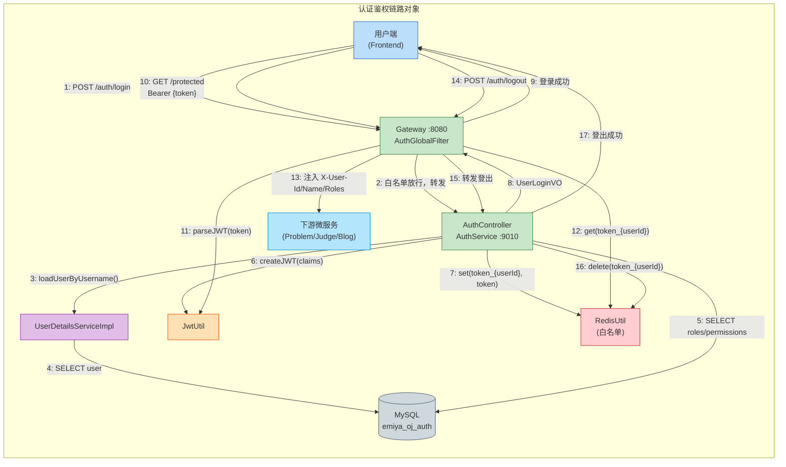

---

### 3.5 构件图 (Component Diagram)

> ⚠️ Mermaid 不原生支持 UML 构件图，使用 flowchart + subgraph 近似表示。

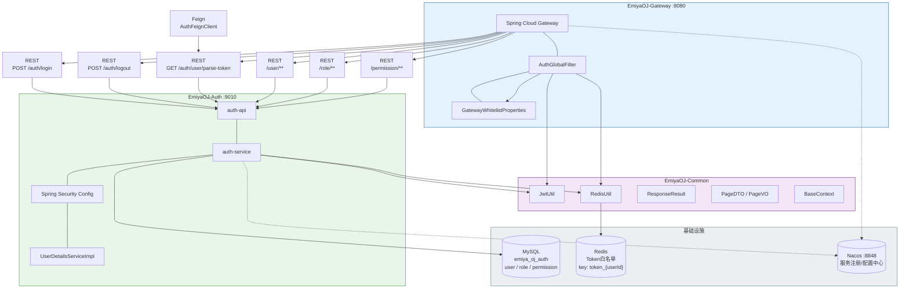

---

### 3.6 部署图 (Deployment Diagram)

> ⚠️ Mermaid 不原生支持 UML 部署图，使用 flowchart + subgraph 近似表示。

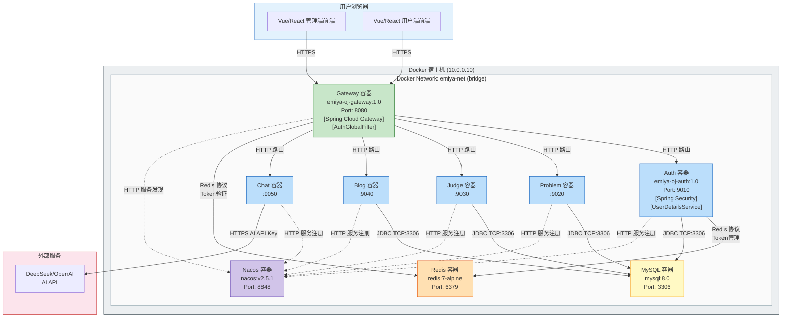

---

## 附录

### A. 与 PlantUML 版及现有文档交叉引用

| 文档 | 关联说明 |
|------|----------|
| `docs/UML2.0-完整建模.md` | **PlantUML 版**（同一建模内容，PlantUML 格式） |
| `docs/UML-Diagrams.md` | 现有早期 Mermaid 格式 UML 图（内容较简略） |
| `docs/EmiyaOJ-Cloud需求规格说明书.md` | 用例依据，参与者定义和功能需求 |
| `docs/EmiyaOJ-Cloud概要设计说明书.md` | 微服务架构、公共接口、JWT 设计 |
| `docs/详细设计/EmiyaOJ-Cloud判题提交子模块详细设计说明书.md` | 判题用例详细设计参考 |
| `docs/详细设计/EmiyaOJ-Cloud认证网关子模块详细设计说明书.md` | 认证用例详细设计参考 |
| `/memories/repo/EmiyaOJ-Cloud-Architecture.md` | 全系统架构、类、端口、数据表清单 |

### B. Mermaid vs PlantUML 对比

| 图类型 | Mermaid 支持 | PlantUML 支持 |
|--------|-------------|---------------|
| 用例图 | ⚠️ flowchart 近似 | ✅ 原生支持 |
| 活动图 | ✅ flowchart TD | ✅ 原生支持 |
| 类图 | ✅ classDiagram | ✅ 原生支持 |
| 时序图 | ✅ sequenceDiagram | ✅ 原生支持 |
| 通信图 | ⚠️ flowchart LR 近似 | ✅ 原生支持 |
| 构件图 | ⚠️ flowchart subgraph 近似 | ✅ 原生支持 |
| 部署图 | ⚠️ flowchart subgraph 近似 | ✅ 原生支持 |

### C. Mermaid 渲染方式

| 方式 | 说明 |
|------|------|
| VS Code 插件 | 安装 `Markdown Preview Mermaid Support` (bierner.markdown-mermaid) |
| 在线渲染 | 复制代码块到 [Mermaid Live Editor](https://mermaid.live/) |
| GitHub | GitHub 原生支持 Mermaid 渲染（README、Issue、PR） |
| IDEA 插件 | 安装 `Mermaid` 插件 (专业的 Mermaid 图表支持) |

### D. 图清单

| 序号 | 章节 | 图类型 | 图名 |
|------|------|--------|------|
| 1 | 一 | 用例图 | EmiyaOJ-Cloud 全系统用例图 |
| 2 | 二.1 | 活动图 | 代码提交与自动判题活动图 |
| 3 | 二.2 | 类图 | 判题模块核心类图 |
| 4 | 二.3 | 时序图 | 代码提交与异步判题时序图 |
| 5 | 二.4 | 通信图 | 判题链路通信图 |
| 6 | 二.5 | 构件图 | 判题模块构件图 |
| 7 | 二.6 | 部署图 | 判题链路部署图 |
| 8 | 三.1 | 活动图 | 用户认证与授权访问活动图 |
| 9 | 三.2 | 类图 | 认证授权模块核心类图 |
| 10 | 三.3a | 时序图 | 用户登录流程时序图 |
| 11 | 三.3b | 时序图 | 请求鉴权流程时序图 |
| 12 | 三.4 | 通信图 | 认证鉴权链路通信图 |
| 13 | 三.5 | 构件图 | 认证授权模块构件图 |
| 14 | 三.6 | 部署图 | 全系统部署拓扑图 |

---

> **文档版本**: v1.0  
> **建模工具**: Mermaid  
> **最后更新**: 2026-05-20  
> **对应 PlantUML 版**: `docs/UML2.0-完整建模.md`
