# EmiyaOJ-Cloud — UML 2.0 完整建模文档

> **项目**: EmiyaOJ-Cloud 在线判题系统  
> **架构**: Spring Cloud 微服务 (Gateway + Auth + Problem + Judge + Blog + Chat + Moderation)  
> **建模标准**: UML 2.0 (Unified Modeling Language)  
> **图格式**: PlantUML  
> **建模日期**: 2026-05-20  

---

## 目录

| 章节 | 内容 | 图数 |
|------|------|------|
| [一、系统用例图](#一系统用例图-use-case-diagram) | 全系统参与者与用例关系 | 1 |
| [二、重点用例①：代码提交与自动判题](#二重点用例代码提交与自动判题) | 活动图 / 类图 / 时序图 / 通信图 / 构件图 / 部署图 | 6 |
| [三、重点用例②：用户认证与授权访问](#三重点用例用户认证与授权访问) | 活动图 / 类图 / 时序图 / 通信图 / 构件图 / 部署图 | 6 |
| [附录](#附录) | 与现有 Mermaid 文档交叉引用 | — |

> **总计 13 张 UML 2.0 图**  
> **PlantUML 渲染**: 复制代码块到 [PlantUML Online](https://www.plantuml.com/plantuml/uml/) 或使用 VS Code PlantUML 插件预览

---

## 一、系统用例图 (Use Case Diagram)

### 1.1 全系统用例图

涵盖 EmiyaOJ-Cloud 全部参与者与 8 大功能模块的用例划分。

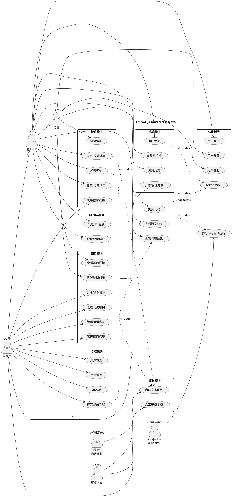

### 1.2 用例图说明

| 要素 | 说明 |
|------|------|
| 4 类人员参与者 | 访客、注册用户、管理员、审核人员 |
| 2 类外部系统 | Go-Judge 判题沙箱、阿里云内容审核服务 |
| 9 个功能模块 | 认证、题目、判题、博客、竞赛、AI助手、审核、管理 |
| 25 个用例 | 覆盖用户端和管理端全部功能 |
| 关键关系 | `<<include>>` = 必须包含；`<<extend>>` = 可选扩展；`--|>` = 角色继承 |

---

## 二、重点用例 ①：代码提交与自动判题

> **用例编号**: UC-JUDGE-001  
> **参与角色**: 注册用户（主参与者）、Go-Judge沙箱（辅助参与者）  
> **前置条件**: 用户已登录，题目存在且公开，编程语言已启用  
> **后置条件**: 系统创建提交记录，异步完成判题并更新状态  

---

### 2.1 活动图 (Activity Diagram)

描述从用户提交代码到判题结果生成的完整业务流程。

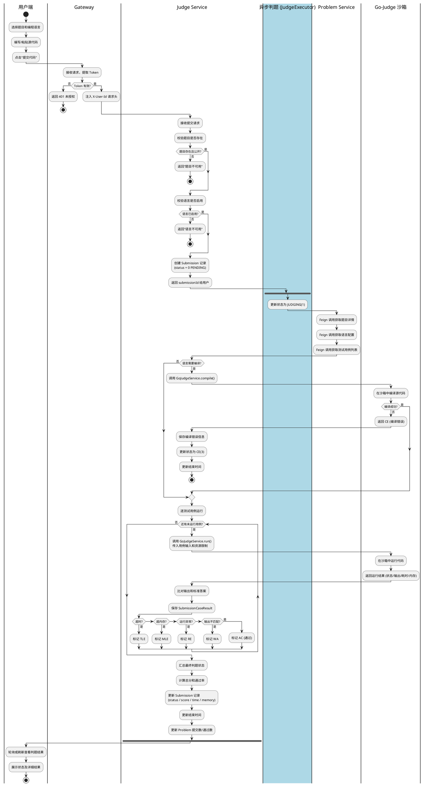

---

### 2.2 类图 (Class Diagram)

展示判题模块的核心实体类、服务类、以及跨服务 Feign 调用关系。

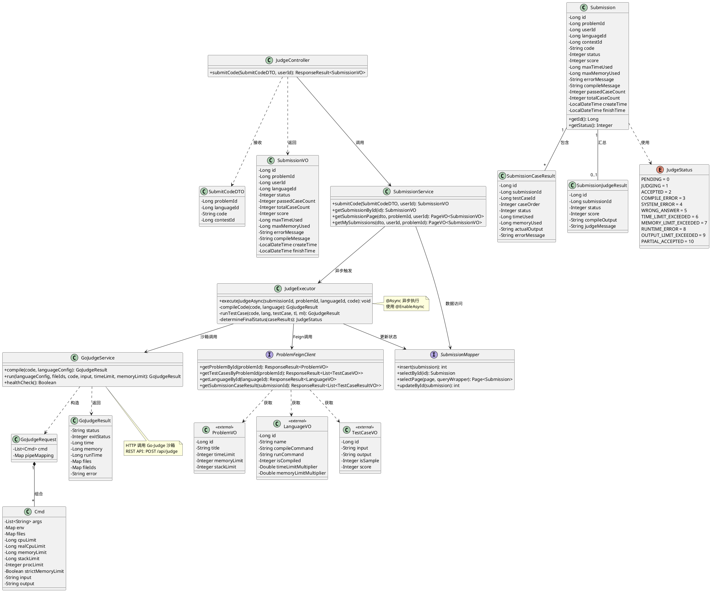

---

### 2.3 时序图 (Sequence Diagram)

展示代码提交与异步判题的完整交互消息链。

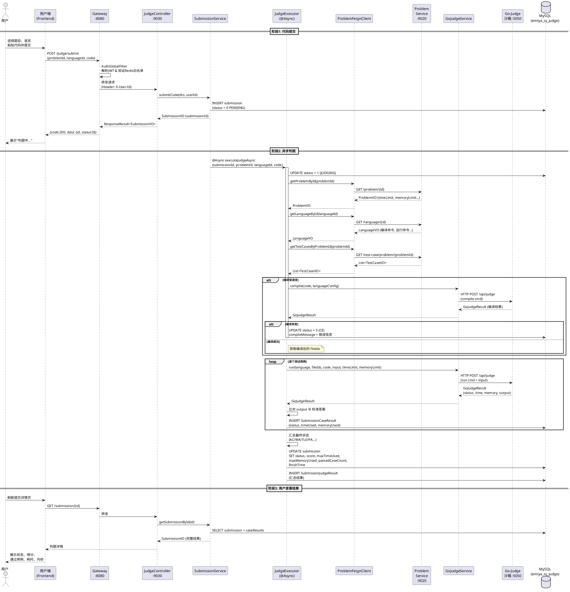

---

### 2.4 通信图 (Communication Diagram)

展示判题链路中各对象间的链接与消息传递（与 2.3 时序图对应）。

```plantuml
@startuml Judge-Communication
skinparam rectangleBorderColor #1565C0
skinparam rectangleBackgroundColor #E3F2FD
skinparam defaultFontSize 12

rectangle "用户端\n(Frontend)" as FE
rectangle "Gateway\n:8080" as GW
rectangle "JudgeController\nJudgeService" as JC [
**JudgeController**
--
+ submitCode()
--
**SubmissionService**
--
+ submitCode()
+ getSubmissionById()
]
rectangle "JudgeExecutor\n(@Async)" as JE [
**JudgeExecutor**
--
+ executeJudgeAsync()
- compileCode()
- runTestCase()
]
rectangle "GoJudgeService" as GJS [
**GoJudgeService**
--
+ compile()
+ run()
]
rectangle "ProblemService\n:9020" as PS [
**ProblemService**
--
题目/语言/测试用例
数据源
]
rectangle "Go-Judge 沙箱\n:5050" as GJ
database "MySQL\n(emiya_oj_judge)" as DB

' === 交互链接 ===
FE -[#blue]> GW : 1: POST /judge/submit
GW -[#blue]> JC : 2: 路由转发\n(X-User-Id)
JC -[#blue]> DB : 3: INSERT submission\n(PENDING)
JC -[#blue]> JE : 4: @Async 触发判题

JE -[#green]> PS : 5: Feign 调用\n获取题目/语言/测试用例
JE -[#green]> GJS : 6: 调用编译服务

GJS -[#red]> GJ : 7: HTTP POST\n编译/运行代码
GJ -[#red]> GJS : 8: 返回运行结果

JE -[#green]> GJS : 9: 逐用例运行
GJS -[#red]> GJ : 10: HTTP POST\n每个测试用例

JE -[#blue]> DB : 11: INSERT SubmissionCaseResult
JE -[#blue]> DB : 12: UPDATE/INSERT\n汇总结果

FE -[#blue]> GW : 13: GET /submission/{id}
GW -[#blue]> JC : 14: 路由转发
JC -[#blue]> DB : 15: SELECT 提交详情
JC -[#blue]> FE : 16: 返回完整结果

note bottom of JE
  @Async异步执行
  Spring异步线程池
end note

@enduml
```

---

### 2.5 构件图 (Component Diagram)

展示判题链路涉及的软件构件及其接口依赖。

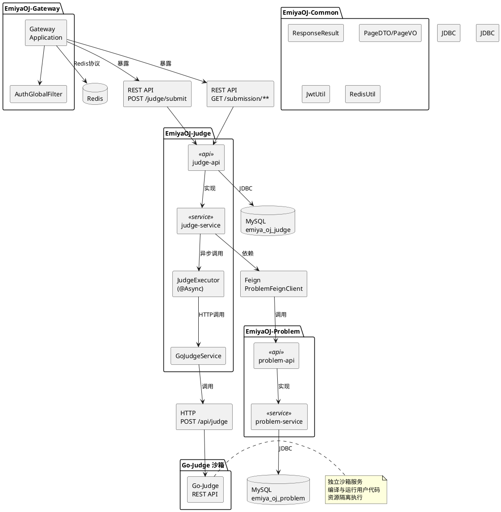

---

### 2.6 部署图 (Deployment Diagram)

展示判题链路的物理部署节点及通信协议。

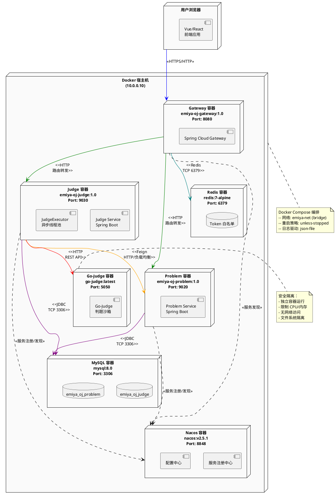

---

## 三、重点用例 ②：用户认证与授权访问

> **用例编号**: UC-AUTH-001  
> **参与角色**: 访客（注册/登录）、注册用户（登出/鉴权访问）、管理员（RBAC 管理）  
> **前置条件**: 系统已部署 Gateway / Auth / Redis / MySQL  
> **后置条件**: 用户获得 JWT Token，可访问受保护资源  

---

### 3.1 活动图 (Activity Diagram)

描述用户登录、Token 签发、请求鉴权与 RBAC 权限校验的完整流程。

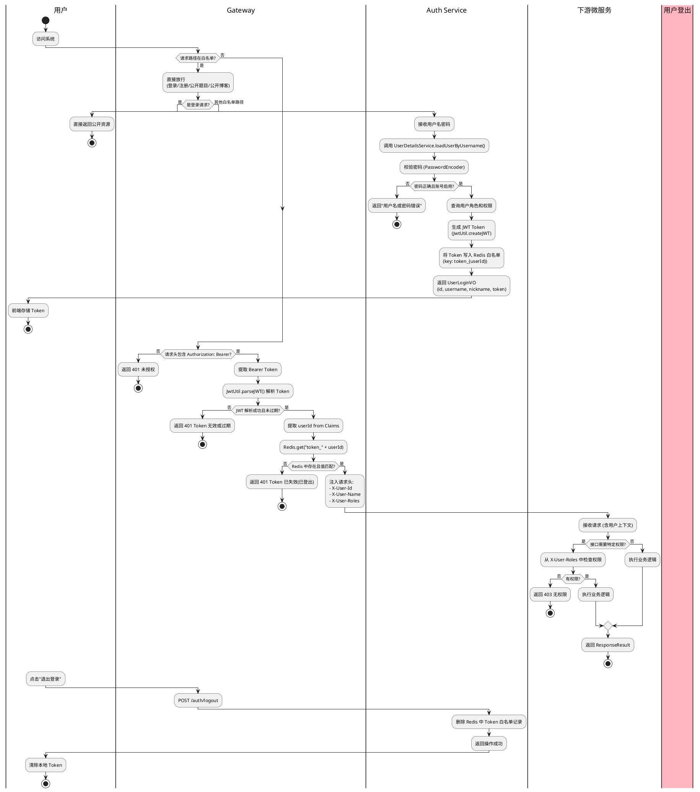

---

### 3.2 类图 (Class Diagram)

展示认证授权模块的核心实体类、服务类、Spring Security 集成及网关过滤器。

```plantuml
@startuml Auth-Class
skinparam classAttributeIconSize 0

' === 实体类 ===
class User {
  - Long id
  - String username
  - String password
  - String nickname
  - String email
  - String phone
  - String avatar
  - Integer status
  - Integer deleted
  - LocalDateTime createTime
  - LocalDateTime updateTime
  - Long createBy
  - Long updateBy
  + getAuthorities(): Collection<GrantedAuthority>
}

class Role {
  - Long id
  - String roleCode
  - String roleName
  - String description
  - Integer status
  - Integer deleted
  - LocalDateTime createTime
  - LocalDateTime updateTime
}

class Permission {
  - Long id
  - Long parentId
  - String permissionCode
  - String permissionName
  - Integer permissionType
  - String path
  - String component
  - String icon
  - Integer sortOrder
  - Integer status
  - List<Permission> children
}

class UserRole {
  - Long id
  - Long userId
  - Long roleId
  - LocalDateTime createTime
  - Long createBy
}

class RolePermission {
  - Long roleId
  - Long permissionId
  - LocalDateTime createTime
}

class LoginUser {
  - User user
  - Collection<GrantedAuthority> authorities
  - List<String> permissions
  + getAuthorities(): Collection<GrantedAuthority>
  + getPassword(): String
  + getUsername(): String
  + isAccountNonLocked(): boolean
  + isEnabled(): boolean
}

enum PermissionTypeEnum {
  MENU = 1
  BUTTON = 2
  API = 3
}

' === DTO/VO ===
class UserLoginDTO {
  - String username
  - String password
}

class UserLoginVO {
  - Long id
  - String username
  - String nickname
  - String token
}

class UserAuthDTO {
  - Long userId
  - String username
  - List<String> permissions
}

class UserSaveDTO {
  - Long id
  - String username
  - String password
  - String nickname
  - String email
  - String phone
  - Integer status
}

class RoleSaveDTO {
  - Long id
  - String roleCode
  - String roleName
  - String description
  - Integer status
}

class PermissionSaveDTO {
  - Long id
  - Long parentId
  - String permissionCode
  - String permissionName
  - Integer permissionType
  - String path
  - Integer sortOrder
  - Integer status
}

' === Controller ===
class AuthController {
  + login(UserLoginDTO): ResponseResult<UserLoginVO>
  + logout(userId): ResponseResult<?>
  + parseToken(token): ResponseResult<UserAuthDTO>
}

class UserController {
  + page(PageDTO): ResponseResult<PageVO<UserVO>>
  + getById(id): ResponseResult<UserVO>
  + save(UserSaveDTO): ResponseResult<Void>
  + update(UserSaveDTO): ResponseResult<Void>
  + delete(id): ResponseResult<Void>
  + resetPassword(id): ResponseResult<Void>
  + updateStatus(id, status): ResponseResult<Void>
  + assignRoles(id, roleIds): ResponseResult<Void>
  + hasPermission(id, code): ResponseResult<Boolean>
  + hasRole(id, code): ResponseResult<Boolean>
}

class RoleController {
  + page(RoleQueryDTO): ResponseResult<PageVO<RoleVO>>
  + list(): ResponseResult<List<RoleVO>>
  + getById(id): ResponseResult<RoleVO>
  + save(RoleSaveDTO): ResponseResult<Void>
  + update(RoleSaveDTO): ResponseResult<Void>
  + delete(id): ResponseResult<Void>
  + updateStatus(id, status): ResponseResult<Void>
  + assignPermissions(id, permIds): ResponseResult<Void>
  + exists(code): ResponseResult<Boolean>
}

class PermissionController {
  + list(PermissionQueryDTO): ResponseResult<List<PermissionVO>>
  + tree(PermissionQueryDTO): ResponseResult<List<PermissionVO>>
  + getById(id): ResponseResult<PermissionVO>
  + save(PermissionSaveDTO): ResponseResult<Void>
  + update(PermissionSaveDTO): ResponseResult<Void>
  + delete(id): ResponseResult<Void>
  + updateStatus(id, status): ResponseResult<Void>
  + exists(code): ResponseResult<Boolean>
}

' === Service ===
class AuthService {
  + login(UserLoginDTO): UserLoginVO
  + logout(userId): void
  + parseToken(token): UserAuthDTO
}

class UserServiceImpl {
  + selectUserPage(PageDTO): PageVO<UserVO>
  + selectUserById(id): UserVO
  + saveUser(UserSaveDTO): void
  + updateUser(UserSaveDTO): void
  + deleteUser(id): void
  + resetPassword(id): void
  + updateUserStatus(id, status): void
  + assignRoles(id, roleIds): void
  + hasPermission(id, code): Boolean
  + hasRole(id, code): Boolean
}

class RoleServiceImpl {
  + selectRolePage(RoleQueryDTO): PageVO<RoleVO>
  + selectAllRoles(): List<RoleVO>
  + selectRoleById(id): RoleVO
  + saveRole(RoleSaveDTO): void
  + updateRole(RoleSaveDTO): void
  + deleteRole(id): void
  + updateRoleStatus(id, status): void
  + assignPermissions(id, permIds): void
  + existsRoleCode(code): Boolean
}

class PermissionServiceImpl {
  + selectPermissionList(dto): List<PermissionVO>
  + selectPermissionTree(dto): List<PermissionVO>
  + selectPermissionById(id): PermissionVO
  + savePermission(dto): void
  + updatePermission(dto): void
  + deletePermission(id): void
  + updatePermissionStatus(id, status): void
  + existsPermissionCode(code): Boolean
}

' === Spring Security ===
class UserDetailsServiceImpl {
  + loadUserByUsername(username): UserDetails
}

class SecurityConfig {
  + authenticationManager(): AuthenticationManager
  + passwordEncoder(): PasswordEncoder
  + securityFilterChain(http): SecurityFilterChain
}

' === Gateway Filter ===
class AuthGlobalFilter {
  - JwtUtil jwtUtil
  - RedisUtil redisUtil
  - GatewayWhitelistProperties whitelist
  + filter(exchange, chain): Mono<Void>
  - isWhitelistPath(path): Boolean
  - extractToken(request): String
  - validateToken(token): Claims
  - injectUserHeaders(exchange, claims): void
}

' === Common 工具 ===
class JwtUtil {
  - String secretKey
  - Long ttlMillis
  + createJWT(claims): String
  + parseJWT(token): Claims
  - getKey(): SecretKey
}

class RedisUtil {
  - StringRedisTemplate redisTemplate
  + set(key, value): void
  + set(key, value, ttl): void
  + get(key): String
  + delete(key): void
  + exists(key): Boolean
}

' === Mapper ===
interface UserMapper
interface RoleMapper
interface PermissionMapper
interface UserRoleMapper
interface RolePermissionMapper

' ====== 关系 ======

' 实体关系
User "1" -- "*" UserRole : 拥有
Role "1" -- "*" UserRole : 被分配
Role "1" -- "*" RolePermission : 包含
Permission "1" -- "*" RolePermission : 被授予
Permission "1" -- "*" Permission : 父子递归

' Controller → Service
AuthController --> AuthService : 调用
UserController --> UserServiceImpl : 调用
RoleController --> RoleServiceImpl : 调用
PermissionController --> PermissionServiceImpl : 调用

' Service → Mapper
UserServiceImpl --> UserMapper : 数据访问
RoleServiceImpl --> RoleMapper : 数据访问
PermissionServiceImpl --> PermissionMapper : 数据访问

' AuthService 依赖
AuthService --> UserDetailsServiceImpl : 认证
AuthService --> JwtUtil : 生成Token
AuthService --> RedisUtil : 白名单管理

' Security
UserDetailsServiceImpl ..|> UserDetailsService <<interface>>
UserDetailsServiceImpl --> UserMapper : 查询用户
SecurityConfig --> UserDetailsServiceImpl : 配置
LoginUser ..|> UserDetails <<interface>>
LoginUser --> User : 包装

' Gateway Filter
AuthGlobalFilter --> JwtUtil : 解析Token
AuthGlobalFilter --> RedisUtil : 验证白名单

' DTO 使用
AuthController ..> UserLoginDTO : 接收
AuthController ..> UserLoginVO : 返回
UserController ..> UserSaveDTO : 接收
RoleController ..> RoleSaveDTO : 接收
PermissionController ..> PermissionSaveDTO : 接收
Permission ..> PermissionTypeEnum : 类型

note right of AuthGlobalFilter
  implements GlobalFilter, Ordered
  所有请求经过此过滤器
  白名单路径直接放行
  非白名单路径需Token校验
end note

note bottom of SecurityConfig
  @Configuration
  @EnableWebSecurity
  Spring Security 6.x
end note

@enduml
```

---

### 3.3 时序图 (Sequence Diagram)

展示 (a) 用户登录流程 和 (b) 请求鉴权流程。

#### 3.3.1 用户登录流程

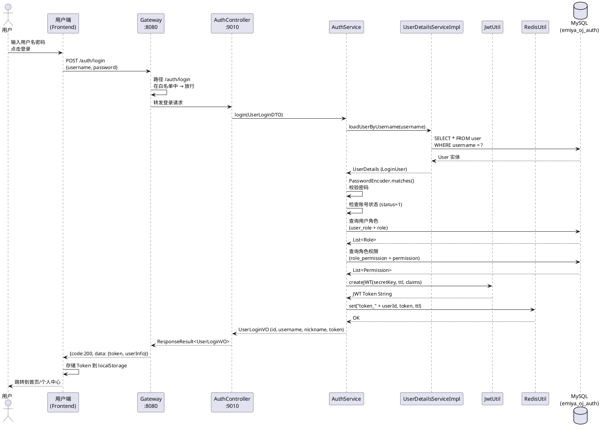

#### 3.3.2 请求鉴权流程

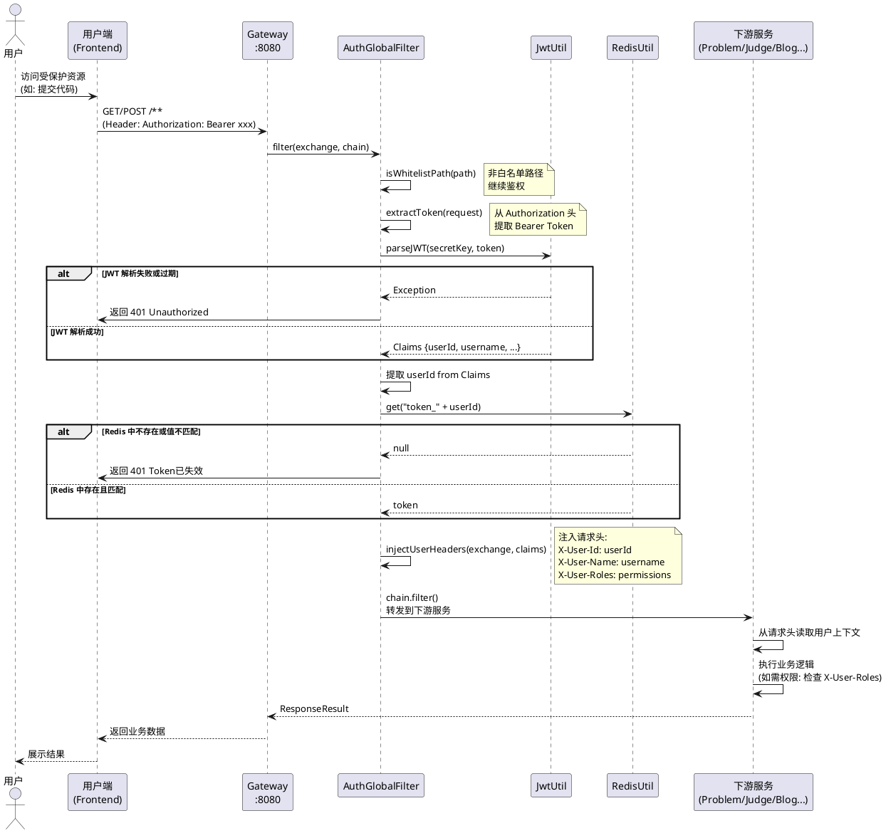

---

### 3.4 通信图 (Communication Diagram)

展示认证鉴权链路中各对象间的链接与消息传递。

```plantuml
@startuml Auth-Communication
skinparam rectangleBorderColor #6A1B9A
skinparam rectangleBackgroundColor #F3E5F5
skinparam defaultFontSize 12

rectangle "用户端\n(Frontend)" as FE
rectangle "Gateway\n:8080\nAuthGlobalFilter" as GW [
**AuthGlobalFilter**
--
+ filter()
- isWhitelistPath()
- extractToken()
- injectUserHeaders()
]
rectangle "AuthController\nAuthService" as Auth [
**AuthService**
--
+ login()
+ logout()
+ parseToken()
]
rectangle "UserDetailsServiceImpl" as UDS [
**UserDetailsServiceImpl**
--
+ loadUserByUsername()
]
rectangle "JwtUtil" as JWT [
**JwtUtil**
--
+ createJWT()
+ parseJWT()
]
rectangle "RedisUtil\n(Redis白名单)" as Redis [
**RedisUtil**
--
+ set()
+ get()
+ delete()
]
database "MySQL\n(emiya_oj_auth)" as DB
rectangle "下游微服务\n(Problem/Judge/Blog)" as DS

' === 登录链路 ===
FE -[#purple]> GW : 1: POST /auth/login\n{username, password}
GW -[#purple]> Auth : 2: 白名单放行\n转发登录请求
Auth -[#purple]> UDS : 3: loadUserByUsername()
UDS -[#purple]> DB : 4: SELECT user
Auth -[#purple]> DB : 5: SELECT roles / permissions
Auth -[#purple]> JWT : 6: createJWT(claims)
Auth -[#purple]> Redis : 7: set(token_{userId}, token)
Auth -[#purple]> GW : 8: UserLoginVO {token}
GW -[#purple]> FE : 9: 登录成功

' === 鉴权链路 ===
FE -[#teal]> GW : 10: GET /protected\nHeader: Bearer {token}
GW -[#teal]> JWT : 11: parseJWT(token)
GW -[#teal]> Redis : 12: get(token_{userId})
GW -[#teal]> DS : 13: 注入 X-User-Id/X-User-Name\nX-User-Roles

' === 登出链路 ===
FE -[#red]> GW : 14: POST /auth/logout
GW -[#red]> Auth : 15: 转发登出请求
Auth -[#red]> Redis : 16: delete(token_{userId})
Auth -[#red]> FE : 17: 登出成功

note right of GW
  1. 白名单路径直接放行
  2. 非白名单路径必须
     校验 JWT + Redis 白名单
  3. 认证通过后注入用户上下文
end note

@enduml
```

---

### 3.5 构件图 (Component Diagram)

展示认证授权模块的软件构件、接口及依赖关系。

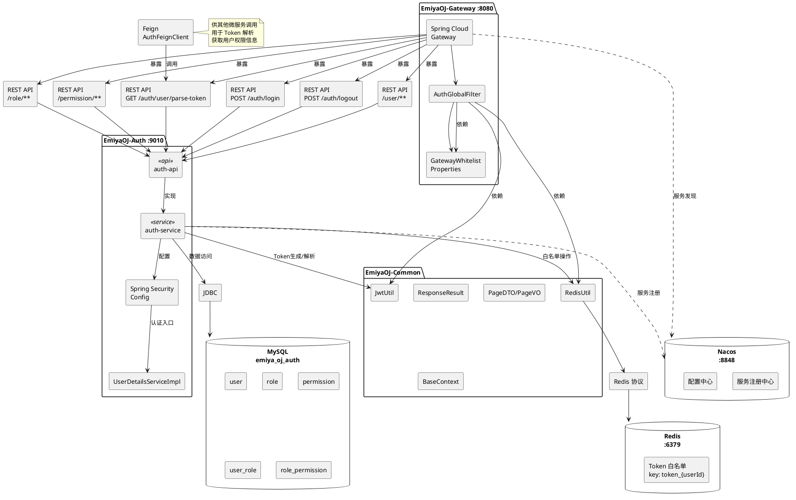

---

### 3.6 部署图 (Deployment Diagram)

展示认证链路的物理部署节点与网络拓扑。

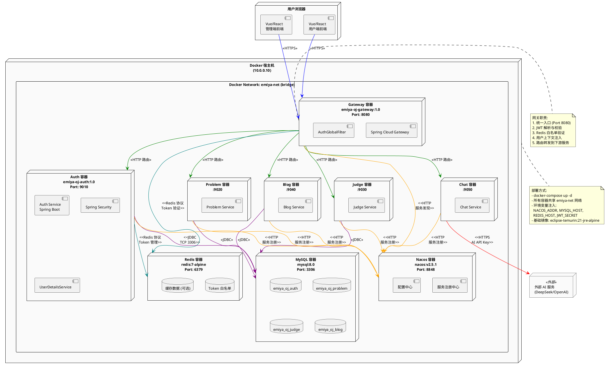

---

## 附录

### A. 与现有文档交叉引用

| 文档 | 关联说明 |
|------|----------|
| `docs/UML-Diagrams.md` | 现有 Mermaid 格式 UML 图；本文件提供 PlantUML 格式的完整替代 |
| `docs/EmiyaOJ-Cloud需求规格说明书.md` | 用例依据，参与者定义和功能需求 |
| `docs/EmiyaOJ-Cloud概要设计说明书.md` | 微服务架构、公共接口、JWT 设计 |
| `docs/详细设计/EmiyaOJ-Cloud判题提交子模块详细设计说明书.md` | 判题用例的详细设计参考 |
| `docs/详细设计/EmiyaOJ-Cloud认证网关子模块详细设计说明书.md` | 认证用例的详细设计参考 |
| `docs/Judge-Submission-API.md` | 判题提交接口定义 |
| `docs/Blog-API.md` | 博客接口定义 |
| `/memories/repo/EmiyaOJ-Cloud-Architecture.md` | 全系统架构、类、端口、数据表清单 |

### B. PlantUML 渲染方式

| 方式 | 说明 |
|------|------|
| VS Code 插件 | 安装 `PlantUML` 扩展 (jebbs.plantuml)，打开 `.md` 文件预览 |
| 在线渲染 | 复制代码块到 [PlantUML Online Server](https://www.plantuml.com/plantuml/uml/) |
| 命令行 | `java -jar plantuml.jar docs/UML2.0-完整建模.md` 生成 PNG/SVG |
| IDEA 插件 | IntelliJ IDEA Ultimate 自带 PlantUML 支持 |

### C. 图清单

| 序号 | 章节 | 图类型 | 图名 |
|------|------|--------|------|
| 1 | 一 | 用例图 | EmiyaOJ-Cloud 全系统用例图 |
| 2 | 二.1 | 活动图 | 代码提交与自动判题活动图 |
| 3 | 二.2 | 类图 | 判题模块核心类图 |
| 4 | 二.3 | 时序图 | 代码提交与异步判题时序图 |
| 5 | 二.4 | 通信图 | 判题链路通信图 |
| 6 | 二.5 | 构件图 | 判题模块构件图 |
| 7 | 二.6 | 部署图 | 判题链路部署图 |
| 8 | 三.1 | 活动图 | 用户认证与授权访问活动图 |
| 9 | 三.2 | 类图 | 认证授权模块核心类图 |
| 10 | 三.3 | 时序图 | 用户登录 & 请求鉴权时序图 (2张) |
| 11 | 三.4 | 通信图 | 认证鉴权链路通信图 |
| 12 | 三.5 | 构件图 | 认证授权模块构件图 |
| 13 | 三.6 | 部署图 | 认证链路部署图 |

---

> **文档版本**: v1.0  
> **建模工具**: PlantUML  
> **最后更新**: 2026-05-20  
> **建模人**: EmiyaOJ-Cloud 开发小组
