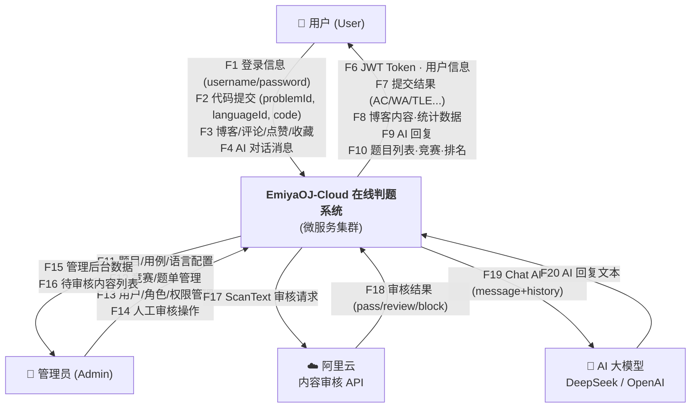
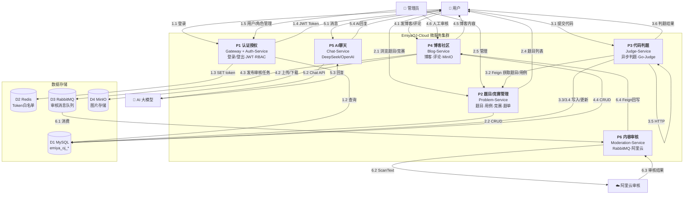
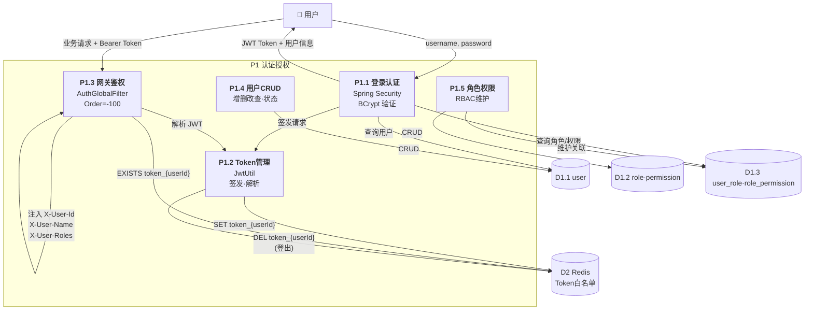
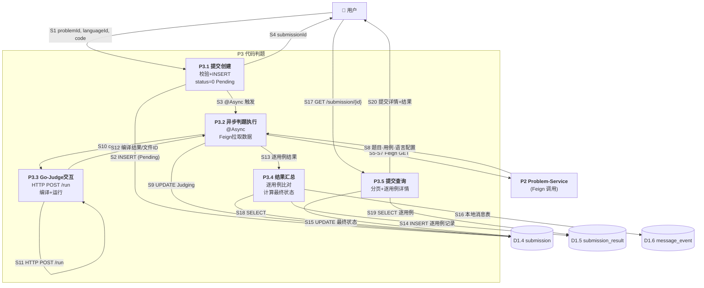
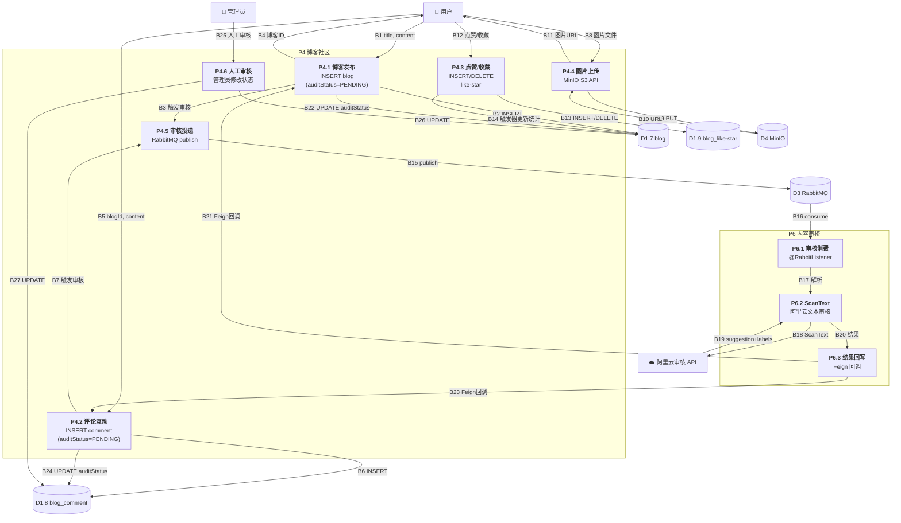
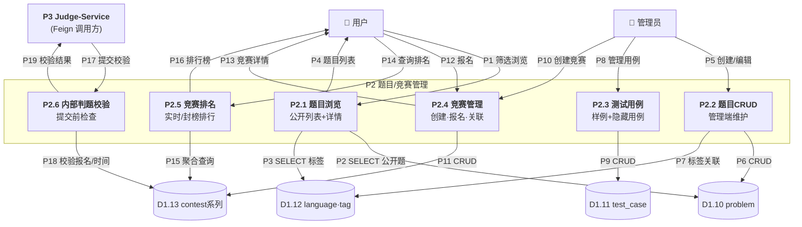
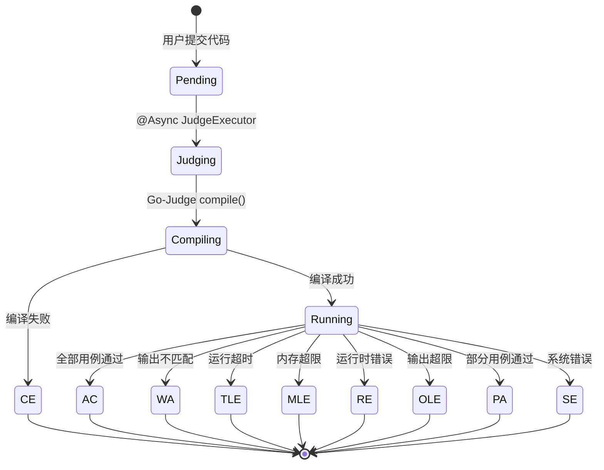
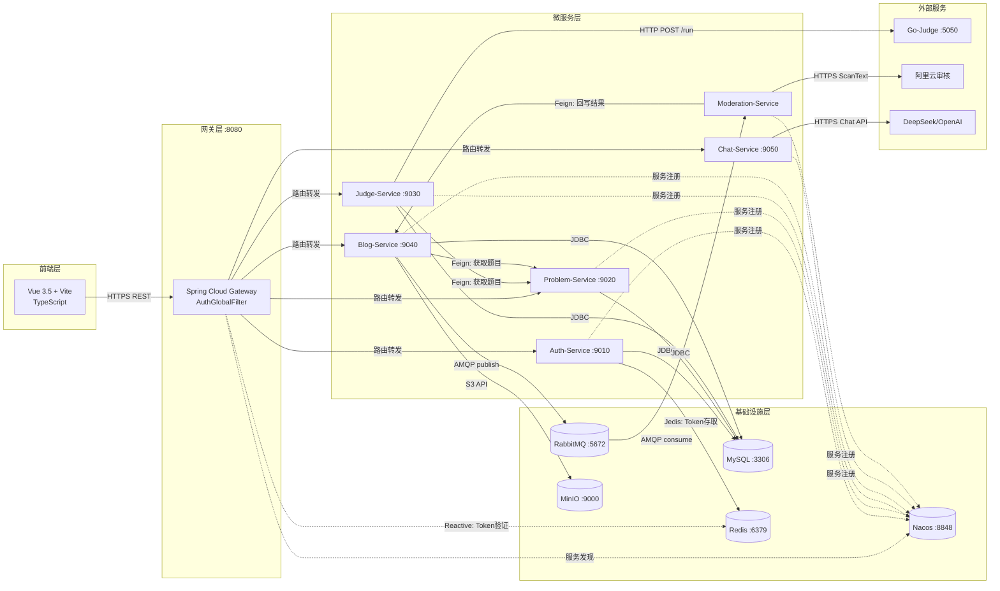

# EmiyaOJ-Cloud 数据流图 (Mermaid 格式)

## Level 0: 上下文图 (Context Diagram)

---

## Level 1: 系统级数据流图

---

## Level 2: P1 认证授权子过程

---

## Level 2: P3 代码判题子过程

---

## Level 2: P4/P6 博客发布与内容审核子过程

---

## Level 2: P2 题目/竞赛管理子过程

---

## 判题状态数据流

---

## 技术栈数据流

