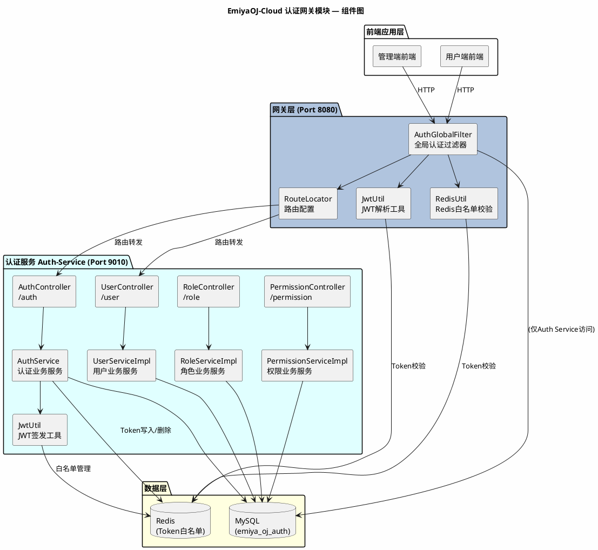
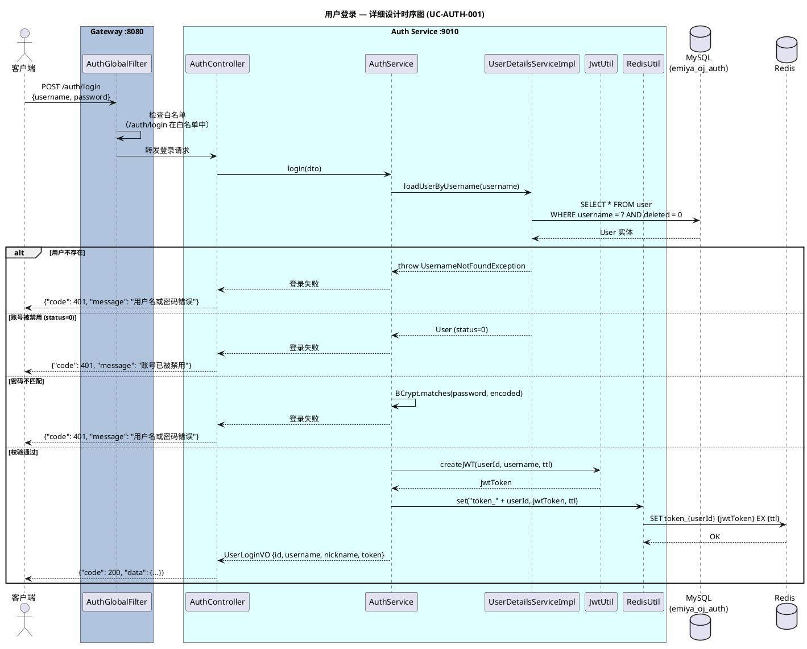
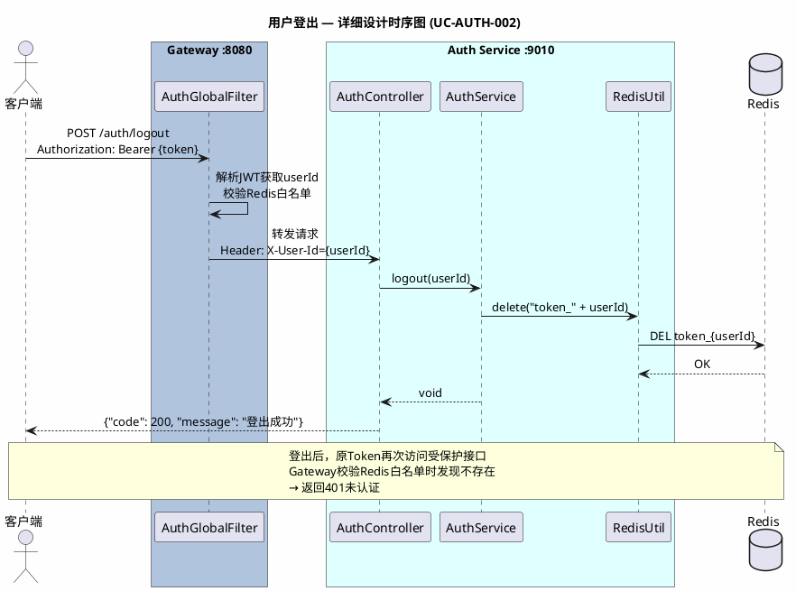
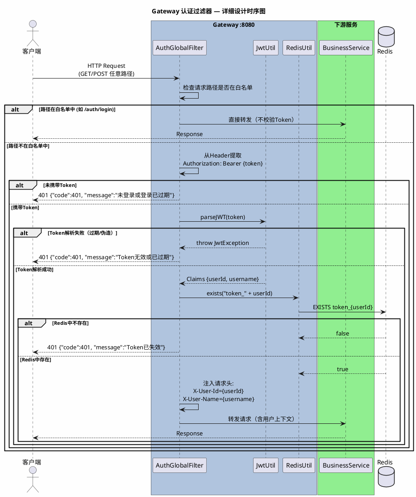
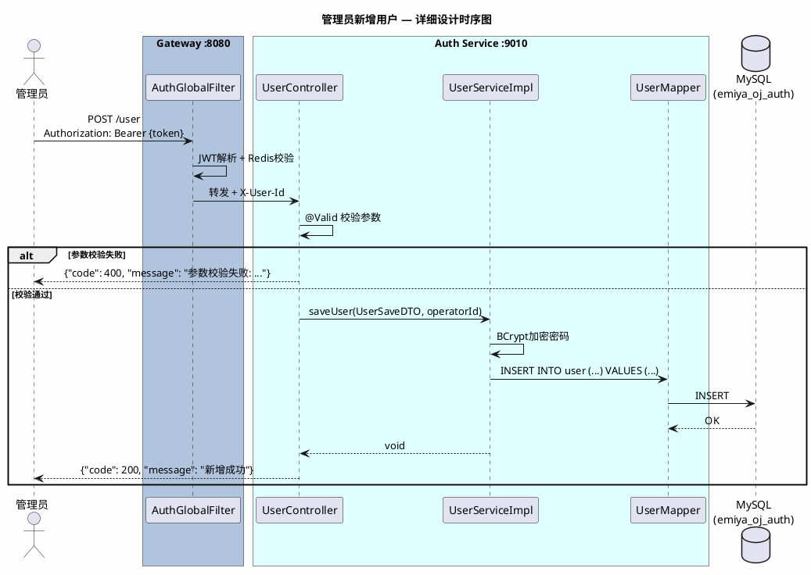
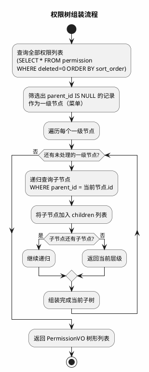
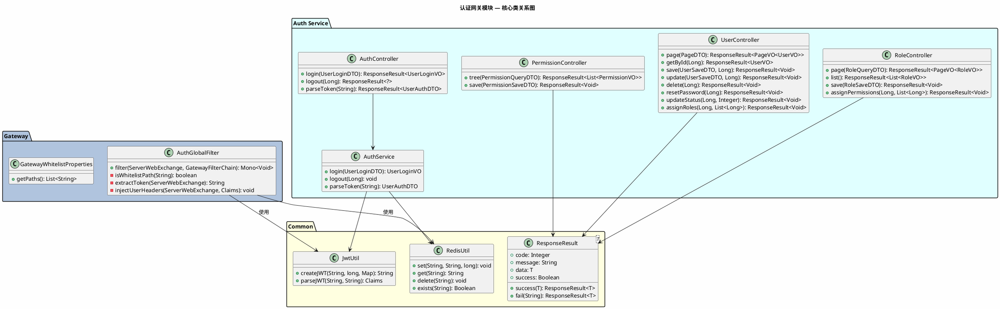
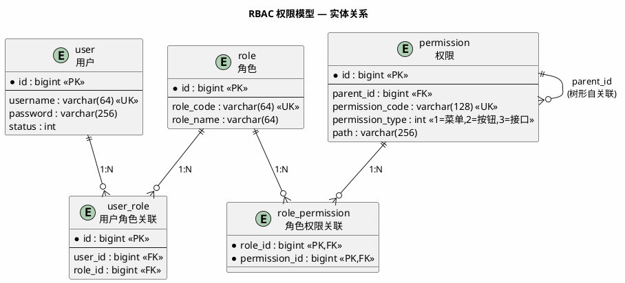

# 《EmiyaOJ-Cloud 在线判题系统》

# 认证网关模块 — 详细设计说明书

| 项目 | 内容 |
| --- | --- |
| 文档名称 | EmiyaOJ-Cloud 认证网关模块详细设计说明书 |
| 所属系统 | EmiyaOJ-Cloud 在线判题系统 |
| 文档版本 | V1.0 |
| 编写日期 | 2026 年 5 月 21 日 |
| 项目性质 | 大学生软件工程实训小组作业 |
| 文档格式 | Markdown |

---

## 1. 引言

### 1.1 编写目的

本详细设计说明书适用于软件开发者与测试人员，旨在详细描述 EmiyaOJ-Cloud 认证网关模块的内部实现设计。文档覆盖 Gateway 网关服务与 Auth 认证服务的程序结构、核心类、接口时序、数据库表结构和异常处理方案，指导开发人员完成编码实现和单元测试，并为测试人员提供接口验证依据。

### 1.2 项目概况

EmiyaOJ-Cloud 是一个面向高校软件工程实训和在线编程训练场景的综合 OJ 平台。认证网关模块是整个系统的安全入口，负责统一鉴权、路由转发和用户上下文透传。模块由两个子服务组成：**EmiyaOJ-Gateway**（API 网关）和 **EmiyaOJ-Auth**（认证权限服务），二者紧密协作，共同实现 JWT + Redis 白名单双重认证和 RBAC 权限控制。

### 1.3 术语定义

| 术语 | 定义 |
| --- | --- |
| Gateway | API 网关，基于 Spring Cloud Gateway 构建，负责统一入口、路由转发和认证过滤 |
| Auth Service | 认证服务，负责用户登录/登出、JWT 签发和 RBAC 用户/角色/权限管理 |
| JWT | JSON Web Token，无状态认证凭证 |
| RBAC | Role-Based Access Control，基于角色的访问控制 |
| BCrypt | 不可逆密码加密算法 |
| X-User-Id | 网关注入的请求头，携带当前登录用户编号 |
| Redis Token 白名单 | 存储在 Redis 中的合法 Token 列表，用于实现主动登出 |

### 1.4 参考资料

| 资料 | 说明 |
| --- | --- |
| `docs/EmiyaOJ-Cloud软件工程实训大报告.md` | 模块功能描述、用例图和流程设计 |
| `docs/EmiyaOJ-Cloud需求规格说明书.md` | 认证网关功能需求 |
| `docs/EmiyaOJ-Cloud概要设计说明书.md` | 系统总体架构和接口规范 |
| `docs/登录认证时序图.puml` | 登录认证分析级时序图 |
| `docs/InitPermissionSql.md` | 权限初始化 SQL 说明 |
| `/memories/repo/EmiyaOJ-Cloud-Architecture.md` | 代码级架构参考 |
| `sql/emiya_oj_auth.sql` | 认证数据库表结构 |

---

## 2. 系统概述

### 2.1 系统架构

认证网关模块在整体系统中的位置如下：



---

## 3. 程序设计详细描述

### 3.1 子模块 1：用户登录

| 项目 | 内容 |
| --- | --- |
| 模块编号 | M-AUTH-001 |
| 源程序文件 | `EmiyaOJ-Auth/auth-service/.../controller/AuthController.java` |
| 功能 | 用户通过账号密码进行身份认证，系统校验通过后签发 JWT 并写入 Redis 白名单 |
| 输入参数 | `UserLoginDTO { username: String, password: String }` |
| 要访问的表 | `user`（emiya_oj_auth） |
| 外部依赖 | Redis（Token 白名单写入） |

**模块时序图：**



**接口说明：**

- **请求接口**：`POST /auth/login`
- **请求体**：
```json
{
    "username": "admin",
    "password": "123456"
}
```
- **成功响应**：
```json
{
    "code": 200,
    "message": "登录成功",
    "data": {
        "id": 1,
        "username": "admin",
        "nickname": "管理员",
        "token": "eyJhbGciOiJIUzI1NiJ9..."
    },
    "success": true
}
```
- **失败响应**：
```json
{
    "code": 401,
    "message": "用户名或密码错误",
    "data": null,
    "success": false
}
```

**出错处理：**

| 异常场景 | 响应码 | 提示信息 | 处理方式 |
| --- | --- | --- | --- |
| 用户名不存在 | 401 | 用户名或密码错误 | 不区分用户名/密码错误，防止用户枚举 |
| 密码不匹配 | 401 | 用户名或密码错误 | BCrypt.matches() 返回 false |
| 账号被禁用 | 401 | 账号已被禁用，请联系管理员 | 检查 user.status == 0 |
| Redis 不可用 | 500 | 系统繁忙，请稍后重试 | 捕获 RedisConnectionException |
| 参数为空 | 400 | 用户名和密码不能为空 | @Valid 校验 |

---

### 3.2 子模块 2：用户登出

| 项目 | 内容 |
| --- | --- |
| 模块编号 | M-AUTH-002 |
| 源程序文件 | `EmiyaOJ-Auth/auth-service/.../controller/AuthController.java` |
| 功能 | 用户主动登出，删除 Redis 白名单使当前 Token 即时失效 |
| 输入参数 | `@RequestHeader("X-User-Id") Long userId` |
| 要访问的表 | 无（仅操作 Redis） |
| 外部依赖 | Redis（删除 Token 白名单） |

**模块时序图：**



**接口说明：**

- **请求接口**：`POST /auth/logout`
- **请求头**：`Authorization: Bearer {token}`（Gateway 解析后注入 `X-User-Id`）
- **成功响应**：
```json
{
    "code": 200,
    "message": "登出成功",
    "data": null,
    "success": true
}
```

---

### 3.3 子模块 3：Gateway 认证过滤器

| 项目 | 内容 |
| --- | --- |
| 模块编号 | M-GW-001 |
| 源程序文件 | `EmiyaOJ-Gateway/.../filter/AuthGlobalFilter.java` |
| 功能 | 拦截所有请求，完成白名单放行、JWT 解析、Redis 白名单校验和用户上下文请求头注入 |
| 输入参数 | `ServerWebExchange`（请求上下文） |
| 要访问的表 | 无（仅操作 Redis） |
| 外部依赖 | Redis（Token 白名单校验） |

**模块时序图：**



**核心类设计：**

| 类名 | 方法 | 功能 |
| --- | --- | --- |
| `AuthGlobalFilter` | `filter(ServerWebExchange, GatewayFilterChain)` | 实现 GlobalFilter，完成认证过滤主逻辑 |
| `AuthGlobalFilter` | `isWhitelistPath(String path)` | 判断路径是否在白名单中 |
| `AuthGlobalFilter` | `extractToken(ServerWebExchange)` | 从 Authorization 头提取 Bearer Token |
| `AuthGlobalFilter` | `injectUserHeaders(ServerWebExchange, Claims)` | 注入 X-User-Id、X-User-Name 请求头 |
| `JwtUtil` | `parseJWT(String secretKey, String token)` | 解析 JWT 并返回 Claims |
| `GatewayWhitelistProperties` | `getPaths()` | 获取 YAML 配置的白名单路径列表 |

**白名单路径配置（application.yml）：**
```yaml
gateway:
  whitelist:
    paths:
      - /auth/login
      - /auth/register
      - /problem/list
      - /problem/{id}
      - /blog
      - /blog/query
      - /v3/api-docs/**
      - /swagger-ui/**
```

---

### 3.4 子模块 4：用户管理

| 项目 | 内容 |
| --- | --- |
| 模块编号 | M-AUTH-003 |
| 源程序文件 | `EmiyaOJ-Auth/auth-service/.../controller/UserController.java` |
| 功能 | 管理员维护用户信息（分页查询、详情、新增、编辑、删除、重置密码、启用/禁用、角色分配） |
| 输入参数 | `UserSaveDTO`、`PageDTO`、`@RequestHeader X-User-Id` |
| 要访问的表 | `user`、`user_role`（emiya_oj_auth） |

**模块时序图（用户新增）：**



**接口列表：**

| HTTP 方法 | 路径 | 功能 | 权限要求 |
| --- | --- | --- | --- |
| POST | /user/page | 分页查询用户列表 | 用户管理权限 |
| GET | /user/{id} | 查询用户详情 | 用户管理权限 |
| POST | /user | 新增用户 | 用户管理权限 |
| PUT | /user | 编辑用户 | 用户管理权限 |
| DELETE | /user/{id} | 删除用户（逻辑删除） | 用户管理权限 |
| DELETE | /user/batch | 批量删除用户 | 用户管理权限 |
| PUT | /user/{id}/reset-password | 重置密码 | 用户管理权限 |
| PUT | /user/{id}/status | 启用/禁用用户 | 用户管理权限 |
| PUT | /user/{id}/roles | 分配用户角色 | 用户管理权限 |
| GET | /user/{id}/permissions | 查询用户权限编码列表 | 认证通行 |
| GET | /user/{id}/has-permission | 检查用户是否拥有某权限 | 认证通行 |
| GET | /user/{id}/has-role | 检查用户是否拥有某角色 | 认证通行 |

---

### 3.5 子模块 5：角色管理

| 项目 | 内容 |
| --- | --- |
| 模块编号 | M-AUTH-004 |
| 源程序文件 | `EmiyaOJ-Auth/auth-service/.../controller/RoleController.java` |
| 功能 | 管理员维护角色信息（分页查询、列表、详情、新增、编辑、删除、启用/禁用、权限分配） |
| 输入参数 | `RoleSaveDTO`、`RoleQueryDTO` |
| 要访问的表 | `role`、`role_permission`、`user_role`（emiya_oj_auth） |

**接口列表：**

| HTTP 方法 | 路径 | 功能 |
| --- | --- | --- |
| POST | /role/page | 分页查询角色 |
| GET | /role/list | 查询全部角色列表 |
| GET | /role/{id} | 查询角色详情 |
| POST | /role | 新增角色 |
| PUT | /role | 编辑角色 |
| DELETE | /role/{id} | 删除角色 |
| DELETE | /role/batch | 批量删除角色 |
| PUT | /role/{id}/status | 启用/禁用角色 |
| PUT | /role/{id}/permissions | 为角色分配权限 |
| GET | /role/{id}/permissions | 查询角色拥有的权限 ID 列表 |
| GET | /role/exists | 检查角色编码是否存在 |
| GET | /role/user/{userId} | 查询用户拥有的角色列表 |

---

### 3.6 子模块 6：权限管理

| 项目 | 内容 |
| --- | --- |
| 模块编号 | M-AUTH-005 |
| 源程序文件 | `EmiyaOJ-Auth/auth-service/.../controller/PermissionController.java` |
| 功能 | 管理员维护权限树（菜单/按钮/接口三级），支持递归组装和条件查询 |
| 输入参数 | `PermissionSaveDTO`、`PermissionQueryDTO` |
| 要访问的表 | `permission`、`role_permission`（emiya_oj_auth） |

**权限树组装算法：**



**接口列表：**

| HTTP 方法 | 路径 | 功能 |
| --- | --- | --- |
| POST | /permission/list | 查询权限列表（扁平） |
| POST | /permission/tree | 查询权限树（递归组装） |
| GET | /permission/{id} | 查询权限详情 |
| POST | /permission | 新增权限 |
| PUT | /permission | 编辑权限 |
| DELETE | /permission/{id} | 删除权限（级联删除子权限） |
| DELETE | /permission/batch | 批量删除权限 |
| PUT | /permission/{id}/status | 启用/禁用权限 |
| GET | /permission/exists | 检查权限编码是否存在 |
| GET | /permission/role/{roleId} | 查询角色拥有的权限 |
| GET | /permission/user/{userId} | 查询用户拥有的权限 |

---

## 4. 表结构说明

### 4.1 认证数据库（emiya_oj_auth）

认证数据库包含 6 张表，用于存储用户、角色、权限及其关联关系。

#### 4.1.1 user 表

用于存放用户基础信息。

| 列名称 | 描述 | 类型 | Allow Null | 主键(PK)/外键(FK) |
| --- | --- | --- | --- | --- |
| id | 用户唯一编号 | bigint | NO | Yes，PK (ASSIGN_ID) |
| username | 用户名（登录账号） | varchar(64) | NO | UNIQUE |
| password | 密码（BCrypt 加密） | varchar(256) | NO | NO |
| nickname | 昵称 | varchar(64) | YES | NO |
| email | 邮箱 | varchar(128) | YES | UNIQUE |
| phone | 手机号 | varchar(20) | YES | NO |
| avatar | 头像地址 | varchar(512) | YES | NO |
| status | 状态：0-禁用, 1-启用 | int | NO | NO (DEFAULT 1) |
| deleted | 逻辑删除：0-未删除, 1-已删除 | int | NO | NO (DEFAULT 0) |
| create_time | 创建时间 | datetime | NO | NO |
| update_time | 更新时间 | datetime | YES | NO |
| create_by | 创建人 | bigint | YES | NO |
| update_by | 更新人 | bigint | YES | NO |

#### 4.1.2 role 表

用于存放角色信息。

| 列名称 | 描述 | 类型 | Allow Null | 主键(PK)/外键(FK) |
| --- | --- | --- | --- | --- |
| id | 角色编号 | bigint | NO | Yes，PK (AUTO) |
| role_code | 角色编码 | varchar(64) | NO | UNIQUE |
| role_name | 角色名称 | varchar(64) | NO | NO |
| description | 角色描述 | varchar(256) | YES | NO |
| status | 状态：0-禁用, 1-启用 | int | YES | NO (DEFAULT 1) |
| deleted | 逻辑删除 | int | YES | NO (DEFAULT 0) |
| create_time | 创建时间 | datetime | YES | NO |
| update_time | 更新时间 | datetime | YES | NO |
| create_by | 创建人 | bigint | YES | NO |
| update_by | 更新人 | bigint | YES | NO |

#### 4.1.3 permission 表

用于存放权限信息（支持菜单/按钮/接口三级树形结构）。

| 列名称 | 描述 | 类型 | Allow Null | 主键(PK)/外键(FK) |
| --- | --- | --- | --- | --- |
| id | 权限编号 | bigint | NO | Yes，PK (AUTO) |
| parent_id | 父权限编号（树形结构，NULL=顶级） | bigint | YES | FK → permission.id |
| permission_code | 权限编码 | varchar(128) | NO | UNIQUE |
| permission_name | 权限名称 | varchar(64) | NO | NO |
| permission_type | 类型：1-菜单, 2-按钮, 3-接口 | int | NO | NO |
| path | 路径或接口 URL | varchar(256) | YES | NO |
| component | 前端组件路径 | varchar(256) | YES | NO |
| icon | 图标 | varchar(64) | YES | NO |
| sort_order | 排序 | int | YES | NO |
| status | 状态：0-禁用, 1-启用 | int | YES | NO (DEFAULT 1) |
| deleted | 逻辑删除 | int | YES | NO (DEFAULT 0) |
| create_time | 创建时间 | datetime | YES | NO |
| update_time | 更新时间 | datetime | YES | NO |
| create_by | 创建人 | bigint | YES | NO |
| update_by | 更新人 | bigint | YES | NO |

#### 4.1.4 user_role 表

用户与角色多对多关联表。

| 列名称 | 描述 | 类型 | Allow Null | 主键(PK)/外键(FK) |
| --- | --- | --- | --- | --- |
| id | 编号 | bigint | NO | Yes，PK |
| user_id | 用户编号 | bigint | NO | FK → user.id |
| role_id | 角色编号 | bigint | NO | FK → role.id |
| create_time | 创建时间 | datetime | YES | NO |
| create_by | 创建人 | bigint | YES | NO |

- **联合唯一索引**：(user_id, role_id)

#### 4.1.5 role_permission 表

角色与权限多对多关联表。

| 列名称 | 描述 | 类型 | Allow Null | 主键(PK)/外键(FK) |
| --- | --- | --- | --- | --- |
| role_id | 角色编号 | bigint | NO | Yes，联合 PK |
| permission_id | 权限编号 | bigint | NO | Yes，联合 PK |
| create_time | 创建时间 | datetime | YES | NO |

#### 4.1.6 operation_log 表

操作日志表，用于审计追踪。

| 列名称 | 描述 | 类型 | Allow Null | 主键(PK)/外键(FK) |
| --- | --- | --- | --- | --- |
| id | 日志编号 | bigint | NO | Yes，PK |
| user_id | 操作用户 | bigint | YES | NO |
| operation | 操作名称 | varchar(128) | YES | NO |
| method | 请求方法 | varchar(256) | YES | NO |
| params | 请求参数 | text | YES | NO |
| ip | IP 地址 | varchar(64) | YES | NO |
| create_time | 操作时间 | datetime | YES | NO |

---

## 5. 公用接口

### 5.1 核心类关系图



### 5.2 RBAC 权限模型



### 5.3 全局变量

| 变量/常量 | 类型 | 说明 |
| --- | --- | --- |
| `JwtClaimsConstant.USER_ID` | String | JWT Claims 中的用户 ID 键名 |
| `JwtClaimsConstant.USERNAME` | String | JWT Claims 中的用户名键名 |
| `GatewayWhitelistProperties.paths` | List\<String\> | Gateway 白名单路径列表 |
| `X-User-Id` | HTTP Header | 网关注入的当前用户 ID |
| `X-User-Name` | HTTP Header | 网关注入的当前用户名 |

### 5.4 设计规则汇总

| 规则 | 说明 |
| --- | --- |
| 密码安全 | 采用 BCrypt 不可逆加密存储，登录时不返回密码 |
| Token 生命周期 | JWT 包含 userId 和过期时间；Redis 白名单支持主动登出 |
| 登录安全 | 登录失败不提示具体原因（用户名不存在 vs 密码错误），防止用户枚举 |
| RBAC | 用户-角色多对多，角色-权限多对多；权限支持树形层级（parent_id 自关联） |
| 权限类型 | 1-菜单（控制管理端菜单可见性）、2-按钮（控制操作按钮）、3-接口（控制 API 访问） |
| 逻辑删除 | 用户、角色、权限均采用逻辑删除（deleted=1），保留数据可追溯性 |
| Gateway 白名单 | 登录、注册、公开题目、公开博客、Swagger 等路径不校验 Token |
| 用户上下文传递 | Gateway 解析 JWT 后通过 X-User-Id、X-User-Name 请求头向下游服务传递 |

---

## 6. 附录

### 6.1 网关路由配置

```yaml
spring:
  cloud:
    gateway:
      routes:
        - id: auth-service
          uri: lb://auth-service
          predicates:
            - Path=/auth/**, /user/**, /role/**, /permission/**
        - id: problem-service
          uri: lb://problem-service
          predicates:
            - Path=/problem/**, /test-case/**, /language/**, /problem-set/**, /contest/**
        - id: judge-service
          uri: lb://judge-service
          predicates:
            - Path=/judge/**, /submission/**
        - id: blog-service
          uri: lb://blog-service
          predicates:
            - Path=/blog/**
        - id: chat-service
          uri: lb://chat-service
          predicates:
            - Path=/client/chat/**
        - id: moderation-service
          uri: lb://moderation-service
          predicates:
            - Path=/moderation/**
```

### 6.2 角色初始化数据

| role_code | role_name | 说明 |
| --- | --- | --- |
| admin | 管理员 | 拥有所有管理端权限 |
| teacher | 教师 | 可管理题目、竞赛、查看提交记录 |
| moderator | 审核人员 | 可进行博客审核操作 |
| user | 普通用户 | 用户端刷题和社区功能 |
