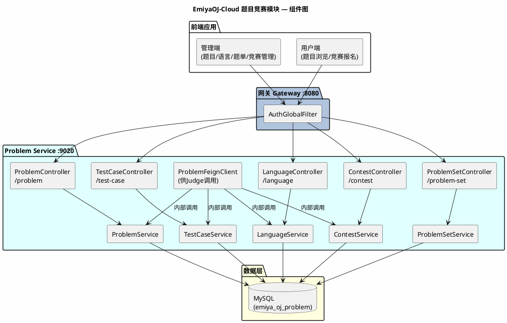
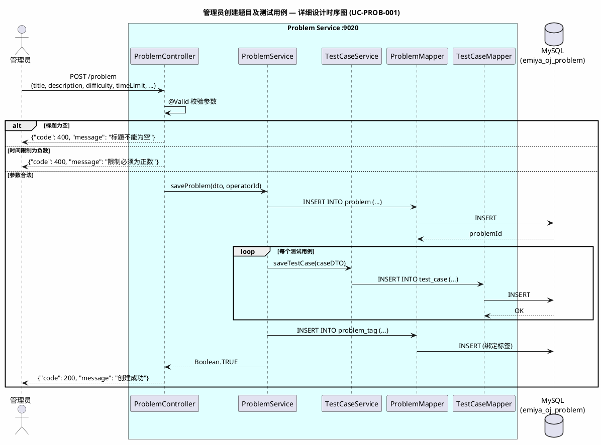
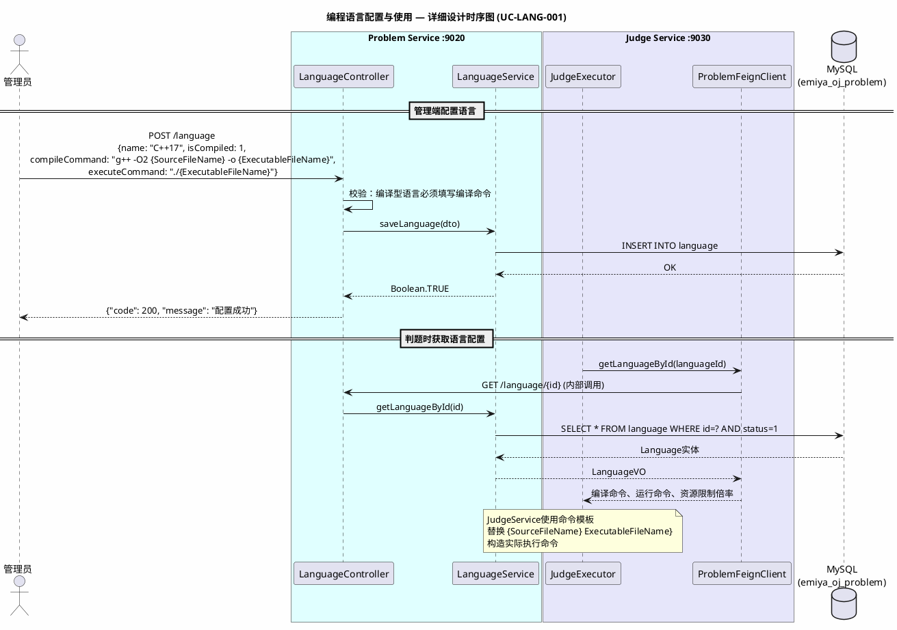
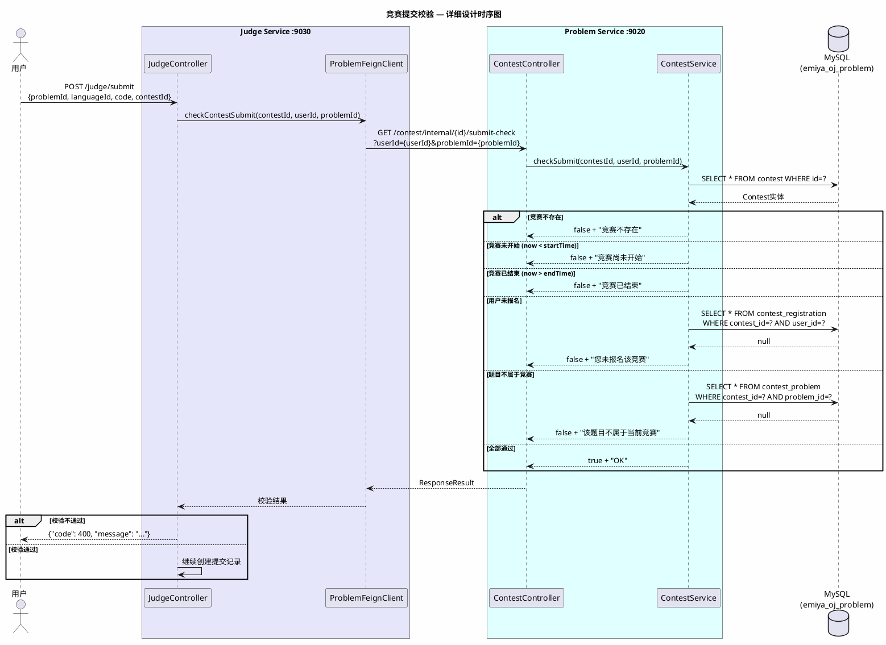
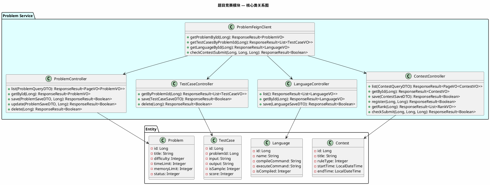

# 《EmiyaOJ-Cloud 在线判题系统》

# 题目竞赛模块 — 详细设计说明书

| 项目 | 内容 |
| --- | --- |
| 文档名称 | EmiyaOJ-Cloud 题目竞赛模块详细设计说明书 |
| 所属系统 | EmiyaOJ-Cloud 在线判题系统 |
| 文档版本 | V1.0 |
| 编写日期 | 2026 年 5 月 21 日 |
| 项目性质 | 大学生软件工程实训小组作业 |
| 文档格式 | Markdown |

---

## 1. 引言

### 1.1 编写目的

本详细设计说明书适用于软件开发者与测试人员，旨在详细描述 EmiyaOJ-Cloud 题目竞赛模块（EmiyaOJ-Problem）的内部实现设计。文档覆盖题目管理、测试用例管理、标签管理、编程语言配置、题单管理和竞赛管理的程序结构、核心类、接口时序、数据库表结构和异常处理方案。

### 1.2 项目概况

题目竞赛模块是 OJ 系统的核心资源管理模块，由 **EmiyaOJ-Problem** 微服务独立承担。该服务管理系统的全部题库资源（题目、测试用例、标签、编程语言、题单、竞赛），并通过 Feign 接口为判题服务（Judge Service）提供判题所需数据（题目限制、测试用例、语言命令、竞赛校验）。

### 1.3 术语定义

| 术语 | 定义 |
| --- | --- |
| Problem | 编程题目，包含题面描述、难度、时空限制等 |
| TestCase | 测试用例，分为样例用例（is_sample=1，用户可见）和隐藏用例（is_sample=0，仅判题使用） |
| Language | 编程语言配置，包含编译/运行命令模板和资源限制倍率 |
| ProblemSet | 题单，专题题目集合，支持排序 |
| Contest | 竞赛，支持 ACM/ICPC、IOI、Codeforces 三种规则 |
| Feign | 微服务间声明式 HTTP 调用组件 |

### 1.4 参考资料

| 资料 | 说明 |
| --- | --- |
| `docs/EmiyaOJ-Cloud软件工程实训大报告.md` | 题目竞赛模块功能描述和用例图 |
| `docs/EmiyaOJ-Cloud需求规格说明书.md` | 功能需求 |
| `docs/Judge-Submission-API.md` | 判题接口定义 |
| `docs/Contest-API.md` | 竞赛接口定义 |
| `docs/ProblemSet-API.md` | 题单接口定义 |
| `docs/Language-API.md` | 语言配置接口定义 |
| `docs/Language-Config.md` | 语言命令模板配置说明 |
| `/memories/repo/EmiyaOJ-Cloud-Architecture.md` | 代码级架构参考 |
| `sql/emiya_oj_problem*.sql` | 题目数据库表结构 |

---

## 2. 系统概述

### 2.1 系统架构



---

## 3. 程序设计详细描述

### 3.1 子模块 1：题目管理（Problem CRUD）

| 项目 | 内容 |
| --- | --- |
| 模块编号 | M-PROB-001 |
| 源程序文件 | `EmiyaOJ-Problem/problem-service/.../controller/ProblemController.java` |
| 功能 | 管理员创建、编辑、删除、发布题目；用户端分页浏览公开题目列表和查看详情 |
| 输入参数 | `ProblemSaveDTO`、`ProblemQueryDTO`、`@RequestHeader X-User-Id` |
| 要访问的表 | `problem`、`problem_tag`、`test_case`（emiya_oj_problem） |

**模块时序图（管理员创建题目及测试用例）：**



**接口列表：**

| HTTP 方法 | 路径 | 功能 | 鉴权 |
| --- | --- | --- | --- |
| GET | /problem/list | 分页查询公开题目（用户端） | 白名单放行 |
| GET | /problem/{id} | 查询题目详情（含样例用例） | 白名单放行 |
| POST | /problem | 新增题目（管理端） | 需认证+权限 |
| PUT | /problem | 编辑题目（管理端） | 需认证+权限 |
| DELETE | /problem/{id} | 删除题目（管理端，逻辑删除） | 需认证+权限 |
| POST | /problem/admin/page | 管理端分页查询全部题目 | 需认证+权限 |

**输入/输出说明：**

- **ProblemSaveDTO**（新增/编辑题目）：
```json
{
    "title": "两数之和",
    "description": "给定一个整数数组...",
    "inputDescription": "第一行包含整数 n...",
    "outputDescription": "输出两个整数的和...",
    "sampleInput": "2\n1 2",
    "sampleOutput": "3",
    "hint": "注意数据范围",
    "difficulty": 1,
    "timeLimit": 1000,
    "memoryLimit": 262144,
    "tagIds": [1, 3],
    "testCases": [
        {"input": "1 2", "output": "3", "isSample": 1, "score": 10, "sortOrder": 1},
        {"input": "-1 1", "output": "0", "isSample": 0, "score": 90, "sortOrder": 2}
    ],
    "status": 1
}
```

**设计规则：**
- 隐藏用例（is_sample=0）不得通过公开接口 `/problem/{id}` 返回给普通用户
- 标题必填，时空限制必须为正整数
- 题目删除采用逻辑删除（deleted=1），保留关联数据

**出错处理：**

| 异常场景 | 处理方式 |
| --- | --- |
| 标题为空 | 返回 400 "标题不能为空" |
| 时间/内存限制为负数 | 返回 400 "限制必须为正数" |
| 题目被题单/竞赛引用时删除 | 拒绝删除，提示"该题目已被引用，请先解除关联" |
| 未登录访问管理接口 | Gateway 返回 401 |

---

### 3.2 子模块 2：测试用例管理

| 项目 | 内容 |
| --- | --- |
| 模块编号 | M-PROB-002 |
| 源程序文件 | `EmiyaOJ-Problem/problem-service/.../controller/TestCaseController.java` |
| 功能 | 管理员维护题目的测试用例（新增、编辑、删除、批量管理） |
| 输入参数 | `TestCaseSaveDTO` |
| 要访问的表 | `test_case`（emiya_oj_problem） |

**接口列表：**

| HTTP 方法 | 路径 | 功能 | 鉴权 |
| --- | --- | --- | --- |
| GET | /test-case/problem/{problemId} | 查询题目的全部测试用例（内部接口，判题使用） | Feign 内部 |
| POST | /test-case | 新增测试用例 | 需认证+权限 |
| PUT | /test-case | 编辑测试用例 | 需认证+权限 |
| DELETE | /test-case/{id} | 删除测试用例 | 需认证+权限 |

**设计规则：**
- 内部接口 `/test-case/problem/{problemId}` 返回全部用例（含隐藏），仅供 Judge Service 通过 Feign 调用
- 空测试用例的题目允许保存但判题无实际比对数据
- 隐藏用例的 input/output 不可在用户端公开接口中返回

**测试数据生成器扩展：**
- 每个题目可维护一份 `TestCaseGeneratorSpec` 和一份 Python `TestCaseGenerator` 脚本，存放在 `test_case_generator` 表
- 管理端通过 `/test-case-generator/{problemId}/spec` 维护描述，通过 `/test-case-generator/{problemId}` 维护脚本
- `/test-case-generator/{problemId}/run` 调 Judge Service 内部接口，复用 Go-Judge 沙箱执行 Python，stdout 必须为测试用例 JSON 数组
- 入库默认追加；请求 `saveMode=REPLACE` 时先逻辑删除该题旧测试用例，再保存生成结果

---

### 3.3 子模块 3：语言配置

| 项目 | 内容 |
| --- | --- |
| 模块编号 | M-PROB-003 |
| 源程序文件 | `EmiyaOJ-Problem/problem-service/.../controller/LanguageController.java` |
| 功能 | 管理员配置编程语言的编译/运行命令模板，用户端查看可用语言列表 |
| 输入参数 | `LanguageSaveDTO` |
| 要访问的表 | `language`（emiya_oj_problem） |

**模块时序图（管理员配置语言 → 判题服务使用）：**



**命令模板占位符规则：**

| 占位符 | 替换内容 | 示例 |
| --- | --- | --- |
| `{SourceFileName}` | 源代码文件名（含扩展名） | `main.cpp` |
| `{ExecutableFileName}` | 可执行文件名（不含扩展名） | `main` |
| `{LanguageVersion}` | 语言版本号 | `17` |

**设计规则：**
- 编译型语言（is_compiled=1）必须填写编译命令，否则拒绝保存
- 禁用语言（status=0）不可用于新提交，但历史提交仍可查看
- 用户端 `/language/list` 仅返回 status=1 的语言

---

### 3.4 子模块 4：题单管理

| 项目 | 内容 |
| --- | --- |
| 模块编号 | M-PROB-004 |
| 源程序文件 | `EmiyaOJ-Problem/problem-service/.../controller/ProblemSetController.java` |
| 功能 | 管理员创建专题题单，关联题目并设置排序；用户端浏览公开题单 |
| 输入参数 | `ProblemSetSaveDTO` |
| 要访问的表 | `problem_set`、`problem_set_problem`（emiya_oj_problem） |

**接口列表：**

| HTTP 方法 | 路径 | 功能 |
| --- | --- | --- |
| GET | /problem-set/list | 查询公开题单列表 |
| GET | /problem-set/{id} | 查询题单详情（含题目列表及排序） |
| POST | /problem-set | 创建题单 |
| PUT | /problem-set | 编辑题单 |
| DELETE | /problem-set/{id} | 删除题单 |
| PUT | /problem-set/{id}/problems | 替换题单中的题目列表（含排序） |
| POST | /problem-set/{id}/problems | 追加或更新题单题目关系 |
| DELETE | /problem-set/{id}/problems/{problemId} | 从题单中移除题目 |

---

### 3.5 子模块 5：竞赛管理

| 项目 | 内容 |
| --- | --- |
| 模块编号 | M-PROB-005 |
| 源程序文件 | `EmiyaOJ-Problem/problem-service/.../controller/ContestController.java` |
| 功能 | 管理员创建竞赛、管理题目和报名；用户报名参赛；Judge Service 通过 Feign 校验竞赛提交合法性 |
| 输入参数 | `ContestSaveDTO`、`@RequestHeader X-User-Id` |
| 要访问的表 | `contest`、`contest_problem`、`contest_registration`、`contest_admin`（emiya_oj_problem） |

**模块时序图（竞赛提交校验）：**



**竞赛规则类型：**

| 值 | 规则 | 排名依据 |
| --- | --- | --- |
| 1 | ACM/ICPC | 通过题数降序 → 罚时升序（罚时 = 每题首次AC时间 + 20min * 错误提交次数） |
| 2 | IOI | 每题最高分之和降序 |
| 3 | Codeforces | 通过题数降序 → 总得分降序 |

**接口列表：**

| HTTP 方法 | 路径 | 功能 |
| --- | --- | --- |
| GET | /contest/list | 查询竞赛列表 |
| GET | /contest/{id} | 查询竞赛详情 |
| POST | /contest | 创建竞赛 |
| PUT | /contest | 编辑竞赛 |
| DELETE | /contest/{id} | 删除竞赛 |
| POST | /contest/{id}/register | 报名竞赛 |
| DELETE | /contest/{id}/register | 取消报名 |
| GET | /contest/{id}/registrations | 查询报名列表 |
| PUT | /contest/{id}/problems | 替换竞赛题目 |
| GET | /contest/{id}/rank | 查询排行榜 |
| GET | /contest/internal/{id}/submit-check | 内部接口：判题前校验（Feign） |

---

## 4. 表结构说明

### 4.1 题目数据库（emiya_oj_problem）

#### 4.1.1 problem 表

用于存放题目信息。

| 列名称 | 描述 | 类型 | Allow Null | PK/FK |
| --- | --- | --- | --- | --- |
| id | 题目编号 | bigint | NO | Yes，PK |
| title | 题目标题 | varchar(256) | NO | NO |
| description | 题目描述（Markdown） | text | YES | NO |
| input_description | 输入说明 | text | YES | NO |
| output_description | 输出说明 | text | YES | NO |
| sample_input | 样例输入 | text | YES | NO |
| sample_output | 样例输出 | text | YES | NO |
| hint | 提示 | text | YES | NO |
| difficulty | 难度：1-简单, 2-中等, 3-困难 | int | YES | NO |
| time_limit | 时间限制（ms） | int | YES | NO |
| memory_limit | 内存限制（KB） | int | YES | NO |
| stack_limit | 栈限制 | int | YES | NO |
| source | 题目来源 | varchar(256) | YES | NO |
| author_id | 作者编号 | bigint | YES | NO |
| accept_count | 通过次数 | int | YES | NO |
| submit_count | 提交次数 | int | YES | NO |
| status | 状态：0-隐藏, 1-公开 | int | YES | NO |
| deleted | 逻辑删除：0-未删除, 1-已删除 | int | YES | NO |
| create_time | 创建时间 | datetime | YES | NO |
| update_time | 更新时间 | datetime | YES | NO |
| create_by | 创建人 | bigint | YES | NO |
| update_by | 更新人 | bigint | YES | NO |

#### 4.1.2 test_case 表

用于存放测试用例。

| 列名称 | 描述 | 类型 | Allow Null | PK/FK |
| --- | --- | --- | --- | --- |
| id | 用例编号 | bigint | NO | Yes，PK |
| problem_id | 题目编号 | bigint | NO | FK → problem.id |
| input | 输入数据 | text | YES | NO |
| output | 期望输出 | text | YES | NO |
| is_sample | 是否样例：0-隐藏, 1-样例 | int | YES | NO |
| score | 分值 | int | YES | NO |
| sort_order | 排序 | int | YES | NO |
| deleted | 逻辑删除 | int | YES | NO |
| create_time | 创建时间 | datetime | YES | NO |
| update_time | 更新时间 | datetime | YES | NO |

#### 4.1.3 language 表

用于存放编程语言配置。

| 列名称 | 描述 | 类型 | Allow Null | PK/FK |
| --- | --- | --- | --- | --- |
| id | 语言编号 | bigint | NO | Yes，PK |
| name | 语言名称 | varchar(64) | NO | NO |
| version | 版本 | varchar(32) | YES | NO |
| compile_command | 编译命令模板 | varchar(512) | YES | NO |
| execute_command | 运行命令模板 | varchar(512) | NO | NO |
| source_file_ext | 源文件扩展名 | varchar(16) | NO | NO |
| executable_ext | 可执行文件扩展名 | varchar(16) | YES | NO |
| is_compiled | 是否编译型：0-解释型, 1-编译型 | int | YES | NO |
| time_limit_multiplier | 时间限制倍率 | decimal | YES | NO |
| memory_limit_multiplier | 内存限制倍率 | decimal | YES | NO |
| status | 状态：0-禁用, 1-启用 | int | YES | NO |
| create_time | 创建时间 | datetime | YES | NO |
| update_time | 更新时间 | datetime | YES | NO |

#### 4.1.4 tag 表

用于存放题目标签。

| 列名称 | 描述 | 类型 | PK/FK |
| --- | --- | --- | --- |
| id | 标签编号 | bigint | Yes，PK |
| name | 标签名称 | varchar(64) | NO |
| description | 标签描述 | varchar(256) | NO |
| color | 标签颜色 | varchar(16) | NO |
| create_time | 创建时间 | datetime | NO |
| update_time | 更新时间 | datetime | NO |

#### 4.1.5 contest 表

用于存放竞赛信息。

| 列名称 | 描述 | 类型 | PK/FK |
| --- | --- | --- | --- |
| id | 竞赛编号 | bigint | Yes，PK |
| title | 竞赛标题 | varchar(256) | NO |
| description | 竞赛描述 | text | NO |
| rule_type | 规则类型：1-ACM/ICPC, 2-IOI, 3-Codeforces | int | NO |
| start_time | 开始时间 | datetime | NO |
| end_time | 结束时间 | datetime | NO |
| freeze_time | 封榜时间 | datetime | YES |
| invite_code | 邀请码（10字符） | varchar(10) | UNIQUE |
| status | 状态：0-草稿, 1-已发布, 2-已取消 | int | NO |
| create_by | 创建人 | bigint | NO |
| deleted | 逻辑删除 | int | NO |
| create_time | 创建时间 | datetime | NO |
| update_time | 更新时间 | datetime | NO |

#### 4.1.6 其他关联表

| 表名 | 说明 | 关键字段 |
| --- | --- | --- |
| `problem_tag` | 题目与标签关联（多对多） | problem_id, tag_id |
| `problem_set` | 题单 | id, title, description, status (0-隐藏,1-公开) |
| `problem_set_problem` | 题单与题目关联 | problem_set_id, problem_id, sort_order |
| `contest_problem` | 竞赛题目 | contest_id, problem_id, label(题号), score, sort_order |
| `contest_registration` | 竞赛报名 | contest_id, user_id (联合唯一) |
| `contest_admin` | 竞赛管理员 | contest_id, user_id (联合唯一) |

---

## 5. 公用接口

### 5.1 核心类关系图



### 5.2 Feign 接口定义（供 Judge Service 调用）

| 方法 | 路径 | 说明 |
| --- | --- | --- |
| `getProblemById(Long id)` | `GET /problem/{id}` | 获取题目详情（含限制条件） |
| `getTestCasesByProblemId(Long problemId)` | `GET /test-case/problem/{problemId}` | 获取全部测试用例（含隐藏） |
| `getLanguageById(Long id)` | `GET /language/{id}` | 获取语言编译/运行命令 |
| `checkContestSubmit(Long contestId, Long userId, Long problemId)` | `GET /contest/internal/{id}/submit-check` | 校验竞赛提交合法性 |

### 5.3 设计规则汇总

| 规则 | 说明 |
| --- | --- |
| 隐藏用例保护 | is_sample=0 的测试用例不得通过公开接口返回，仅供 Judge Service Feign 内部调用 |
| 编译命令校验 | is_compiled=1 的语言必须填写 compile_command，否则拒绝保存 |
| 禁用语言不可提交 | status=0 的语言在用户端不可见且不可用于新提交 |
| 竞赛四重校验 | 提交竞赛题目必须同时满足：竞赛存在、时间范围、用户已报名、题目属于竞赛 |
| 逻辑删除 | 题目、标签、测试用例、题单、竞赛均采用逻辑删除 |
| 命令模板 | 编译/运行命令使用 {SourceFileName}、{ExecutableFileName} 占位符，判题时动态替换 |
