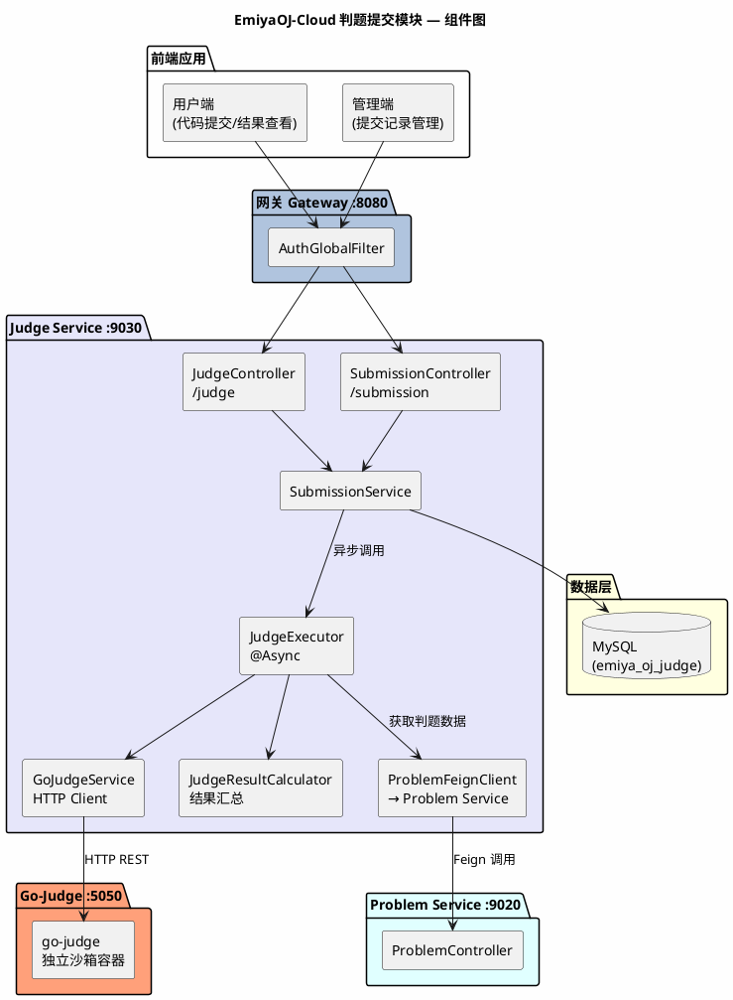
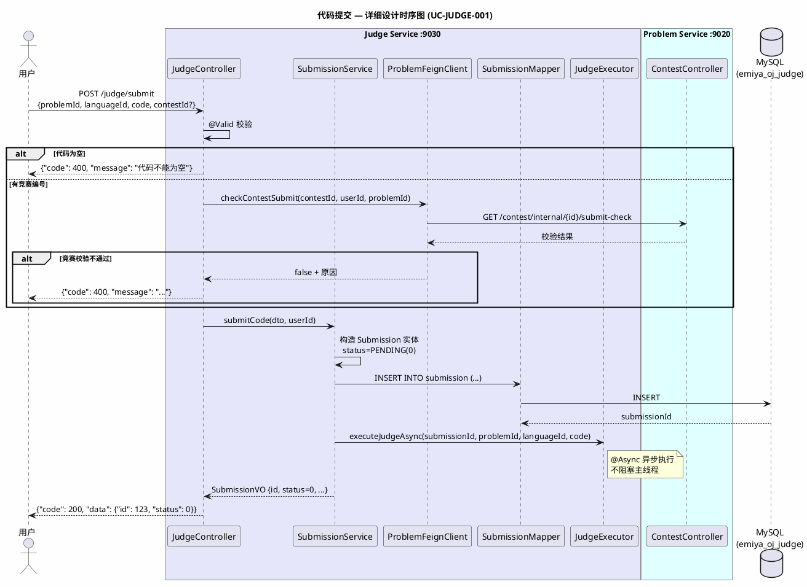
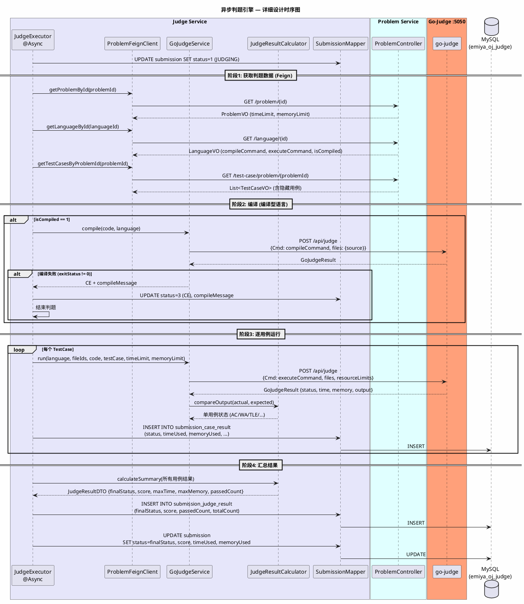
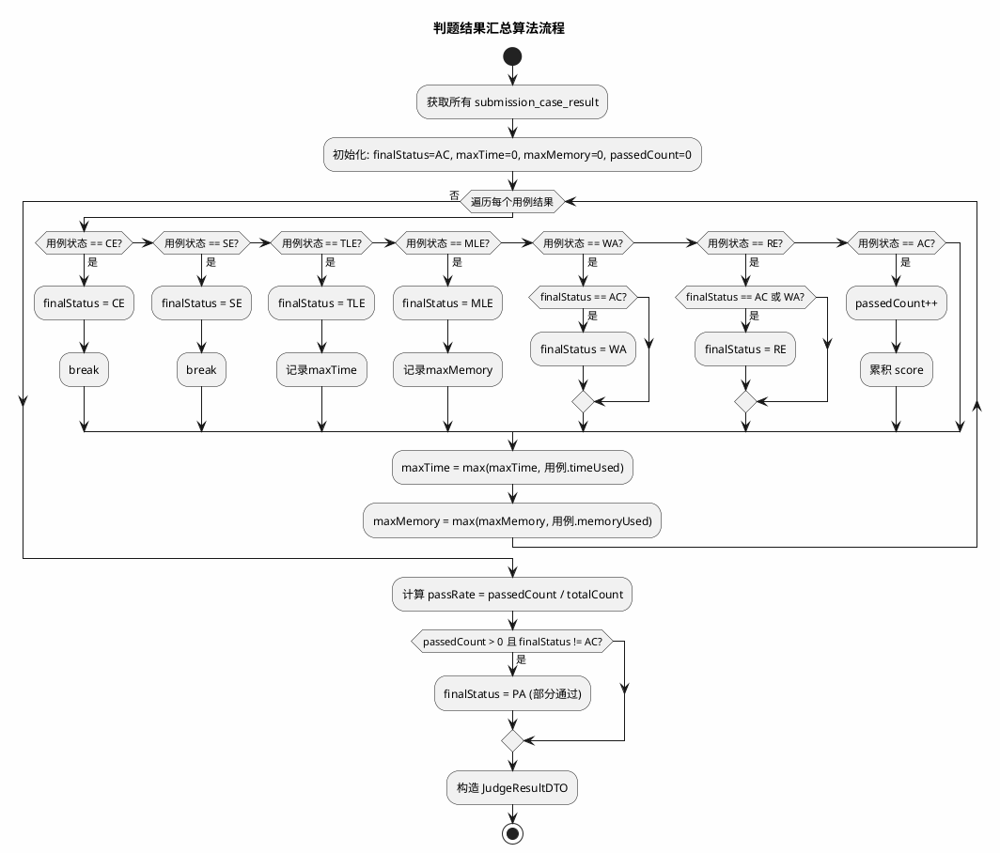
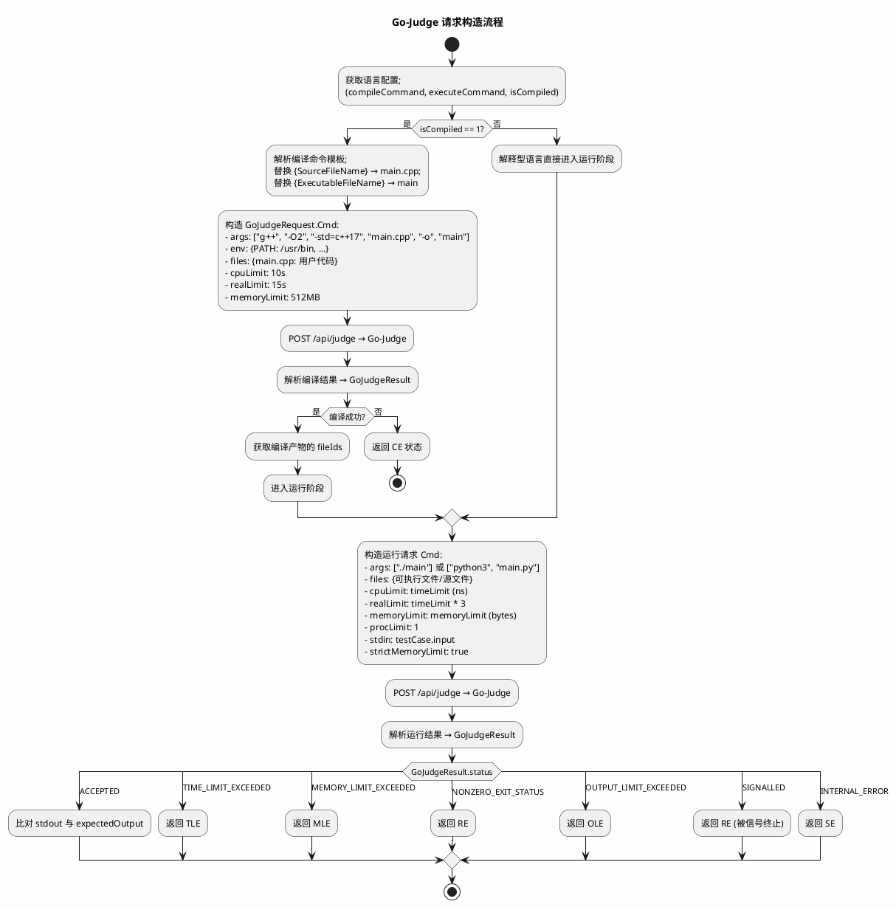
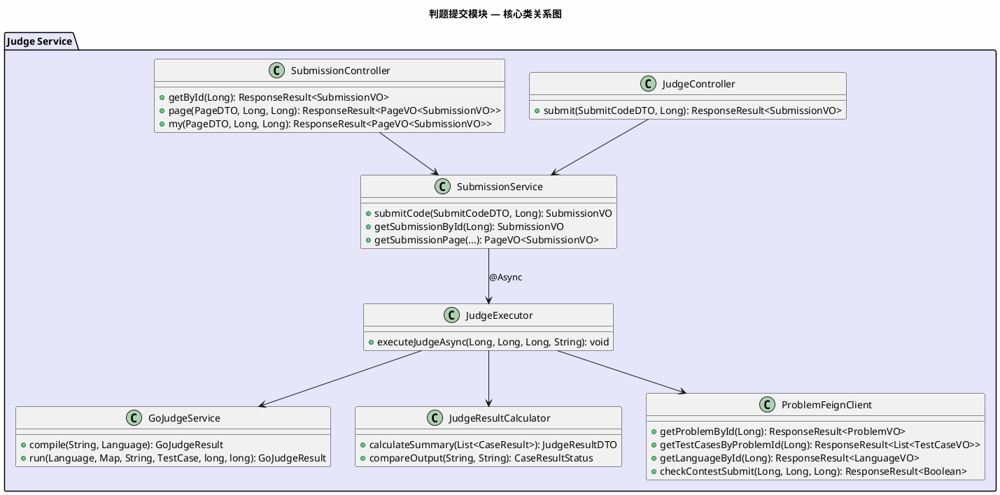

# 《EmiyaOJ-Cloud 在线判题系统》

# 判题提交模块 — 详细设计说明书

| 项目 | 内容 |
| --- | --- |
| 文档名称 | EmiyaOJ-Cloud 判题提交模块详细设计说明书 |
| 所属系统 | EmiyaOJ-Cloud 在线判题系统 |
| 文档版本 | V1.0 |
| 编写日期 | 2026 年 5 月 21 日 |
| 项目性质 | 大学生软件工程实训小组作业 |
| 文档格式 | Markdown |

---

## 1. 引言

### 1.1 编写目的

本详细设计说明书适用于软件开发者与测试人员，旨在详细描述 EmiyaOJ-Cloud 判题提交模块（EmiyaOJ-Judge）的内部实现设计。文档覆盖代码提交、异步判题引擎、Go-Judge 沙箱调用、判题结果汇总和提交记录查询的程序结构、核心类、接口时序和数据库表结构。

### 1.2 项目概况

判题提交模块是 OJ 系统的核心业务链路模块，由 **EmiyaOJ-Judge** 微服务独立承担。该服务接收用户代码提交，通过 Feign 从 Problem Service 获取判题数据，调用 Go-Judge 独立沙箱隔离执行用户代码，逐用例比对输出后汇总计算最终判题状态（11 种状态），并对外提供提交记录查询接口。

### 1.3 术语定义

| 术语 | 定义 |
| --- | --- |
| Submission | 一次代码提交记录 |
| Go-Judge | 独立判题沙箱，通过 REST API 隔离编译和运行用户代码 |
| @Async | Spring 异步注解，用于异步执行判题流程 |
| AC/WA/TLE/CE/RE/SE/MLE/OLE/PA | 判题状态码，详见附录 |
| Feign | 微服务间声明式 HTTP 调用 |

### 1.4 参考资料

| 资料 | 说明 |
| --- | --- |
| `docs/EmiyaOJ-Cloud软件工程实训大报告.md` | 判题提交模块功能描述和流程图 |
| `docs/判题提交时序图.puml` | 判题提交分析级时序图 |
| `docs/Judge-Submission-API.md` | 判题提交接口定义 |
| `/memories/repo/EmiyaOJ-Cloud-Architecture.md` | 代码级架构参考 |
| `sql/emiya_oj_judge.sql` | 判题数据库表结构 |
| `go-judge/Dockerfile` | Go-Judge 沙箱容器配置 |

---

## 2. 系统概述

### 2.1 系统架构



---

## 3. 程序设计详细描述

### 3.1 子模块 1：代码提交

| 项目 | 内容 |
| --- | --- |
| 模块编号 | M-JUDGE-001 |
| 源程序文件 | `EmiyaOJ-Judge/judge-service/.../controller/JudgeController.java` |
| 功能 | 接收用户代码提交，创建 PENDING 状态的提交记录并立即返回提交编号（< 500ms），然后异步启动判题流程 |
| 输入参数 | `SubmitCodeDTO { problemId, languageId, code, contestId? }`、`@RequestHeader X-User-Id` |
| 要访问的表 | `submission`（emiya_oj_judge） |

**模块时序图：**



**输入/输出说明：**

- **SubmitCodeDTO**（请求）：
```json
{
    "problemId": 1,
    "languageId": 2,
    "code": "#include <iostream>\nint main() { int a,b; std::cin>>a>>b; std::cout<<a+b; return 0; }",
    "contestId": null
}
```
- **SubmissionVO**（响应）：
```json
{
    "code": 200,
    "data": {
        "id": 123,
        "problemId": 1,
        "userId": 5,
        "languageId": 2,
        "status": 0,
        "createTime": "2026-05-21T10:30:00"
    }
}
```

**设计规则：**
- 提交接口必须在 500ms 内返回，不等待判题完成
- 判题通过 `@Async` 异步执行，线程池独立配置
- 竞赛提交需先通过 Problem Service 的四重校验

---

### 3.2 子模块 2：异步判题引擎

| 项目 | 内容 |
| --- | --- |
| 模块编号 | M-JUDGE-002 |
| 源程序文件 | `EmiyaOJ-Judge/judge-service/.../judge/JudgeExecutor.java` |
| 功能 | 异步执行完整判题流程：获取判题数据 → 编译（如需） → 逐用例运行 → 输出比对 → 汇总结果 |
| 输入参数 | `submissionId, problemId, languageId, code` |
| 要访问的表 | `submission`、`submission_case_result`、`submission_judge_result`（emiya_oj_judge） |

**模块时序图：**



**判题结果汇总算法核心逻辑：**



**11 种判题状态说明：**

| 状态码 | 常量 | 含义 | 触发条件 |
| --- | --- | --- | --- |
| 0 | PENDING | 待判题 | 提交记录创建时的初始状态 |
| 1 | JUDGING | 判题中 | 异步判题开始后设置 |
| 2 | AC | 通过 | 所有测试用例输出与期望一致 |
| 3 | CE | 编译错误 | 编译型语言编译失败（exitStatus != 0） |
| 4 | SE | 系统错误 | Go-Judge 不可用或内部异常 |
| 5 | WA | 答案错误 | 至少一个用例输出不匹配 |
| 6 | TLE | 时间超限 | 至少一个用例运行时间 > timeLimit |
| 7 | MLE | 内存超限 | 至少一个用例内存使用 > memoryLimit |
| 8 | RE | 运行错误 | 用户程序运行时异常（非零退出码） |
| 9 | OLE | 输出超限 | 用户程序输出超过限制大小 |
| 10 | PA | 部分通过 | 部分用例通过但存在非通过用例 |

---

### 3.3 子模块 3：Go-Judge 沙箱交互

| 项目 | 内容 |
| --- | --- |
| 模块编号 | M-JUDGE-003 |
| 源程序文件 | `EmiyaOJ-Judge/judge-service/.../judge/GoJudgeService.java` |
| 功能 | 封装与 Go-Judge 沙箱的 HTTP 通信，构造编译/运行请求并解析执行结果 |
| 输入参数 | 编译/运行命令、文件映射、资源限制 |
| 外部依赖 | Go-Judge 容器（端口 5050） |

**Go-Judge 请求构造流程：**



**Go-Judge REST API 说明：**

| 端点 | 方法 | 说明 |
| --- | --- | --- |
| `/api/judge` | POST | 提交编译或运行任务 |
| `/api/file` | POST | 上传文件到沙箱 |
| `/api/file/{id}` | GET | 下载沙箱中的文件（如编译产物、stdout） |
| `/api/file/{id}` | DELETE | 删除沙箱中的文件 |

**资源限制参数：**

| 参数 | 说明 | 单位 |
| --- | --- | --- |
| `cpuLimit` | CPU 时间限制 | 纳秒 (ns) |
| `realLimit` | 真实时间限制（墙钟时间） | 纳秒 (ns) |
| `memoryLimit` | 内存限制 | 字节 (bytes) |
| `procLimit` | 进程数限制 | 个数 |
| `strictMemoryLimit` | 严格内存限制 | boolean |

---

### 3.4 子模块 4：提交记录查询

| 项目 | 内容 |
| --- | --- |
| 模块编号 | M-JUDGE-004 |
| 源程序文件 | `EmiyaOJ-Judge/judge-service/.../controller/SubmissionController.java` |
| 功能 | 用户查询自己的提交记录和详情；管理员查询全部提交 |
| 输入参数 | `PageDTO`、`@RequestHeader X-User-Id` |
| 要访问的表 | `submission`、`submission_case_result`、`submission_judge_result` |

**接口列表：**

| HTTP 方法 | 路径 | 功能 | 鉴权 |
| --- | --- | --- | --- |
| GET | /submission/{id} | 查询提交详情（含用例明细和汇总） | 需认证 |
| GET | /submission/page | 分页查询提交记录（管理端） | 需认证+权限 |
| GET | /submission/my | 分页查询当前用户的提交 | 需认证 |

**设计规则：**
- 查询他人提交详情时，不返回代码内容（code 字段置空）和隐藏用例信息
- 查询自己的提交详情时，返回完整信息
- 分页查询默认按创建时间降序排列

---

## 4. 表结构说明

### 4.1 判题数据库（emiya_oj_judge）

#### 4.1.1 submission 表

用于存放每次代码提交记录。

| 列名称 | 描述 | 类型 | Allow Null | PK/FK |
| --- | --- | --- | --- | --- |
| id | 提交编号 | bigint | NO | Yes，PK (ASSIGN_ID) |
| problem_id | 题目编号 | bigint | NO | NO |
| user_id | 用户编号 | bigint | NO | NO |
| language_id | 语言编号 | bigint | NO | NO |
| contest_id | 竞赛编号（可为空） | bigint | YES | NO |
| contest_problem_id | 竞赛题目编号 | bigint | YES | NO |
| code | 用户源代码 | text | NO | NO |
| status | 判题状态：0-10 | int | NO | NO (DEFAULT 0) |
| score | 得分 | int | YES | NO |
| time_used | 最大耗时（ms） | int | YES | NO |
| memory_used | 最大内存（KB） | int | YES | NO |
| error_message | 错误信息 | varchar(1024) | YES | NO |
| compile_message | 编译输出信息 | text | YES | NO |
| pass_rate | 通过率 | decimal | YES | NO |
| deleted | 逻辑删除 | int | YES | NO |
| create_time | 创建时间 | datetime | NO | NO |
| update_time | 更新时间 | datetime | YES | NO |

#### 4.1.2 submission_case_result 表

用于存放每个测试用例的判题明细。

| 列名称 | 描述 | 类型 | PK/FK |
| --- | --- | --- | --- |
| id | 明细编号 | bigint | Yes，PK |
| submission_id | 提交编号 | bigint | FK → submission.id |
| test_case_id | 测试用例编号 | bigint | NO |
| status | 单用例状态：0-10 | int | NO |
| time_used | 耗时（ms） | int | NO |
| memory_used | 内存（KB） | int | NO |
| actual_output | 实际输出 | text | YES |
| error_message | 错误信息 | varchar(1024) | YES |
| create_time | 创建时间 | datetime | NO |

#### 4.1.3 submission_judge_result 表

用于存放提交的判题汇总结果。

| 列名称 | 描述 | 类型 | PK/FK |
| --- | --- | --- | --- |
| id | 汇总编号 | bigint | Yes，PK |
| submission_id | 提交编号 | bigint | FK → submission.id (UNIQUE) |
| status | 最终判题状态：0-10 | int | NO |
| score | 总分 | int | NO |
| passed_case_count | 通过用例数 | int | NO |
| total_case_count | 总用例数 | int | NO |
| max_time | 最大耗时（ms） | int | NO |
| max_memory | 最大内存（KB） | int | NO |
| create_time | 创建时间 | datetime | NO |

---

## 5. 公用接口

### 5.1 核心类关系图



### 5.2 GoJudgeResult 数据结构

```java
public class GoJudgeResult {
    private String status;       // ACCEPTED / TIME_LIMIT_EXCEEDED / MEMORY_LIMIT_EXCEEDED / ...
    private int exitStatus;      // 进程退出码
    private long time;           // 运行时间（纳秒）
    private long memory;         // 内存使用（字节）
    private long runTime;        // 真实运行时间（纳秒）
    private Map<String, String> files;    // 文件ID映射 (stdout → fileId)
    private Map<String, String> fileIds;  // 文件ID映射
    private String error;        // 错误信息
}
```

### 5.3 设计规则汇总

| 规则 | 说明 |
| --- | --- |
| 提交快速返回 | 提交接口必须 < 500ms 返回，不等待判题完成 |
| 异步判题 | 通过 @Async 异步执行判题流程，线程池独立配置 |
| 沙箱隔离 | 用户代码必须在 Go-Judge 容器中执行，业务服务不直接运行任何用户代码 |
| 状态优先级 | CE > SE > TLE > MLE > RE > OLE > WA > PA > AC（优先取最严重状态） |
| 隐藏数据保护 | 查询他人提交时隐藏代码和隐藏用例信息 |
| 竞赛前置校验 | 竞赛提交前必须通过 Problem Service 的四重校验 |
| 结果一致性 | submission_judge_result 汇总状态必须与 submission_case_result 明细状态一致 |
