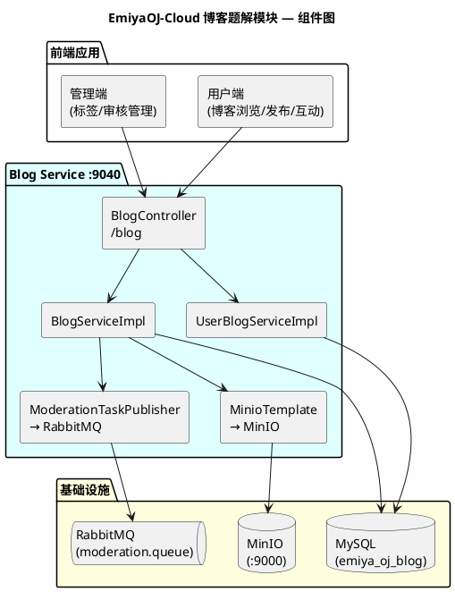
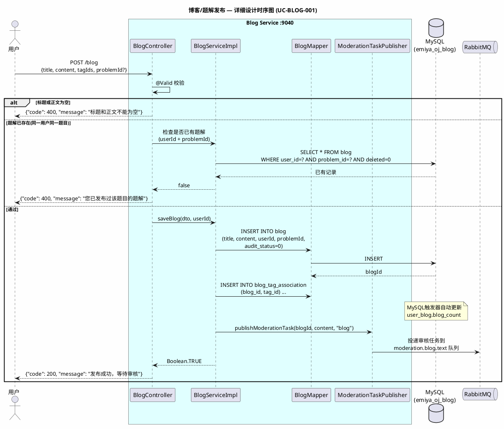
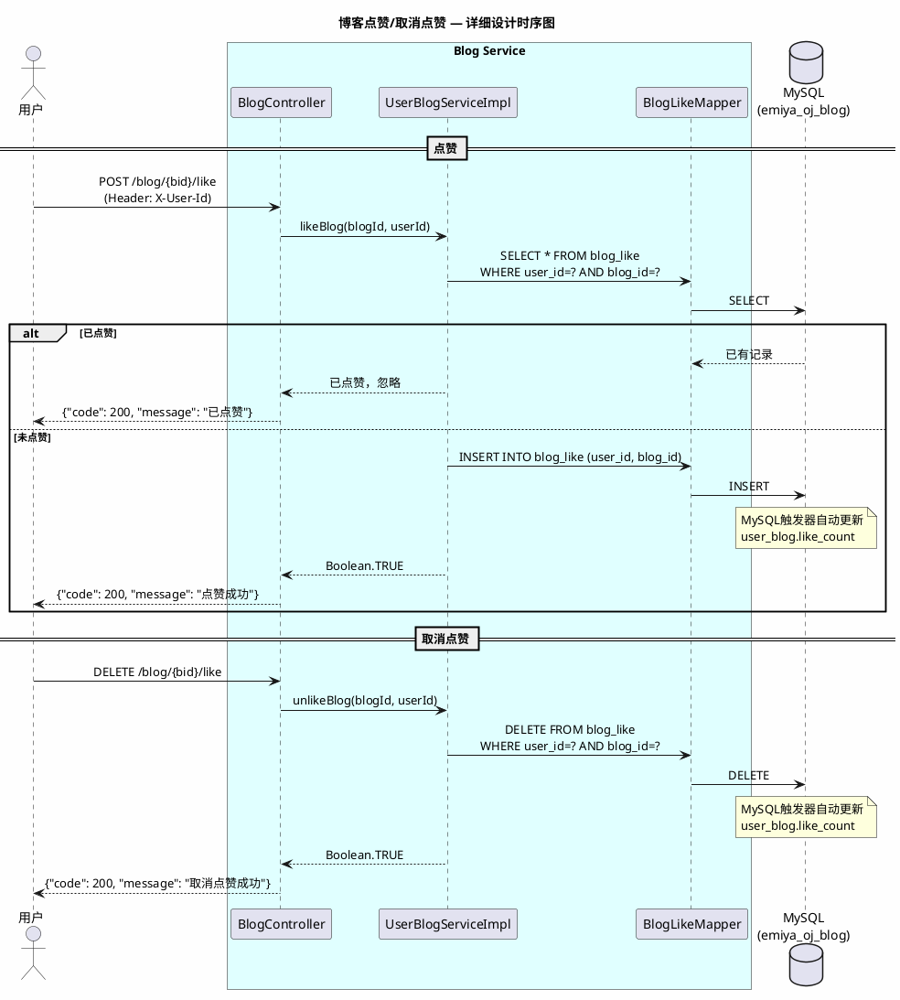
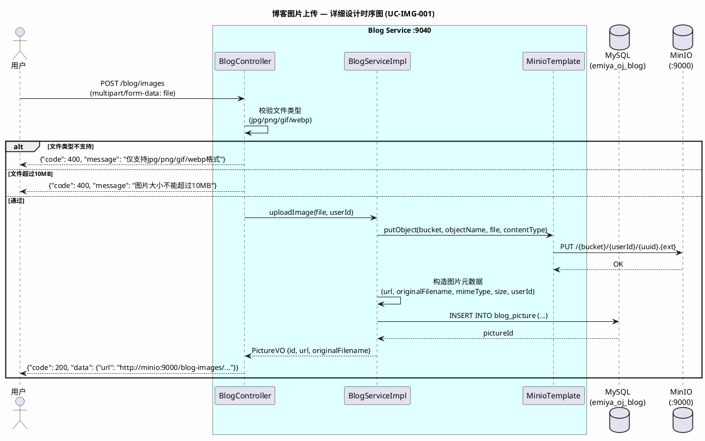
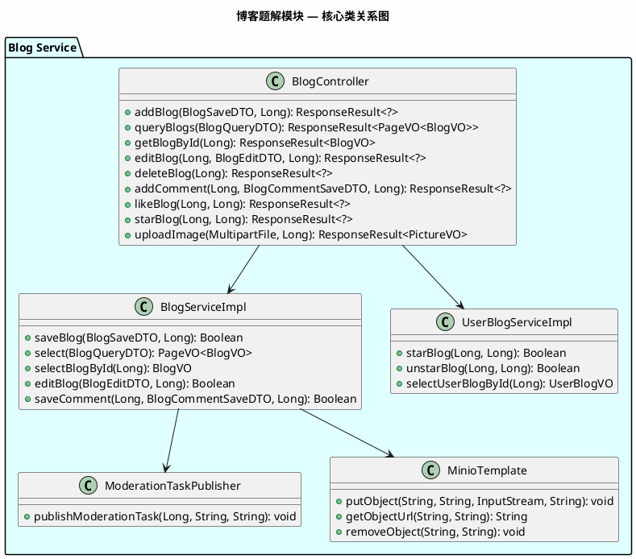

# 《EmiyaOJ-Cloud 在线判题系统》

# 博客题解模块 — 详细设计说明书

| 项目 | 内容 |
| --- | --- |
| 文档名称 | EmiyaOJ-Cloud 博客题解模块详细设计说明书 |
| 所属系统 | EmiyaOJ-Cloud 在线判题系统 |
| 文档版本 | V1.0 |
| 编写日期 | 2026 年 5 月 21 日 |
| 项目性质 | 大学生软件工程实训小组作业 |
| 文档格式 | Markdown |

---

## 1. 引言

### 1.1 编写目的

本详细设计说明书详细描述 EmiyaOJ-Cloud 博客题解模块（EmiyaOJ-Blog）的内部实现设计，覆盖博客发布/编辑/删除、题解绑定、评论互动、点赞收藏、图片上传（MinIO）和用户统计的程序结构与数据库设计。

### 1.2 项目概况

博客题解模块由 **EmiyaOJ-Blog** 微服务独立承担，负责管理博客社区的完整功能。该服务对接 MinIO（图片对象存储）和 RabbitMQ（审核任务投递），通过 MySQL 触发器自动维护用户博客统计数据。新发布或编辑后的内容自动进入待审核状态。

### 1.3 参考资料

| 资料 | 说明 |
| --- | --- |
| `docs/EmiyaOJ-Cloud软件工程实训大报告.md` | 博客题解模块功能描述和用例图 |
| `docs/博客审核时序图.puml` | 博客发布与审核分析级时序图 |
| `docs/Blog-API.md` | 博客接口定义 |
| `/memories/repo/EmiyaOJ-Cloud-Architecture.md` | 代码级架构参考 |
| `sql/emiya_oj_blog.sql` | 博客数据库表结构 |

---

## 2. 系统概述

### 2.1 系统架构

---

## 3. 程序设计详细描述

### 3.1 子模块 1：博客/题解发布

| 项目 | 内容 |
| --- | --- |
| 模块编号 | M-BLOG-001 |
| 源程序文件 | `EmiyaOJ-Blog/blog-service/.../controller/BlogController.java` |
| 功能 | 用户发布普通博客或绑定题目的题解，保存后进入 PENDING 审核状态并投递 RabbitMQ 审核任务 |
| 输入参数 | `BlogSaveDTO { title, content, tagIds, problemId? }`、`@RequestHeader X-User-Id` |
| 要访问的表 | `blog`、`blog_tag_association`、`user_blog`（emiya_oj_blog） |

**模块时序图：**

**接口列表：**

| HTTP 方法 | 路径 | 功能 | 鉴权 |
| --- | --- | --- | --- |
| POST | /blog | 发布普通博客 | 需认证 |
| POST | /blog/problems/{problemId}/solutions | 发布/更新题解 | 需认证 |
| POST | /blog/query | 分页查询博客列表 | 白名单放行（仅返回APPROVED） |
| GET | /blog/{bid} | 查询博客详情 | 白名单放行 |
| PUT | /blog/{bid} | 编辑博客 | 需认证+本人 |
| DELETE | /blog/{bid} | 删除博客（逻辑删除） | 需认证+本人 |
| GET | /blog/tags | 查询全部博客标签 | 白名单放行 |

**设计规则：**
- 同一用户对同一题目仅限一篇题解（uk: user_id + problem_id）
- 新发布或编辑后自动进入 PENDING（audit_status=0）
- 公开查询默认仅返回 APPROVED（audit_status=1）的内容
- 博客删除采用逻辑删除（deleted=1）

---

### 3.2 子模块 2：评论互动

| 项目 | 内容 |
| --- | --- |
| 模块编号 | M-BLOG-002 |
| 源程序文件 | `EmiyaOJ-Blog/blog-service/.../controller/BlogController.java` |
| 功能 | 用户对博客发表评论，评论同样进入审核流程 |
| 输入参数 | `BlogCommentSaveDTO { content, parentCommentId? }` |
| 要访问的表 | `blog_comment`（emiya_oj_blog） |

**接口列表：**

| HTTP 方法 | 路径 | 功能 |
| --- | --- | --- |
| POST | /blog/{bid}/comments/query | 分页查询评论（仅返回APPROVED） |
| POST | /blog/{bid}/comments | 发表评论 |
| GET | /blog/comments/{cid} | 查询评论详情 |
| POST | /blog/comments/query | 按条件查询评论列表 |

---

### 3.3 子模块 3：点赞收藏

| 项目 | 内容 |
| --- | --- |
| 模块编号 | M-BLOG-003 |
| 源程序文件 | `EmiyaOJ-Blog/blog-service/.../controller/BlogController.java` |
| 功能 | 用户对博客点赞/取消、收藏/取消，通过 MySQL 触发器自动维护统计 |
| 要访问的表 | `blog_like`、`blog_star`、`user_blog`（emiya_oj_blog） |

**模块时序图（点赞/取消点赞）：**

**接口列表（点赞收藏）：**

| HTTP 方法 | 路径 | 功能 |
| --- | --- | --- |
| POST | /blog/{bid}/like | 点赞博客 |
| DELETE | /blog/{bid}/like | 取消点赞 |
| POST | /blog/{bid}/star | 收藏博客 |
| DELETE | /blog/{bid}/star | 取消收藏 |

---

### 3.4 子模块 4：图片上传（MinIO）

| 项目 | 内容 |
| --- | --- |
| 模块编号 | M-BLOG-004 |
| 源程序文件 | `EmiyaOJ-Blog/blog-service/.../controller/BlogController.java` |
| 功能 | 用户上传博客图片到 MinIO 对象存储，保存元数据，返回可访问的图片 URL |
| 输入参数 | `MultipartFile`（图片文件） |
| 要访问的表 | `blog_picture`（emiya_oj_blog） |
| 外部依赖 | MinIO |

**模块时序图：**

**设计规则：**
- 仅支持 jpg/png/gif/webp 格式
- 单文件不超过 10MB
- 图片按用户维度分目录存储（`{bucket}/{userId}/{uuid}.{ext}`）
- 删除图片时校验上传者或管理员权限，同步删除 MinIO 文件并标记 deleted=1

---

### 3.5 子模块 5：用户博客统计

| 项目 | 内容 |
| --- | --- |
| 模块编号 | M-BLOG-005 |
| 源程序文件 | `EmiyaOJ-Blog/blog-service/.../service/UserBlogServiceImpl.java` |
| 功能 | 查询用户博客统计数据（发文数、收藏数），数据通过 MySQL 触发器自动维护 |
| 要访问的表 | `user_blog`（emiya_oj_blog） |

**MySQL 触发器逻辑：**
- 博客插入后 → `user_blog.blog_count + 1`
- 博客删除后 → `user_blog.blog_count - 1`
- 收藏插入后 → `user_blog.star_count + 1`
- 取消收藏后 → `user_blog.star_count - 1`

**接口列表：**

| HTTP 方法 | 路径 | 功能 |
| --- | --- | --- |
| GET | /blog/user/{uid} | 查询用户博客统计 |
| POST | /blog/user/{uid}/blogs/query | 分页查询用户的博客 |
| POST | /blog/user/{uid}/stars/query | 分页查询用户的收藏 |

---

## 4. 表结构说明

### 4.1 博客数据库（emiya_oj_blog）

#### 4.1.1 blog 表

| 列名称 | 描述 | 类型 | PK/FK |
| --- | --- | --- | --- |
| id | 博客编号 | bigint | Yes，PK |
| user_id | 作者编号 | bigint | NO |
| problem_id | 题目编号（题解时使用） | bigint | YES |
| blog_type | 类型：0-普通博客, 1-题解 | int | NO |
| title | 标题 | varchar(256) | NO |
| content | 正文（Markdown） | text | NO |
| audit_status | 审核状态：0-PENDING, 1-APPROVED, 2-REJECTED, 3-MANUAL_REVIEW | int | NO (DEFAULT 0) |
| audit_task_id | 审核任务编号 | varchar(64) | YES |
| audit_reason | 审核原因 | varchar(512) | YES |
| audit_labels | 审核标签 | varchar(256) | YES |
| deleted | 逻辑删除 | int | NO (DEFAULT 0) |
| create_time | 创建时间 | datetime | NO |
| update_time | 更新时间 | datetime | YES |

- **联合唯一索引**：(user_id, problem_id) WHERE problem_id IS NOT NULL（同一用户同一题目仅一篇题解）

#### 4.1.2 blog_comment 表

| 列名称 | 描述 | 类型 | PK/FK |
| --- | --- | --- | --- |
| id | 评论编号 | bigint | Yes，PK |
| blog_id | 博客编号 | bigint | FK → blog.id |
| user_id | 评论者编号 | bigint | NO |
| parent_comment_id | 父评论编号（支持嵌套） | bigint | YES |
| content | 评论内容 | text | NO |
| audit_status | 审核状态：0-3 | int | NO |
| deleted | 逻辑删除 | int | NO |
| create_time | 创建时间 | datetime | NO |
| update_time | 更新时间 | datetime | YES |

#### 4.1.3 blog_like 表

| 列名称 | 描述 | 类型 | PK/FK |
| --- | --- | --- | --- |
| id | 编号 | bigint | Yes，PK |
| user_id | 用户编号 | bigint | NO |
| blog_id | 博客编号 | bigint | FK → blog.id |
| create_time | 创建时间 | datetime | NO |

- **联合唯一索引**：(user_id, blog_id)

#### 4.1.4 blog_star 表

| 列名称 | 描述 | 类型 | PK/FK |
| --- | --- | --- | --- |
| id | 编号 | bigint | Yes，PK |
| user_id | 用户编号 | bigint | NO |
| blog_id | 博客编号 | bigint | FK → blog.id |
| create_time | 创建时间 | datetime | NO |

- **联合唯一索引**：(user_id, blog_id)

#### 4.1.5 blog_picture 表

| 列名称 | 描述 | 类型 | PK/FK |
| --- | --- | --- | --- |
| id | 图片编号 | bigint | Yes，PK |
| url | MinIO 访问地址 | varchar(512) | NO |
| original_filename | 原始文件名 | varchar(256) | NO |
| mime_type | MIME 类型 | varchar(64) | NO |
| size | 文件大小（字节） | bigint | NO |
| user_id | 上传者 | bigint | NO |
| deleted | 逻辑删除 | int | NO |
| create_time | 创建时间 | datetime | NO |

#### 4.1.6 其他表

| 表名 | 说明 | 关键字段 |
| --- | --- | --- |
| `blog_tag` | 博客标签 | id, tag, desc |
| `blog_tag_association` | 博客与标签关联 | blog_id, tag_id (联合唯一) |
| `user_blog` | 用户博客统计（触发器维护） | user_id, username, nickname, blog_count, star_count |

---

## 5. 公用接口

### 5.1 核心类关系图

### 5.2 审核状态流转

| 状态值 | 状态 | 含义 | 可见性 |
| --- | --- | --- | --- |
| 0 | PENDING | 待审核（新发布或编辑后的默认状态） | 仅作者和管理端可见 |
| 1 | APPROVED | 审核通过 | 公开可见 |
| 2 | REJECTED | 审核驳回 | 仅作者和管理端可见 |
| 3 | MANUAL_REVIEW | 人工复核（阿里云审核建议复核） | 管理端可见 |

### 5.3 设计规则汇总

| 规则 | 说明 |
| --- | --- |
| 题解唯一性 | 同一用户同一题目仅限一篇题解（uk: user_id + problem_id） |
| 审核自动触发 | 新发布或编辑后 audit_status 自动重置为 PENDING（0） |
| 公开查询过滤 | 默认仅返回 audit_status=1 的内容 |
| 图片安全 | 仅支持 jpg/png/gif/webp，单文件 ≤10MB，按用户分目录 |
| 统计自动维护 | user_blog 表通过 MySQL 触发器自动维护，业务代码无需手动更新计数 |
| 逻辑删除 | 博客、评论、图片均采用逻辑删除 |
| RabbitMQ 投递 | 内容保存后立即投递审核任务，不阻塞发布响应 |
