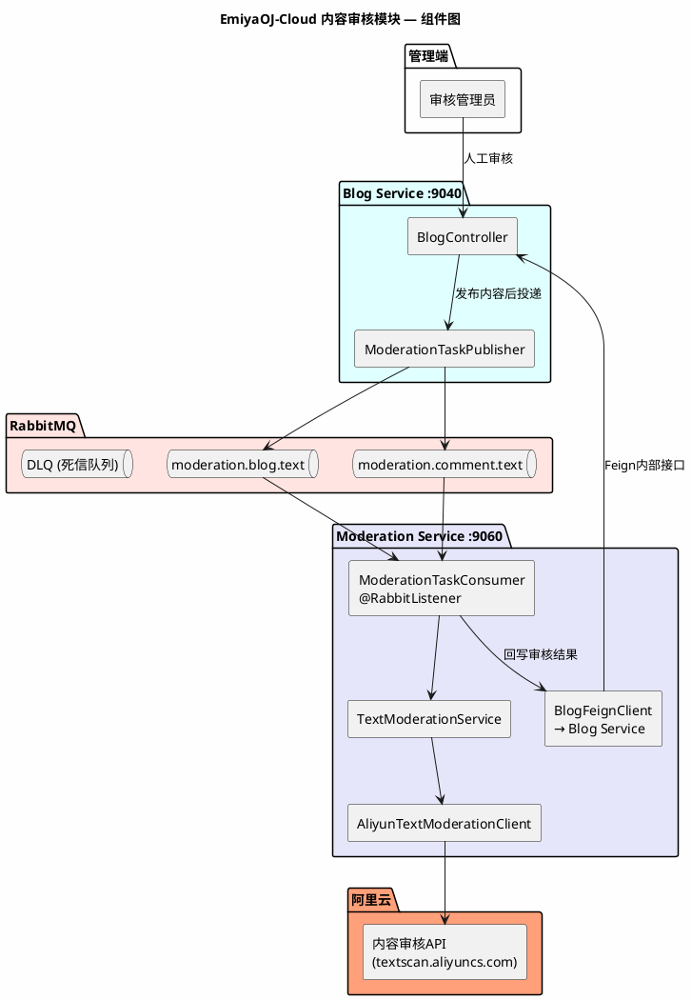
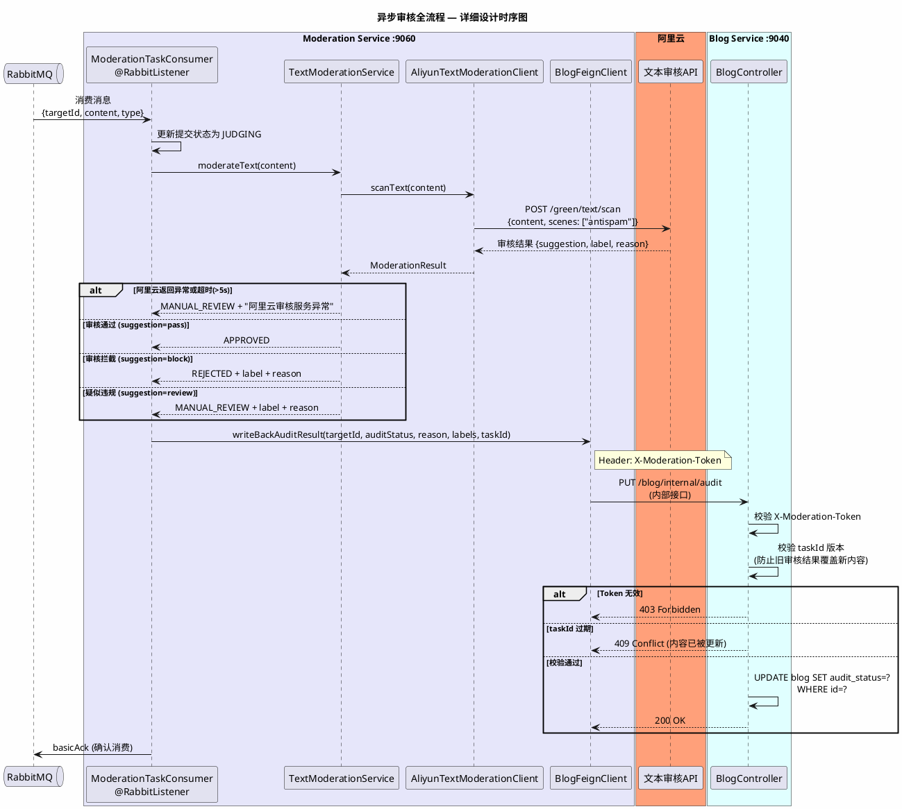
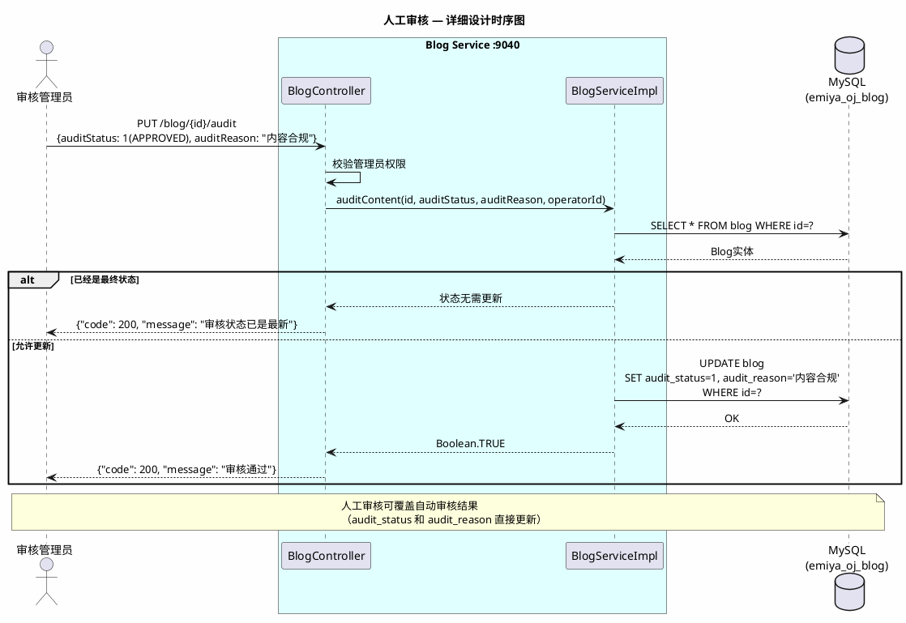
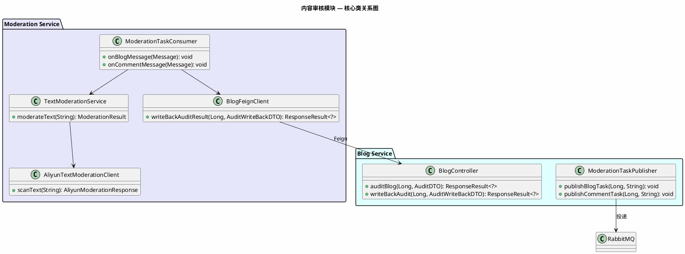
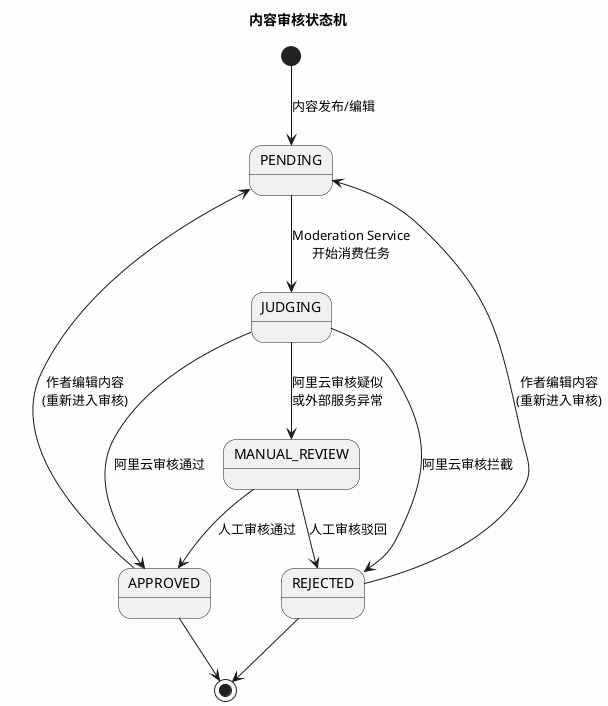

# 《EmiyaOJ-Cloud 在线判题系统》

# 内容审核模块 — 详细设计说明书

| 项目 | 内容 |
| --- | --- |
| 文档名称 | EmiyaOJ-Cloud 内容审核模块详细设计说明书 |
| 所属系统 | EmiyaOJ-Cloud 在线判题系统 |
| 文档版本 | V1.0 |
| 编写日期 | 2026 年 5 月 21 日 |
| 项目性质 | 大学生软件工程实训小组作业 |
| 文档格式 | Markdown |

---

## 1. 引言

### 1.1 编写目的

本详细设计说明书详细描述 EmiyaOJ-Cloud 内容审核模块（EmiyaOJ-Moderation）的内部实现设计，覆盖 RabbitMQ 异步审核消息投递与消费、阿里云文本审核 API 调用、审核结果回写（Feign）和人工审核覆盖机制。

### 1.2 项目概况

内容审核模块采用"**自动审核 + 人工兜底**"双层策略。Blog Service 保存内容后投递审核任务到 RabbitMQ；Moderation Service 异步消费任务并调用阿里云文本审核 API；审核结果通过内部 Feign 接口回写 Blog Service。管理端支持人工通过/驳回，可覆盖自动审核结果。

### 1.3 参考资料

| 资料 | 说明 |
| --- | --- |
| `docs/EmiyaOJ-Cloud软件工程实训大报告.md` | 内容审核模块功能描述和用例图 |
| `docs/博客审核时序图.puml` | 博客发布与审核分析级时序图 |
| `docs/Blog-Moderation-API.md` | 审核接口定义 |
| `docs/Aliyun-moderation-sample.md` | 阿里云文本审核示例 |
| `docs/Moderation-Setup.md` | 审核服务配置说明 |
| `/memories/repo/EmiyaOJ-Cloud-Architecture.md` | 代码级架构参考 |

---

## 2. 系统概述

### 2.1 系统架构



---

## 3. 程序设计详细描述

### 3.1 子模块 1：审核任务投递（Blog Service 侧）

| 项目 | 内容 |
| --- | --- |
| 模块编号 | M-MOD-001 |
| 源程序文件 | `EmiyaOJ-Blog/blog-service/.../mq/ModerationTaskPublisher.java` |
| 功能 | 博客/题解/评论保存后立即投递审核任务到 RabbitMQ，不阻塞发布响应 |
| 输入参数 | `targetId(Long)`, `content(String)`, `type("blog"/"comment")` |
| 外部依赖 | RabbitMQ |

**消息格式：**
```json
{
    "targetId": 123,
    "content": "这是博客正文内容...",
    "type": "blog",
    "timestamp": "2026-05-21T10:30:00"
}
```

**RabbitMQ 配置：**
- 交换机：`emiyaoj.moderation.exchange`（Topic 类型）
- 路由键：`moderation.blog.text`（博客）/ `moderation.comment.text`（评论）
- 确认模式：手动确认（MANUAL）
- 死信队列：`moderation.dlq`（处理失败的消息）

---

### 3.2 子模块 2：审核任务消费与阿里云调用

| 项目 | 内容 |
| --- | --- |
| 模块编号 | M-MOD-002 |
| 源程序文件 | `EmiyaOJ-Moderation/moderation-service/.../mq/ModerationTaskConsumer.java` |
| 功能 | 消费 RabbitMQ 审核任务，调用阿里云文本审核 API，根据审核建议决定内容状态 |
| 输入参数 | RabbitMQ 消息体（JSON） |
| 外部依赖 | RabbitMQ、阿里云文本审核 API |

**模块时序图：**



**阿里云审核建议 → 系统状态映射：**

| 阿里云 suggestion | 系统 audit_status | 说明 |
| --- | --- | --- |
| `pass` | APPROVED (1) | 内容合规，公开展示 |
| `block` | REJECTED (2) | 内容违规，驳回隐藏 |
| `review` | MANUAL_REVIEW (3) | 疑似违规，等待人工复核 |
| 调用异常/超时 | MANUAL_REVIEW (3) | 外部服务不可用，转人工兜底 |

---

### 3.3 子模块 3：审核结果回写

| 项目 | 内容 |
| --- | --- |
| 模块编号 | M-MOD-003 |
| 源程序文件 | `EmiyaOJ-Blog/blog-service/.../controller/BlogController.java`（内部接口） |
| 功能 | 接收 Moderation Service 的审核回写，通过内部令牌和任务 ID 版本校验保障安全 |
| 输入参数 | `targetId, auditStatus, auditReason, auditLabels, taskId`、`X-Moderation-Token` |
| 要访问的表 | `blog`、`blog_comment`（emiya_oj_blog） |

**安全机制：**

1. **X-Moderation-Token 校验**：回写接口必须携带正确的内部令牌，防止未授权调用
2. **Task ID 版本校验**：只有当请求中的 taskId 与数据库中当前的 audit_task_id 匹配时，才允许更新；若不匹配（说明内容已被重新编辑并生成了新审核任务），则拒绝旧审核结果覆盖

---

### 3.4 子模块 4：人工审核

| 项目 | 内容 |
| --- | --- |
| 模块编号 | M-MOD-004 |
| 源程序文件 | `EmiyaOJ-Blog/blog-service/.../controller/BlogController.java` |
| 功能 | 审核管理员在管理端查看待审核内容，执行通过或驳回操作，可覆盖自动审核结果 |
| 输入参数 | `targetId, auditStatus(APPROVED/REJECTED), auditReason` |
| 权限要求 | 审核权限 |

**模块时序图：**



**接口列表：**

| HTTP 方法 | 路径 | 功能 | 鉴权 |
| --- | --- | --- | --- |
| PUT | /blog/{id}/audit | 人工审核博客（通过/驳回） | 需认证+审核权限 |
| PUT | /blog/comments/{id}/audit | 人工审核评论 | 需认证+审核权限 |
| GET | /blog/audit/list | 查询待审核内容列表 | 需认证+审核权限 |

---

## 4. 表结构说明（审核相关字段）

审核状态字段分布在 `blog` 和 `blog_comment` 表中：

| 列名称 | 描述 | 类型 | 所在表 |
| --- | --- | --- | --- |
| audit_status | 审核状态：0-PENDING, 1-APPROVED, 2-REJECTED, 3-MANUAL_REVIEW | int | blog, blog_comment |
| audit_task_id | 当前审核任务编号（用于版本校验） | varchar(64) | blog, blog_comment |
| audit_reason | 审核原因（自动审核标签或人工审核填写） | varchar(512) | blog, blog_comment |
| audit_labels | 阿里云审核返回的违规标签（JSON） | varchar(256) | blog, blog_comment |

---

## 5. 公用接口

### 5.1 核心类关系图



### 5.2 审核状态机



### 5.3 RabbitMQ 配置

| 配置项 | 值 | 说明 |
| --- | --- | --- |
| 交换机 | `emiyaoj.moderation.exchange` | Topic 类型 |
| 博客审核队列 | `moderation.blog.text` | routingKey: `moderation.blog.text` |
| 评论审核队列 | `moderation.comment.text` | routingKey: `moderation.comment.text` |
| 死信队列 | `moderation.dlq` | 处理失败消息的重试队列 |
| 确认模式 | `MANUAL` | 手动确认，确保消息可靠消费 |
| 并发消费者 | 2-4 | 根据消息积压情况调整 |

### 5.4 设计规则汇总

| 规则 | 说明 |
| --- | --- |
| 发布与审核分离 | 用户发布内容后立即返回成功，审核异步进行 |
| 内部令牌保护 | 回写接口必须携带 X-Moderation-Token，防止未授权调用 |
| 版本校验 | 通过 audit_task_id 防止旧审核结果覆盖新编辑内容 |
| 人工兜底 | 阿里云异常或返回 review 时自动进入 MANUAL_REVIEW，不丢失内容 |
| 外部超时 | 阿里云调用超时设为 5 秒，超时转人工复核 |
| 消息可靠性 | RabbitMQ 手动确认 + 死信队列，确保审核任务不丢失 |
