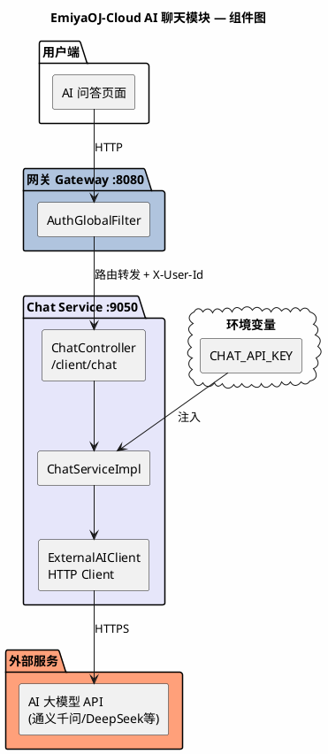
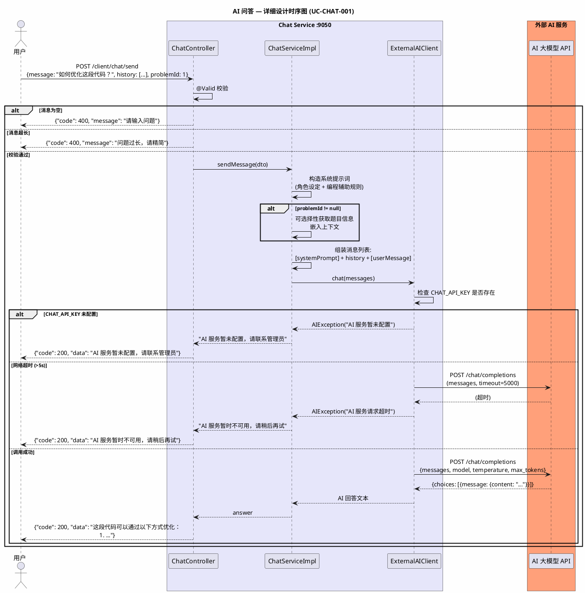
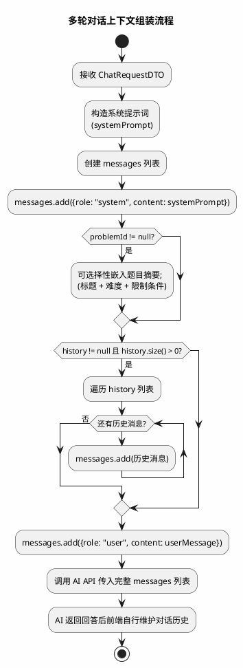
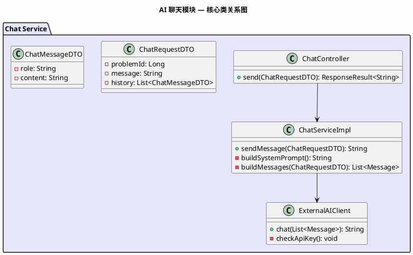

# 《EmiyaOJ-Cloud 在线判题系统》

# AI 聊天模块 — 详细设计说明书

| 项目 | 内容 |
| --- | --- |
| 文档名称 | EmiyaOJ-Cloud AI 聊天模块详细设计说明书 |
| 所属系统 | EmiyaOJ-Cloud 在线判题系统 |
| 文档版本 | V1.0 |
| 编写日期 | 2026 年 5 月 21 日 |
| 项目性质 | 大学生软件工程实训小组作业 |
| 文档格式 | Markdown |

---

## 1. 引言

### 1.1 编写目的

本详细设计说明书详细描述 EmiyaOJ-Cloud AI 聊天模块（EmiyaOJ-Chat）的内部实现设计，覆盖 AI 问答接口、多轮对话上下文管理、外部 AI 大模型调用和异常降级机制。

### 1.2 项目概况

AI 聊天模块由 **EmiyaOJ-Chat** 微服务独立承担，为用户提供编程学习辅助能力。用户端发送编程问题或题目相关问题到 Chat Service，Chat Service 调用外部 AI 大模型接口（如通义千问 qwen-turbo），支持多轮对话上下文传递。外部服务异常时返回友好降级提示，不影响核心判题链路。

### 1.3 术语定义

| 术语 | 定义 |
| --- | --- |
| Chat Service | AI 聊天微服务 |
| API Key | 外部 AI 服务的访问密钥（通过环境变量注入） |
| 多轮对话 | 将历史对话消息作为上下文传递给 AI 模型，实现连续对话 |
| 降级 | 外部服务不可用时返回友好提示而非系统异常 |

### 1.4 参考资料

| 资料 | 说明 |
| --- | --- |
| `docs/EmiyaOJ-Cloud软件工程实训大报告.md` | AI 聊天模块功能描述和用例图 |
| `/memories/repo/EmiyaOJ-Cloud-Architecture.md` | 代码级架构参考 |

---

## 2. 系统概述

### 2.1 系统架构



---

## 3. 程序设计详细描述

### 3.1 子模块 1：AI 问答

| 项目 | 内容 |
| --- | --- |
| 模块编号 | M-CHAT-001 |
| 源程序文件 | `EmiyaOJ-Chat/chat-service/.../controller/ChatController.java` |
| 功能 | 接收用户编程问题，调用外部 AI 大模型接口返回回答，支持多轮对话和题目上下文 |
| 输入参数 | `ChatRequestDTO { problemId?, message, history }`、`@RequestHeader X-User-Id` |
| 外部依赖 | 外部 AI 服务（API Key 环境变量注入） |

**模块时序图：**



**输入/输出说明：**

- **ChatRequestDTO**（请求）：
```json
{
    "problemId": 1,
    "message": "如何优化这段代码的时间复杂度？",
    "history": [
        {"role": "user", "content": "我写了一个排序算法"},
        {"role": "assistant", "content": "请问你使用的是哪种排序算法？"},
        {"role": "user", "content": "冒泡排序，但是大数据量时会超时"}
    ]
}
```
- **ChatMessageDTO**：
```json
{
    "role": "user|assistant|system",
    "content": "消息内容"
}
```

**设计规则：**

| 规则 | 说明 |
| --- | --- |
| API Key 安全 | `CHAT_API_KEY` 通过环境变量注入，不得写入代码仓库 |
| 超时控制 | 外部 AI 调用超时设为 5 秒 |
| 异常降级 | AI 服务不可用时返回友好提示，不影响判题主链路 |
| 系统提示词 | 预设角色为编程助手，限定回答范围和风格 |
| 消息长度 | 单条消息不超过 2000 字符，过长时提示用户精简 |

---

### 3.2 子模块 2：多轮对话上下文

| 项目 | 内容 |
| --- | --- |
| 模块编号 | M-CHAT-002 |
| 源程序文件 | `EmiyaOJ-Chat/chat-service/.../service/ChatServiceImpl.java` |
| 功能 | 将历史对话消息列表作为上下文传递给 AI 模型，实现连续对话 |
| 输入参数 | `history: List<ChatMessageDTO>`（前端维护并每次传递） |

**上下文组装逻辑：**



**设计规则：**
- 对话历史由前端维护并通过 `history` 字段每次传递
- Chat Service 无状态，不持久化对话记录（简化设计）
- 历史消息建议保留最近 10 轮对话，前端控制长度防止 token 超限

---

## 4. 表结构说明

Chat Service 为无状态服务，**不维护独立数据库**。对话历史由前端维护，每次请求时作为参数传递。后续如需扩展可增加 `chat_history` 表。

---

## 5. 公用接口

### 5.1 核心类关系图



### 5.2 异常降级策略

| 异常场景 | 返回给用户的消息 | HTTP 状态码 | 记录日志 |
| --- | --- | --- | --- |
| CHAT_API_KEY 未配置 | "AI 服务暂未配置，请联系管理员" | 200 (success=false) | WARN |
| 外部 AI 服务超时 (>5s) | "AI 服务暂时不可用，请稍后再试" | 200 (success=false) | ERROR |
| 外部 AI 返回错误 | "AI 服务暂时不可用，请稍后再试" | 200 (success=false) | ERROR |
| 消息为空 | "请输入问题" | 400 | INFO |
| 消息超长 | "问题过长，请精简后重新输入" | 400 | INFO |

### 5.3 环境变量配置

| 变量 | 说明 | 示例值 |
| --- | --- | --- |
| `CHAT_API_KEY` | AI 服务 API 密钥 | `sk-xxxx` |
| `CHAT_API_URL` | AI 服务端点地址 | `https://api.openai.com/v1/chat/completions` |
| `CHAT_MODEL` | AI 模型名称 | `qwen-turbo` |
| `CHAT_TIMEOUT` | 请求超时时间（毫秒） | `5000` |
| `CHAT_MAX_TOKENS` | 最大返回 token 数 | `1024` |

### 5.4 设计规则汇总

| 规则 | 说明 |
| --- | --- |
| 无状态设计 | Chat Service 不维护数据库，对话历史由前端管理 |
| API Key 安全 | 通过环境变量注入，不入库、不入仓 |
| 超时与降级 | 外部调用超时 5 秒，失败时返回友好提示 |
| 不影响主链路 | Chat Service 异常不影响判题、博客等核心功能 |
| 系统提示词 | 预设编程助手角色，限定回答领域和风格 |
