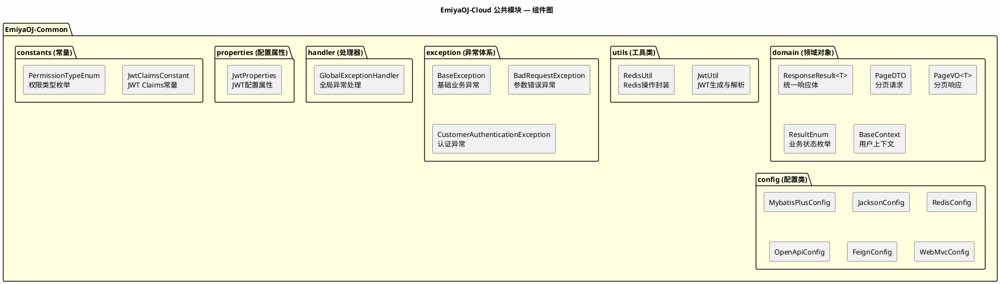
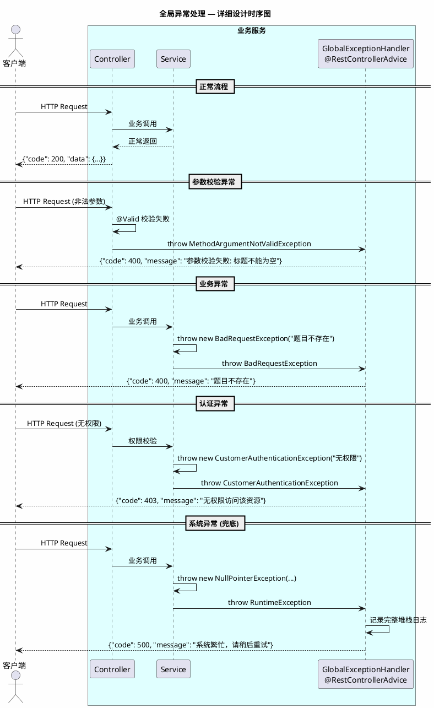
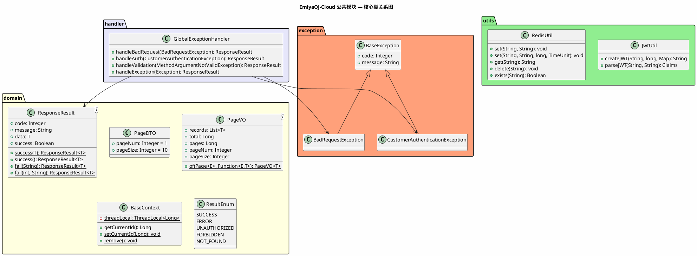
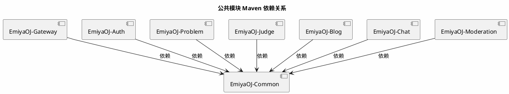

# 《EmiyaOJ-Cloud 在线判题系统》

# 公共模块 — 详细设计说明书

| 项目 | 内容 |
| --- | --- |
| 文档名称 | EmiyaOJ-Cloud 公共模块详细设计说明书 |
| 所属系统 | EmiyaOJ-Cloud 在线判题系统 |
| 文档版本 | V1.0 |
| 编写日期 | 2026 年 5 月 21 日 |
| 项目性质 | 大学生软件工程实训小组作业 |
| 文档格式 | Markdown |

---

## 1. 引言

### 1.1 编写目的

本详细设计说明书详细描述 EmiyaOJ-Cloud 公共模块（EmiyaOJ-Common）的设计，该模块沉淀了所有微服务共用的通用能力，包括统一响应体、分页对象、JWT 工具、Redis 工具、全局异常处理、用户上下文传递和各类配置类。

### 1.2 项目概况

EmiyaOJ-Common 是 Maven 多模块项目中的基础模块，被 Gateway、Auth、Problem、Judge、Blog、Chat、Moderation 等所有微服务依赖。其设计目标是消除重复代码、统一接口风格、集中管理横切关注点。

### 1.3 参考资料

| 资料 | 说明 |
| --- | --- |
| `docs/EmiyaOJ-Cloud软件工程实训大报告.md` | 公共能力描述 |
| `docs/Exception-API.md` | 异常响应和错误码说明 |
| `/memories/repo/EmiyaOJ-Cloud-Architecture.md` | 代码级架构参考 |
| `EmiyaOJ-Common/pom.xml` | 公共模块依赖配置 |

---

## 2. 系统概述

### 2.1 公共模块组件图



---

## 3. 程序设计详细描述

### 3.1 子模块 1：统一响应体（ResponseResult）

| 项目 | 内容 |
| --- | --- |
| 模块编号 | M-COM-001 |
| 源程序文件 | `EmiyaOJ-Common/.../domain/ResponseResult.java` |
| 功能 | 定义全系统统一的 JSON 响应结构，所有接口返回此类型 |
| 被依赖方 | Gateway、Auth、Problem、Judge、Blog、Chat、Moderation |

**数据结构：**
```java
public class ResponseResult<T> {
    private Integer code;      // 业务状态码 (200=成功)
    private String message;    // 提示信息
    private T data;            // 响应数据
    private Boolean success;   // 是否成功

    // 静态工厂方法
    public static <T> ResponseResult<T> success(T data) { ... }
    public static <T> ResponseResult<T> success() { ... }
    public static <T> ResponseResult<T> fail(String message) { ... }
    public static <T> ResponseResult<T> fail(int code, String message) { ... }
}
```

**典型响应示例：**
```json
{
    "code": 200,
    "message": "操作成功",
    "data": {"id": 1, "username": "admin"},
    "success": true
}
```

---

### 3.2 子模块 2：分页对象（PageDTO / PageVO）

| 项目 | 内容 |
| --- | --- |
| 模块编号 | M-COM-002 |
| 源程序文件 | `EmiyaOJ-Common/.../domain/PageDTO.java`、`PageVO.java` |
| 功能 | 统一分页请求参数和分页响应结构，与 MyBatis-Plus 分页插件配合 |

**PageDTO（分页请求）：**
```java
public class PageDTO {
    private Integer pageNum = 1;   // 页码（从1开始）
    private Integer pageSize = 10; // 每页大小
}
```

**PageVO（分页响应）：**
```java
public class PageVO<T> {
    private List<T> records;       // 当前页数据列表
    private Long total;            // 总记录数
    private Long pages;            // 总页数
    private Integer pageNum;       // 当前页码
    private Integer pageSize;      // 每页大小

    // 静态工厂方法：从 MyBatis-Plus Page 转换
    public static <T, E> PageVO<T> of(Page<E> page, Function<E, T> converter) { ... }
}
```

**使用示例：**
```java
// Controller 中
Page<Problem> page = problemService.page(new Page<>(pageDTO.getPageNum(), pageDTO.getPageSize()), wrapper);
PageVO<ProblemVO> result = PageVO.of(page, ProblemVO::fromEntity);
return ResponseResult.success(result);
```

---

### 3.3 子模块 3：JWT 工具（JwtUtil）

| 项目 | 内容 |
| --- | --- |
| 模块编号 | M-COM-003 |
| 源程序文件 | `EmiyaOJ-Common/.../utils/JwtUtil.java` |
| 功能 | 生成和解析 JWT Token，基于 JJWT 0.12.6 |
| 被依赖方 | Gateway、Auth Service |

**核心方法：**

| 方法 | 说明 |
| --- | --- |
| `createJWT(String secretKey, long ttlMillis, Map<String, Object> claims)` | 生成 JWT Token |
| `parseJWT(String secretKey, String token)` | 解析 JWT 并返回 Claims |

**JWT Claims 结构：**
```json
{
    "userId": 1,
    "username": "admin",
    "iat": 1716268800,
    "exp": 1716355200
}
```

**配置属性（JwtProperties）：**
```java
@ConfigurationProperties(prefix = "jwt")
public class JwtProperties {
    private String secretKey;        // 签名密钥
    private long ttl;                // Token 有效期（毫秒）
    private String tokenPrefix;      // Token 前缀（Bearer）
}
```

---

### 3.4 子模块 4：Redis 工具（RedisUtil）

| 项目 | 内容 |
| --- | --- |
| 模块编号 | M-COM-004 |
| 源程序文件 | `EmiyaOJ-Common/.../utils/RedisUtil.java` |
| 功能 | 封装 Redis 常用操作（set/get/delete/exists），简化各服务的 Redis 调用 |
| 被依赖方 | Gateway（ReactiveRedisTemplate）、Auth Service（StringRedisTemplate） |

**核心方法：**

| 方法 | 说明 |
| --- | --- |
| `set(String key, String value)` | 写入键值对 |
| `set(String key, String value, long ttl, TimeUnit unit)` | 写入带过期时间的键值对 |
| `get(String key)` | 读取键值 |
| `delete(String key)` | 删除键 |
| `exists(String key)` | 检查键是否存在 |

---

### 3.5 子模块 5：全局异常处理

| 项目 | 内容 |
| --- | --- |
| 模块编号 | M-COM-005 |
| 源程序文件 | `EmiyaOJ-Common/.../handler/GlobalExceptionHandler.java` |
| 功能 | 全局拦截所有未处理异常，统一转换为 ResponseResult 格式返回 |

**异常处理时序：**



**异常映射表：**

| 异常类型 | HTTP 状态码 | 响应体 code | 提示信息 |
| --- | --- | --- | --- |
| `MethodArgumentNotValidException` | 400 | 400 | 参数校验失败: {具体字段} |
| `BadRequestException` | 400 | 400 | {业务提示} |
| `CustomerAuthenticationException` | 401/403 | 401/403 | {认证/权限提示} |
| `Exception` (未预期) | 500 | 500 | 系统繁忙，请稍后重试 |

---

### 3.6 子模块 6：用户上下文（BaseContext）

| 项目 | 内容 |
| --- | --- |
| 模块编号 | M-COM-006 |
| 源程序文件 | `EmiyaOJ-Common/.../domain/BaseContext.java` |
| 功能 | 基于 ThreadLocal 存储当前请求的用户 ID，供下游服务获取当前操作用户 |
| 被依赖方 | 所有业务服务 |

**核心方法：**
```java
public class BaseContext {
    private static final ThreadLocal<Long> threadLocal = new ThreadLocal<>();

    public static Long getCurrentId() { return threadLocal.get(); }
    public static void setCurrentId(Long id) { threadLocal.set(id); }
    public static void remove() { threadLocal.remove(); }
}
```

**使用流程：**
1. Gateway 在请求头注入 `X-User-Id`
2. 各服务的 `UserContextInterceptor`（WebMvcConfigurer）从请求头读取并设置到 BaseContext
3. Service 层通过 `BaseContext.getCurrentId()` 获取当前用户 ID
4. 请求结束后通过拦截器的 `afterCompletion` 调用 `BaseContext.remove()` 清理

---

### 3.7 子模块 7：配置类

| 配置类 | 源程序文件 | 功能 |
| --- | --- | --- |
| `MybatisPlusConfig` | `.../config/MybatisPlusConfig.java` | MyBatis-Plus 分页插件、逻辑删除配置 |
| `JacksonConfig` | `.../config/JacksonConfig.java` | JSON 序列化配置（日期格式、时区等） |
| `RedisConfig` | `.../config/RedisConfig.java` | Redis 序列化配置（Jackson2Json） |
| `OpenApiConfig` | `.../config/OpenApiConfig.java` | SpringDoc OpenAPI / Swagger 配置 |
| `FeignConfig` | `.../config/FeignConfig.java` | Feign 客户端通用配置（超时、重试） |
| `WebMvcConfig` | `.../config/WebMvcConfig.java` | 注册 UserContextInterceptor 拦截器 |

---

## 4. 公用接口

### 4.1 核心类关系图



### 5. Maven 依赖关系



### 6. 设计规则汇总

| 规则 | 说明 |
| --- | --- |
| 统一响应 | 所有 JSON 接口必须返回 `ResponseResult<T>` 结构 |
| 统一分页 | 列表查询统一使用 `PageDTO` 传参、`PageVO<T>` 返回 |
| JWT 安全 | JWT 签名密钥通过环境变量注入，不硬编码 |
| 异常不暴露堆栈 | 未预期异常通过 GlobalExceptionHandler 兜底，仅返回通用提示 |
| ThreadLocal 清理 | 每个请求结束后必须调用 `BaseContext.remove()` 防止内存泄漏 |
| MyBatis-Plus 逻辑删除 | 通过 `@TableLogic(value="0", delval="1")` 统一处理 |
| OpenAPI 文档 | 通过 SpringDoc 自动生成 Swagger 接口文档，各服务独立配置 |
