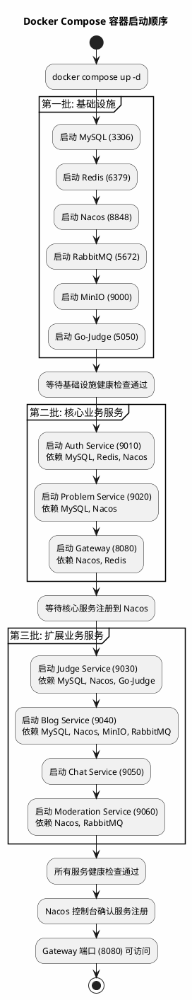
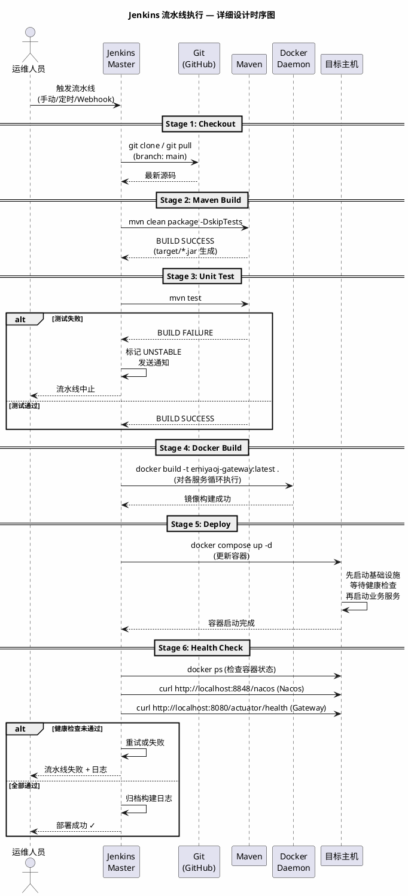
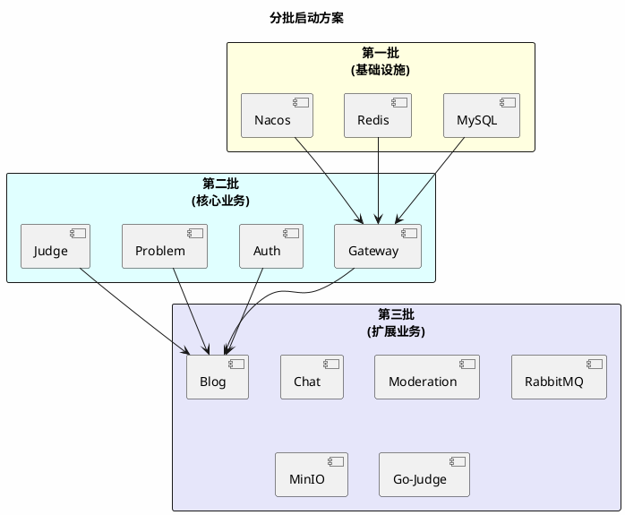

# 《EmiyaOJ-Cloud 在线判题系统》

# 部署运维模块 — 详细设计说明书

| 项目 | 内容 |
| --- | --- |
| 文档名称 | EmiyaOJ-Cloud 部署运维模块详细设计说明书 |
| 所属系统 | EmiyaOJ-Cloud 在线判题系统 |
| 文档版本 | V1.0 |
| 编写日期 | 2026 年 5 月 21 日 |
| 项目性质 | 大学生软件工程实训小组作业 |
| 文档格式 | Markdown |

---

## 1. 引言

### 1.1 编写目的

本详细设计说明书详细描述 EmiyaOJ-Cloud 部署运维模块的设计，覆盖 Docker Compose 容器编排、Jenkins 流水线自动构建部署、Nacos 服务注册发现和健康检查机制，确保系统可在开发、测试和演示环境中稳定运行。

### 1.2 项目概况

部署运维模块是项目交付的自动化保障，通过 Docker Compose 统一编排 6 个基础设施服务和 7 个业务微服务，通过 Jenkins 流水线固化从代码拉取到容器更新的全流程，确保演示环境的一致性和可复现性。

### 1.3 参考资料

| 资料 | 说明 |
| --- | --- |
| `docs/EmiyaOJ-Cloud软件工程实训大报告.md` | 部署运维模块功能描述和流程图 |
| `docker-compose.yml` | Docker Compose 编排配置 |
| `Dockerfile.mysql` | MySQL 初始化镜像 |
| 各服务 `Dockerfile` | 业务服务镜像构建文件 |
| `docs/EmiyaOJ-Cloud系统实施计划.md` | Jenkins 流水线部署步骤 |
| `/memories/repo/EmiyaOJ-Cloud-Architecture.md` | 部署架构参考 |

---

## 2. 系统概述

### 2.1 部署架构图

```plantuml
@startuml Deploy-Architecture
skinparam backgroundColor #FEFEFE
skinparam componentStyle rectangle
title EmiyaOJ-Cloud 部署架构 — 部署图

node "宿主机 (4核/16GB)" {
    
    package "Docker Compose" #LightSteelBlue {
        
        package "基础设施容器" #LightYellow {
            database "MySQL\n(:3306)" as MySQL
            database "Redis\n(:6379)" as Redis
            node "Nacos\n(:8848/9848)" as Nacos
            queue "RabbitMQ\n(:5672/:15672)" as RabbitMQ
            database "MinIO\n(:9000/:9001)" as MinIO
            node "Go-Judge\n(:5050)\nprivileged" as GoJudge
        }
        
        package "业务服务容器" #LightCyan {
            node "Gateway\n(:8080)" as GW
            node "Auth\n(:9010)" as Auth
            node "Problem\n(:9020)" as Problem
            node "Judge\n(:9030)" as Judge
            node "Blog\n(:9040)" as Blog
            node "Chat\n(:9050)" as Chat
            node "Moderation\n(:9060)" as Moderation
        }
    }
    
    node "Jenkins" #Lavender {
        [Pipeline Job\n构建→镜像→部署] as Jenkins
    }
    
    node "前端 (Nginx)" #LightGreen {
        [管理端] as AdminUI
        [用户端] as UserUI
    }
}

AdminUI --> GW : HTTP :8080
UserUI --> GW : HTTP :8080
Jenkins --> GW : health check
Jenkins --> Nacos : 服务注册检查

@enduml
```

### 2.2 服务端口规划

| 服务 | 端口 | 容器名 | 依赖 |
| --- | --- | --- | --- |
| Gateway | 8080 | emiyaoj-gateway | Nacos, Redis |
| Auth Service | 9010 | emiyaoj-auth | MySQL, Nacos, Redis |
| Problem Service | 9020 | emiyaoj-problem | MySQL, Nacos |
| Judge Service | 9030 | emiyaoj-judge | MySQL, Nacos, Go-Judge |
| Blog Service | 9040 | emiyaoj-blog | MySQL, Nacos, MinIO, RabbitMQ |
| Chat Service | 9050 | emiyaoj-chat | Nacos |
| Moderation Service | 9060 | emiyaoj-moderation | Nacos, RabbitMQ |
| Go-Judge | 5050 | go-judge | 无 |
| MySQL | 3306 | mysql | 无 |
| Redis | 6379 | redis | 无 |
| Nacos | 8848 | nacos | 无 |
| RabbitMQ | 5672/15672 | rabbitmq | 无 |
| MinIO | 9000/9001 | minio | 无 |

---

## 3. 程序设计详细描述

### 3.1 子模块 1：Docker Compose 编排

| 项目 | 内容 |
| --- | --- |
| 模块编号 | M-DEPLOY-001 |
| 源程序文件 | `docker-compose.yml`（项目根目录） |
| 功能 | 定义所有容器的配置、网络、数据卷、环境变量和启动依赖关系 |

**容器启动顺序：**



**关键 Docker Compose 配置项：**

| 容器 | 关键配置 | 说明 |
| --- | --- | --- |
| MySQL | `healthcheck: mysqladmin ping` | 健康检查 |
| MySQL | `volumes: mysql-data:/var/lib/mysql` | 数据持久化 |
| Redis | `volumes: redis-data:/data` | 数据持久化 |
| Go-Judge | `privileged: true` | 需要特权模式支持资源限制 |
| Go-Judge | `shm_size: 256m` | 共享内存大小 |
| 业务服务 | `environment: NACOS_ADDR=nacos:8848` | 服务注册地址 |
| 业务服务 | `depends_on: mysql (condition: service_healthy)` | 启动依赖 |
| 所有容器 | `networks: emiyaoj-network` | 统一桥接网络 |

**网络配置：**
- 网络名称：`emiyaoj-network`
- 驱动：`bridge`
- 容器间通过容器名互相访问（如 `jdbc:mysql://mysql:3306/emiya_oj_auth`）

---

### 3.2 子模块 2：Dockerfile 设计

| 服务 | Dockerfile 路径 | 基础镜像 |
| --- | --- | --- |
| Gateway | `EmiyaOJ-Gateway/Dockerfile` | `eclipse-temurin:21-jre-alpine` |
| Auth | `EmiyaOJ-Auth/auth-service/Dockerfile` | `eclipse-temurin:21-jre-alpine` |
| Problem | `EmiyaOJ-Problem/problem-service/Dockerfile` | `eclipse-temurin:21-jre-alpine` |
| Judge | `EmiyaOJ-Judge/judge-service/Dockerfile` | `eclipse-temurin:21-jre-alpine` |
| Blog | `EmiyaOJ-Blog/blog-service/Dockerfile` | `eclipse-temurin:21-jre-alpine` |
| Chat | `EmiyaOJ-Chat/chat-service/Dockerfile` | `eclipse-temurin:21-jre-alpine` |
| Moderation | `EmiyaOJ-Moderation/moderation-service/Dockerfile` | `eclipse-temurin:21-jre-alpine` |
| MySQL（初始化） | `Dockerfile.mysql` | `mysql:8.0.31` |

**标准 Dockerfile 模板：**
```dockerfile
FROM eclipse-temurin:21-jre-alpine
WORKDIR /app
COPY target/*.jar app.jar
ENV JAVA_TOOL_OPTIONS="-Duser.timezone=Asia/Shanghai"
EXPOSE {服务端口}
ENTRYPOINT ["java", "-jar", "app.jar"]
```

---

### 3.3 子模块 3：Jenkins 流水线

| 项目 | 内容 |
| --- | --- |
| 模块编号 | M-DEPLOY-003 |
| 源程序文件 | Jenkins Pipeline 配置（Jenkinsfile 或 Jenkins 任务配置） |
| 功能 | 自动化完成代码拉取 → Maven 构建 → 单元测试 → Docker 镜像构建 → 容器更新 → 健康检查 |

**流水线时序图：**



**流水线阶段说明：**

| 阶段 | 命令/操作 | 成功标准 | 失败处理 |
| --- | --- | --- | --- |
| Checkout | `git checkout main` | 代码拉取成功 | 检查仓库凭据和网络 |
| Maven Build | `mvn clean package -DskipTests` | BUILD SUCCESS | 查看编译错误日志 |
| Unit Test | `mvn test` | 全部测试通过 | 标记 UNSTABLE，发送通知 |
| Docker Build | `docker build -t {service}:latest .` | 镜像构建成功 | 检查 Dockerfile 和 jar 路径 |
| Deploy | `docker compose up -d` | 容器全部启动 | 检查资源（CPU/内存） |
| Health Check | `curl /actuator/health` | 各服务返回 UP | 查看容器日志 |

**环境变量管理（Jenkins Credentials）：**

| Credential ID | 说明 | 注入方式 |
| --- | --- | --- |
| `MYSQL_ROOT_PASSWORD` | MySQL 密码 | 环境变量 |
| `REDIS_PASSWORD` | Redis 密码 | 环境变量 |
| `JWT_SECRET_KEY` | JWT 签名密钥 | 环境变量 |
| `CHAT_API_KEY` | AI 服务 API Key | 环境变量 |
| `ALIBABA_CLOUD_ACCESS_KEY_ID` | 阿里云 AK | 环境变量 |
| `ALIBABA_CLOUD_ACCESS_KEY_SECRET` | 阿里云 SK | 环境变量 |
| `MINIO_ROOT_PASSWORD` | MinIO 密钥 | 环境变量 |
| `MODERATION_INTERNAL_TOKEN` | 审核内部令牌 | 环境变量 |

---

### 3.4 子模块 4：Nacos 服务注册

| 项目 | 内容 |
| --- | --- |
| 模块编号 | M-DEPLOY-004 |
| 源程序文件 | 各服务 `application.yml` |
| 功能 | 所有微服务启动后自动注册到 Nacos，Gateway 通过服务名进行负载均衡路由 |

**Nacos 配置（各服务 application.yml）：**
```yaml
spring:
  cloud:
    nacos:
      discovery:
        server-addr: ${NACOS_ADDR:nacos:8848}
        namespace: public
        group: DEFAULT_GROUP
```

**服务注册清单（Nacos 控制台可见）：**

| 服务名 | 实例 IP | 端口 | 健康状态 |
| --- | --- | --- | --- |
| `gateway-service` | 容器IP | 8080 | UP |
| `auth-service` | 容器IP | 9010 | UP |
| `problem-service` | 容器IP | 9020 | UP |
| `judge-service` | 容器IP | 9030 | UP |
| `blog-service` | 容器IP | 9040 | UP |
| `chat-service` | 容器IP | 9050 | UP |
| `moderation-service` | 容器IP | 9060 | UP |

---

### 3.5 子模块 5：健康检查与监控

| 项目 | 内容 |
| --- | --- |
| 模块编号 | M-DEPLOY-005 |
| 功能 | 各服务提供健康检查端点，Docker Compose 和 Jenkins 通过健康检查判断服务可用性 |

**健康检查端点：**

| 检查目标 | 方法 | 预期结果 |
| --- | --- | --- |
| MySQL | `mysqladmin ping -h localhost` | `mysqld is alive` |
| Redis | `redis-cli ping` | `PONG` |
| Nacos | `curl http://localhost:8848/nacos/v1/console/health` | UP |
| Gateway | `curl http://localhost:8080/actuator/health` | `{"status": "UP"}` |
| 业务服务 | `curl http://localhost:{port}/actuator/health` | `{"status": "UP"}` |

**Docker Compose 健康检查配置示例：**
```yaml
healthcheck:
  test: ["CMD", "mysqladmin", "ping", "-h", "localhost"]
  interval: 10s
  timeout: 5s
  retries: 5
  start_period: 30s
```

---

## 4. 部署方案

### 4.1 三套部署方案

| 方案 | 适用场景 | 启动命令 |
| --- | --- | --- |
| 本地全量部署 | 开发联调 | `docker compose up -d` |
| Jenkins 流水线部署 | 演示验收 | Jenkins Pipeline 自动执行 |
| 分批启动 | 资源不足时 | 先基础设施 → 核心服务 → 扩展服务 |

**分批启动顺序：**



### 4.2 数据卷持久化

| 数据卷 | 挂载路径 | 内容 |
| --- | --- | --- |
| `mysql-data` | `/var/lib/mysql` | MySQL 数据文件 |
| `redis-data` | `/data` | Redis RDB/AOF 持久化文件 |
| `minio-data` | `/data` | MinIO 对象存储文件 |
| `rabbitmq-data` | `/var/lib/rabbitmq` | RabbitMQ 消息和配置 |
| `nacos-logs` | `/home/nacos/logs` | Nacos 运行日志 |

### 4.3 数据库初始化

MySQL 容器首次启动时自动执行 `sql/` 目录下的 SQL 文件：

| SQL 文件 | 创建的数据库 |
| --- | --- |
| `emiya_oj_auth.sql` | `emiya_oj_auth` |
| `emiya_oj_problem.sql` | `emiya_oj_problem` |
| `emiya_oj_problem_contest.sql` | `emiya_oj_problem` (竞赛表) |
| `emiya_oj_problem_set.sql` | `emiya_oj_problem` (题单表) |
| `emiya_oj_judge.sql` | `emiya_oj_judge` |
| `emiya_oj_blog.sql` | `emiya_oj_blog` |
| `emiya_oj_language.sql` | `emiya_oj_problem` (语言配置) |
| `emiya_oj_blog_moderation_migration.sql` | `emiya_oj_blog` (审核字段迁移) |

---

## 5. 公用接口

### 5.1 部署关键命令

| 命令 | 说明 |
| --- | --- |
| `docker compose up -d` | 启动全部服务 |
| `docker compose down` | 停止全部服务 |
| `docker compose ps` | 查看容器运行状态 |
| `docker compose logs -f {service}` | 查看指定服务日志 |
| `docker compose restart {service}` | 重启指定服务 |
| `docker compose build --no-cache {service}` | 重新构建指定服务镜像 |

### 5.2 关键环境变量清单

| 变量 | 用途 | 默认值 |
| --- | --- | --- |
| `NACOS_ADDR` | Nacos 服务地址 | `nacos:8848` |
| `MYSQL_HOST` | MySQL 主机 | `mysql` |
| `MYSQL_USER` | MySQL 用户 | `root` |
| `MYSQL_PASSWORD` | MySQL 密码 | `root` |
| `REDIS_HOST` | Redis 主机 | `redis` |
| `REDIS_PORT` | Redis 端口 | `6379` |
| `RABBITMQ_HOST` | RabbitMQ 主机 | `rabbitmq` |
| `RABBITMQ_USERNAME` | RabbitMQ 用户 | `guest` |
| `RABBITMQ_PASSWORD` | RabbitMQ 密码 | `guest` |
| `MINIO_ENDPOINT` | MinIO 地址 | `http://minio:9000` |
| `MINIO_ACCESS_KEY` | MinIO 访问密钥 | `minioadmin` |
| `MINIO_SECRET_KEY` | MinIO 私有密钥 | `minioadmin` |
| `CHAT_API_KEY` | AI 服务 API Key | (需配置) |
| `JWT_SECRET_KEY` | JWT 签名密钥 | (需配置) |
| `MODERATION_INTERNAL_TOKEN` | 审核内部令牌 | (需配置) |

### 5.3 设计规则汇总

| 规则 | 说明 |
| --- | --- |
| 敏感配置不入仓 | AI Key、密码、令牌等通过环境变量或 Jenkins Credentials 注入 |
| 基础设施先启动 | MySQL、Redis、Nacos 必须在业务服务之前通过健康检查 |
| 数据卷持久化 | MySQL、Redis、MinIO、RabbitMQ 数据映射到宿主机目录 |
| 统一网络 | 所有容器加入 `emiyaoj-network` 桥接网络，通过容器名通信 |
| 健康检查全覆盖 | 基础设施和业务服务均配置 Docker healthcheck |
| 分批启动兜底 | 资源不足时优先启动 Gateway/Auth/Problem/Judge 核心链路 |
| Jenkins 凭据管理 | 所有敏感配置存储在 Jenkins Credentials 中，日志不显示明文 |
