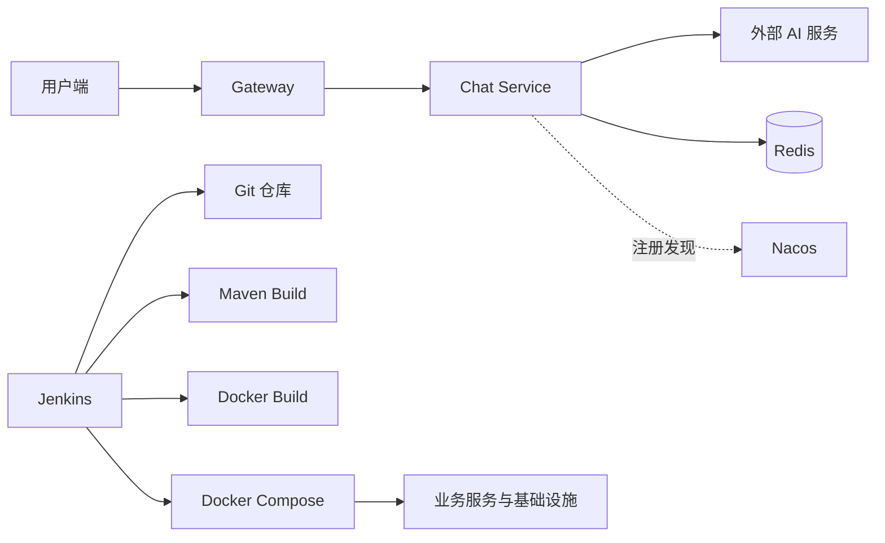
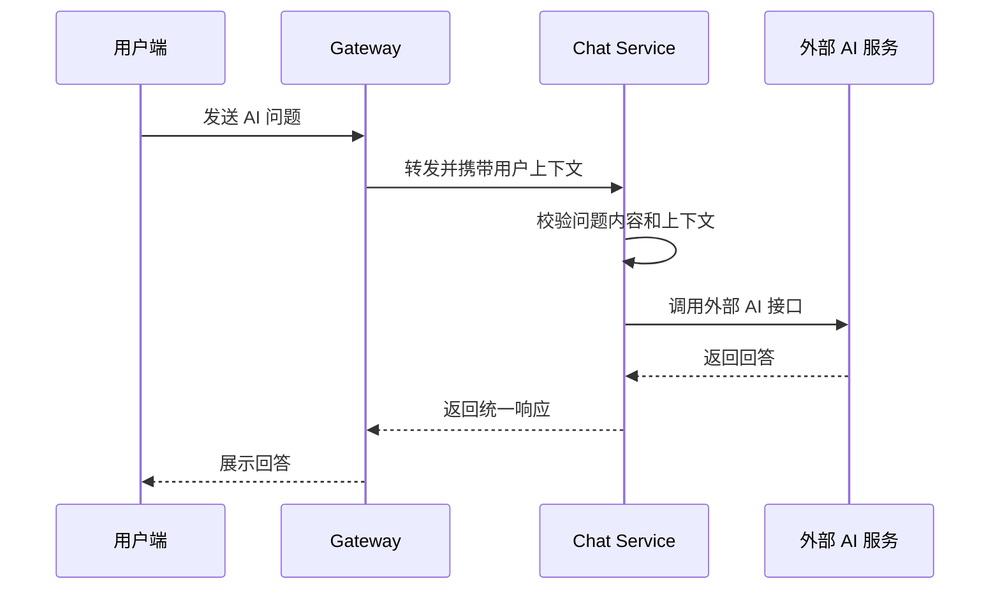
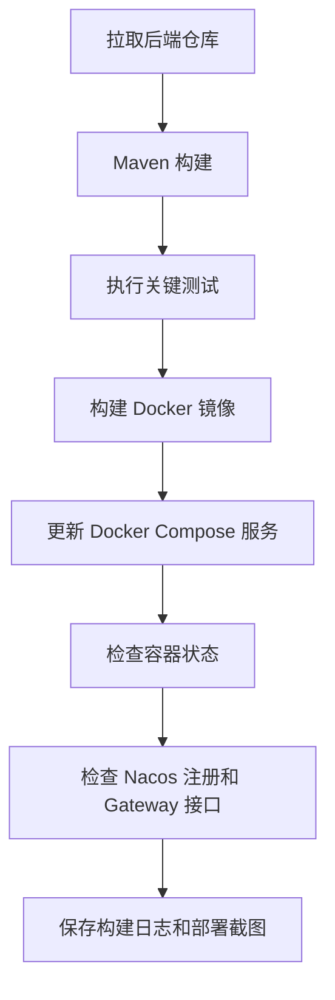

# EmiyaOJ-Cloud 在线判题系统 AI 聊天与部署运维子模块详细设计说明书

| 项目 | 内容 |
| --- | --- |
| 文档名称 | AI 聊天与部署运维子模块详细设计说明书 |
| 所属系统 | EmiyaOJ-Cloud 在线判题系统 |
| 文档版本 | v1.0 |
| 编写日期 | 2026 年 5 月 10 日 |
| 覆盖模块 | EmiyaOJ-Chat、Docker Compose、Jenkins、Nacos |
| 文档格式 | Markdown |

## 1 引言

### 1.1 编写目的

本文档说明 AI 聊天与部署运维子模块的详细设计，覆盖 Chat Service、AI 外部服务调用、用户上下文、异常降级、Docker Compose 集成环境、Nacos 注册发现、Jenkins 流水线和部署验证。

### 1.2 项目概况

EmiyaOJ-Cloud 除在线判题主链路外，还提供 AI 问答辅助能力，并通过 Docker Compose 和 Jenkins 支撑实训演示环境部署。Chat Service 负责接收用户问题并调用外部 AI 服务；部署运维能力负责统一启动 MySQL、Redis、RabbitMQ、MinIO、Nacos、Go-Judge 和各业务微服务。

### 1.3 术语定义

| 术语 | 说明 |
| --- | --- |
| Chat Service | AI 聊天服务 |
| AI 外部服务 | 由环境变量配置访问密钥的第三方 AI 接口 |
| Docker Compose | 本地和演示环境容器编排工具 |
| Nacos | 服务注册与配置中心 |
| Jenkins | 自动构建和部署流水线 |
| Go-Judge | 判题沙箱容器 |

### 1.4 参考资料与读取说明

模板文件为 UTF-8 编码，读取命令如下：

```powershell
Get-Content -Encoding UTF8 -Path docs\详细设计说明书模板.md
```

| 资料 | 说明 |
| --- | --- |
| `docs/EmiyaOJ-Cloud系统实施计划.md` | Jenkins、Docker Compose、分工和部署计划 |
| `docs/EmiyaOJ-Cloud需求规格说明书.md` | AI 问答和部署验收需求 |
| `docs/EmiyaOJ-Cloud概要设计说明书.md` | Chat、部署、端口和外部依赖设计 |
| `docker-compose.yml` | 容器编排配置 |
| `pom.xml` | Chat 模块和后端多模块构建 |

## 2 系统概述

### 2.1 系统架构



### 2.2 子模块目标

| 目标 | 说明 |
| --- | --- |
| AI 问答 | 用户端可向 AI 助手发送题目或代码相关问题 |
| 外部服务隔离 | AI Key 通过环境变量配置，不写入仓库 |
| 友好异常 | 外部 AI 不可用时返回可理解提示 |
| 容器化部署 | 使用 Docker Compose 启动基础设施和业务服务 |
| 服务注册 | 微服务启动后注册到 Nacos |
| 流水线部署 | Jenkins 完成拉取、构建、镜像、部署和检查 |

## 3 程序设计详细描述

### 3.1 模块组成

| 模块编号 | 模块名称 | 主要职责 |
| --- | --- | --- |
| AI-001 | 聊天入口 | 接收用户问题和上下文 |
| AI-002 | AI 调用 | 调用外部 AI 服务并返回回答 |
| AI-003 | 异常降级 | 外部服务失败时返回友好提示 |
| OPS-001 | 容器编排 | Docker Compose 启动基础设施和业务服务 |
| OPS-002 | 服务注册 | Nacos 管理服务发现 |
| OPS-003 | Jenkins 构建 | Maven 构建、镜像构建和容器更新 |
| OPS-004 | 部署验证 | 检查容器状态、端口和核心接口 |

### 3.2 AI 聊天设计



### 3.3 AI 调用约束

| 约束 | 说明 |
| --- | --- |
| 访问密钥 | 通过 `CHAT_API_KEY` 等环境变量配置 |
| 输入内容 | 不允许空问题，长度应受接口限制 |
| 用户上下文 | 从 Gateway 注入的用户编号获取当前用户 |
| 异常处理 | 超时、限流、Key 缺失和外部异常均返回友好提示 |
| 演示数据 | 外部服务不可用时可准备固定问题和异常提示演示 |

### 3.4 Docker Compose 设计

Docker Compose 负责启动以下服务：

| 类别 | 服务 |
| --- | --- |
| 基础设施 | MySQL、Redis、Nacos、RabbitMQ、MinIO |
| 判题沙箱 | Go-Judge |
| 后端服务 | Gateway、Auth、Problem、Judge、Blog、Chat、Moderation |
| 网络 | 所有服务加入统一 Docker 网络 |

启动顺序应保证基础设施优先，业务服务通过环境变量连接数据库、注册中心、消息队列和外部依赖。

### 3.5 Nacos 服务注册设计

| 项目 | 说明 |
| --- | --- |
| 注册对象 | Gateway、Auth、Problem、Judge、Blog、Chat、Moderation |
| 服务发现 | Gateway 路由和 Feign 调用通过服务名发现目标服务 |
| 配置管理 | 可集中管理服务地址、端口和外部依赖配置 |
| 验收方式 | 部署后在 Nacos 控制台确认服务实例在线 |

### 3.6 Jenkins 流水线设计



### 3.7 部署验证设计

| 验证项 | 标准 |
| --- | --- |
| 容器状态 | 基础设施和业务服务处于运行状态 |
| 服务注册 | 各微服务在 Nacos 中可见 |
| Gateway | 统一入口可访问 |
| MySQL | 核心数据库初始化完成 |
| Redis | Token 白名单可读写 |
| RabbitMQ | 审核消息可投递和消费 |
| MinIO | 博客图片可上传 |
| Go-Judge | 判题服务可调用沙箱 |
| Chat | AI 问答接口可返回回答或友好异常 |

## 4 表结构说明

AI 聊天与部署运维子模块当前不单独新增业务数据库表。它依赖以下已有数据与配置：

| 数据来源 | 说明 |
| --- | --- |
| `emiya_oj_auth.user` | 用户身份和上下文 |
| Redis | Token 白名单、可能的会话缓存 |
| 环境变量 | AI Key、数据库连接、服务地址和内部 Token |
| Jenkins 配置 | Git 凭据、Docker 权限、构建脚本和部署目标 |

## 5 公用接口

| 接口分类 | 说明 |
| --- | --- |
| AI 问答接口 | 用户端发送问题，Chat Service 返回回答 |
| Gateway 路由 | 用户端通过 Gateway 访问 Chat |
| 外部 AI 调用 | Chat Service 调用第三方 AI 服务 |
| Jenkins 流水线 | 拉取、构建、镜像、部署和健康检查 |
| Docker Compose | 启动和更新本地或演示环境服务 |

## 6 异常处理

| 异常场景 | 处理方式 |
| --- | --- |
| AI Key 未配置 | 返回配置缺失或服务暂不可用提示 |
| 外部 AI 超时 | 返回友好异常，不阻塞其他业务 |
| Docker 资源不足 | 分批启动核心服务，优先保证主链路 |
| Nacos 未注册 | 检查服务日志、注册配置和网络 |
| Jenkins 构建失败 | 根据阶段日志定位 Maven、Docker 或部署问题 |
| Go-Judge 权限不足 | 检查容器权限和运行环境配置 |

## 7 测试与验收要点

| 验收项 | 验收标准 |
| --- | --- |
| AI 问答 | 用户端可完成一次问答或收到友好异常 |
| 环境变量 | 敏感 Key 不写入仓库 |
| Docker Compose | 基础设施和业务服务可启动 |
| Nacos | 业务服务注册在线 |
| Jenkins | 可完成构建、镜像、部署和检查 |
| 部署截图 | Jenkins 日志、Nacos、容器状态可作为验收材料 |
| 主链路 | 部署后登录、题目、提交、博客、AI 至少可演示核心流程 |

## 8 项目总结目录对齐补充：详细设计

### 8.1 AI 聊天功能模块

| 设计项 | 内容 |
| --- | --- |
| 功能描述 | 接收用户编程问题或题目相关问题，调用外部 AI 服务并返回回答 |
| 性能描述 | AI 请求受外部服务响应时间影响，超时或失败时应快速返回友好提示 |
| 输入 | 用户编号、问题内容、可选上下文、题目相关信息 |
| 输出 | AI 回答、错误提示、统一响应 |
| 程序逻辑 | Gateway 鉴权后转发到 Chat；Chat 校验问题内容；调用外部 AI；成功返回回答，失败返回友好异常 |
| 限制条件 | AI Key 不得写入代码库；外部服务不可用不应影响判题主链路 |

### 8.2 Docker Compose 部署功能模块

| 设计项 | 内容 |
| --- | --- |
| 功能描述 | 启动 MySQL、Redis、Nacos、RabbitMQ、MinIO、Go-Judge 和各后端服务 |
| 性能描述 | 演示环境资源有限时支持分批启动，优先保证核心链路服务 |
| 输入 | Docker Compose 配置、环境变量、镜像或 Jar 包 |
| 输出 | 运行中的容器、服务端口、Nacos 注册实例 |
| 程序逻辑 | 启动基础设施；启动业务服务；服务注册到 Nacos；通过 Gateway 访问核心接口 |
| 限制条件 | Docker 资源不足会影响启动；Go-Judge 可能依赖容器权限 |

### 8.3 Jenkins 流水线功能模块

| 设计项 | 内容 |
| --- | --- |
| 功能描述 | 自动拉取代码、执行 Maven 构建、构建镜像、更新容器并检查部署结果 |
| 性能描述 | 构建耗时取决于网络、依赖缓存、镜像构建和服务器资源 |
| 输入 | Git 仓库地址、分支、JDK/Maven/Docker 配置、环境变量、凭据 |
| 输出 | 构建日志、Jar 包、Docker 镜像、容器状态、部署截图 |
| 程序逻辑 | 拉取代码；后端构建；前端构建；镜像构建；Docker Compose 更新；检查容器和接口 |
| 限制条件 | Jenkins 用户需要 Git、Maven、Docker 权限；敏感配置应通过 Credentials 或环境变量注入 |
