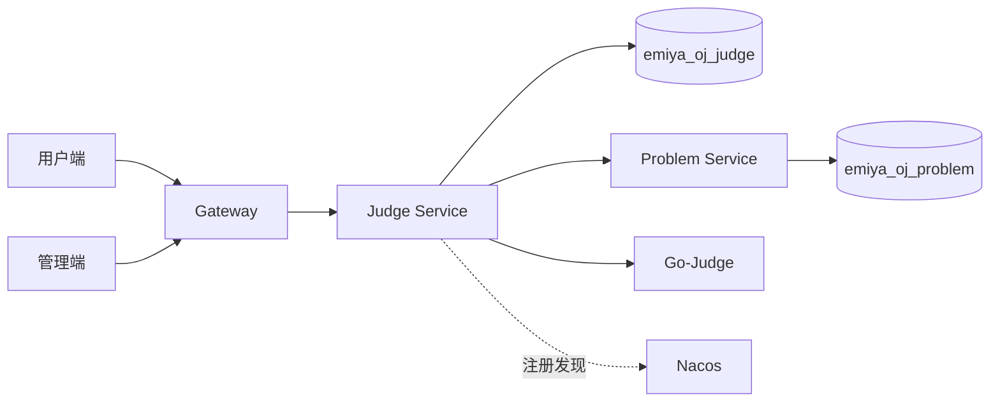
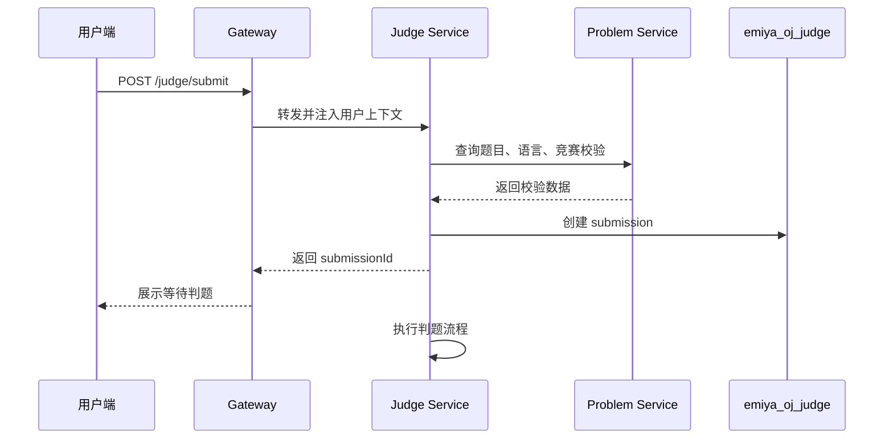
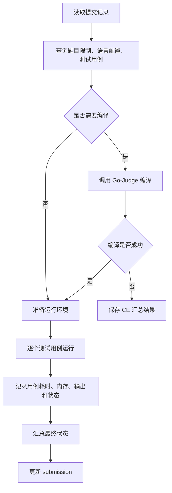
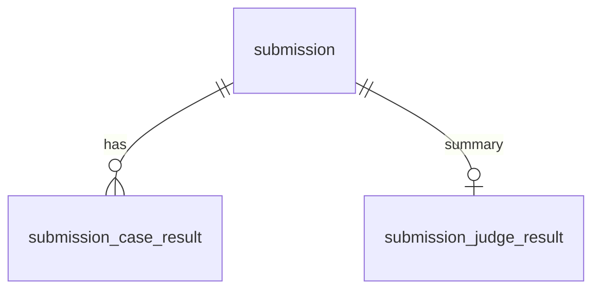

# EmiyaOJ-Cloud 在线判题系统判题提交子模块详细设计说明书

| 项目 | 内容 |
| --- | --- |
| 文档名称 | 判题提交子模块详细设计说明书 |
| 所属系统 | EmiyaOJ-Cloud 在线判题系统 |
| 文档版本 | v1.0 |
| 编写日期 | 2026 年 5 月 10 日 |
| 覆盖模块 | EmiyaOJ-Judge |
| 文档格式 | Markdown |

## 1 引言

### 1.1 编写目的

本文档说明 EmiyaOJ-Cloud 判题提交子模块的详细设计，覆盖代码提交、竞赛提交校验、提交记录、Go-Judge 沙箱调用、测试用例执行、结果计算和提交查询等能力。

### 1.2 项目概况

Judge Service 是系统核心业务链路之一。用户端提交代码后，系统创建提交记录，读取 Problem Service 中的题目、语言和测试用例配置，调用 Go-Judge 沙箱执行代码，将用例结果和汇总结果写入 `emiya_oj_judge` 数据库，并向用户端和管理端提供查询能力。

### 1.3 术语定义

| 术语 | 说明 |
| --- | --- |
| Submission | 用户的一次代码提交 |
| Go-Judge | 独立沙箱服务，用于编译和运行用户代码 |
| AC | Accepted，全部用例通过 |
| WA | Wrong Answer，输出不匹配 |
| TLE | Time Limit Exceeded，运行超时 |
| MLE | Memory Limit Exceeded，内存超限 |
| CE | Compilation Error，编译错误 |
| RE | Runtime Error，运行错误 |

### 1.4 参考资料与读取说明

模板文件为 UTF-8 编码，读取命令如下：

```powershell
Get-Content -Encoding UTF8 -Path docs\详细设计说明书模板.md
```

| 资料 | 说明 |
| --- | --- |
| `docs/Judge-Submission-API.md` | 提交、提交详情和分页查询接口 |
| `docs/Contest-API.md` | 竞赛提交校验关系 |
| `docs/Language-API.md` | 语言命令模板与判题关系 |
| `docs/EmiyaOJ-Cloud概要设计说明书.md` | 判题流程和数据库概要 |
| `sql/emiya_oj_judge.sql` | 判题数据库脚本 |

## 2 系统概述

### 2.1 系统架构



### 2.2 子模块目标

| 目标 | 说明 |
| --- | --- |
| 快速提交 | 提交接口创建记录并返回提交编号 |
| 安全执行 | 用户代码必须在 Go-Judge 沙箱中运行 |
| 结果记录 | 保存单用例结果和汇总结果 |
| 状态查询 | 支持用户端和管理端查询提交状态 |
| 竞赛支持 | 竞赛提交需校验时间、报名和题目关系 |

## 3 程序设计详细描述

### 3.1 模块组成

| 模块编号 | 模块名称 | 主要职责 |
| --- | --- | --- |
| J-001 | 提交入口 | 接收题目、语言、代码和竞赛上下文 |
| J-002 | 提交校验 | 校验用户、题目、语言和竞赛规则 |
| J-003 | 判题执行 | 调用 Go-Judge 编译和运行 |
| J-004 | 结果计算 | 计算单用例和最终状态 |
| J-005 | 提交查询 | 查询我的提交、提交详情、分页提交 |
| J-006 | 管理查询 | 管理端按用户、题目、语言、状态筛选 |

### 3.2 代码提交设计



| 输入 | 说明 |
| --- | --- |
| `problemId` | 题目编号 |
| `languageId` | 编程语言编号 |
| `code` | 用户源代码 |
| `contestId` | 竞赛编号，普通提交为空 |

### 3.3 判题执行设计



### 3.4 结果计算设计

| 状态 | 判定规则 |
| --- | --- |
| Accepted | 所有测试用例均通过 |
| Wrong Answer | 程序正常结束但输出不匹配 |
| Time Limit Exceeded | 单用例运行时间超过限制 |
| Memory Limit Exceeded | 单用例内存超过限制 |
| Compilation Error | 编译命令失败 |
| Runtime Error | 运行阶段异常退出 |
| System Error | 题目配置、沙箱、服务调用或数据库异常 |

结果优先级建议为：CE、System Error、RE、TLE、MLE、WA、AC。若存在多个失败用例，最终状态取最能说明失败原因的状态，同时保留单用例明细。

### 3.5 竞赛提交设计

竞赛提交进入判题前必须调用 Problem Service 的竞赛提交校验能力。

| 校验项 | 规则 |
| --- | --- |
| 竞赛存在 | `contestId` 必须存在 |
| 时间范围 | 当前时间必须处于允许提交阶段 |
| 报名关系 | 需要报名的竞赛必须已报名 |
| 题目关系 | 题目必须属于该竞赛 |
| 提交记录 | 保存 `contest_id`，供排行榜统计 |

### 3.6 提交查询设计

| 查询场景 | 说明 |
| --- | --- |
| `GET /submission/{id}` | 查询提交详情 |
| `GET /submission/page` | 管理端或题目维度分页查询 |
| `GET /submission/my` | 当前用户提交记录 |

普通用户只能查看自己的完整代码和详细输出。管理端可按权限查询全站提交记录。竞赛期间可按竞赛规则限制他人代码和详细结果展示。

## 4 表结构说明

### 4.1 核心表清单

| 表名 | 说明 |
| --- | --- |
| `submission` | 提交主表 |
| `submission_case_result` | 单用例结果 |
| `submission_judge_result` | 判题汇总结果 |

### 4.2 实体关系



### 4.3 字段用途

| 表 | 关键字段 | 用途 |
| --- | --- | --- |
| `submission` | `user_id`、`problem_id`、`language_id`、`contest_id`、`code`、`status` | 保存提交上下文和状态 |
| `submission_case_result` | `submission_id`、`test_case_id`、`status`、`time_used`、`memory_used` | 保存用例级结果 |
| `submission_judge_result` | `submission_id`、`status`、`score`、`compile_output`、`judge_message` | 保存汇总结果 |

## 5 公用接口

| 接口分类 | 说明 |
| --- | --- |
| 提交代码 | 创建提交记录并触发判题 |
| 提交详情 | 查询单次提交代码、状态、错误信息和用例摘要 |
| 我的提交 | 当前用户提交分页 |
| 管理查询 | 管理端多条件查询提交记录 |
| 服务间调用 | 调 Problem Service 获取题目、语言、用例和竞赛校验 |
| 沙箱调用 | 调 Go-Judge 编译和运行代码 |

## 6 异常处理

| 异常场景 | 处理方式 |
| --- | --- |
| 未登录提交 | 返回未认证 |
| 题目不存在 | 拒绝提交 |
| 语言禁用 | 拒绝提交 |
| 竞赛不可提交 | 返回明确业务错误 |
| 测试用例为空 | 标记 System Error |
| Go-Judge 不可用 | 标记 System Error 并记录日志 |
| 编译失败 | 保存 CE 和编译输出 |

## 7 测试与验收要点

| 验收项 | 验收标准 |
| --- | --- |
| 普通提交 | 提交后生成提交编号和初始状态 |
| 正确代码 | 最终状态为 Accepted |
| 错误代码 | 可返回 WA、CE、RE、TLE、MLE 等状态 |
| 竞赛提交 | 未报名、非竞赛题目、非开放时间提交被拒绝 |
| 查询权限 | 用户不能查看他人敏感提交详情 |
| 沙箱隔离 | 用户代码通过 Go-Judge 执行 |
| 数据覆盖 | 文档覆盖判题相关 SQL 表 |

## 8 项目总结目录对齐补充：详细设计

### 8.1 代码提交功能模块

| 设计项 | 内容 |
| --- | --- |
| 功能描述 | 接收用户提交的题目编号、语言编号、代码和竞赛上下文，创建提交记录并触发判题 |
| 性能描述 | 提交接口应快速返回提交编号，判题过程不长时间阻塞前端请求 |
| 输入 | `problemId`、`languageId`、`code`、`contestId`、当前用户编号 |
| 输出 | `submissionId`、初始状态、提交时间、统一响应 |
| 程序逻辑 | 校验登录态、题目、语言和竞赛规则；写入 `submission`；进入判题执行流程 |
| 限制条件 | 代码不能为空或超长；禁用语言、无效题目和不可提交竞赛应被拒绝 |

### 8.2 判题执行功能模块

| 设计项 | 内容 |
| --- | --- |
| 功能描述 | 调用 Problem Service 获取题目、语言和测试用例，调用 Go-Judge 完成编译运行并保存结果 |
| 性能描述 | 按题目时间和内存限制执行；超时、超内存和沙箱异常应快速终止并记录 |
| 输入 | 提交记录、题目限制、语言命令、测试用例输入输出 |
| 输出 | 单用例状态、耗时、内存、编译输出、汇总状态 |
| 程序逻辑 | 更新提交为判题中；编译代码；逐用例运行；比对输出；保存 `submission_case_result` 和 `submission_judge_result` |
| 限制条件 | 用户代码必须在 Go-Judge 中执行；测试用例为空或沙箱不可用应标记系统错误 |

### 8.3 提交查询功能模块

| 设计项 | 内容 |
| --- | --- |
| 功能描述 | 提供我的提交、提交详情、管理端分页查询和题目/竞赛维度查询 |
| 性能描述 | 提交列表必须分页；详情接口按权限过滤敏感字段 |
| 输入 | 提交编号、用户编号、题目编号、竞赛编号、状态、分页参数 |
| 输出 | 提交列表、提交详情、代码、状态、用例摘要、错误信息 |
| 程序逻辑 | 根据用户角色构造查询范围；普通用户仅查看本人完整详情；管理员可按条件查询 |
| 限制条件 | 隐藏用例输入、标准输出和他人代码不得向普通用户公开 |
