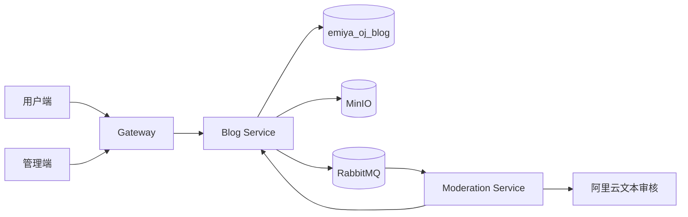
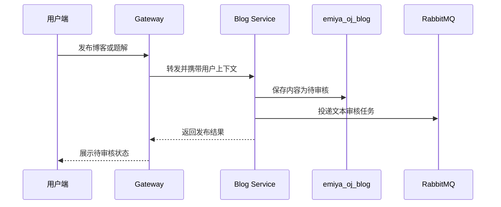
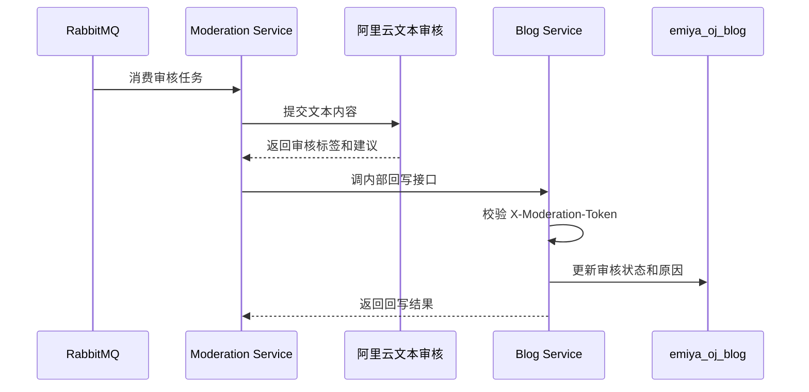
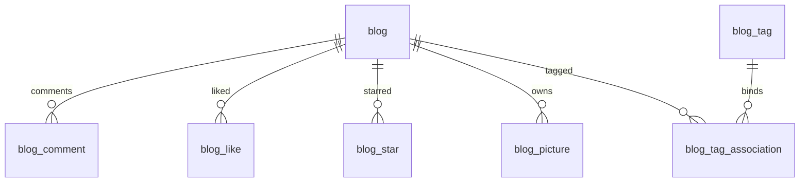

# EmiyaOJ-Cloud 在线判题系统博客审核子模块详细设计说明书

| 项目 | 内容 |
| --- | --- |
| 文档名称 | 博客审核子模块详细设计说明书 |
| 所属系统 | EmiyaOJ-Cloud 在线判题系统 |
| 文档版本 | v1.0 |
| 编写日期 | 2026 年 5 月 10 日 |
| 覆盖模块 | EmiyaOJ-Blog、EmiyaOJ-Moderation |
| 文档格式 | Markdown |

## 1 引言

### 1.1 编写目的

本文档说明博客审核子模块的详细设计，覆盖博客、题解、评论、点赞、收藏、图片上传、MinIO 文件存储、RabbitMQ 审核任务、阿里云文本审核和审核结果回写。

### 1.2 项目概况

Blog Service 提供社区内容能力，Moderation Service 提供异步文本审核能力。用户发布博客、题解或评论后，内容进入待审核状态并投递审核任务；审核服务消费任务、调用外部审核接口并通过内部接口回写审核结果。管理端可进行人工审核或状态调整。

### 1.3 术语定义

| 术语 | 说明 |
| --- | --- |
| 博客 | 用户发布的社区文章 |
| 题解 | 绑定题目的博客内容 |
| 评论 | 博客下的用户互动内容 |
| MinIO | 对象存储服务，用于保存博客图片 |
| RabbitMQ | 消息队列，用于文本审核任务 |
| Moderation | 文本审核服务 |
| 审核状态 | PENDING、APPROVED、REJECTED 等内容状态 |

### 1.4 参考资料与读取说明

模板文件为 UTF-8 编码，读取命令如下：

```powershell
Get-Content -Encoding UTF8 -Path docs\详细设计说明书模板.md
```

| 资料 | 说明 |
| --- | --- |
| `docs/Blog-API.md` | 博客、题解、图片、点赞等接口 |
| `docs/Blog-Moderation-API.md` | 审核回写和人工审核接口 |
| `docs/Moderation-Setup.md` | 审核运行依赖和配置 |
| `docs/Aliyun-moderation-sample.md` | 阿里云文本审核调用说明 |
| `sql/emiya_oj_blog.sql` | 博客数据库脚本 |
| `sql/emiya_oj_blog_moderation_migration.sql` | 审核字段迁移脚本 |

## 2 系统概述

### 2.1 系统架构



### 2.2 子模块目标

| 目标 | 说明 |
| --- | --- |
| 内容发布 | 支持博客、题解、评论发布 |
| 社区互动 | 支持点赞、收藏、评论和标签 |
| 图片存储 | 使用 MinIO 保存博客图片 |
| 自动审核 | 发布或编辑后异步投递审核任务 |
| 人工审核 | 管理端可调整博客和评论审核状态 |
| 安全回写 | 审核服务通过内部 Token 回写结果 |

## 3 程序设计详细描述

### 3.1 模块组成

| 模块编号 | 模块名称 | 主要职责 |
| --- | --- | --- |
| B-001 | 博客发布 | 创建、编辑、查询博客和题解 |
| B-002 | 评论互动 | 评论发布、查询和审核状态控制 |
| B-003 | 点赞收藏 | 维护点赞和收藏关系 |
| B-004 | 图片上传 | 上传、下载、删除博客图片 |
| B-005 | 标签统计 | 博客标签和用户博客统计 |
| M-001 | 审核任务 | 消费 RabbitMQ 文本审核任务 |
| M-002 | 外部审核 | 调用阿里云文本审核接口 |
| M-003 | 审核回写 | 回写博客或评论审核状态 |
| M-004 | 人工审核 | 管理端人工更新审核结果 |

### 3.2 博客与题解发布设计



博客和题解复用内容模型。题解需绑定题目编号，便于用户端在题目详情或题解列表中查询。

### 3.3 评论与互动设计

| 功能 | 设计说明 |
| --- | --- |
| 评论 | 发布后进入审核流程，查询时按审核状态过滤 |
| 点赞 | 用户对博客建立点赞关系，再次取消时删除关系 |
| 收藏 | 用户对博客建立收藏关系，用于个人收藏列表 |
| 标签 | 博客可绑定多个标签，支持社区内容筛选 |
| 统计 | 用户博客统计记录发文、点赞、收藏等指标 |

### 3.4 图片上传设计

图片通过 Blog Service 上传到 MinIO。数据库保存图片元数据和对象存储路径。下载时由接口根据图片编号读取元数据并返回文件内容或访问地址。删除图片时需要校验上传人或管理权限。

### 3.5 文本审核设计



### 3.6 人工审核设计

管理端可按审核状态筛选博客和评论，对自动审核结果进行确认、通过或驳回。人工审核操作应记录操作人、审核时间和审核原因，便于答辩演示和问题追踪。

## 4 表结构说明

### 4.1 核心表清单

| 表名 | 说明 |
| --- | --- |
| `blog` | 博客与题解主表 |
| `blog_comment` | 博客评论 |
| `blog_like` | 博客点赞关系 |
| `blog_star` | 博客收藏关系 |
| `blog_picture` | 博客图片元数据 |
| `blog_tag` | 博客标签 |
| `blog_tag_association` | 博客标签关联 |
| `user_blog` | 用户博客统计 |

### 4.2 实体关系



### 4.3 审核字段

| 字段 | 说明 |
| --- | --- |
| `audit_status` | 审核状态 |
| `audit_reason` | 审核原因或命中标签 |
| `audit_time` | 审核完成时间 |
| `audit_user_id` | 人工审核人，自动审核可为空 |

## 5 公用接口

| 接口分类 | 示例 | 权限 |
| --- | --- | --- |
| 博客发布 | `POST /blog` | 登录用户 |
| 题解发布 | `POST /blog/problems/{problemId}/solutions` | 登录用户 |
| 博客查询 | `POST /blog/query`、`GET /blog/{bid}` | 访客或登录用户 |
| 点赞收藏 | `/blog/{bid}/like`、收藏相关接口 | 登录用户 |
| 图片接口 | `POST /blog/images`、下载、删除 | 登录用户 |
| 审核回写 | 内部审核结果回写接口 | Moderation 内部调用 |
| 人工审核 | 人工更新博客或评论审核状态 | 管理员/审核人员 |

## 6 异常处理

| 异常场景 | 处理方式 |
| --- | --- |
| 未登录发布 | 返回未认证 |
| 图片上传失败 | 返回上传失败并记录 MinIO 异常 |
| 审核队列不可用 | 内容保留待审核状态并记录异常 |
| 外部审核失败 | 保存可追踪失败原因 |
| 回写 Token 错误 | 拒绝内部回写请求 |
| 内容被驳回 | 用户端不公开展示，管理端可查看原因 |

## 7 测试与验收要点

| 验收项 | 验收标准 |
| --- | --- |
| 博客发布 | 发布后进入待审核状态 |
| 自动审核 | RabbitMQ 任务可被消费并回写状态 |
| 人工审核 | 管理端可通过或驳回博客和评论 |
| 图片上传 | 图片可上传、下载和删除 |
| 互动 | 点赞、收藏、评论关系正确 |
| 安全 | 内部回写接口校验 Token |
| 数据覆盖 | 文档覆盖博客和审核迁移相关 SQL 表 |

## 8 项目总结目录对齐补充：详细设计

### 8.1 博客题解功能模块

| 设计项 | 内容 |
| --- | --- |
| 功能描述 | 支持博客和题解发布、编辑、查询、删除，以及评论、点赞、收藏和标签 |
| 性能描述 | 博客列表和评论列表分页查询；图片和正文按需加载 |
| 输入 | 标题、正文、题目编号、标签、评论内容、用户编号 |
| 输出 | 博客详情、题解列表、评论列表、点赞收藏状态、审核状态 |
| 程序逻辑 | 登录用户发布内容；Blog 保存为待审核；查询接口按审核状态和权限过滤内容 |
| 限制条件 | 待审核和驳回内容默认不公开；非本人不得编辑或删除他人内容 |

### 8.2 图片上传功能模块

| 设计项 | 内容 |
| --- | --- |
| 功能描述 | 支持博客图片上传、下载、删除和元数据维护 |
| 性能描述 | 图片文件通过 MinIO 存储，接口仅保存和返回元数据或访问地址 |
| 输入 | 图片文件、文件名、内容类型、用户编号 |
| 输出 | 图片编号、访问地址、下载结果、删除结果 |
| 程序逻辑 | 校验登录和文件类型；上传 MinIO；保存 `blog_picture` 元数据；删除时校验权限 |
| 限制条件 | 非法类型、空文件和超大文件应被拒绝；MinIO 异常需记录并返回友好提示 |

### 8.3 内容审核功能模块

| 设计项 | 内容 |
| --- | --- |
| 功能描述 | 通过 RabbitMQ 异步审核博客、题解和评论，并支持人工审核 |
| 性能描述 | 发布接口不等待外部审核完成；审核结果异步回写，减少用户等待 |
| 输入 | 内容类型、内容编号、文本内容、审核任务 ID、审核结果、内部 Token |
| 输出 | 审核状态、审核原因、审核时间、回写结果 |
| 程序逻辑 | Blog 保存待审核并投递任务；Moderation 消费任务并调用外部审核；回写接口校验内部令牌和任务 ID；管理端可人工调整 |
| 限制条件 | 旧审核结果不得覆盖新内容；内部回写接口不能对外开放；外部审核不可用时可进入人工复核 |
