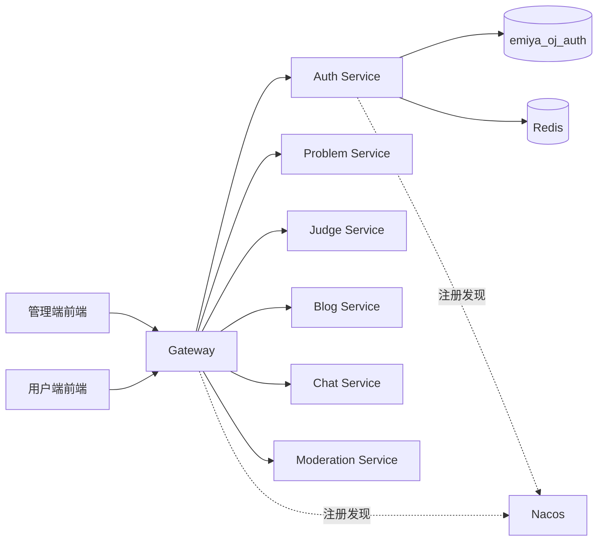
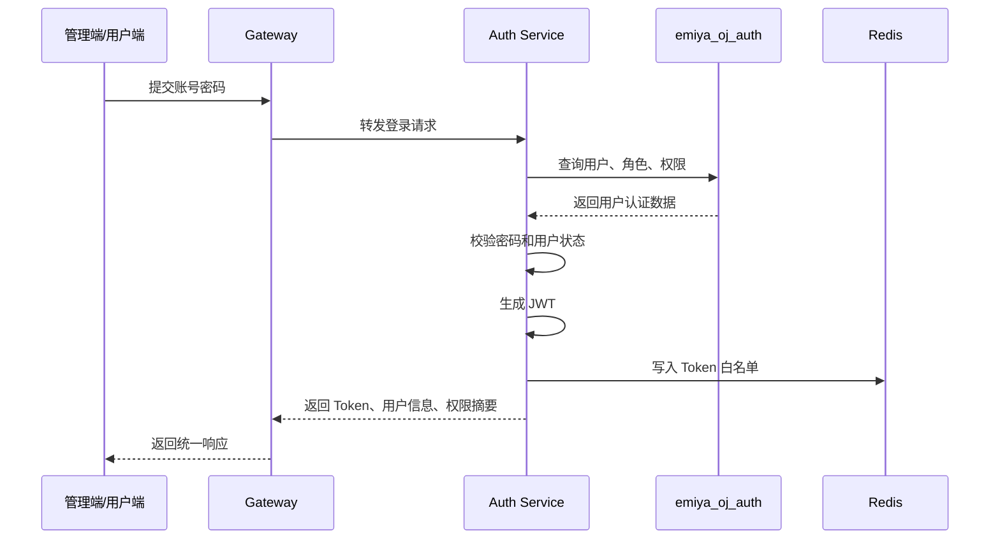
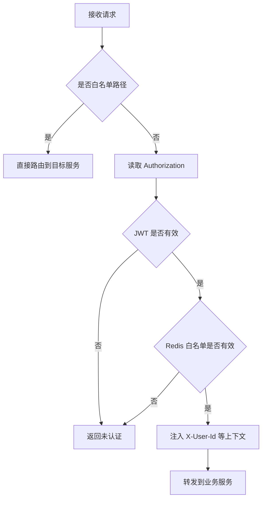
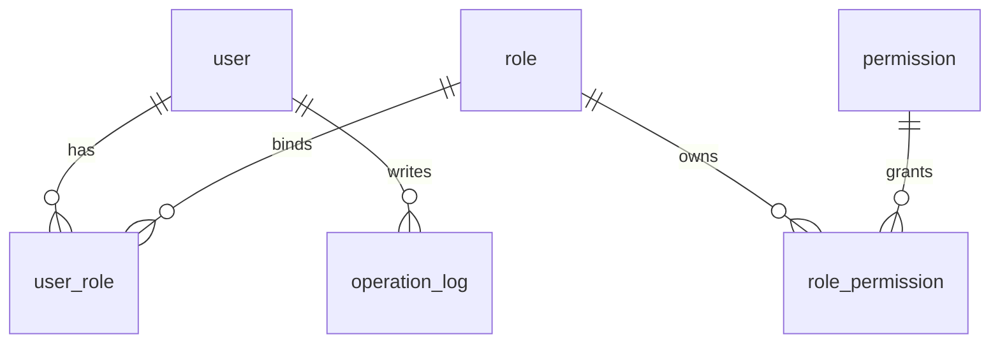

# EmiyaOJ-Cloud 在线判题系统认证网关子模块详细设计说明书

| 项目 | 内容 |
| --- | --- |
| 文档名称 | 认证网关子模块详细设计说明书 |
| 所属系统 | EmiyaOJ-Cloud 在线判题系统 |
| 文档版本 | v1.0 |
| 编写日期 | 2026 年 5 月 10 日 |
| 覆盖模块 | EmiyaOJ-Gateway、EmiyaOJ-Auth、EmiyaOJ-Common |
| 文档格式 | Markdown |

## 1 引言

### 1.1 编写目的

本文档用于说明 EmiyaOJ-Cloud 在线判题系统中认证网关子模块的详细设计，明确统一入口、路由转发、登录登出、JWT、Redis Token 白名单、RBAC 权限、统一响应、分页和异常处理等能力的实现边界。本文档供后端开发、前端联调、测试验收和实训答辩使用。

### 1.2 项目概况

EmiyaOJ-Cloud 采用前后端分离和 Spring Cloud 微服务架构。管理端、用户端通过 Gateway 访问后端服务，Gateway 负责路由、鉴权和用户上下文注入；Auth Service 负责用户、角色、权限和 Token 生命周期；Common 模块提供统一响应、公共异常、分页对象和通用工具。

### 1.3 术语定义

| 术语 | 说明 |
| --- | --- |
| Gateway | API 网关，系统后端统一入口 |
| Auth Service | 认证授权服务，负责登录登出、用户、角色、权限和 Token |
| JWT | JSON Web Token，登录成功后返回的访问令牌 |
| Redis Token 白名单 | 存储有效 Token 或会话标识，用于支持登出后立即失效 |
| RBAC | 基于角色的访问控制模型 |
| Common | 公共模块，沉淀统一响应、异常、分页和工具能力 |

### 1.4 参考资料与读取说明

由于模板文件为 UTF-8 编码，读取时使用如下命令：

```powershell
Get-Content -Encoding UTF8 -Path docs\详细设计说明书模板.md
```

本文档参考以下资料编写：

| 资料 | 说明 |
| --- | --- |
| `docs/EmiyaOJ-Cloud系统实施计划.md` | 项目分工、部署、Jenkins 和联调范围 |
| `docs/EmiyaOJ-Cloud需求规格说明书.md` | 认证、网关、RBAC 和非功能需求 |
| `docs/EmiyaOJ-Cloud概要设计说明书.md` | 总体架构、公共接口、JWT 与用户上下文设计 |
| `pom.xml` | Maven 模块结构 |
| `sql/emiya_oj_auth.sql` | 认证授权数据库表结构 |

## 2 系统概述

### 2.1 系统架构



### 2.2 子模块目标

| 目标 | 说明 |
| --- | --- |
| 统一入口 | 管理端和用户端统一访问 Gateway，不直接访问业务服务 |
| 登录认证 | 支持账号密码登录，成功后签发 Token |
| 登出失效 | 登出时删除 Redis 白名单中的 Token 状态 |
| 权限控制 | 管理端接口、菜单、按钮按用户角色和权限控制 |
| 上下文透传 | Gateway 将用户编号、角色等上下文传递给下游服务 |
| 公共能力 | 提供统一响应、分页、异常处理和 OpenAPI 支持 |

### 2.3 角色与边界

| 角色 | 权限范围 |
| --- | --- |
| 访客 | 可访问登录、公开题目、公开博客等白名单接口 |
| 普通用户 | 可访问用户端题目、提交、竞赛、博客、AI 问答等功能 |
| 管理员/教师 | 可访问管理端用户、角色、权限、题目、竞赛、提交和审核功能 |
| 系统服务 | 可通过内部接口完成服务间调用，受内部约定和 Token 控制 |

## 3 程序设计详细描述

### 3.1 模块组成

| 模块编号 | 模块名称 | 主要职责 |
| --- | --- | --- |
| A-001 | 登录认证 | 校验账号密码，生成 JWT，写入 Redis 白名单 |
| A-002 | 登出处理 | 删除 Token 白名单记录，使 Token 立即失效 |
| A-003 | 用户管理 | 维护用户基础信息、状态和角色关系 |
| A-004 | 角色权限 | 维护角色、权限树、角色权限绑定 |
| G-001 | 网关路由 | 按服务名和路径转发请求 |
| G-002 | 网关鉴权 | 校验白名单、JWT 和 Redis Token 状态 |
| G-003 | 上下文注入 | 向下游服务注入用户编号等请求头 |
| C-001 | 公共响应 | 统一 JSON 返回结构 |
| C-002 | 公共异常 | 统一业务异常和系统异常响应 |

### 3.2 登录认证设计

#### 3.2.1 功能说明

用户在管理端或用户端输入账号密码后，Gateway 将请求转发到 Auth Service。Auth Service 校验用户状态和密码，生成 JWT，并将 Token 标识写入 Redis 白名单。前端保存 Token，在后续请求中通过 `Authorization: Bearer {token}` 传递。

#### 3.2.2 处理流程



#### 3.2.3 校验规则

| 校验项 | 规则 |
| --- | --- |
| 账号 | 必须存在且处于启用状态 |
| 密码 | 与数据库保存的密码摘要匹配 |
| 角色 | 登录成功后加载用户角色和权限 |
| Token | JWT 有效期与 Redis 白名单共同控制会话有效性 |

### 3.3 网关鉴权设计

#### 3.3.1 功能说明

Gateway 对所有请求进行前置处理。白名单路径直接放行；受保护路径必须携带合法 JWT，并且 Redis 中存在有效 Token 记录。认证通过后，Gateway 将用户上下文注入请求头，供下游服务完成业务权限判断和审计记录。

#### 3.3.2 处理流程



#### 3.3.3 白名单与受保护接口

| 类型 | 示例 |
| --- | --- |
| 白名单接口 | 登录、公开题目列表、公开博客查询、静态资源、Swagger 文档 |
| 受保护接口 | 提交代码、我的提交、发布博客、AI 问答 |
| 管理接口 | 用户管理、角色权限、题目维护、竞赛维护、审核管理 |

### 3.4 RBAC 权限设计

#### 3.4.1 功能说明

系统使用用户、角色、权限三层结构控制管理端访问能力。用户可绑定多个角色，角色可绑定多个权限。权限可表示菜单、按钮或接口资源。管理端根据用户权限展示菜单和按钮，后端接口根据角色或权限编码进行校验。

#### 3.4.2 数据关系



#### 3.4.3 设计要点

| 设计项 | 说明 |
| --- | --- |
| 菜单权限 | 控制管理端可见菜单 |
| 按钮权限 | 控制新增、编辑、删除、审核等操作入口 |
| 接口权限 | 控制后端管理接口访问 |
| 审计记录 | 管理操作写入操作日志，便于问题追踪 |

### 3.5 用户管理设计

| 操作 | 设计说明 |
| --- | --- |
| 新增用户 | 校验账号唯一性，初始化状态和角色 |
| 编辑用户 | 更新昵称、邮箱、状态等资料 |
| 禁用用户 | 禁用后拒绝登录，可保留历史提交和博客数据 |
| 绑定角色 | 维护 `user_role` 关系 |
| 查询用户 | 支持分页、账号、昵称、状态等条件 |

### 3.6 公共模块设计

| 能力 | 设计说明 |
| --- | --- |
| 统一响应 | 所有 JSON 接口返回 `code`、`message`、`data`、`success` |
| 分页对象 | 列表接口统一包含页码、页大小、总数和记录列表 |
| 异常处理 | 业务异常返回明确错误码和提示，系统异常记录日志 |
| 工具能力 | JWT、Redis、时间、参数校验等通用逻辑集中复用 |
| OpenAPI | 各业务服务暴露 Swagger/OpenAPI 文档，便于联调 |

## 4 表结构说明

### 4.1 核心表清单

| 表名 | 说明 |
| --- | --- |
| `user` | 用户基础信息、账号、密码摘要、状态 |
| `role` | 角色信息 |
| `permission` | 权限树，包含菜单、按钮、接口等权限 |
| `user_role` | 用户与角色关联 |
| `role_permission` | 角色与权限关联 |
| `operation_log` | 管理操作日志 |

### 4.2 主要字段说明

| 表 | 关键字段 | 用途 |
| --- | --- | --- |
| `user` | `id`、`username`、`password`、`status` | 登录认证和用户状态判断 |
| `role` | `id`、`role_code`、`role_name`、`status` | 角色识别和授权 |
| `permission` | `id`、`parent_id`、`permission_code`、`type`、`path` | 菜单树和接口权限 |
| `operation_log` | `user_id`、`operation`、`method`、`params`、`create_time` | 审计和排查 |

## 5 公用接口

### 5.1 对外接口分类

| 分类 | 说明 |
| --- | --- |
| 登录登出 | 登录签发 Token，登出删除 Token 白名单 |
| 用户管理 | 用户新增、编辑、禁用、查询、角色绑定 |
| 角色管理 | 角色新增、编辑、删除、权限绑定 |
| 权限管理 | 权限树维护、菜单和按钮权限查询 |
| 网关转发 | 按路径转发到 Auth、Problem、Judge、Blog、Chat、Moderation |

### 5.2 服务间约定

| 项目 | 说明 |
| --- | --- |
| 用户上下文 | Gateway 向下游服务注入 `X-User-Id` 等请求头 |
| 鉴权失败 | 返回统一未认证或无权限响应 |
| Token 存储 | Redis 保存有效 Token 标识或用户会话状态 |
| 日志 | Gateway 记录关键路由信息，Auth 记录管理操作 |

## 6 异常处理

| 异常场景 | 处理方式 |
| --- | --- |
| 未携带 Token | 返回未认证 |
| Token 过期或解析失败 | 返回未认证，前端跳转登录 |
| Redis 白名单不存在 | 返回未认证 |
| 权限不足 | 返回无权限 |
| 用户被禁用 | 拒绝登录并提示账号状态异常 |
| 数据库异常 | 记录日志并返回系统错误 |

## 7 测试与验收要点

| 验收项 | 验收标准 |
| --- | --- |
| 登录 | 正确账号可登录并返回 Token |
| 登出 | 登出后原 Token 不能继续访问受保护接口 |
| 网关鉴权 | 白名单放行，受保护接口必须认证 |
| RBAC | 不同角色看到不同管理菜单和按钮 |
| 用户上下文 | 下游服务能读取用户编号 |
| 统一响应 | 成功和失败响应结构一致 |
| 文档读取 | 使用 UTF-8 命令读取模板和本文档中文正常 |

## 8 项目总结目录对齐补充：详细设计

### 8.1 认证网关功能模块

| 设计项 | 内容 |
| --- | --- |
| 功能描述 | 完成登录、登出、JWT 签发、Redis Token 白名单、Gateway 鉴权、路由转发、用户上下文注入、用户角色权限管理和统一异常响应 |
| 性能描述 | 登录、鉴权和普通权限查询应快速返回；Gateway 不处理复杂业务，只进行轻量 Token 校验和路由转发 |
| 输入 | 账号密码、Authorization Token、请求路径、用户/角色/权限维护参数 |
| 输出 | JWT、用户信息、权限摘要、统一响应、未认证/无权限错误、下游请求头中的用户上下文 |
| 程序逻辑 | Gateway 判断白名单；非白名单请求解析 JWT 并校验 Redis；通过后注入用户上下文；Auth 完成用户、角色、权限和 Token 生命周期维护 |
| 限制条件 | Redis 不可用会影响 Token 白名单校验；管理接口必须具备管理员权限；前端必须通过 Gateway 访问后端 |

### 8.2 用户角色权限功能模块

| 设计项 | 内容 |
| --- | --- |
| 功能描述 | 管理用户、角色、权限树、用户角色关系和角色权限关系，支撑管理端菜单、按钮和接口权限控制 |
| 性能描述 | 用户、角色、权限列表应支持分页或树形加载，避免一次返回过多数据 |
| 输入 | 用户资料、角色编码、权限编码、菜单路径、按钮标识、绑定关系 |
| 输出 | 用户列表、角色列表、权限树、绑定结果和操作日志 |
| 程序逻辑 | 管理端提交维护请求；服务端校验管理员权限和参数合法性；写入对应表；登录或查询时汇总权限返回 |
| 限制条件 | 权限编码应保持唯一；禁用用户不可登录；删除角色或权限前应考虑已有绑定关系 |
