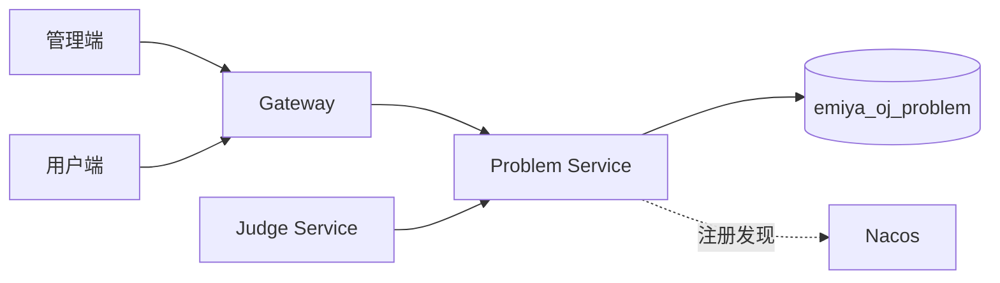
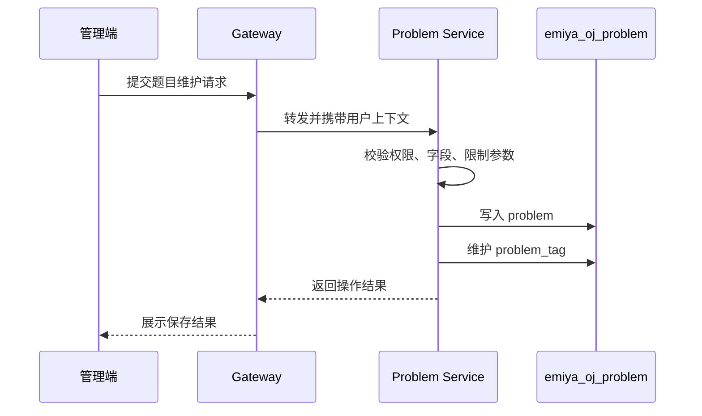
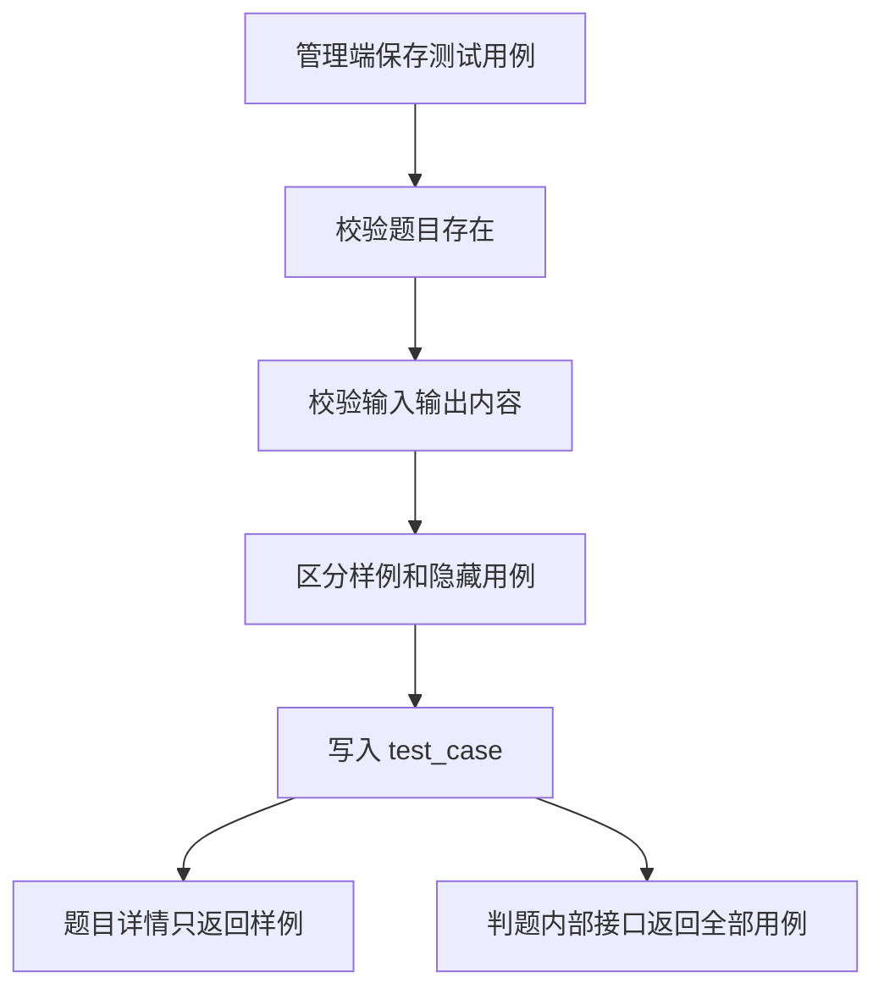
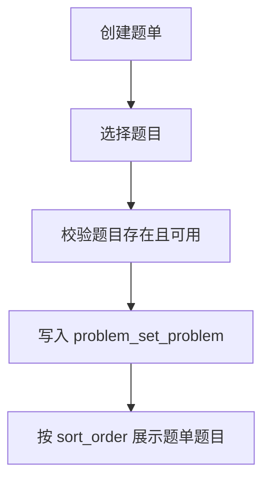
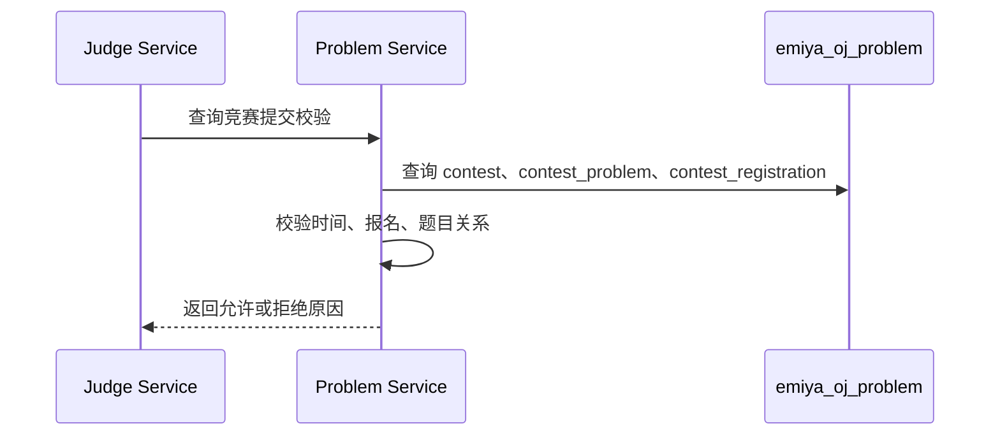
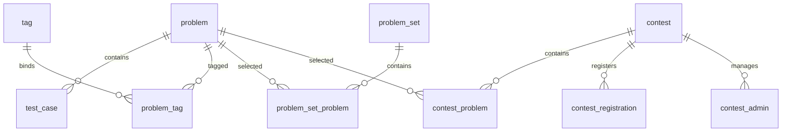

# EmiyaOJ-Cloud 在线判题系统题目竞赛子模块详细设计说明书

| 项目 | 内容 |
| --- | --- |
| 文档名称 | 题目竞赛子模块详细设计说明书 |
| 所属系统 | EmiyaOJ-Cloud 在线判题系统 |
| 文档版本 | v1.0 |
| 编写日期 | 2026 年 5 月 10 日 |
| 覆盖模块 | EmiyaOJ-Problem |
| 文档格式 | Markdown |

## 1 引言

### 1.1 编写目的

本文档说明 EmiyaOJ-Cloud 题目竞赛子模块的详细设计，覆盖题目、测试用例、标签、编程语言、题单、竞赛、报名、管理员和排行榜等功能，作为开发、联调、测试和答辩依据。

### 1.2 项目概况

Problem Service 是在线判题系统的题库与竞赛中心，既为管理端提供题目、语言、题单、竞赛维护能力，也为用户端提供题目浏览、题单练习、竞赛参与能力，并为 Judge Service 提供题目限制、语言配置、测试用例和竞赛提交校验数据。

### 1.3 术语定义

| 术语 | 说明 |
| --- | --- |
| 题目 | 编程训练或竞赛中的问题实体 |
| 测试用例 | 判题时用于输入输出比对的数据 |
| 标签 | 题目分类和筛选标记 |
| 语言配置 | 编程语言名称、版本、编译命令、运行命令和资源限制 |
| 题单 | 按专题组织的一组题目 |
| 竞赛 | 限定时间、题目和参赛人员的比赛活动 |
| 排行榜 | 按竞赛提交结果统计的排名列表 |

### 1.4 参考资料与读取说明

模板文件为 UTF-8 编码，读取命令如下：

```powershell
Get-Content -Encoding UTF8 -Path docs\详细设计说明书模板.md
```

| 资料 | 说明 |
| --- | --- |
| `docs/EmiyaOJ-Cloud需求规格说明书.md` | 题目、测试用例、语言、题单、竞赛需求 |
| `docs/EmiyaOJ-Cloud概要设计说明书.md` | Problem Service 概要设计和数据库概要 |
| `docs/Contest-API.md` | 竞赛接口 |
| `docs/ProblemSet-API.md` | 题单接口 |
| `docs/Language-API.md` | 编程语言接口 |
| `sql/emiya_oj_problem.sql` | 题目、标签、测试用例表 |
| `sql/emiya_oj_language.sql` | 语言表 |
| `sql/emiya_oj_problem_set.sql` | 题单表 |
| `sql/emiya_oj_problem_contest.sql` | 竞赛表 |

## 2 系统概述

### 2.1 系统架构



### 2.2 子模块目标

| 目标 | 说明 |
| --- | --- |
| 题目维护 | 管理题目描述、输入输出、限制、难度和状态 |
| 用例维护 | 管理样例和隐藏测试用例 |
| 标签管理 | 支持题目分类、筛选和多标签绑定 |
| 语言配置 | 管理可提交语言和 Go-Judge 命令模板 |
| 题单管理 | 将题目组织为专题练习 |
| 竞赛管理 | 支持竞赛创建、题目关联、报名、管理员和排行榜 |
| 服务间数据 | 为判题服务提供题目、语言、用例和竞赛校验 |

## 3 程序设计详细描述

### 3.1 模块组成

| 模块编号 | 模块名称 | 主要职责 |
| --- | --- | --- |
| P-001 | 题目查询 | 公开题目列表、详情、筛选和分页 |
| P-002 | 题目维护 | 题目新增、编辑、删除、发布和禁用 |
| P-003 | 测试用例 | 样例、隐藏用例维护和判题读取 |
| P-004 | 标签管理 | 标签维护和题目标签绑定 |
| P-005 | 语言配置 | 编程语言命令模板、启用禁用 |
| P-006 | 题单管理 | 题单增删改查和题目排序 |
| P-007 | 竞赛管理 | 竞赛、题目、报名、管理员和排行榜 |
| P-008 | 内部校验 | Judge Service 提交前竞赛校验 |

### 3.2 题目管理设计

#### 3.2.1 功能说明

管理员或教师在管理端维护题目。用户端只能查询公开题目和可访问竞赛题目。题目详情展示描述、输入输出说明、样例、限制、难度和标签，隐藏测试用例不向用户端公开。

#### 3.2.2 处理流程



#### 3.2.3 校验规则

| 校验项 | 规则 |
| --- | --- |
| 标题 | 必填，长度符合数据库限制 |
| 描述 | 支持较长文本，用户端按 Markdown 或富文本渲染 |
| 时间限制 | 必须为正数 |
| 内存限制 | 必须为正数 |
| 难度 | 取系统约定难度枚举 |
| 状态 | 草稿、发布、禁用等状态控制用户端可见性 |

### 3.3 测试用例设计

| 类型 | 说明 |
| --- | --- |
| 样例用例 | 用户端题目详情可展示，用于帮助理解题意 |
| 隐藏用例 | 仅 Judge Service 判题时读取，不向普通用户公开 |



### 3.4 编程语言配置设计

语言配置由管理端维护，用户端提交代码时只展示启用语言。Judge Service 根据语言配置生成 Go-Judge 编译和运行请求。

| 配置项 | 说明 |
| --- | --- |
| `name` | 语言名称 |
| `version` | 语言版本 |
| `source_file_name` | 源文件名 |
| `compile_command` | 编译命令模板 |
| `run_command` | 运行命令模板 |
| `time_limit` | 默认时间限制 |
| `memory_limit` | 默认内存限制 |
| `status` | 启用状态 |

### 3.5 题单管理设计

题单用于专题训练。管理员可创建题单、编辑题单说明、设置公开状态，并维护题单内题目顺序。



### 3.6 竞赛管理设计

竞赛支持创建、编辑、删除、报名、题目配置、管理员配置和排行榜查询。竞赛题目通过 `contest_problem` 维护，可以设置题目别名、分值和排序。

#### 3.6.1 竞赛提交校验



#### 3.6.2 排行榜设计

| 数据来源 | 说明 |
| --- | --- |
| 竞赛题目 | `contest_problem` 提供题目范围和分值 |
| 竞赛报名 | `contest_registration` 提供参赛用户范围 |
| 提交记录 | Judge Service 提供竞赛提交和判题结果 |
| 排名规则 | 按竞赛规则统计通过题数、得分、耗时等信息 |

## 4 表结构说明

### 4.1 核心表清单

| 表名 | 说明 |
| --- | --- |
| `problem` | 题目主表 |
| `tag` | 题目标签 |
| `problem_tag` | 题目标签关联 |
| `test_case` | 测试用例 |
| `language` | 编程语言配置 |
| `problem_set` | 题单 |
| `problem_set_problem` | 题单题目关联 |
| `contest` | 竞赛 |
| `contest_problem` | 竞赛题目关联 |
| `contest_registration` | 竞赛报名 |
| `contest_admin` | 竞赛管理员 |

### 4.2 实体关系



## 5 公用接口

| 接口分类 | 说明 | 权限 |
| --- | --- | --- |
| 题目公开查询 | 查询公开题目列表和详情 | 访客或登录用户 |
| 题目管理 | 新增、编辑、删除、发布题目 | 管理员/教师 |
| 测试用例管理 | 维护样例和隐藏用例 | 管理员/教师 |
| 语言配置 | `/language/list`、管理端语言维护接口 | 管理员/用户 |
| 题单接口 | `/problem-set/list`、详情、维护和题目绑定 | 管理员/用户 |
| 竞赛接口 | `/contest/list`、报名、题目、排行榜、内部校验 | 管理员/用户/内部服务 |

## 6 异常处理

| 异常场景 | 处理方式 |
| --- | --- |
| 题目不存在 | 返回业务错误 |
| 测试用例为空 | 管理端提示题目配置不完整 |
| 语言禁用 | 用户端不展示，提交时再次拦截 |
| 竞赛未开始或已结束 | 拒绝竞赛提交 |
| 未报名竞赛 | 拒绝提交或查看受限数据 |
| 隐藏用例访问 | 普通用户接口不返回隐藏用例 |

## 7 测试与验收要点

| 验收项 | 验收标准 |
| --- | --- |
| 题目维护 | 可新增、编辑、查询、发布和禁用题目 |
| 用例维护 | 样例可展示，隐藏用例不公开 |
| 语言配置 | 启用语言可提交，禁用语言不可提交 |
| 题单 | 题单题目按排序展示 |
| 竞赛 | 可创建竞赛、报名、配置题目和查看排行榜 |
| 内部校验 | Judge Service 能获取竞赛提交校验结果 |
| 数据覆盖 | 文档覆盖题目、语言、题单、竞赛相关 SQL 表 |

## 8 项目总结目录对齐补充：详细设计

### 8.1 题目管理功能模块

| 设计项 | 内容 |
| --- | --- |
| 功能描述 | 管理题目标题、描述、输入输出说明、难度、标签、时间限制、内存限制和发布状态 |
| 性能描述 | 题目列表按分页查询；详情接口不返回隐藏用例，减少敏感数据暴露 |
| 输入 | 题目基础字段、标签编号、状态、分页条件和筛选条件 |
| 输出 | 题目列表、题目详情、题目编号、操作结果 |
| 程序逻辑 | 管理员维护题目；服务端校验参数；保存题目主表和标签关联；用户端按公开状态查询 |
| 限制条件 | 已被题单、竞赛或提交引用的题目删除需谨慎；隐藏测试用例不得通过公开接口返回 |

### 8.2 测试用例与语言配置功能模块

| 设计项 | 内容 |
| --- | --- |
| 功能描述 | 维护样例用例、隐藏用例和编程语言编译/运行命令，为判题服务提供配置 |
| 性能描述 | 测试用例仅在题目详情和判题内部接口按需返回；语言列表只返回启用语言给用户端 |
| 输入 | 用例输入输出、样例标识、排序、语言名称、版本、命令模板、启用状态 |
| 输出 | 样例数据、隐藏用例内部数据、语言配置、操作结果 |
| 程序逻辑 | 管理端维护数据；Problem Service 校验题目和语言参数；Judge Service 判题前读取题目、用例和语言配置 |
| 限制条件 | 编译型语言必须配置编译命令；测试用例为空会影响判题；禁用语言不可用于提交 |

### 8.3 题单竞赛功能模块

| 设计项 | 内容 |
| --- | --- |
| 功能描述 | 管理题单、题单题目顺序、竞赛、竞赛报名、竞赛题目、管理员和排行榜 |
| 性能描述 | 竞赛列表、题单列表和排行榜应分页或按竞赛范围查询，避免大范围扫描 |
| 输入 | 题单信息、题目编号、排序、竞赛时间、报名规则、邀请码、竞赛题目配置 |
| 输出 | 题单详情、竞赛详情、报名结果、提交校验结果、排行榜 |
| 程序逻辑 | 管理员创建题单/竞赛并关联题目；用户报名；Judge 提交时调用内部校验；排行榜根据提交结果统计 |
| 限制条件 | 竞赛时间、报名状态和题目关联必须同时满足；未报名、未开始、已结束或非竞赛题目提交应被拒绝 |
